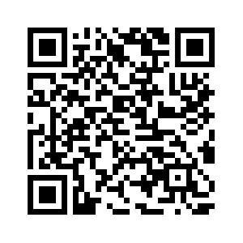
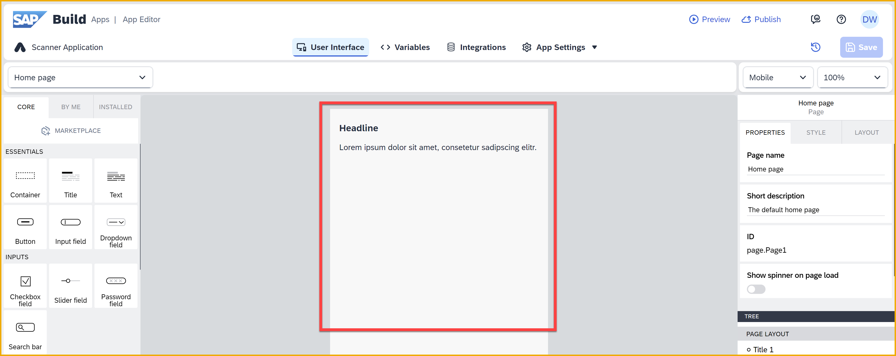
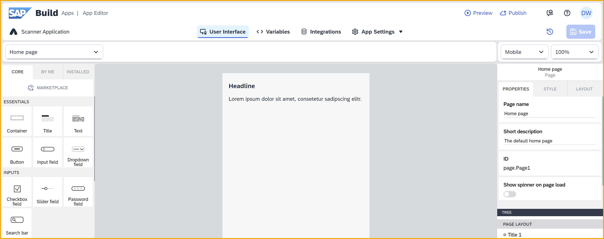
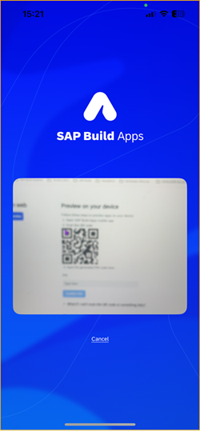

 
# Create an Application with SAP Build Apps
<!-- description --> Create an application with SAP Build Apps on SAP BTP. The application, created in a browser, can be used with the mobile preview app to scan physical barcodes on food packaging to display calorific information.

 
## Prerequisites
- Access to an SAP Build Apps system – follow these instructions to install SAP Build Apps on your trial system. 
    - For video instructions, see the following: <div>&nbsp;</div><iframe width="560" height="315" src="https://www.youtube.com/embed/ZpQM2B1v2GY" frameborder="0" allowfullscreen></iframe>
    - For written instructions, do ONLY **Step 2** of [Set Up Prerequisites for SAP Build CodeJam](https://developers.sap.com/tutorials/codejam-0-prerequisites.html#76cc6857-c70a-4e56-a03a-41e6043a67fe) **→ YOU ONLY HAVE TO DO STEP 2 (Install SAP Build Apps) OF THIS TUTORIAL!!!**
- Download the SAP Build Apps previewer app on a smart phone or tablet: [iOS](https://apps.apple.com/us/app/sap-appgyver-preview/id1585856868) / [Android](https://play.google.com/store/apps/details?id=com.sap.appgyver.preview.release).

    <center>

    | iOS | Android | 
    | ------ | --------- |
    |  |  |

    </center>

## You will learn
  - How to create a no-code project with SAP Build Apps
  - How to add and edit visual elements in the SAP Build Apps Composer tool

## Intro
>**IMPORTANT:** Make sure to follow the above prerequisites for installing SAP Build Apps -- the booster will install SAP Build Apps and the Cloud Identity Service, as well as assign you the needed roles. 

In this mission you will learn how to create a no-code application using SAP Build Apps. The application you create enables someone to scan a barcode of a food item and display information about the product using the Open Food Facts API:


>**IMPORTANT:** Though you can use any SAP Build Apps version, these tutorials are based on a SAP BTP trial account.

---

### Did you set up SAP Build Apps correctly?
Yes, no one reads the documentation.

But you need to follow the documentation to set up SAP Build Apps correctly on a trial account. The setup is simple, but it does require a custom identity provider and specific roles, so it's worth taking an extra 2 minutes to make sure everything is set OK. 

If you setup SAP Build Apps properly, skip this step. Otherwise, we have tried to make it as simple as possible by giving you a choice:

- [2-minute video](https://www.youtube.com/watch?v=ZpQM2B1v2GY)
- [Written instructions](https://developers.sap.com/tutorials/codejam-0-prerequisites.html#76cc6857-c70a-4e56-a03a-41e6043a67fe) – the written instructions are in a single step -- **Step 2** -- in our SAP Build CodeJam prerequisites tutorial. **You only have to do Step 2, Install SAP Build Apps**.

>**ADVERTISEMENT:** The Developer Advocates deliver SAP Build CodeJams –- both beginner and more-advanced workshops -- and we are always looking for hosts. If you are interested, see our [blog](https://community.sap.com/t5/sap-codejam-blog-posts/so-you-want-to-host-a-codejam-everything-you-need-to-know/ba-p/221415) about what's required to host a CodeJam and add a comment there that you want to host one.

>


### Create SAP Build Apps project

1. Open the SAP Build lobby in your trial account by doing the following:

    - Open the SAP BTP cockpit by going to [https://account.hanatrial.ondemand.com/cockpit](https://account.hanatrial.ondemand.com/cockpit).

    - Click **Go to Your Trial Account**.

    - Under Subaccounts, click the **trial** tile.     

        

    - **Under Instances and Subscriptions**, click the button next to SAP Build Apps.
    
        
        
        This opens the SAP Build lobby.

        

2. Within the SAP Build lobby, click **Create**.
   
    
   
    Click **Build an Application**. 
   
    

    Click **SAP Build Apps**. 
   
    

    Click **Web & Mobile Application**. 

    

3. Enter:

    | **Field** | **Value** |
    |---------|--------------|
    | Name | **Scanner Application** |
    | Description | **Scanner app for reading food barcodes** |
    
    Click **Create**.

    

    Your SAP Build Apps project is created, and the default **Home page** is displayed. Once created, projects can be accessed again at any time from the SAP Build lobby.

    

4. Since we want to create a mobile app, open the device dropdown and select **Mobile**.

    

    Your project will now look like this:

    


### Understand SAP Build Apps



When working with SAP Build Apps, the majority of your time will be spent in the app builder area. This area allows you to complete key tasks such as, but not limited to, the following:

- Build pixel-perfect user interfaces

- Integrate with external data resources

- Create complex logic with visual programming

- Bind data to components to create dynamic views

- Define navigation

For more detailed coverage of the features available in the app builder area, view the [SAP Build Apps documentation](https://help.sap.com/docs/BUILD_APPS/431746e4c663458aa68d9754b237bfc6/daece9f87abf4f7187a14ae0b1f8b2ab.html).


### Edit app interface
You'll now start to create a basic layout for your application, starting with editing text.

1. Select the **Title** component (the one that says **Headline**) by clicking it once.

    

    Click the text to select the text.

    

    Copy-and-paste or type in the following:

    ```Text
    Barcode Scanner
    ```

    

2. Double-click the **Text** component to highlight the text, and paste in the following:

    ```Text
    Scan a barcode of a food product using your smartphone
    ```

    

    >Instead of editing text directly inside a component, you can also set the text using the **Content** property in the **Properties** tab to the right. This option is needed if you set the text based on a formula or variable.


### Add scan button

Next, you'll need to add a scan button which, when tapped, will open the camera device on your smartphone.

1. Locate the **Button** component (found under **Core > Essentials**) and drag and drop this underneath the paragraph/text field.

    

2. Edit the button label by clicking the word **Button** inside the button and typing `Scan`.

    

3. Click **Save** (upper right).

    

The application is now saved and available to preview using the preview app on your smartphone.

 

### Preview app on your device
1. Open the SAP Build Apps preview app on your mobile device, and click **Other login options**.

    

    Select the **US10** region from the dropdown list.

    
    
    >If you are not using a trial account and your account is in the EU10 region, select the **EU10** region.

    Click **Generate Code**. This will display a pin code.

      

2. Go back to SAP Build Apps on your desktop, and click **Preview**.
    
    
    
3. Enter the pin code, and press **Enter** or click **Confirm pin**.

    

    This will refresh the preview app and display a list of your apps. 

4. Click **Open** for the **Scanner Application** project.

     

    Your application starts to run.

    

