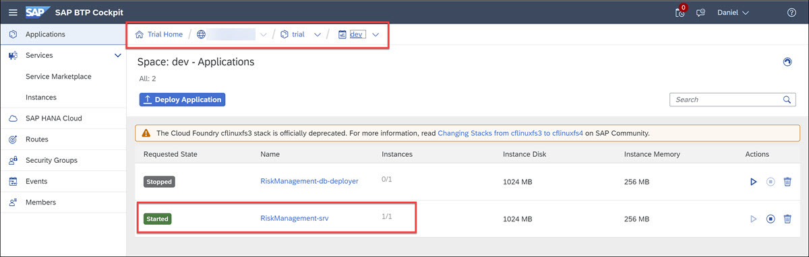
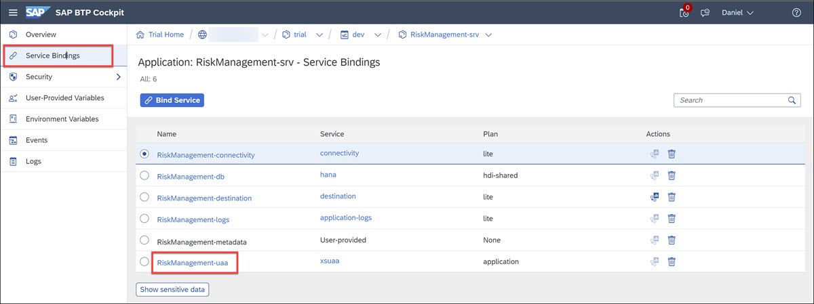
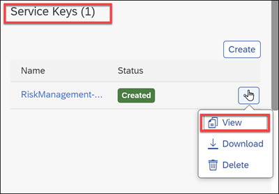
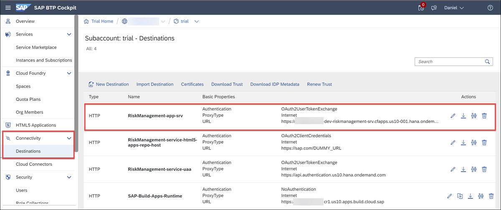
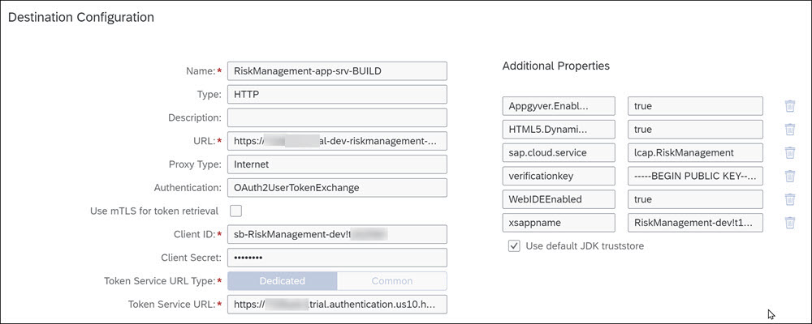
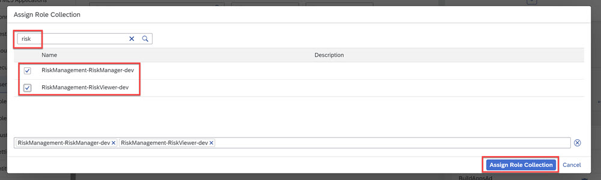
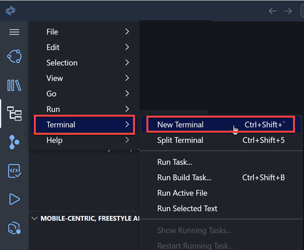
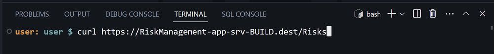
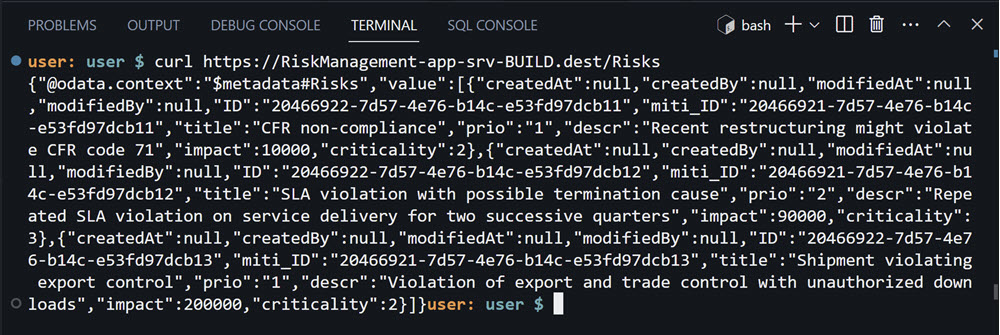
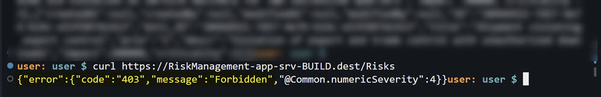

 

# Expose a CAP Service to SAP Build
<!-- description --> Expose a CAP service that is deployed on SAP BTP so that SAP Build Apps projects can access the backend.

 
## Prerequisites
- You have created a CAP service, as described in [Create a CAP Service with BAS Productivity Tools](build-apps-cap-service).


## You will learn
- How to create a destination to your CAP service with principal propagation


## Intro
In order for SAP Build Apps to access your CAP service, you must create a destination for the service. The destination will be defined so it will log into the service using the credentials of the current user.

We want to log into the service this way because we have defined roles, which can be assigned to specific users. So we need to know the current user.


---

### View service in BTP
Open your SAP BTP cockpit and navigate to the Cloud Foundry space where your service is deployed.



Click on the service, and then click on **Service Bindings**. Here you will `RiskManagement-uaa`



Finally, click on `RiskManagement-uaa`, and you will see a service key on the right, for which you can click **View** to get all the information you need to build a destination.




### Create destination
1. Navigate back to your subaccount (`trial` if you are in your trial account).

2. Go to **Connectivity > Destinations**.

    You will already see a destination called `RiskManagement-app-srv` related to your service, from which you will create copy and adjust it so you can use it for SAP Build Apps.

    

3. If you cannot clone the destination, export it and import it as a new destination.

    >You will notice the authentication type is `OAuth2UserTokenExchange`. This allows the CAP service, when called using the destination, to know who the user is. This is important because we defined roles and only users with those roles can either read or read and write to the CAP service.

    Set the following:

    | Field    | Value | 
    | -------- | ------- |
    | Name  | `RiskManagement-app-srv-BUILD`    |
    | URL  | Add the following path to the URL: `/service/RiskManagement`   |
    | Client Secret  | Get this value from the service key in the previous step.    |

    Add the following properties to the destination:

    | Field    | Value | 
    | -------- | ------- |
    | Appgyver.Enabled  | true    |
    | WebIDEEnabled  | true     |
    | HTML5.DynamicDestination  | true    |
 
    

3. Click **Save**.


### Give your user roles
1. In the cockpit, go to **Security > Users**.

2. Find your user for the custom IDP, and on the right, click **Assign Role Collection**.

3. Search for `risk`, select both roles you created with your service, and click **Assign Role Collection**.

    


### Test service

1. Go back to SAP Business Application Studio.

    >It must be the BAS located on the same subaccount as your service and SAP Build Apps.

2. Open a terminal window.

    >Either go to hamburger menu **Terminal > New Terminal** or **View > Terminal**.

    

3. In the terminal, run the following command:

    ```Bash
    curl https://RiskManagement-app-srv-BUILD.dest/Risks
    ```

    

    You should get the service document of the service.

    

4. If you remove the roles from your user, immediately you will see that you get a 403 error.

    