# Create a CAP Service with BAS Productivity Tools
<!-- description --> Create a SAP Cloud Application Programming model (CAP) service using the productivity tools in SAP Business Application Studio.
 
 
## Prerequisites
- You have created a trial account in US East (Va) region, as described in [Get a Free Account on SAP BTP Trial](https://developers.sap.com/tutorials/hcp-create-trial-account.html).
- You have installed SAP Build Apps on your trial subaccount, as described in [Set Up SAP Build Apps (with Booster) on SAP BTP Trial Account](https://developers.sap.com/tutorials/build-apps-trial-booster.html).
- You have created an instance of SAP HANA database, as described in [Deploy SAP HANA Cloud](https://developers.sap.com/tutorials/hana-cloud-deploying.html).  
- You have given your user on the custom identity provider the role collection `Business_Application_Studio_Developer`.
  

## You will learn
- How to build a CAP service with low-code tools
- How to create roles to enable authorization for your data entities
- How to deploy your CAP service to SAP BTP


## Intro
You will quickly build a Risk Management service with 2 entities: Risks and Mitigations. Each risk can have 0 or 1 mitigations, while mitigations can be assigned to multiple (or no) risks.

Another key feature is the creation of roles, one for viewer of the data and one for manager, meaning a person who can update the data. The role, exposed in SAP BTP as a role collection, can be assigned to a user once the service is deployed.

>You must set up your SAP BTP tenant with SAP HANA Cloud and SAP Build Apps – your deployed CAP service and SAP Build app must be on the same tenant. For this tutorial, we will assume you are using a trial account.

>You can use SAP Business Application Studio on any tenant, and when it comes time to deploy, deploy the service on the tenant with your SAP HANA Cloud and SAP Build Apps. 


### Create SAP Business Application Studio project


[OPTION BEGIN [Use BAS Directly]]
These steps open SAP Business Application Studio in the traditional way, without using SAP Build's lobby.

1. Open the your subaccount, making sure **Instances and Subscriptions** on the left-side menu is selected.

    Click **SAP Business Application Studio**.

    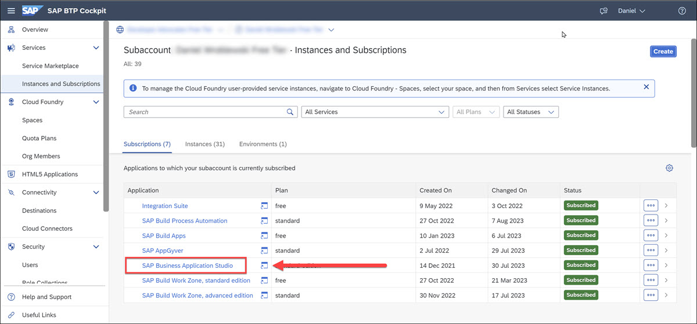

2. After opening SAP Business Application Studio, click **Create Dev Space**.

    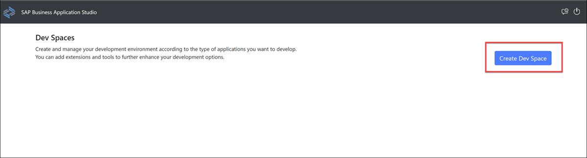

    Enter a name for your dev space, select **Full-Stack Application Using Productivity Tools**, and then click **Create Dev Space**.

    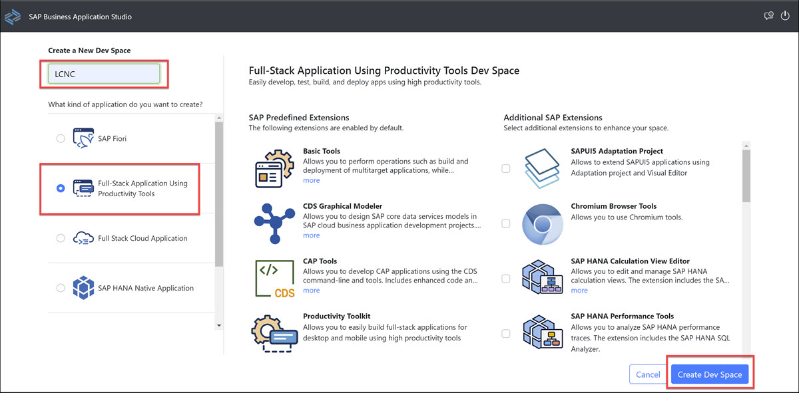

    The dev space will be created, and you will see that is being started.

    

    Soon it will say **Running**.

    

3. Click the dev space name to open it, and you will the main canvas of SAP Business Application Studio.

    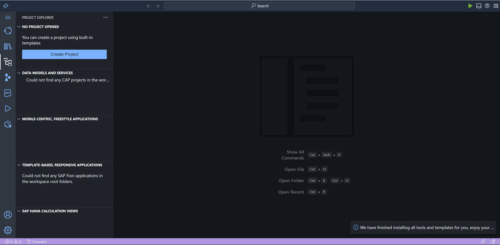

4. Click **Create Project**.

    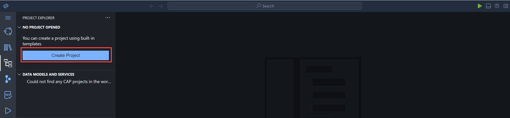

    Select the **Full-Stack Project** generator, and click **Start**.

    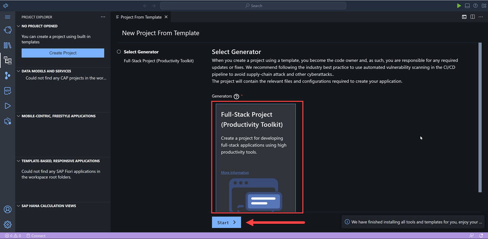

    For the name of the project, enter `RiskManagement`, and then click **Finish**.

    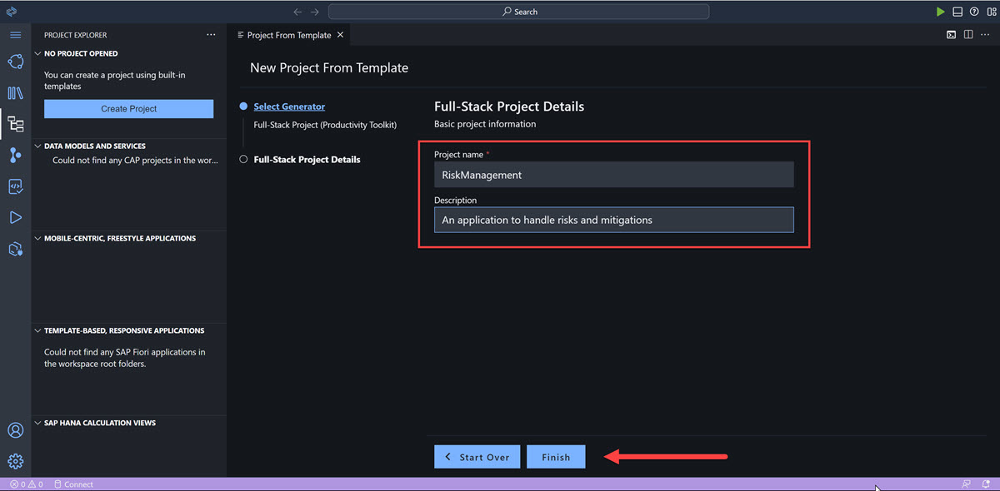

    BAS will generate the project and all the files, and you will see the following, where you can create data models, the services that will expose the data, and more:

    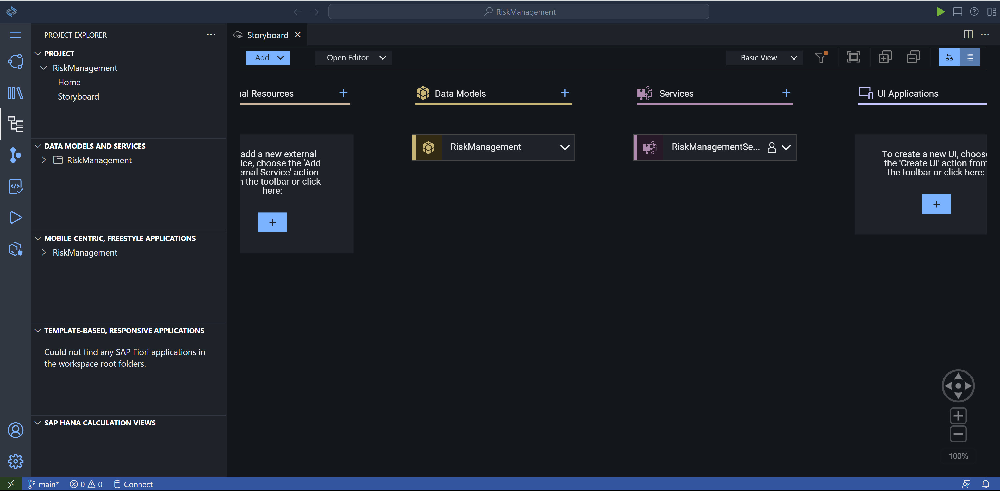

[OPTION END]


### Create data model
1. In the storyboard, click the plus sign ( **+** ) above **Data Models**.

    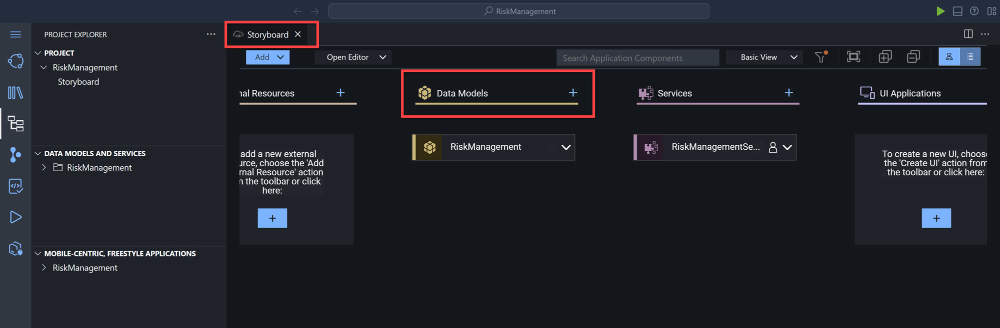

    This will display the data model canvas, with a new data entity called `Entity1`. You will now change the name and add the fields.

    Click the **Show Details** icon to open the editor.

    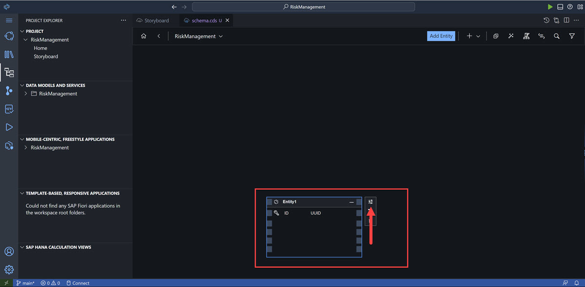

2. In the editor, change the name of the entity to `Risks` (save by clicking the checkmark ☑️) and add the following fields:

    | Property name    | Property Type |  Max Length |
    | -------- | ------- | -------- | 
    | title  | string    | 100 | 
    | prio | string     | 5 | 
    | descr    | string    | 100 | 
    | impact    | integer    | | 
    | criticality    | integer    |  | 

    Close the editor by clicking the top-right **X**.

    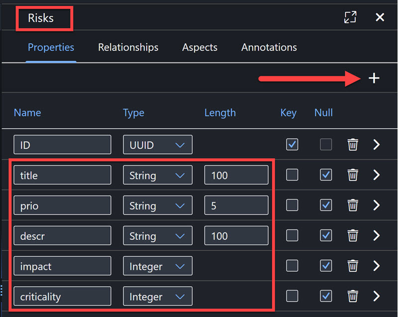

3. Create another entity called **Mitigations** by clicking **Add Entity** and dropping the new entity on the canvas.

    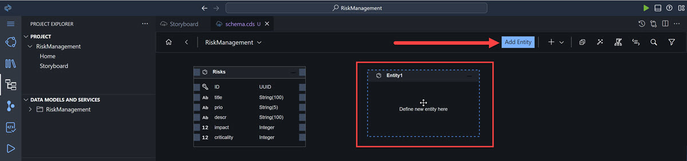

    Again, click the **Show Details** icon (select the entity to see its side menu).

    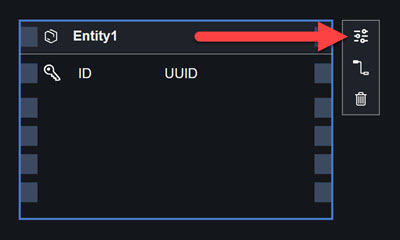

    Change the name of the entity to `Mitigations` (and click ☑️) and add the following fields:

    | Property name    | Property Type |  Max Length |
    | -------- | ------- | -------- | 
    | description  | string    | 100 | 
    | owner | string     | 100 | 
    | timeline    | string    | 100 | 

    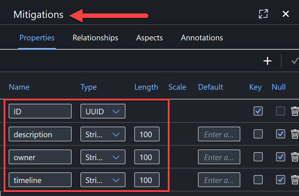

    Close the editor by clicking the top-right **X**.

4. Add relationship between the entities by selecting the **Mitigations** entity, and clicking the **Relationship** icon.

    This will create an arrow for you to indicate the other entity with which to form a relationship.
   
    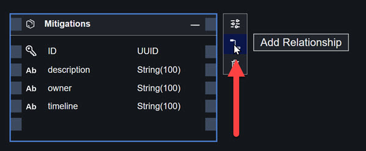

    Drag the icon and drop it on the **Risks** entity, and click.

    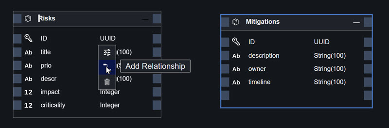

    This will open the relationship editor.

    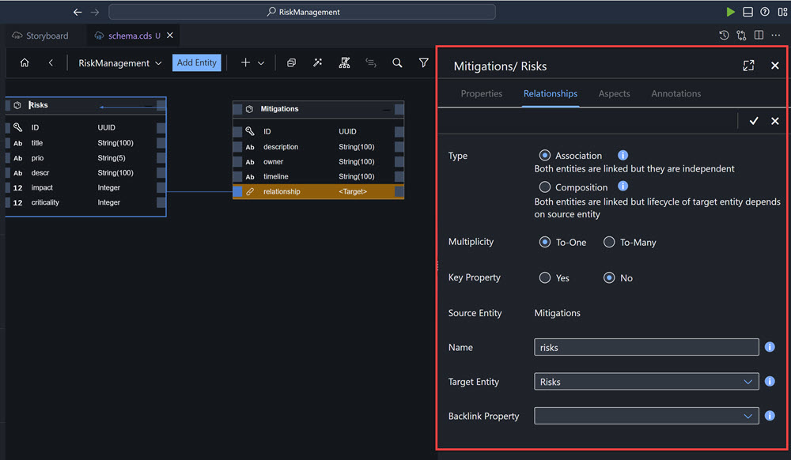
    
    All of the following properties will be set:

    | Field    | Value | 
    | -------- | ------- |
    | Type  | Association    |
    | Multiplicity  | To-many    |
    | Name  | risks    |
    | Target Entity  | RiskManagement.Risks    |
    | Backlink Property  | mitigations    |

    Click **Create**.

    This will create a relationship.

    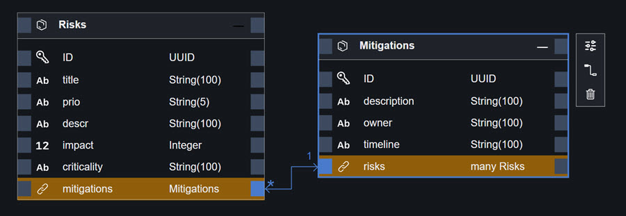

5. For both entities, open the **Show Details** pane again.

    Select the **Aspects** tab, and enable the **managed** aspect. 

    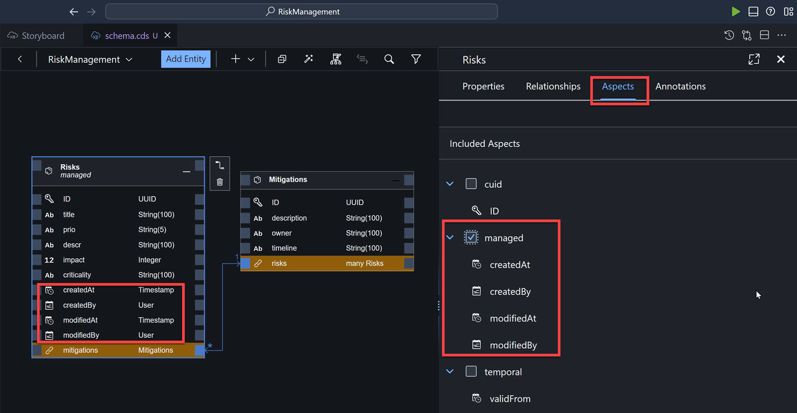

    Repeat for **Mitigations** entity.


### Create service

1. Back in the storyboard, click the plus ( **+** ) next to **Services** to add a service.

    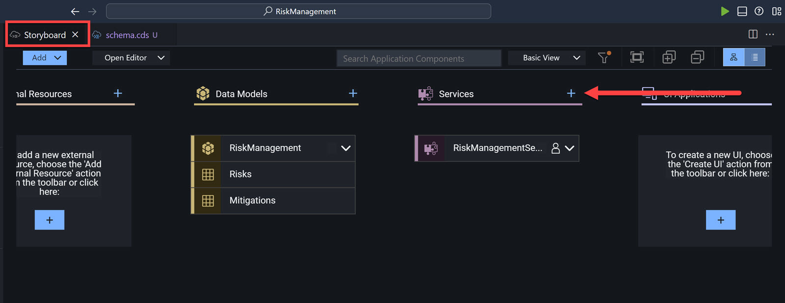

    Choose the **Risks** entity, disable the **Enable Draft Editing**, and click **OK**.

    >**IMPORTANT:** Please make sure that the **Enable Draft Editing** checkbox is ***disabled***, as this will prevent you from adding records and seeing the data in the following tutorials. Note that if you disable the checkbox and then select an entity, the checkbox will be re-enabled.

    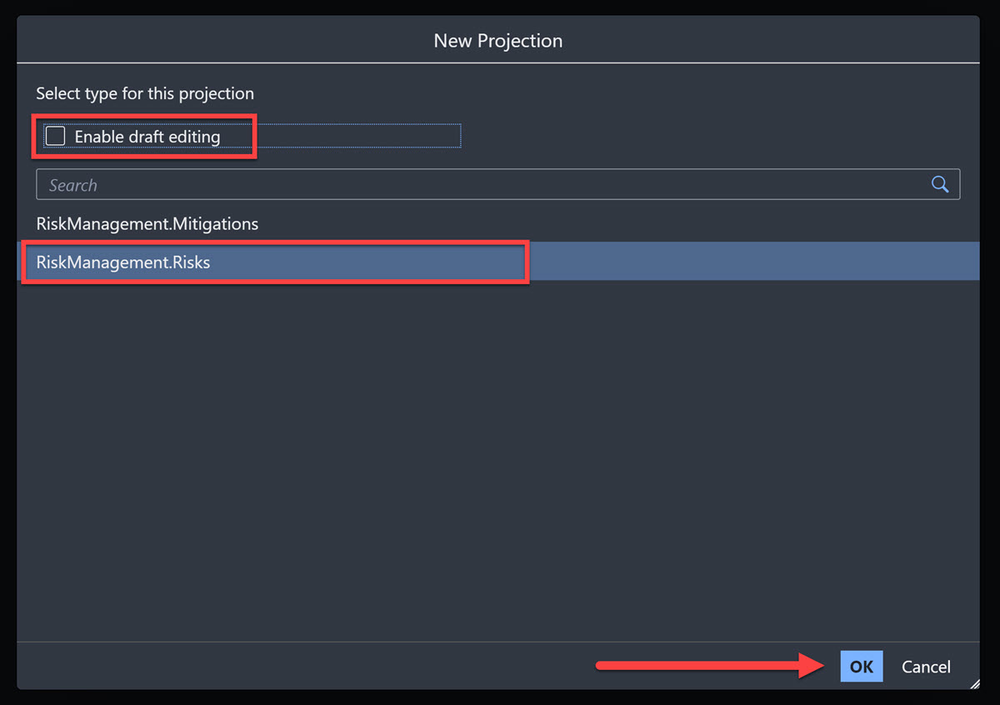

2. Click **Add Entity** and place the new entity in the canvas.

    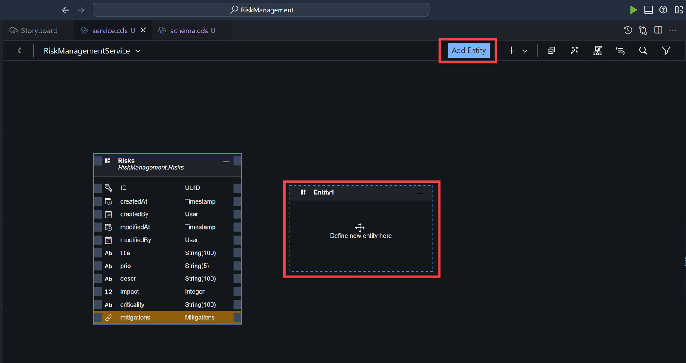

    Choose the **Mitigations** entity, disable the **Enable Draft Editing**, and click **OK**.


### Add sample data

1. Download the CSV data files [RiskManagement-Risks.csv](RiskManagement-Risks.csv) and [RiskManagement-Mitigations.csv](RiskManagement-Mitigations.csv).

2. Go back to the storyboard.

3. Right-click the **Mitigations** entity, and select **Add Sample Data**.

    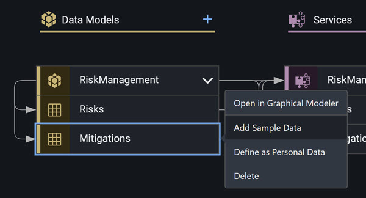

4. Choose **Import**, and click **Add**.

    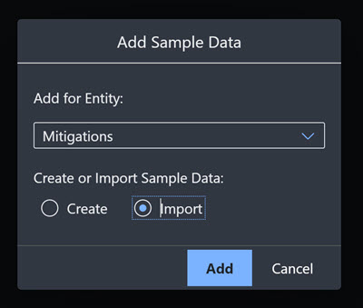

5. Select the downloaded `RiskManagement-Mitigations.csv` file.

    The data is automatically added and saved.

    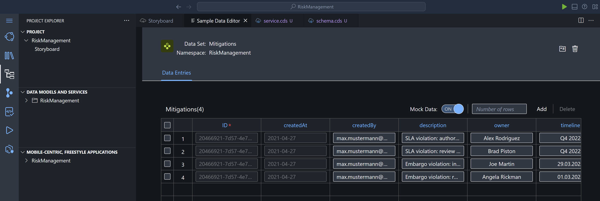

6. Go back to the storyboard, and do the same for the **Risks** entity with the `RiskManagement-Risks.csv` file.


### Add user roles

1. On the storyboard, select the little person icon next to **RiskManagementService**.

    

    >You can also open the **User Roles** editor by selecting the **Open Editor** dropdown and choosing **User Roles**.

    >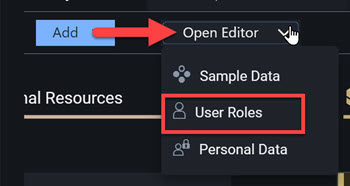

2. Add a role by clicking the plus sign ( **+** ) next to **User Roles**.

    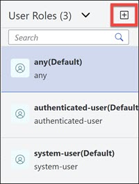
    
    Call the role `RiskViewer` and keep the privilege at **Read**.

    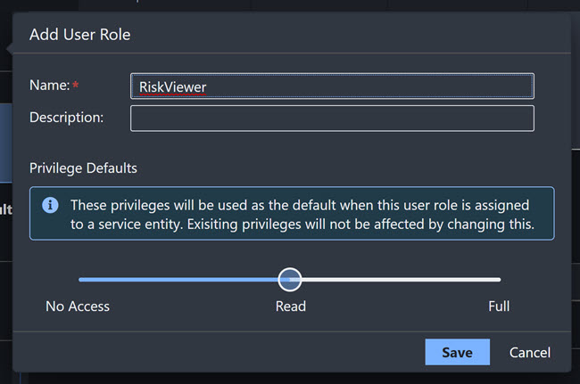

    Click **Save**.

1. Select the new role, and then select your service, **RiskManagementService** from the dropdown. 

    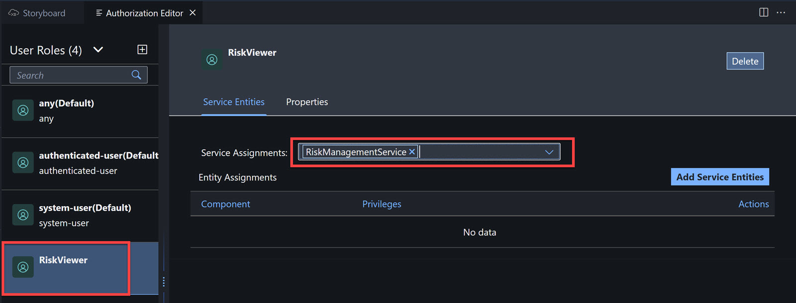

    Click **Add Service Entities**, and toggle on the two entities. The privileges should already be set to **Read**.

    Click **Save**.

     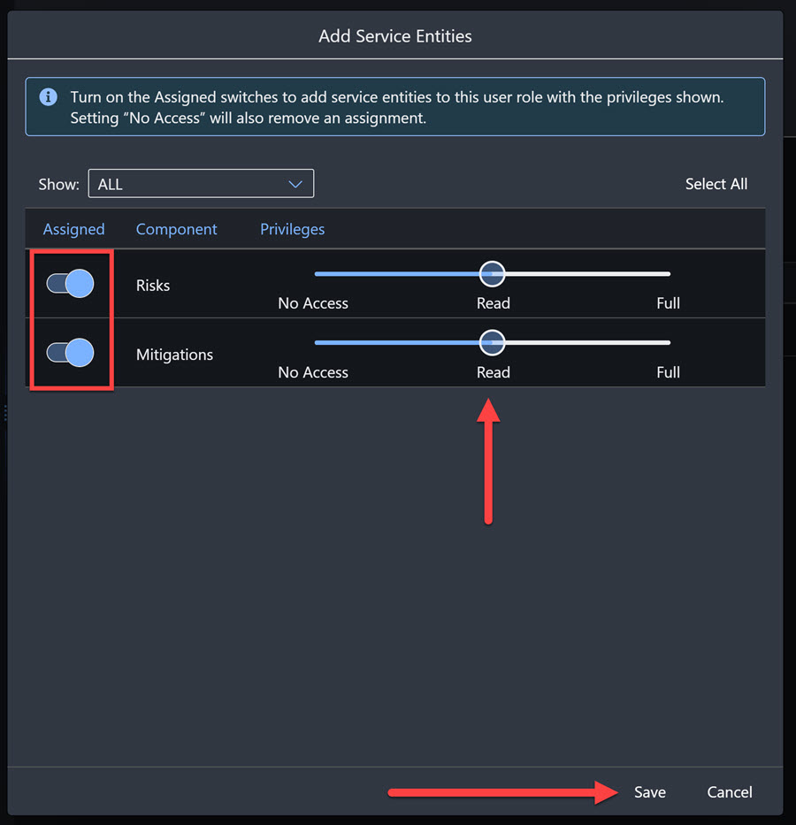

2. Add another role by clicking the plus sign ( **+** ).

    Call the role `RiskManager` and change the privilege to **Full**.

    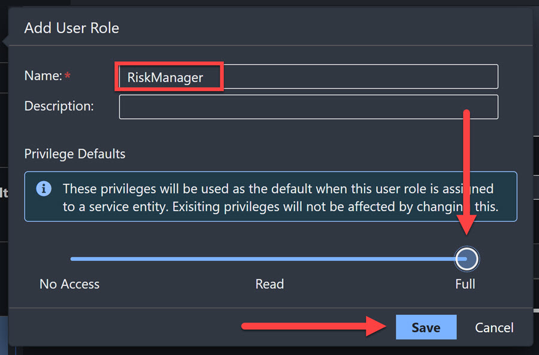

    Click **Save**.

3. Select the new role, and then select your service, **RiskManagementService** from the dropdown. 

    Click **Add Service Entities**, and toggle on the two entities. The privileges should already be set to **Full**.

    Click **Save**.

     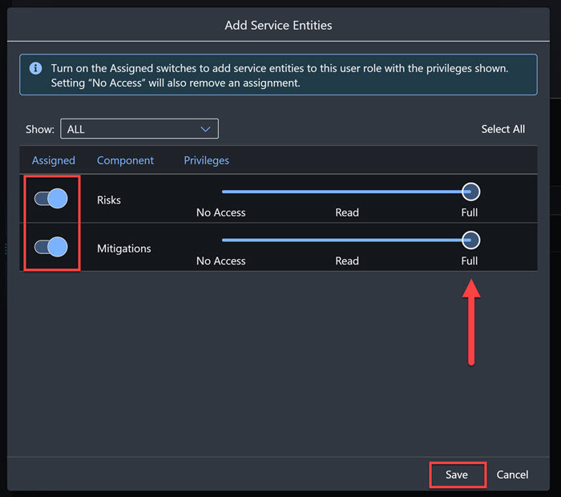


### Deploy project to SAP BTP


1. Open the Task Explorer by clicking on the side panel.

     

    Expand the **Deploy** node to see your project.

    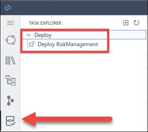

2. Hover over **Enable Discovery and Deploy RiskManagement** and click the **Run** icon next to your project.

    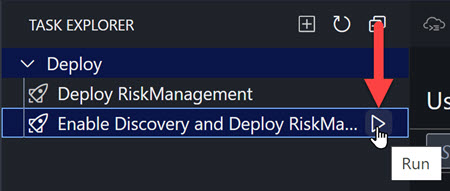

    The deployment process will run briefly, a **Terminal** window will open at the bottom of the screen, and then the Cloud Foundry login screen will appear. (You may need to make the **Terminal** area smaller to see the login screen.)

    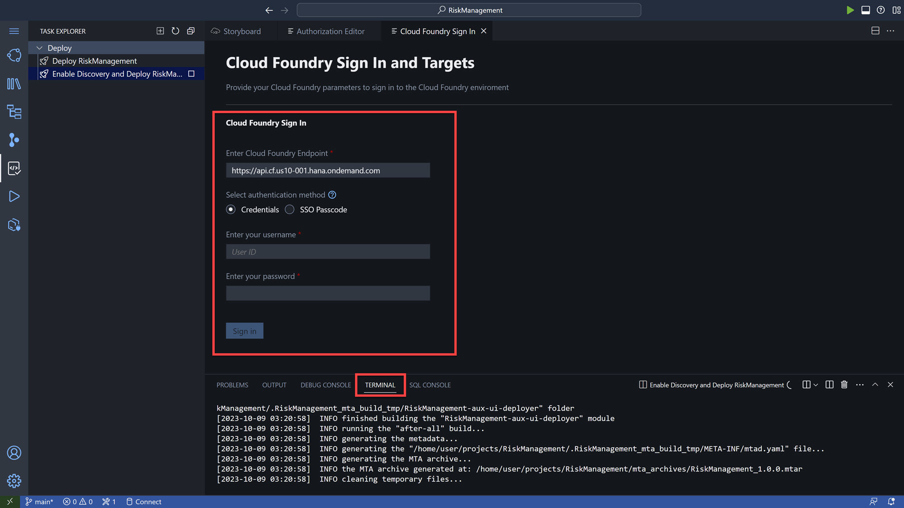

    >You are deploying to Cloud Foundry, so you must login and tell BAS to which Cloud Foundry to deploy.

3. Enter your Cloud Foundry endpoint, and your username and password for SAP BTP trial, and click **Sign-in**.

    Once you login to Cloud Foundry in general, BAS will want to know to which subaccount and space you want to deploy to.

    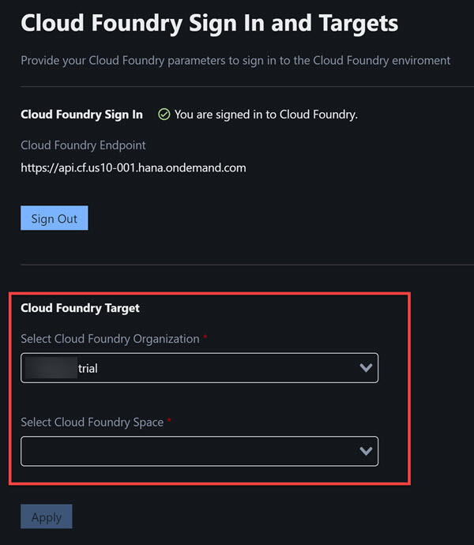

    Select the subaccount (Cloud Foundry organization), and then the space.

    >If you are working on trial, you will likely have only one choice for each.

    Click **Apply**.

The deployment will take about 5 minutes to finish. When complete, you will get the URL to your service, though you will not have permissions to view it.

>**TROUBLESHOOTING:** 
>
>- In a SAP BTP trial account, SAP Business Application Studio allows only 2 deployments using a **Full-Stack Application Using Productivity Tools** dev space. If you created the application from the SAP Build lobby, this is the type of dev space used behind the scenes.
>
>- If you have trouble redeploying the CAP service, you may want to remove the previous deployment by running the following command in a terminal window:
>
>    ```
>    cf undeploy RiskManagement --delete-services --delete-service-keys
>    ``` 
>
>    The above assumes your app is named `RiskManagement`. You can check all deployed apps by running the command `cf mtas`.


### Check service

1. In your trial account, on the left-side menu, click **Cloud Foundry > Spaces**. You likely will have only one space, called **dev**.

    Click the space, and you will now see your application.

    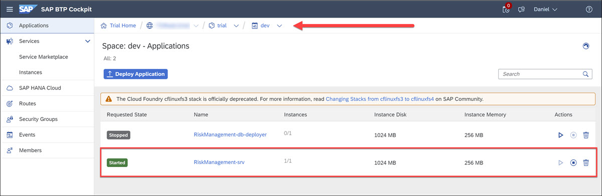

    Click on the link `RickManagement-srv`, and you will see a link. Click on it.

    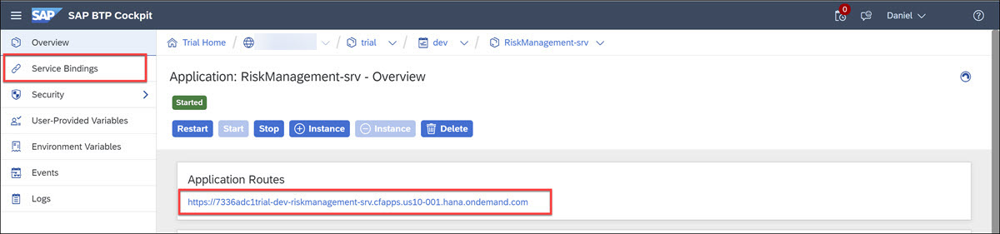

    You will get a page with information about your service, with a link to the service (`service/RiskManagement`).

    >You will not see anything yet since you are not authorized. In the next tutorial, we will test it from SAP Business Application Studio, and in the following tutorial you will access it from SAP Build Apps.

2. The destination for your service – so that other services like SAP Build Apps can call it – was already created. But if you needed to create it yourself, you would do so by getting information about your service.

    Go back to the previous page, and on the left click **Service Bindings**, and then click `RiskManagement-uaa`.

    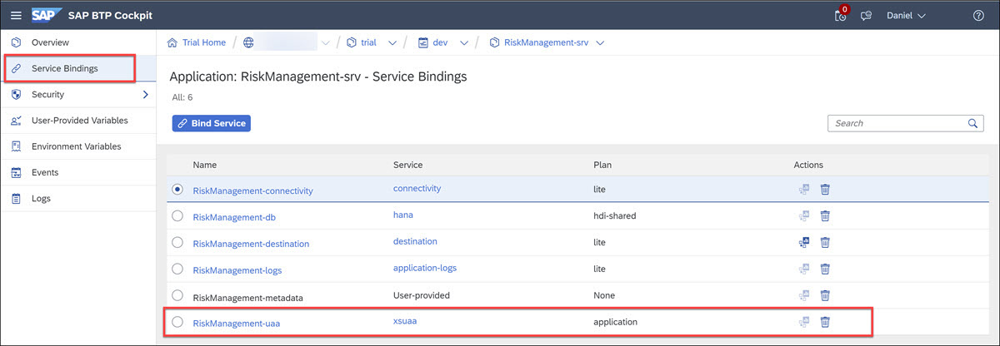

    On the right you will see a service key, and by clicking **View** you will get the client ID, and secret and other information for this service that would be needed to create a destination.

    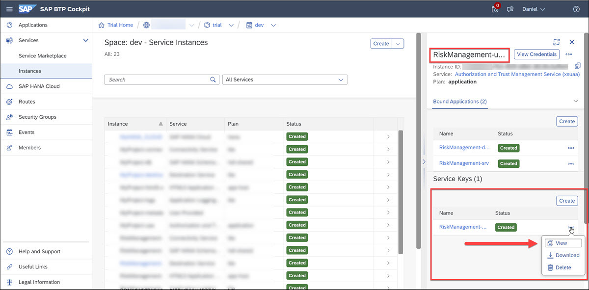


