 

# Deploy SAP Build App to SAP BTP
<!-- description --> Deploy an app created with SAP Build Apps to HTML5 applications on SAP BTP.

 
## Prerequisites
- To deploy, you need to be a member of the Cloud Foundry org and space to which you will be deploying to.

## You will learn
- How to deploy an SAP Build app to SAP BTP

## Intro
After creating an app in SAP Build Apps, and after viewing the preview on the web and on your mobile device, you can then deploy it directly to SAP BTP, like any other HTML5 application.

As of the writing of this tutorial, you could only deploy to an Cloud Foundry org's default space.

>**IMPORTANT:** You need to be a member of the Cloud Foundry org and space to which you will be deploying to.

>If you are an admin of the SAP BTP subaccount, you can see who is an org member by going to the cockpit and navigating to **Cloud Foundry > Org Members**.

>

> If you navigate to the space, there is a similar members for space members.

>

---

### Create build configuration
1. Open the **Launch** tab.
   
2. Select **Open Build Service**.
   
    

    The following is displayed, where you can create a build configuration (a set of properties to describe how you want your app to be built) and to deploy it.

    

3. Click **Create Configuration**.

    Select **SAP Build Work Zone**.
    
    

2. Enter **StandardWZ** for the configuration name, and click **Create**.

    

    This creates a build configuration.

    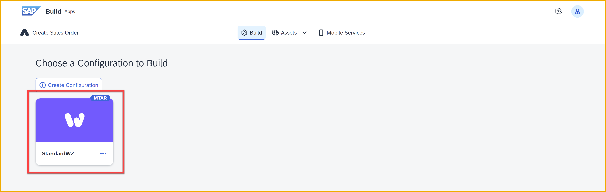
    

### Build the app
1. Click the 3 dots on the configuration, and select **Build**.

    

2. Enter `1.0.0` for the version number, and click **Build**.
   
    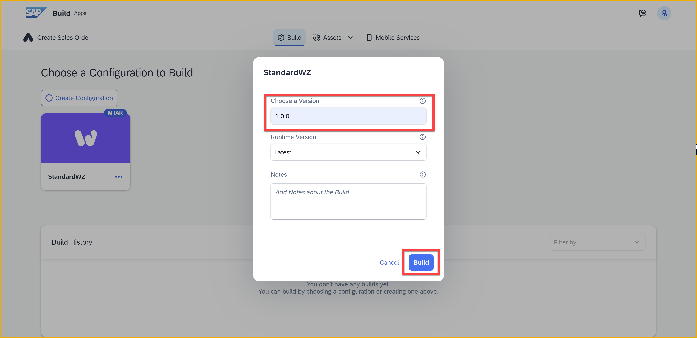

    The build will start.

    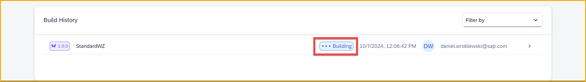

    After about 5 minutes, the status will change from **Building** to **Delivered**.

    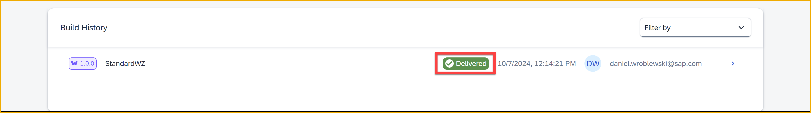

### Deploy app
Before deploying, you must have a build that completed successfully, showing a status of **Delivered**.

>**IMPORTANT:** In order to deploy, you must be a member of Cloud Foundry in your SAP BTP tenant, and a member of the space to which you want to deploy.
>
>An admin can add you to the org and space, starting from the SAP BTP cockpit.
>
>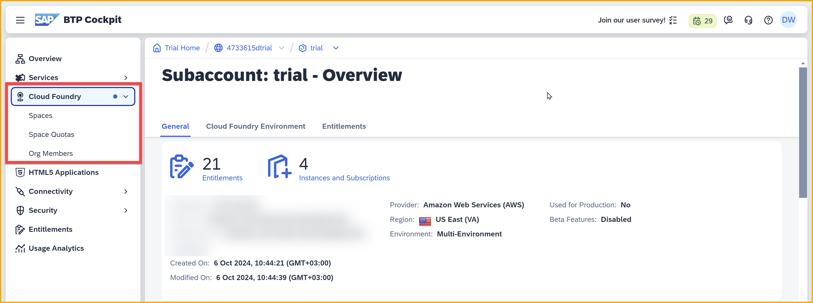

1. Click the **>** symbol for the build you want to deploy.

    

2. Click **Deploy**.

    

3. In the dialog, you have to specify to which Cloud Foundry environment you want to deploy it, as well as your credentials.

    

    For **API Endpoint**, go to the **Overview** page of your SAP BTP subaccount, and check which API endpoint is used by your subaccount.

    

    Then select it in the dropdown.

    

3. Once you select your API endpoint, you need to log into Cloud Foundry.

    Click **Login with BTP**.

    

    A dialog opens, and lets you by default sign in with your default SAP BTP user (using the default IDP, not the custom one for SAP Build Apps). Select the default user.
       
    

    This will log you in and populate the **Organization** dropdown list with the ones you have permission to. 

4. Here, I have rights to several SAP BTP subaccounts. I'll choose the one for my SAP BTP trial account.

    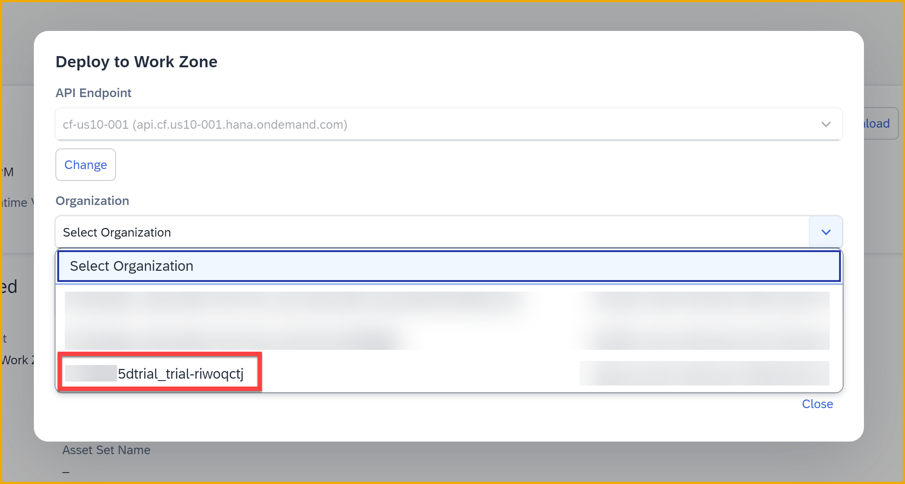

    Once you select an organization, you will get a list of spaceds to which you belong. Select the one you want to deploy to. Most users doing this tutorial will only have one, and it will be named dev.

    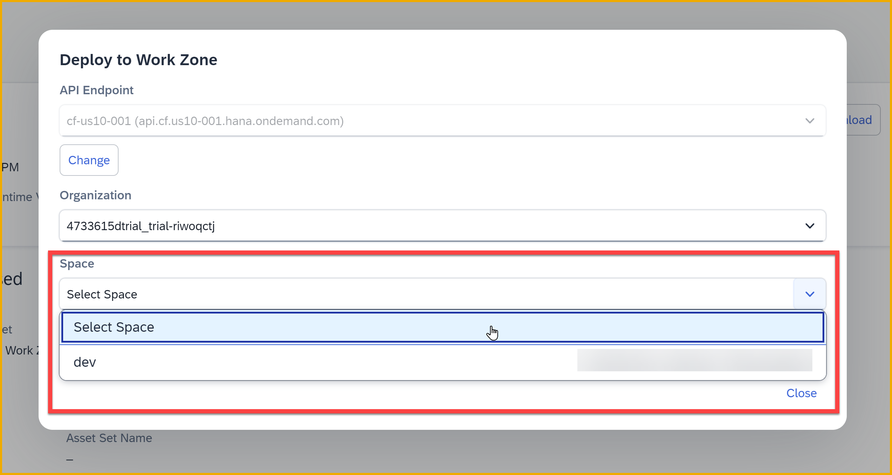

    Click **Continue**.

    The app will start to deploy.

    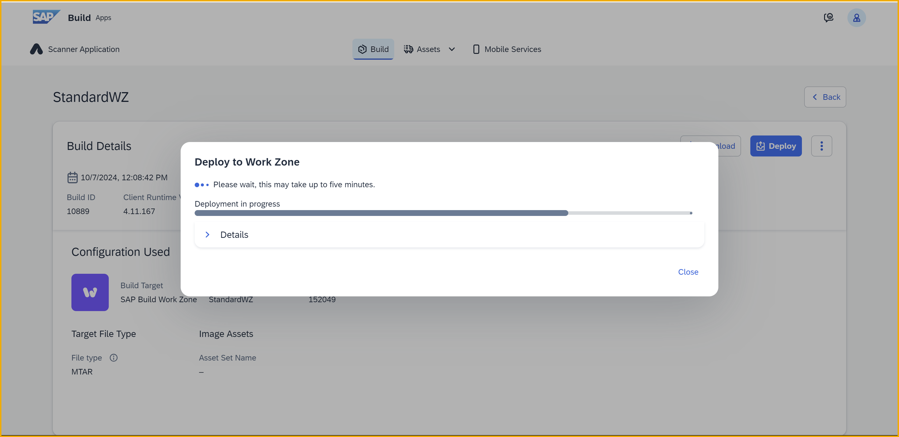

5. Once the deployment ends successfully, you will get a linkto the deployed app. Click the link to open the app.

    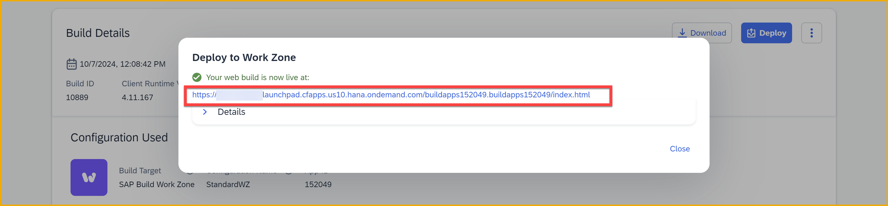

    Once deployed, you can go back to the cockpit and see the app under **HTML5 Applications**, with the same number as in the URL you got above.

    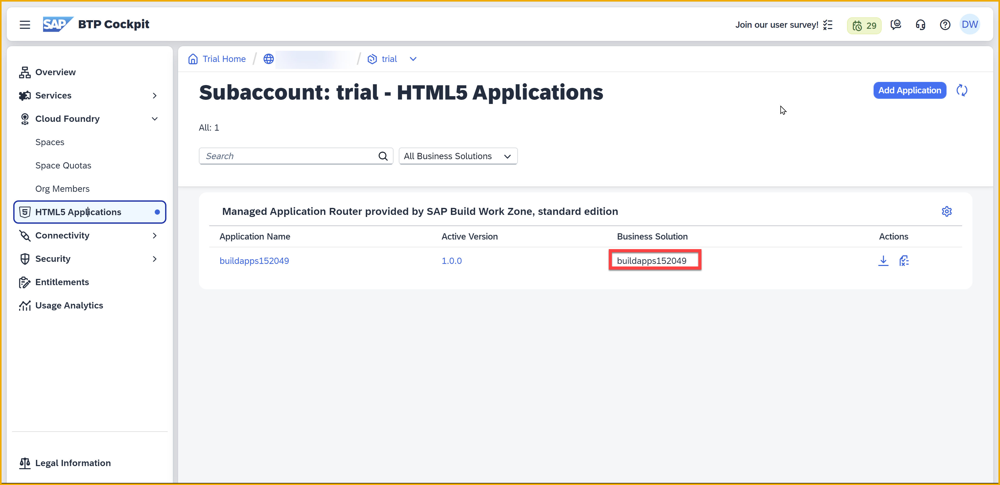

### Running the app
You can click the link returned when you deployed the app. But you may get the following unless you have set up SAP Build Apps to work with SAP Build Work Zone, which is the component that runs your deployed apps.

You must configure your SAP BTP according to the instructions here: [Integration with the App Editor - Deployed Applications](https://help.sap.com/docs/build-apps/service-guide/integration-to-app-builder#deployed-applications?).  

Here is a summary of what needs to be done as of the time of publishing this tutorial.

>The screenshots and instructions below are based on using a SAP BTP trial account. If you have a productive SAP BTP account, the steps may be different but the basics would be the same.

1. Go to the SAP BTP cockpit, navigate to **Instances and Subscriptions**.

    Open the **SAP Build Work Zone, standard edition** application.

    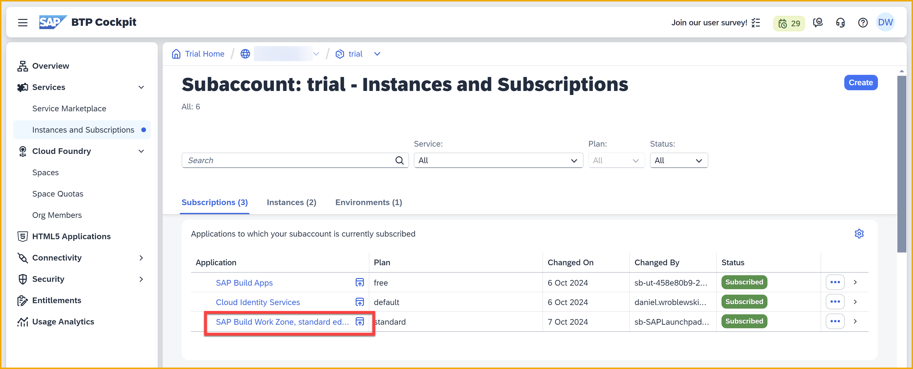

    On the left navigation, click **Settings**, then select the **Identity Authentication** tab.

    Select the checkbox, and click **Enable**.

    After a few seconds, you should see a success message.

2. Go to the SAP BTP cockpit, navigate to **Instances and Subscriptions**.

    Open **Cloud Identity Services**.

    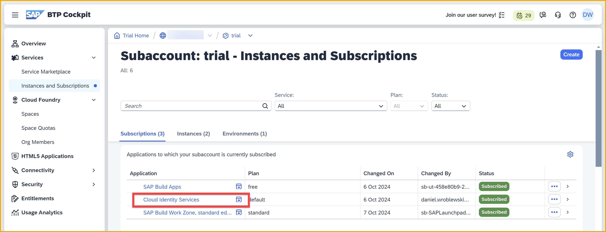

    This opens an admin dashboard. Select the **Applications & Resources > Applications**.
    
    Then on the left, select the **SAP Build Work Zone** application.
    
    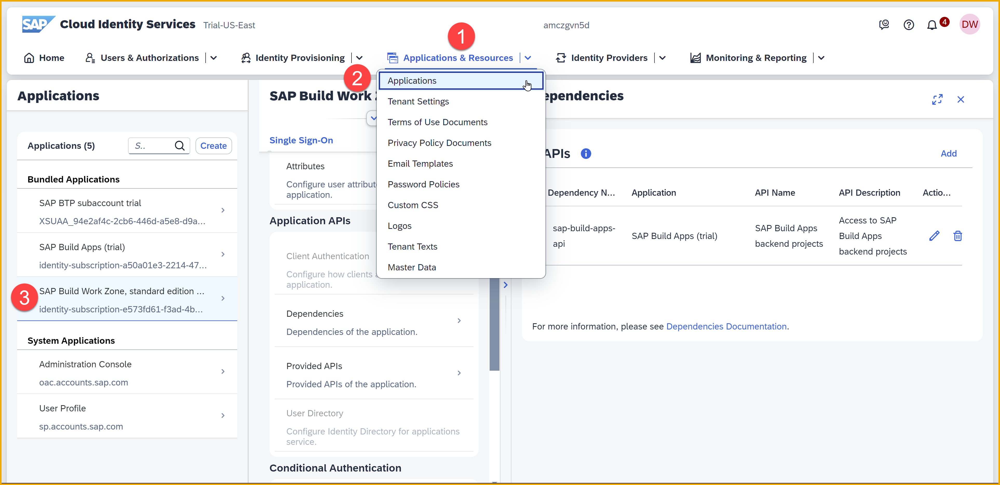

    Scroll down and select **Dependencies**.

    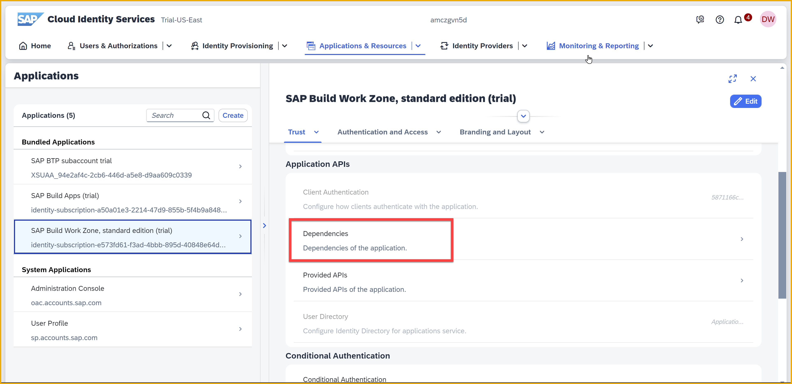

    Add a dependency with the following properties:

    | Field | Value |
    |------|--------|
    | Dependency Name | Enter `sap-build-apps-api` |
    | Application | Select the application for **SAP Build Apps** on your subaccount |
    | API | Select **SAP Build Apps backend projects** |

    Click **Save**.
    
    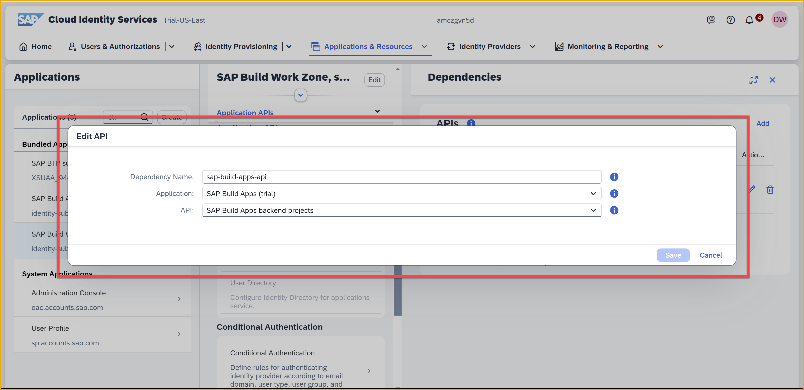
