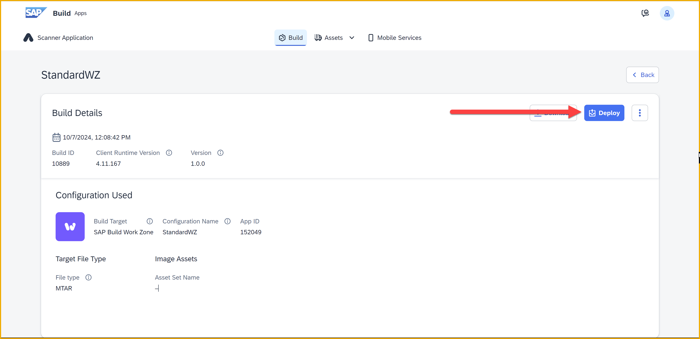

 

# Deploy SAP Build App to SAP BTP
<!-- description --> Deploy an app created with SAP Build Apps to HTML5 applications on SAP BTP.

## Prerequisites
- To deploy, you need to be a member of the Cloud Foundry org and space to which you will be deploying to.

## You will learn
- How to deploy an SAP Build app to SAP BTP

## Intro
After creating an app in SAP Build Apps, and after viewing the preview on the web and on your mobile device, you can then deploy it directly to SAP BTP, like any other HTML5 application.

As of the writing of this tutorial, you could only deploy to an Cloud Foundry org's default space.

>**IMPORTANT:** You need to be a member of the Cloud Foundry org and space to which you will be deploying to.

>If you are an admin of the SAP BTP subaccount, you can see who is an org member by going to the cockpit and navigating to **Cloud Foundry > Org Members**.

>

> If you navigate to the space, there is a similar members for space members.

>

---

### Configure build
Here, you can configure settings for your build. Generally, you can use the defaults and do not need to do this step at all. 

1. Open the **Launch** tab.
   
2. Select **Open Build Service**.
   
    

    The following is displayed, with buttons to configure and start the build in the bottom left.

    

3. Click **Configure**.

4. Select **MTAR**, and then **Save & Next**.

    
   
5. Change the favicon, if needed, and select **Save & Next**.
   
6. Select **Save & Next**.

You should now be back on the main build page.

### Build app
1. Click **Build**.

    

2. Select **MTAR**.
   
    Select the most current runtime version.

    Enter a version for your app, for example `1.0.0`.

    

3. Click **Build**.

The build may take a few minutes, and if you refresh the page, the status may change from `created` to `queued` to `delivered`.

### Deploy app
Before deploying, you must have a build showing as `delivered`.

1. Click **Deploy MTA**.

2. Click **Authorize BTP Deployments**.

    

    You will get a dialog for signing in to the deployment environment (Cloud Foundry).
    
    Select your account.

    

    
3. Once signed in, select the Cloud Foundry organization to deploy the app to.

    

    >The deployment is always to the default space of the organization.

4. Click **Deploy MTA**.

    

    The screen will show a running list of log messages ... this could take about 2 minutes.

    

    Once it is done, you will get a screen like this:

    

    The name of the app is at the end of the URL.

    >**IMPORTANT:** As of the writing of this tutorial, the link in this screen did not work.

### Run app
1. Open your subaccount's cockpit.

2. Go to **HTML5 Applications**, and find your app.

    

    Click the application link.

    You should now see your application.
