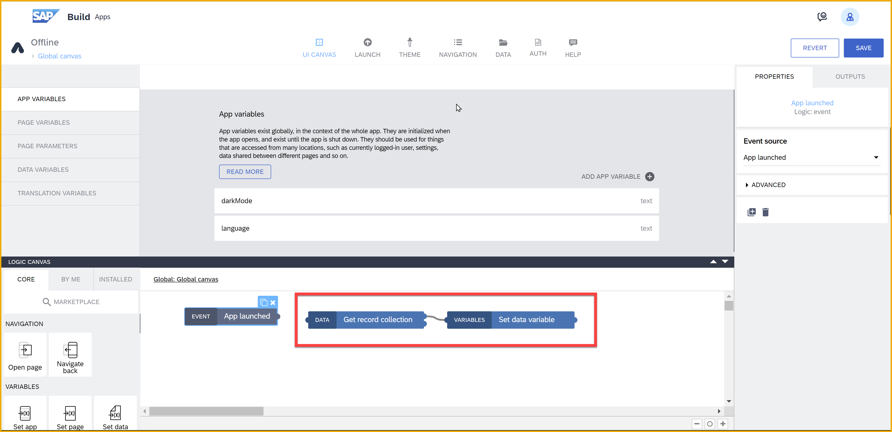
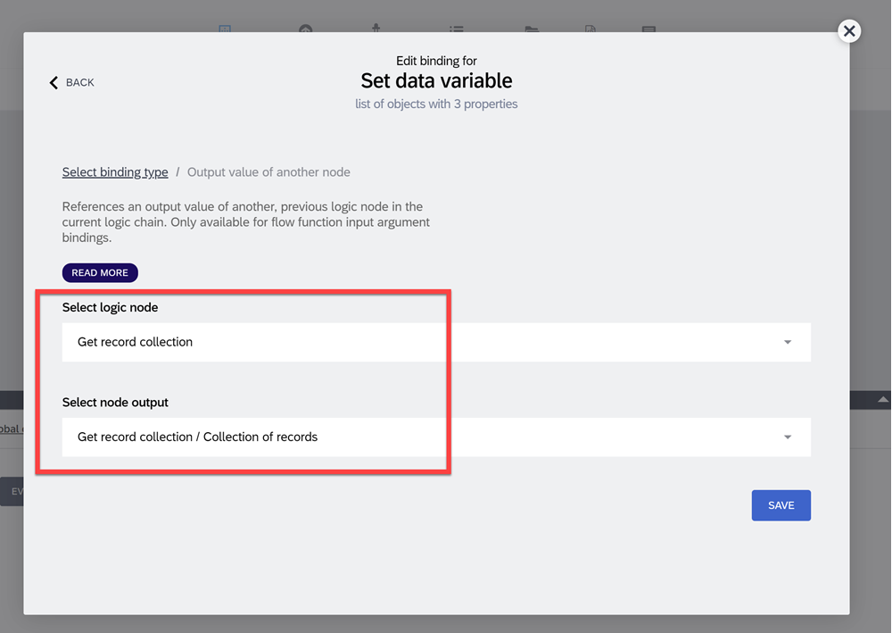
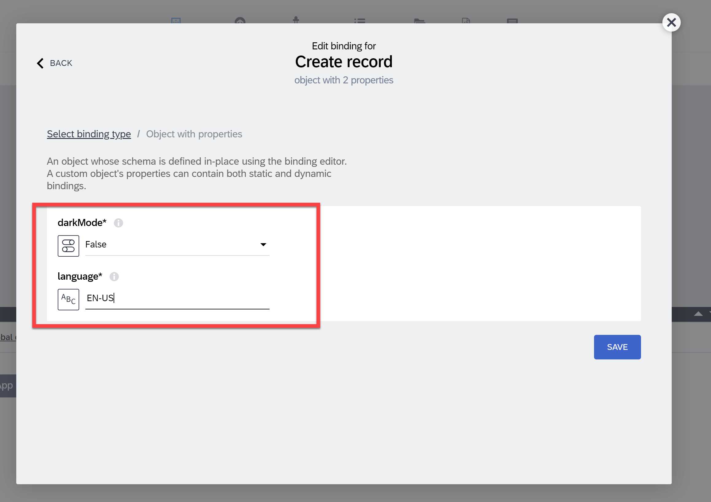
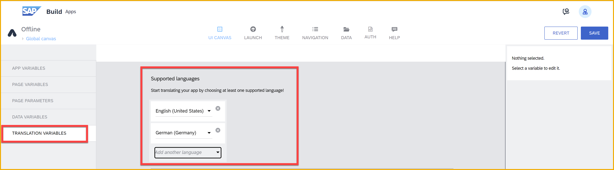

# Store user preferences on user’s device with SAP Build Apps

Store the user’s preferences or other data that should persist every time the user opens the app on the user’s device using SAP Build Apps’ on-device storage data resource.

## Prerequisites

- You set up SAP Build Apps and entered the lobby
- You are familiar with basic SAP Build Apps terminology such as canvas, component, logic, flow function, data, variables and formulas

## You will learn

- How to store information on-device
- How to fetch information from on-device storage
- How to use the global canvas for logic that should be run at app launch
- How to use the translations feature
- How to use formulas to style UI based on a variable value

## Intro

This tutorial shows you how to store a user’s preferences on the user’s device so the user can have a consistent experience every time they open the app. In this tutorial, we will store information on the language the user prefers and whether the app should be in light or dark mode. The same principles can be used to store other similar data as well.

---

### Setting up on-device storage

Let’s start by creating an on-device storage data entity for storing preferences. Due to the nature of on-device storage as a data entity, while we would only need to store two properties in this case, a whole data entity is created.

Give the data entity a name of your choice – in this tutorial, the name used is `Preferences`.

You might notice that the data entity has automatically an ID field. **Do not remove this field**, as you will need it to use some of the data flow functions. Instead, add two new fields:

- `darkMode`, type true/false
- `language`, type text

Save your changes and return to the UI canvas.

### Configuring variables

In this very short step, we will set up the app variables used to store the user’s preferences so that they can be used across all the pages of your app.

Go to the variables tab by clicking on the Variables switch on the top of the UI canvas.

Under **app variables**, create the following:

- `darkMode` of type true/false, initial value `false`
- `language` of type text, example and initial value `en-US`

The result should look like this:

Next, we will be adding a data variable on the app’s **Global canvas**. To do this, we will need to make sure we are on the Global canvas page. Remember to save the changes in your app before trying to change pages.

To go to the global canvas, open the page selection panel and choose the global canvas.

Now from the left side pane, select **data variables**, and add a new data variable for the data entity you created in step 1. Give the data variable a name of your choice, in this tutorial `Preferences` was used. We will be using a Collection type data variable, so you will not need to change the other settings.

### Fetching data from on-device storage and storing it in app variables

Now that the data variable exists, you might notice that it has some automatically generated logic attached to it. We will want to move this logic _away from the data variable’s logic canvas to the global canvas’ main logic canvas._ This is because we will be adding events to detect changes in the app variables and those do not fire correctly from a data variable’s logic canvas.

Thus, select the logic for the Preferences data variable, and copy and remove it with the keyboard command (CTRL/CMD+X).

Next, we want to move to the main logic canvas of the Global canvas. There are several ways to move to it, but the change is easily missed as it is subtle. I recommend going back to app variables and choosing one of the app variables to end up on the main logic canvas again.

You will know it is the main logic canvas because it says Global: Global canvas on top, NOT Data: Preferences.

Once here, click anywhere on the logic canvas and then you can paste the logic we removed from the data variable’s logic canvas using the keyboard command (CTRL/CMD+V). Place it next to the App launched event.

Result should look something like this:

Connect the App launched and Get record collection nodes with your mouse and remove with backspace the connection between the Get record collection node’s success output and the Delay node.

We remove this loop between Get record collection and Delay from the success output because we do not want the data variable to continuously refresh itself. This loop is useful when fetching data from an online backend where changes can happen unbeknownst to the app, but in the case of on-device storage, no changes will happen without the app doing them.

Because we used copy and paste, we will need to fix the Set data variable node’s Record collection input. Currently it refers to an instance of the Get record collection as it existed on the data variable canvas, and this will not work.

Select the Set data variable node, then the Record collection input, and re-choose the Get record collection’s Records output.

Once you have saved, you will notice the Record collection input will say Get record collection / Collection of Records instead of `records @@ UUID`, which was the broken reference.

Next, we will be adding some logic between the Get record collection and Set data variable nodes. Move the Set data variable node to the right to make space for more logic nodes to fit.

From the left side panel, find the If condition node and drag it on the canvas between the Get record collection and Set data variable nodes.

The purpose of this if condition is to check whether the user already has preferences from when they previously used the app, or if default preferences should be created. This is done by checking if the list of records gotten from the Get record collection node is empty or not.

Save before proceeding, or you will not see the correct information as you open the formula editor for the If condition node.

Select the If condition node and go to add a formula into the **condition** input. The formula will look like `!IS_EMPTY(outputs[“Get record collection”].records)`, but _if you copy paste this formula, it will not work_ as once again, the output needs to have the correct reference to the previous logic node. You will get this automatically by using the automatic fill of the formula editor by either clicking the correct output with your mouse or selecting it with arrow keys and enter.

Now that we have the if condition ready, drag a Create record node to the canvas below the If condition node and connect the Create record to the second output, the failing output, of the If condition node.

Select the Create record node and set the Record input. Add desired default values for `darkMode` and `language`, the same ones you set as the initial values of the app variables with the same name.

Then connect the Create record’s success output to Get record collection node and the failing output to the Delay node. As there are a lot of overlapping connections, the canvas is not as easy to read, but it should look something like the following.

Add after the Set data variable node three Set app variable nodes and set values via a formula from the data variable’s first result to each of the three app variables. The formula for each of the three app variables will look something like `data.Preferences[0].darkMode` for `darkMode` for example.

The result should look something like this:

This logic now gets the preferences stored on the user’s device and stores them in a data variable and the three app variables, and if no preferences are found, creates default preferences for the user.

### Setting up translations for the app

To set up translations for your app, select Translation variables from the same place we previously selected App variables or Data variables. From the dropdown, you can select any number of languages you want to support. For the sake of this exercise, select at least two. I have selected English (US) and German.

Since we want to provide a selection for the user between the languages, it is done the easiest if we know the correct keys for each language we want the app to support in order to directly use them in the selection and then not having to do additional logic later on.

You can find the keys of the languages you enabled by looking at the Set current language flow function. But first you must install it from the Marketplace.

Drag two things on the logic canvas on the Global canvas main canvas where you were working in the previous step: the **Set current language flow** from under Installed tab, and a **Receive event** from the very bottom of the Core tab.

We want to change the current language of the app every time the language app variable is changed. Thus, select the Receive event node and select **“App variable ‘language’ changed”** as the event source. Now this event will fire every time the app variable changes, including when the app is first opened.

Next when you select Set current language, you will notice that the options for the Supported language property are the keys for the languages that you will need in the next Step. Write these down – for my English (US) and German selection, the keys were `en-US` and `de`.

Now that you have the keys you need, configure the Set current language node to be the value of the `language` app variable.

Once you have translations enabled, you can start using them everywhere in your application where you have text. The easiest way to do this is while you configure each part of your UI via clicking on the translation button.

### UI for modifying user preferences

To allow the users to change their preferences, we create a simple UI for app settings. You may design the page to your liking – the important part is adding two UI components on the page, one to toggle the dark mode and one to allow the user to select from a list of languages. I will be using a Toggle list item for dark mode and a Dropdown field for the language selection.

Configure the labels and placeholders using the translation capability as shown in the previous steps. For toggle, set the value to be the `darkMode` app variable.

For dropdown you will need to configure the options using the keys we wrote down in the previous step. The configuration should look something like this (with option to use translation for the labels if you so choose).

Now that the options are configured, set the Selected value to be the app variable `language`. Once this is done you have an UI that displays the app variables values as fetched from the on-device storage. The user can also modify these values, and the language value will already influence the UI, but these preferences are not yet saved back to on-device storage to be remembered for the next time the user opens the app.

### Using variables to modify UI for dark mode (OPTIONAL)

If you’d like to do a full dark mode for your app, you will need to use a lot of formulas to set each color in your app to check the `darkMode` app variable before choosing the color it should present. You can get started with these two examples.

Select the title of the page. Under Styles tab, go to modify the style class you are using for the title and set the color to come from a formula.

This formula could be something like `IF(appVars.darkMode, theme.$smartColorPalette_darkMedia.neutral, theme.$smartColorPalette_app.neutral)`

Similarly, set the background of the page. This time the formula can be set by creating a Local Palette as you can see in the gif below.

The formula could be something like `IF(appVars.darkMode, theme.$smartColorPalette_darkMedia.background, theme.$smartColorPalette_app.background)`

It is recommended to use theme variables in formulas instead of going with static values, so that if you need to change a color across the app, you do not need to make the same change in a bunch of places but can simply change it once under the top navigation’s Theme tab.

### Saving user preferences to on-device storage

Return to the Global canvas. Drag another Receive event node next to the previous one and configure it to listen to changes from the `darkMode` app variable. Now we can start making the logic for saving user preferences whenever they are changed.

First we want to make sure not to save changes if none were made, and this is where the relevance of having the data variable in addition to the app variables comes to play. Add an If condition node to the canvas and link both app variable change events to it. In this If condition, check first whether preferenceId is empty and then that at least one of the app variables (`language` or `darkMode`) doesn’t match the value in the data variable. You can my solution in the spoiler.

`(appVars.darkMode==data.Preferences[0].darkMode&&appVars.language==data.Preferences[0].language)`

Depending on how you wrote your formula, use the correct output – the formula I wrote would continue the logic of saving the preferences only if the formula fails. Attach an **Update record flow function** to the If condition. Your logic should look something like this:

Configure the Update record formula using the id from the Preferences data variable and the Record to the contents of the two app variables.

Save the successful result in the Preferences data variable. For that, add a Set data variable node. To set the record collection you’ll need to use a formula, since the data variable is of list type, but this can simply be like [outputs["Update record"].response] (remember you cannot copy paste this formula as it uses an output).

Once the data gets saved in the data variable, your app will function correctly and remember the settings the user last had on this device. When previewed, your app should look something like this.

