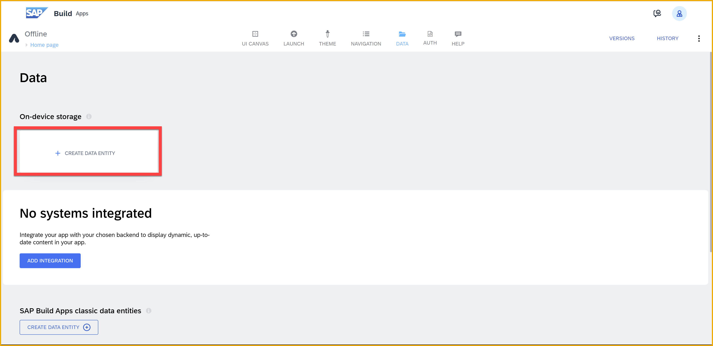
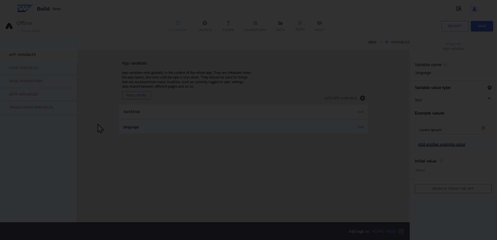
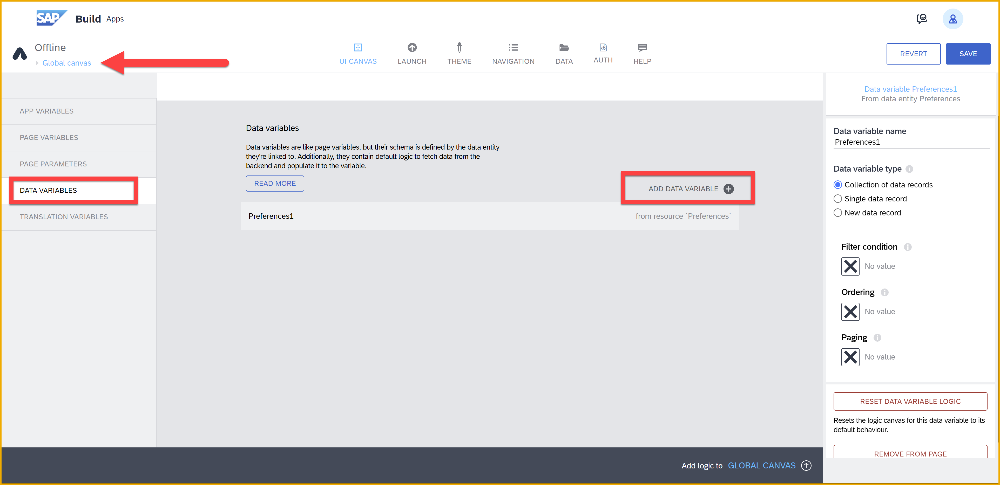
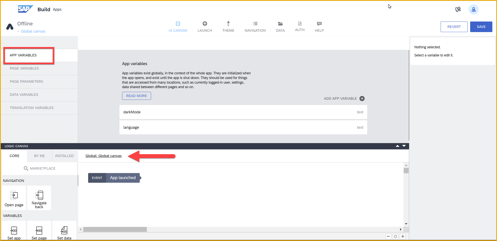

# Store User Preferences on Device

Store the user’s preferences or other data that should persist every time the user opens the app on the user’s device using SAP Build Apps’ on-device storage data resource.

## Prerequisites
- You set up SAP Build Apps and entered the lobby, as described in [Set Up SAP Build Apps (with Booster) on SAP BTP Trial Account](https://developers.sap.com/tutorials/build-apps-trial-booster.html).
- You are familiar with basic SAP Build Apps terminology such as canvas, component, logic, flow function, data, variables and formulas. See the [documentation](https://help.sap.com/docs/build-apps?locale=en-US) for more information.

## You will learn
- How to store information on-device
- How to fetch information from on-device storage
- How to use the global canvas for logic that should be run at app launch
- How to use the translations feature
- How to use formulas to style UI based on a variable value

## Intro

This tutorial shows you how to store a user’s preferences on the user’s device so the user can have a consistent experience every time they open the app. In this tutorial, we will store information on the language the user prefers and whether the app should be in light or dark mode. The same principles can be used to store other similar data as well.

---

### Set up on-device storage

Let’s start by creating an on-device storage data entity for storing preferences. Due to the nature of on-device storage as a data entity, while we would only need to store two properties in this case, a whole data entity is created.



Call the entity `Preferences`, and click **Add**.

You might notice that the data entity has automatically an ID field. **Do not remove this field**, as you will need it to use some of the data flow functions. Instead, add two new fields:

- `darkMode`, select **true/false**
- `language`, select **text**


Save your changes and return to the UI canvas.


### Configure variables

In this very short step, we will set up the app variables used to store the user’s preferences so that they can be used across all the pages of your app.

Go to the **Variables** tab by clicking on the **Variables** switch on the top of the UI canvas.


Under **app variables**, create the following:

- `darkMode` of type **true/false**, initial value `false`
- `language` of type **text**, example and initial value `en-US`

The result should look like this:


Next, we will be adding a data variable on the app’s **Global canvas**. To do this, we will need to make sure we are on the global canvas page. Remember to save the changes in your app before trying to change pages.

To go to the global canvas, open the page selection panel and choose the global canvas.



Now from the left side pane, select **data variables**, and add a new data variable for the data entity you created in step 1. Call the variable `Preferences`. Leave the other settings as is (Collection type).




### Fetch data and store in app variable

Now that the data variable exists, you might notice that it has some automatically generated logic attached to it. We will want to move this logic _away from the data variable’s logic canvas to the global canvas’ main logic canvas._ This is because we will be adding events to detect changes in the app variables and those do not fire correctly from a data variable’s logic canvas.

1. Select the logic for the **Preferences** data variable, and cut it (copy and remove).

    

2. Still on the global canvas, click **App Variables**.

    Make sure you are sill on the global canvas because the logic canvas should say **Global: Global canvas**.

    

    Once here, click anywhere on the logic canvas and paste the logic removed from the data variable’s logic canvas. Place it next to the **App launched** event.

    

    Connect the **App launched** and **Get record collection** nodes with your mouse.

    

3. Because we used copy and paste, we will need to fix the Set data variable node’s Record collection input. Currently it refers to an instance of the Get record collection as it existed on the data variable canvas, and this will not work.

    Select the **Set data variable** flow funcion, then the Record collection input, and re-choose the Get record collection’s Records output.

    

    Then select **Get record collection ? Collection of records**.

    

    >Once you have saved, you will notice the Record collection input will say Get record collection / Collection of Records instead of `records @@ UUID`, which was the broken reference.

4. Move the **Set data variable** node to the right to make space for more logic nodes to fit.

    From the left side panel, find the **If condition** node and drag it on the canvas between the **Get record collection** and **Set data variable** nodes – not yet connected to the flow.

    

    Then pick up the **If condition** again and put it on the line between **Get record collecion** and **Set data variable**.

    

    >The purpose of this if condition is to check whether the user already has preferences from when they previously used the app, or if default preferences should be created. This is done by checking if the list of records gotten from the **Get record collection** node is empty or not.

    Click **Save**.
    
    >If you don't save, you will not see the correct information as you open the formula editor for the If condition node.

5. Select the **If condition** node and set its condition to a formula type binding, and set the formula to the following:

    ```JavaScript
    !IS_EMPTY(outputs["Get record collection"].records)
    ```
    

    >Instead of copying and pasting the formula, you may need to simply build the formula yourself with the formula editor.

6. Drag a **Create record** node to the canvas below the **If condition** node and connect the **Create record** to the second output, the failing output.

    

    Select the **Create record** node and set the **Record** input. Set `darkMode` to false, and `language` to EN-US.

    

    Connect the **Create record**’s success output to **Get record collection**.

    

7. After the **Set data variable** node, add 2 **Set app variable**, one for each app variable you created.

    In the first one, set **darkMode** to the formula `data.Preferences1[0].darkMode`.
    
    In the second one, set **language** to the formula `data.Preferences1[0].language`.

    The result should look something like this:

    

This logic now gets the preferences stored on the user’s device and stores them in a data variable and the 2 app variables, and if no preferences are found, creates default preferences for the user.


### Set up translations

1. To set up translations for your app, select **Translation variables**. 

    From the dropdown, select English (US) and German (Germany).

    

    Since we want to provide a selection for the user between the languages, the easiest way is to use a special flow function.

2. Go to the Marketplace and install **Set current language** flow function.

    

3. Back on the global logic canvas where we were working before, drag a **Receive event** (bottom of the **Core** tab) and **Set current language** (on **Installed** tab) flow function.

    

4. We want to change the current language of the app every time the language app variable is changed. So, select the **Receive event** node and select **App variable 'language' changed** as the event source. 

    

5. Select **Set current language**. 

    Notice that the options for the **Supported language** property are the keys for the languages that you will need in the next step. Make a note of these keys – `en-US` and `de-DE`.

    Set the **Supported language** to the **language** app variable.

Once you have translations enabled, you can start using them everywhere in your application where you have text. The easiest way to do this is while you configure each part of your UI via clicking on the translation button.


### UI to modify preferences

To allow the users to change their preferences, we create a simple UI for app settings. You may design the page to your liking – the important part is adding two UI components on the page, one to toggle the dark mode and one to allow the user to select from a list of languages. 

Here is one option.

1. Change the title to **Settings**.

    Remove the text component.

    

2. Add a **Toggle list item** for dark mode and a **Dropdown field** for the language selection.

    Configure the labels and placeholders using the translation capability as shown in the previous steps. 

    You can use the following from Google translate:

    | English | German |
    |---------|-------|
    | Dark mode | Dunkler modus |
    | Language | Sprache |

    

    For the toggle, set the **Selected value** to be the `darkMode` app variable.

3. For dropdown you will need to configure the options using the keys we wrote down in the previous step. The configuration should look something like this (with option to use translation for the labels if you so choose).

    

    Set the **Selected value** to be the app variable **language**. 

Once this is done you have an UI that displays the app variables values as fetched from the on-device storage. The user can also modify these values, and the language value will already influence the UI.

But these preferences are not yet saved back to on-device storage to be remembered for the next time the user opens the app.


### Modify UI for dark mode (Opional)

If you’d like to do a full dark mode for your app, you will need to use a lot of formulas to set each color in your app to check the `darkMode` app variable before choosing the color it should present. You can get started with these two examples.

Select the title of the page. Under Styles tab, go to modify the style class you are using for the title and set the color to come from a formula.


This formula could be something like `IF(appVars.darkMode, theme.$smartColorPalette_darkMedia.neutral, theme.$smartColorPalette_app.neutral)`

Similarly, set the background of the page. This time the formula can be set by creating a Local Palette as you can see in the gif below.


The formula could be something like `IF(appVars.darkMode, theme.$smartColorPalette_darkMedia.background, theme.$smartColorPalette_app.background)`

It is recommended to use theme variables in formulas instead of going with static values, so that if you need to change a color across the app, you do not need to make the same change in a bunch of places but can simply change it once under the top navigation’s Theme tab.


### Save preferences to on-device storage

1. On the global canvas, drag another **Receive event** node next to the previous one and configure it to listen to changes from the `darkMode` app variable.

    Now we can start making the logic for saving user preferences whenever they are changed.

2. First we want to make sure not to save changes if none were made, and this is where the relevance of having the data variable in addition to the app variables comes to play. 

    Add an **If condition** node to the canvas and link both app variable change events to it. 
    
    In this **If condition**, check first whether preferenceId is empty and then that at least one of the app variables (`language` or `darkMode`) doesn’t match the value in the data variable. The following formula would do this:

    ```JavaScript
    (appVars.darkMode==data.Preferences1[0].darkMode&&appVars.language==data.Preferences1[0].language)
    ```

3. Attach an **Update record flow function** to the **If condition**.

    Your logic should look something like this:

    

4. Configure the **Update record** flow function by setting the **ID** to the formula:

    ```JavaScript
    data.Preferences1[0].id
    ```
    
    Set the **Record** custom object properties each to the contents of the two app variables.

    

5. Save the successful result of the update to the **Preferencess** data variable. 

    For that, add a **Set data variable** node, and set the record collection to the formula:
    
    ```JavaScript
    [outputs["Update record"].response]
    ```
Preview the app.


