  
 
# Perform S/4HANA CRUD Operations in SAP Build Apps
<!-- description --> Using SAP Build Apps, create an app that performs all the CRUD operations for the SAP S/4HANA Cloud business partner address API, and handles $expand for nested entities and API rules.

 
 
## Prerequisites

- You have enabled SAP Build Apps on your trial tenant, as described in [Set Up SAP Build Apps (with Booster) on SAP BTP Trial Account](https://developers.sap.com/tutorials/build-apps-trial-booster.html).
- You have created a destination to your SAP S/4HANA Cloud system's Business Partners API. See the [documentation](https://help.sap.com/docs/build-apps/service-guide/sap-systems?locale=en-US) for destinations being used in SAP Build Apps. The service URL should be in the form: `https://{host}:{port}/sap/opu/odata/sap/API_BUSINESS_PARTNER`  
- To get started, you can create a destination to the APIs on the SAP Business Accelerator Hub (see [Access Demo SAP APIs for SAP Build](https://www.youtube.com/watch?v=11TUQgQi-9k)) and build the entire UI, but you will not be able to update the data.


## You will learn
- How to connect your app to SAP S/4HANA Cloud
- How to perform all the CRUD actions
- How to build and navigate to additional app pages

## Intro
The point of this tutorial is to show you how you would perform all the CRUD operations, and how you would handle some of the complexities of the SAP backend APIs (e.g., nested entities or strict requirements for the data).

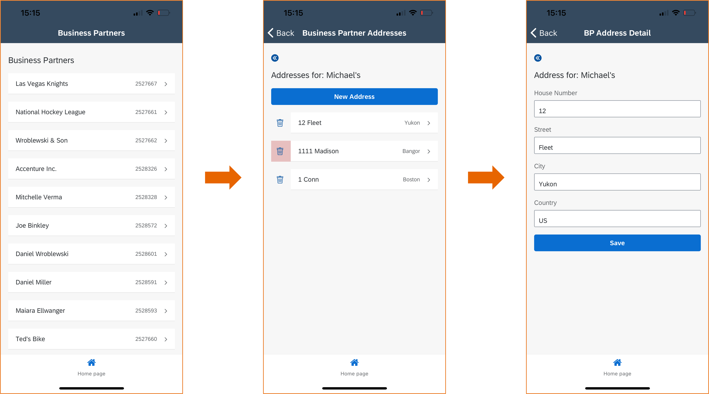

You will create an app with 3 pages:

- Page 1: Display all business partners
- Page 2: Display all addresses for a business partner
- Page 3: Create or update an address

As for complexities of the API, here are a few:

- You cannot delete an address if it is labeled as the default address (AddressUsage = XXDEFAULT).
- Whether an address is the default is determined by the **AddressUsage** nested entity, which you will need to expand.
- If you add an address to a business partner that has no addresses, that address must be labeled as the default address, but if you are adding an additional address, that address CANNOT be labeled as the default address.
- There are all types of conditions for the data. For example, if you add an address from the United Kingdom, it must include a postal code (Postal codes are not needed for the US or Sweden). Or, you cannot delete the default address.

The tutorial will handle the complexities listed above. You can learn about the API on the [SAP Business Accelerator Hub
](https://api.sap.com/api/API_BUSINESS_PARTNER/resource/Email_Address).

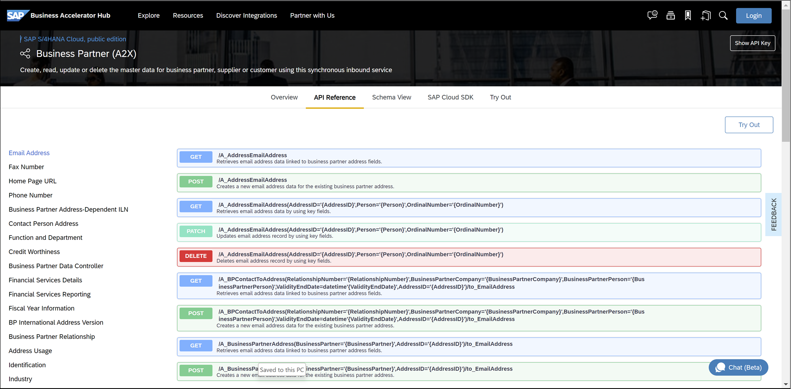


### Create project
In the lobby of your SAP Build Apps, click **Create**.
   


Select **Build an Application**.

   

Select **Web & Mobile Application**.

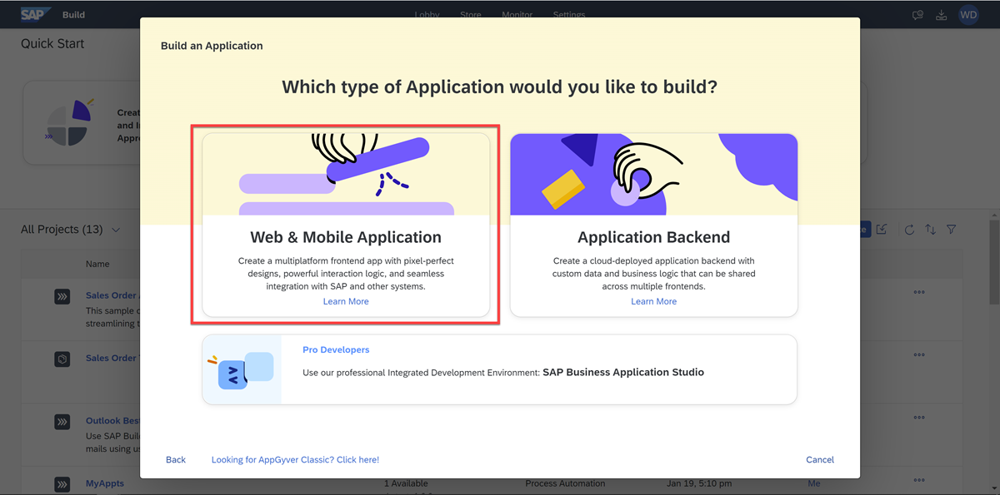

For the project name, enter `S4HANA CRUD`, then click **Create**.


### Enable BTP authentication
In order to connect via SAP BTP destinations, you need to enable SAP BTP authentication for your app.

1. Go to the **Auth** tab.

2. Click **Enable Authentication**.

    

3. Select **SAP BTP Authentication**.

    On the confirmation popup, click **OK**. 


### Connect to S/4HANA Cloud API
In this step, you will make a connection to the Business Partner API of your SAP S/4HANA Cloud system. You will enable 2 entities: **A_BusinessPartner** (the header for a business partner) and **A_BusinessPartnerAddress** (contains all the business partner addresses).

>**IMPORTANT:** This tutorial assumes you have access to an SAP S/4HANA Cloud system, and you have a user with permission to call the Business Partner APIs. If not,you can still do most of the tutorial by using the read-only API on the SAP Business Accelerator Hub (see [Access Demo SAP APIs for SAP Build](https://www.youtube.com/watch?v=11TUQgQi-9k)), though you will not be able to update the data.

1. Go to the **Data** tab.

2. Click **Add Integration**.

    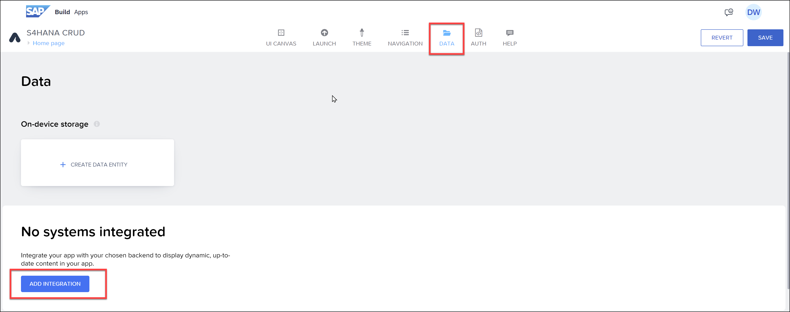

3. Click **BTP Destinations**, and then select the destination to your SAP S/4HANA Cloud Business Partner API.

    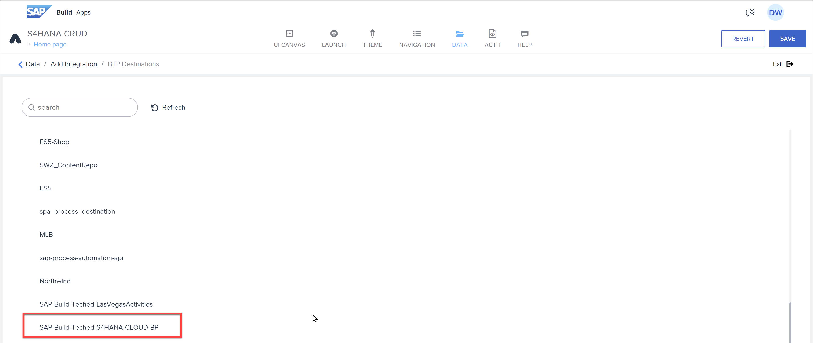

    >The destinations in the screenshot are just examples; your destination will have a different name.

4. Click **Install Integration** (upper right).

    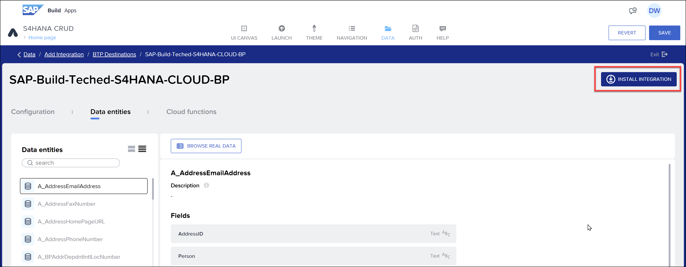

5. Under **Data Entities**, scroll down so you can see both ***A_BusinessPartner*** and ***A_BusinessPartnerAddress***. For each, select it and click **Enable Data Entity**.

    

    You can now select an entity and click **Browse Real Data** to see live data from SAP S/4HANA Cloud.

    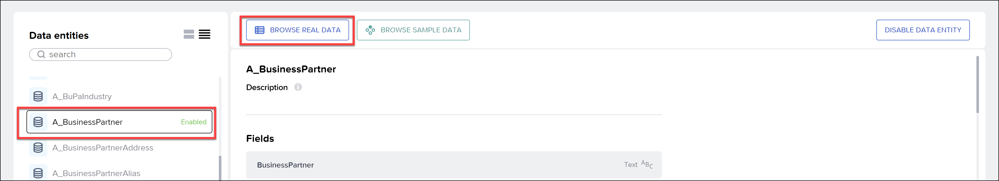

    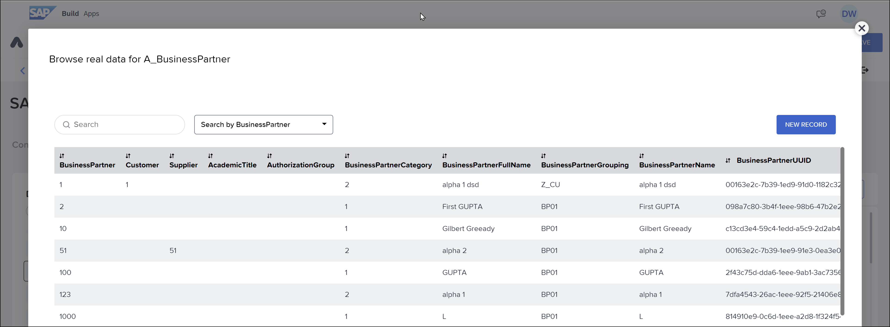

6. Close the data browser, select ***A_BusinessPartnerAddress***. Scroll down to the **Expand** area, and enable ***to_AddressUsage***.

    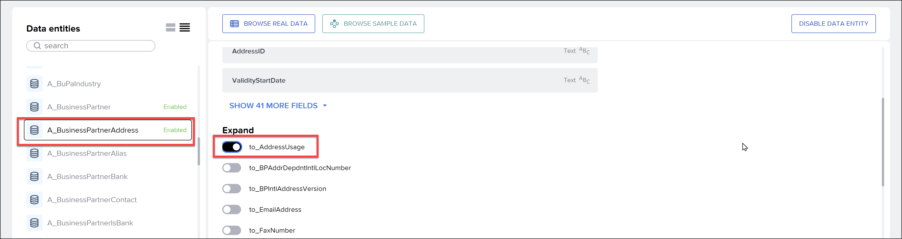

    >***to_AddressUsage*** is a nested entity indicating if the address is the default address. When you get your addresses you will want to know if they are the default, so you need to expand this nested entity. Of course, you could have enabled the ***A_AddressUsage** entity and made another API call, but expanding is easier.

7. Click **Save** (upper right).


### Create page for updating address
You will create a page for creating/updating an existing address. You will only specify 4 fields.

>You are creating the pages in reverse order because the later pages have page parameters that must be sent to the page when navigating to it. These page parameters must be created before you can specify the navigation, so to avoid going back and forth between pages, you simply build the pages in reverse order.

1. Click **Home Page** in top left.

    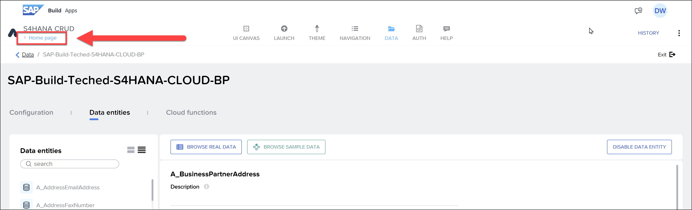

    Click **Add New Page**, enter `BP Address Details`, and click **OK**.

    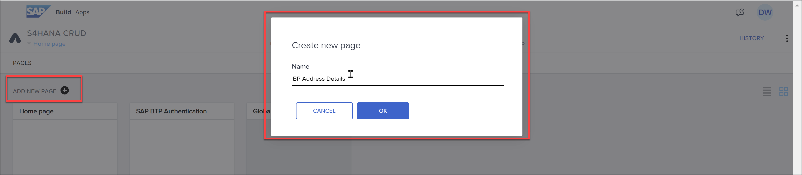

2. Remove all existing components from the page (select each component and click the **X**), and then drag the following components in this order:

    - Icon
    - Title
    - 4 input boxes
    - Button

    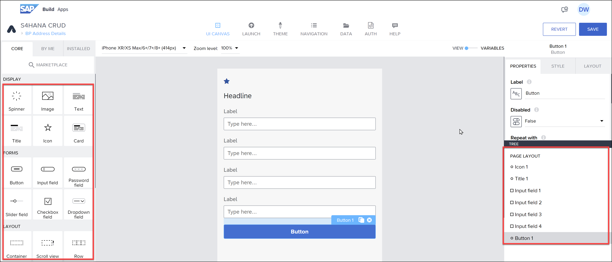

3. Click **Variables**, then **Page Parameters**, and create the following 4 page parameters (all of type text):

    | Parameter | Purpose | 
    |-----------|----------|
    | **AddressID** | The ID of the current address, if you are updating an existing address | 
    | **BPID** | The current business partner |
    | **BPName** | The current business partner name | 
    | **XXDefault** | Indicates if the current address, whether or not it is new or existing, should be considered the default address for this business partner. A value of `XXDEFAULT` indicates a default address; otherwise the value is blank. | 

    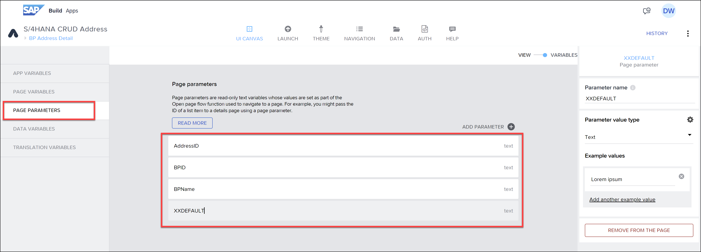

4. Click **Data Variables**, and create a data variable  based on ***A_BusinessPartnerAddress***.

    Set the data variable type to **New data record**.

    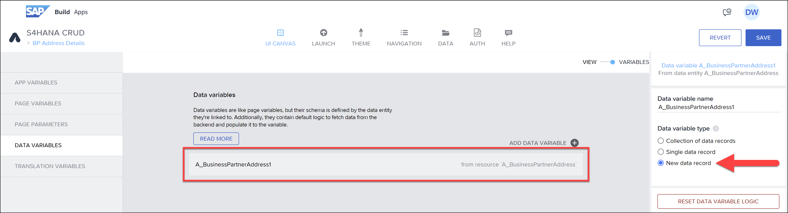
    
5. Click **View** to return to the UI canvas, and configure the properties for the components as follows:

    | Component | Property | Value |
    |-----------|----------|-------|
    | Icon | Icon | **Fiori Icons → sys-back-2** |
    | Title | Content | Use the following formula: `"Address for: " + params.BPName` |
    | Input box 1 | Label | **House Number** |
    | Input box 2 | Label | **Street** |
    | Input box 3 | Label | **City** |
    | Input box 4 | Label | **Country** |
    | Button | Label | **Save** |

6. For each of the input boxes, bind the value field to the following data variable fields:

    | Input Box | Data Field | 
    |-----------|----------|-------|
    | Input box 1 | ***data.A_BusinessPartnerAddress1.HouseNumber*** | 
    | Input box 2 | ***data.A_BusinessPartnerAddress1.StreetName*** | 
    | Input box 3  | ***data.A_BusinessPartnerAddress1.CityName*** | 
    | Input box 4  | ***data.A_BusinessPartnerAddress1.Country*** | 

7. Click **Save** (upper right).


### Set logic for getting data
In this step, you set up the payload or body of the API request because the page is being used for both new addresses as well as updates to existing addresses.

You also must adjust the payload, with a nested entity, based on whether the address is a default or not. 

1. Click **Variables → Data Variables**, and select ***A_BusinessPartnerAddress1***. 

    Open the logic canvas.

    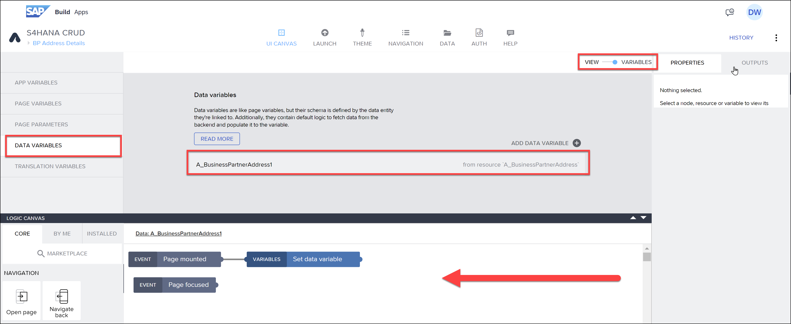

2. Set up the following logic flow:

    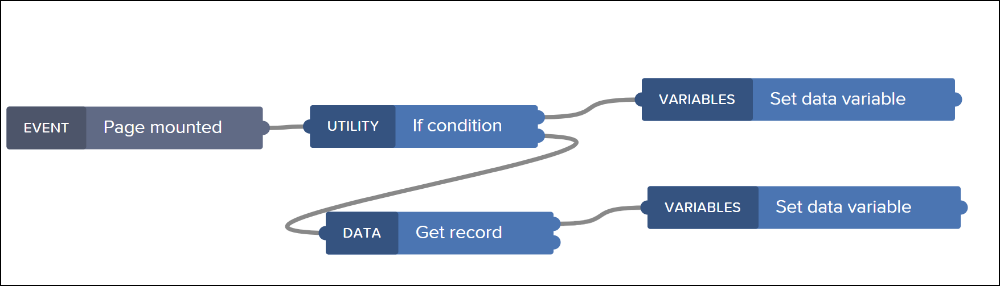

3. Configure the flow functions as follows:

    - **If condition:** This condition checks if you are updating an existing record. Set the condition to the following formula:

        ```JavaScript
        IS_EMPTY(params.AddressID)
        ```

    - **Set data variable** (top, new record)

        - Data variable name: ***A_BusinessPartnerAddress1***
        - Record properties: Set to the following formula:

            ```JavaScript
            {AddressID: params.AddressID, BusinessPartner: params.BPID }
            ```

            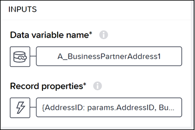

    - **Get record**

        - Resource name: ***A_BusinessPartnerAddress***
        - Set the **BusinessPartner** and **AddressID** to the corresponding page parameter.

            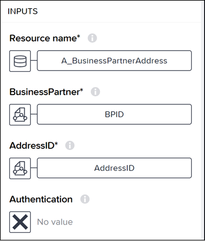


    - **Set data variable** (bottom, update record)

        - Data variable name: ***A_BusinessPartnerAddress1***
        - Record properties: Set to the following formula:

            ```JavaScript
            PICK_KEYS(outputs["Get record"].record, ["HouseNumber", "CityName", "Country", "StreetName"])   
            ```

4. Now add another **If condition** and **Set data variable** flow functions, and connect as follows:

    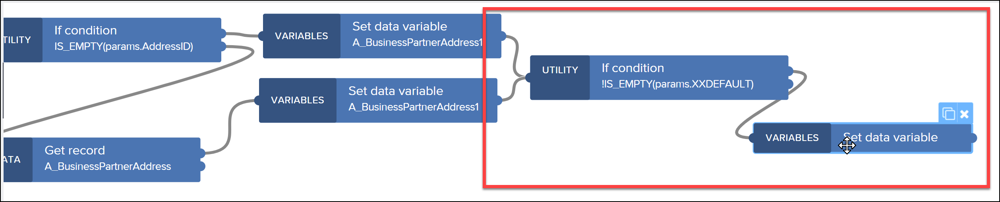

    >These are used to check if the address is a default address, and adds the needed nested entitty.

5. Configure the new flow functions as follows:

    - **If condition:** Set the condition to the following formula:

        ```JavaScript
        !IS_EMPTY(params.XXDEFAULT)
        ```

    - **Set data variable**
 
        - Data variable name: ***A_BusinessPartnerAddress1***
        - Record properties: Set to the following formula:

            ```JavaScript
            SET_KEY(data.A_BusinessPartnerAddress1,"to_AddressUsage", [ {AddressUsage: params.XXDEFAULT} ] ) 
            ```

            >`SET_KEY` takes an object and adds or updates a specific attribute, while keep the other attributes unchanged.


### Set logic for saving data
You need logic for saving changes to the data, and must take into account whether the save is a new address or an update. 

1. Click **View** to return to the UI canvas.

2. Click the **Save** button and open the logic canvas.

    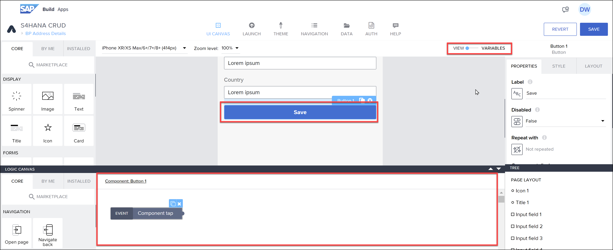

3. Set up the following logic flow:

    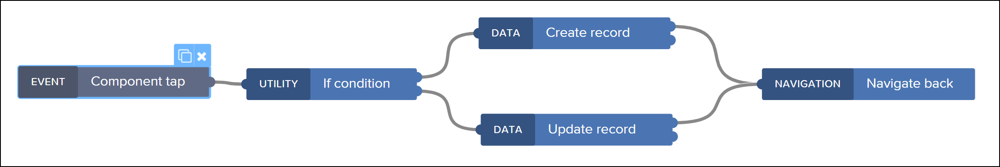

4. Configure the flow functions as follows:

    - **If condition**: Checks if this is a create or update. Set the condition to the following formula:

        ```JavaScript
        IS_EMPTY(params.AddressID)
        ```

    - **Create record**

        - Data variable name: ***A_BusinessPartnerAddress***
        - Record: Set to data variable ***A_BusinessPartnerAddress1***.

    - **Update record**

        - Resource name: ***A_BusinessPartnerAddress***
        - Set the **BusinessPartner** and **AddressID** to the corresponding page parameter.
        - Record: Set to the following formula:

            ```JavaScript
            {Country: data.A_BusinessPartnerAddress1.Country, CityName: data.A_BusinessPartnerAddress1.CityName, HouseNumber: data.A_BusinessPartnerAddress1.HouseNumber, StreetName: data.A_BusinessPartnerAddress1.StreetName}
            ```

5. Click the back icon at the top of the page, open the logic canvas, and connect a **Navigate back** flow function to the **Component tap** event.

    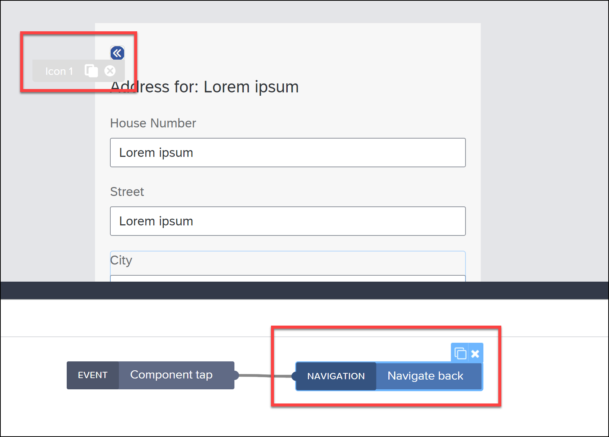


### Create page for displaying addresses
You will create a page for displaying the addresses for a specific business partner.

1. Click **BP Address Details** (current page, in the top left).

    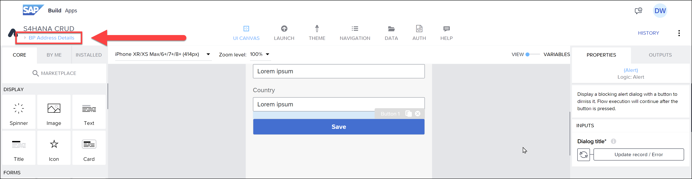

    Click **Add New Page**, enter `Business Partner Addresses`, and click **OK**.

    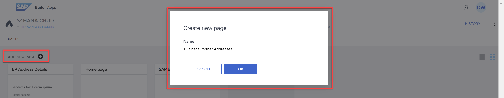

2. Click **Variables**, and then **Page Parameters**, and create a page parameter called `BPID` and of type **text**.

    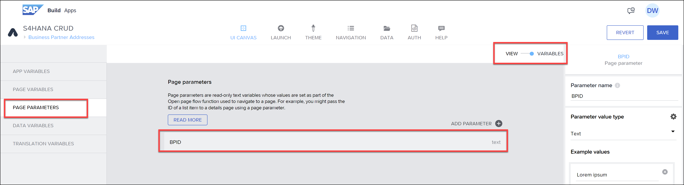

    Click **Data Variables**, and create 2 variables, one for ***A_BusinessPartner*** and one for ***A_BusinessPartnerAddress***.

    


3. Configure the data variables as follows:

    - ***A_BusinessPartner1***

        Make it a **Single data record**, and set **BusinessPartner** to the **BPID** page parameter.

        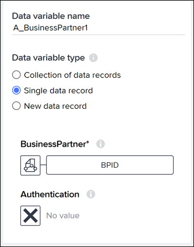

    - ***A_BusinessPartnerAddress1***

        Keep this **Collection of data records**.

        Set the **Filter condition** to **Object with properties**. Add a filter condition so ***BusinessPartner*** equals the ***BPID*** page parameter.

        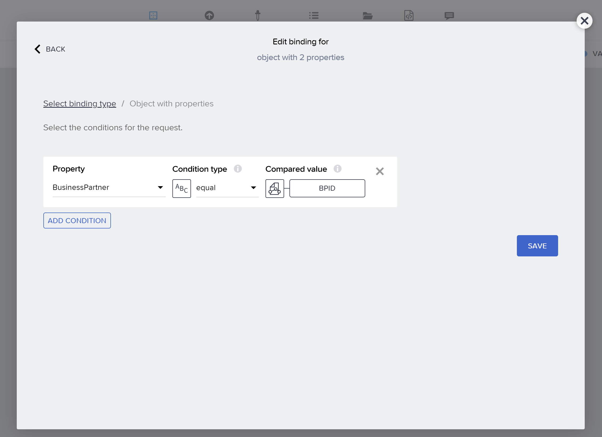

    Click on ***A_BusinessPartnerAddress1***, and open the logic canvas. Connect the **Page focused** event to the rest of the logic flow.

    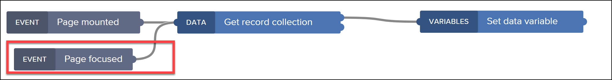

4. Click **View** to return to the UI canvas, and remove all the default components.

5. Add the following components in this order:

    - Icon
    - Title
    - Button
    - Container, and inside the container add:
        - Icon
        - List Item


    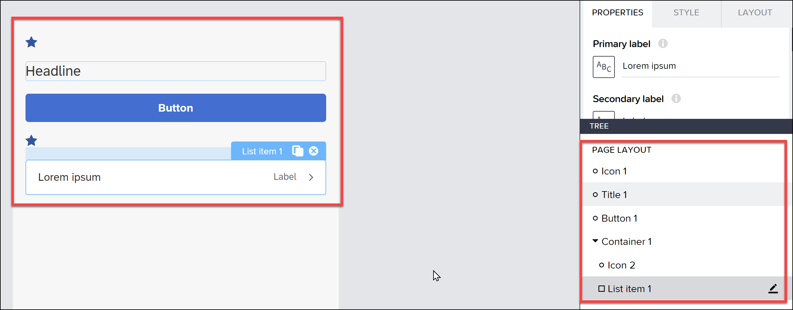

6. Configure the following components:

    | Component | Property | Value |
    |-----------|----------|-------|
    | Icon | Icon | **Fiori Icons → sys-back-2** |
    | Title | Content | Set to formula `"Addresses for: " + IF(IS_EMPTY(data.A_BusinessPartner1.BusinessPartnerFullName), "", data.A_BusinessPartner1.BusinessPartnerFullName)`  |
    | Button | Label | **New Address** |

7. Configure the container as follows:

    - Set **Layout → Layout** to **Horizontal** and **Align to middle**.

        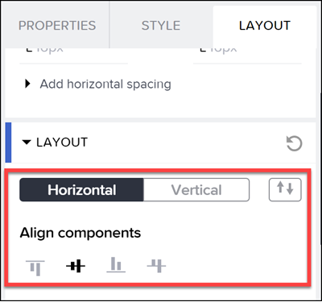

    - Set **Style → Layout Container → Edit**, then edit **Background color** by clicking **Transparent → New Palette**

        

        Click **Formula**, and then click the current formula (probably `#f7f7f7`) to get the formula editor.

        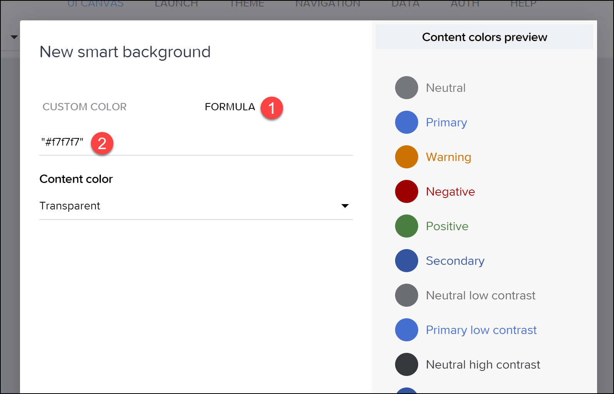
  
        Replace the formula with the following:

        ```JavaScript
        IF(IS_EMPTY(repeated.current.to_AddressUsage.results),"","rgba(196,63,63,0.3)" )
        ```

        >The formula editor may show errors, but you can ignore them.

        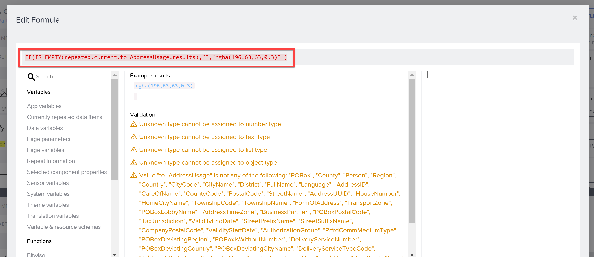
        
        Click **Submit**, and then **Convert**.


    - Set **Style → Padding**, and click the left box, and set it to **Theme → 12px**.

        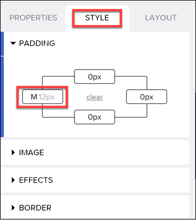

    - Under **Prperties**, set **Repeat with** with the data variable ***A_BusinessPartnerAddress1***.

8. Configure the icon in the container by setting the **Icon** property to **Fiori Icons → delete**.

9. Configure the list item in the container by setting the following:

    - **Primary label** to the following formula:

        ```JavaScript
        repeated.current.HouseNumber + " " + IF(IS_EMPTY(repeated.current.StreetName),"",repeated.current.StreetName)
        ```

    - **Secondary label** to **Data item in repeat → current.CityName**.

10. Click the button, open the logic canvas, and attach an **Open page** flow function to the **Component tap** event.

    Configure the **Open page** flow function as follows:

    | Property | Value | 
    |-----------|----------|
    | Page | **BP Address Detail** page | 
    | BPID | **BPID** page parameter | 
    | XXDEFAULT | Use the following formula: `IF(COUNT(data.A_BusinessPartnerAddress1)==0,"XXDEFAULT","")` | 

    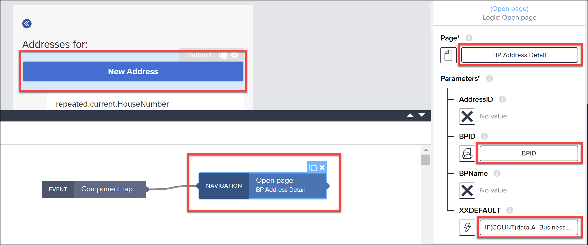

11. Click the list item, open the logic canvas, and attach an **Open page** flow function to the **Component tap** event.

    Configure the **Open page** flow function as follows:

    | Property | Value | 
    |-----------|----------|
    | Page | **BP Address Detail** page | 
    | AddressID | data item in repeat **current.AddressID** | 
    | BPID | **BPID** page parameter | 
    | BPName | data variable field **A_BusinessPartner1.BusinessPartnerFullName**  | 
    | XXDEFAULT | no binding | 

12. Click the back icon at the top of the page, open the logic canvas, and connect a **Navigate back** flow function to the **Component tap** event.

    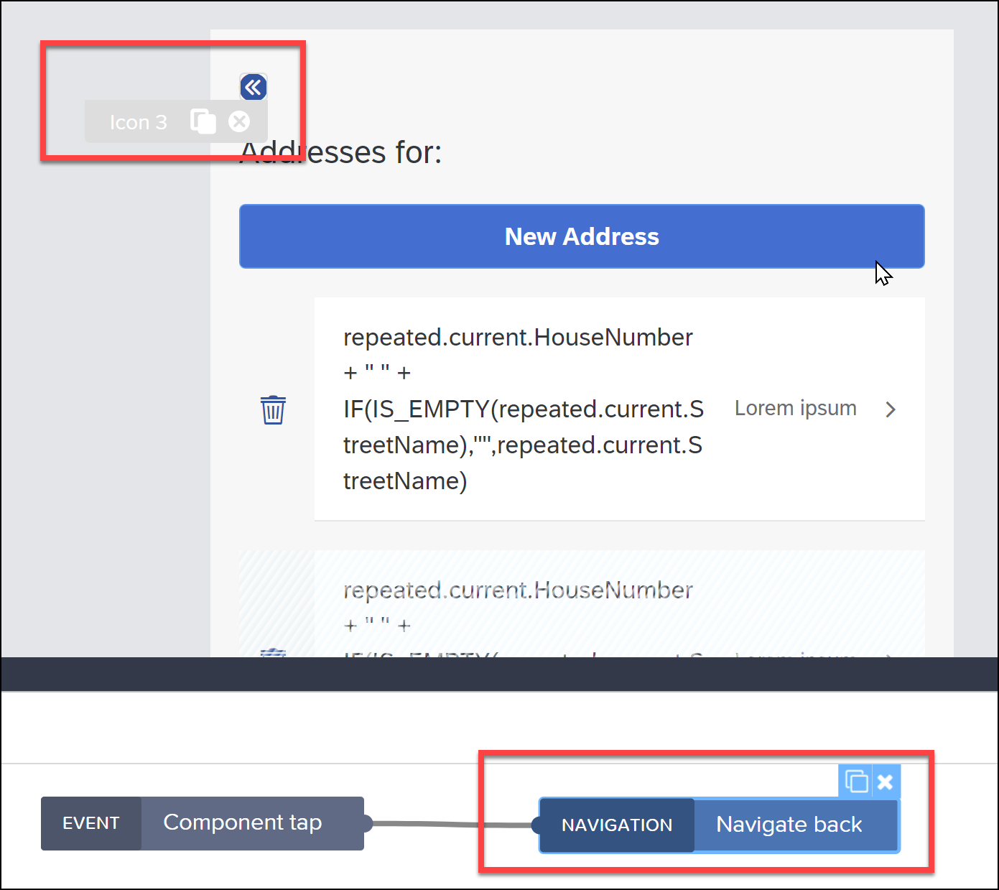


### Add logic to delete address
You need to add the flow functions for deleting a record. But you must first check if the address is the default address; if it is, you alert the user they cannot delete the address.

1. Click the delete icon, and open the logic canvas.
   
2. Set up the following logic flow:

    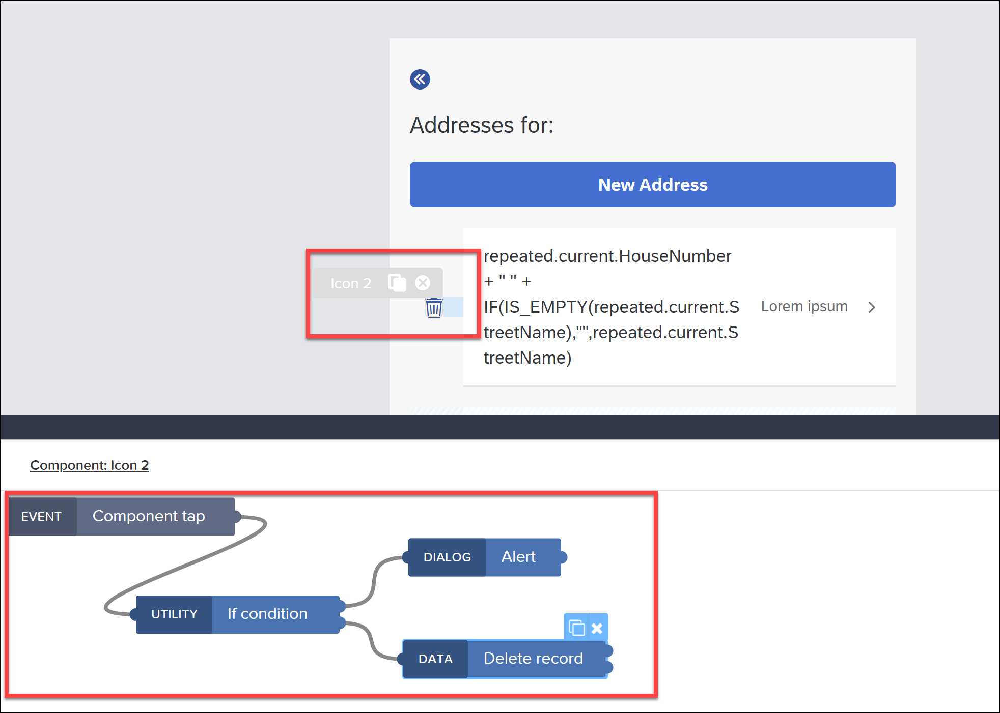

3. Configure the flow functions as follows:

    - If condition: Set the condition to the following formula:

        ```JavaScript
        repeated.current.to_AddressUsage.results[0].AddressUsage === "XXDEFAULT"
        ```

        >You will see errors for the formula, since the nested entity exists but is not part of the schema. Ignore the error and save the formula. 

    - Alert: Set the text to `You cannot delete the default address.`

    - Delete record: Set the condition to the following formula:
  
        - Resource name: ***A_BusinessPartnerAddress***
        - BusinessPartner: **BPID** page parameter
        - AddressID: data item in repeat **current.AddressID**

    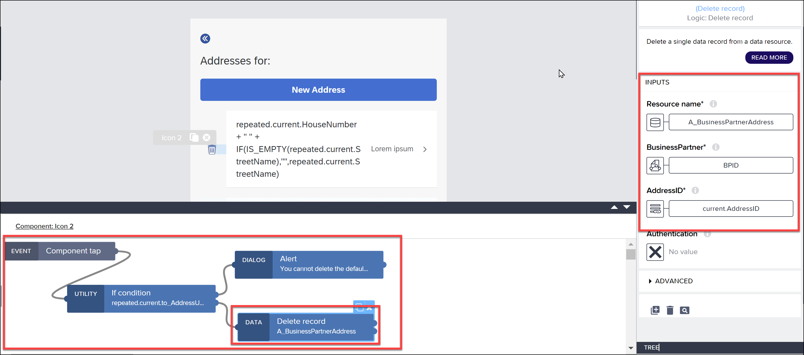

4. To show the update, you will want to retrieve the list of addresses again.

    Go back to the data variable ***A_BusinessPartnerAddress1***, open the logic canvas, and copy the **Get record collection** and **Set data variable** flow functions (you'll need to unselect the event).
    
    Now paste them into the ur delete flow.

    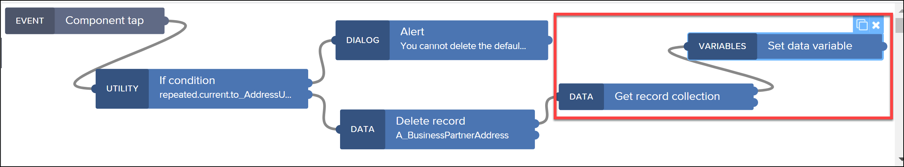

    Click the **Set data variable** flow function, and set the **Record collection** to **Output value of another node → Get record collection → Collection of records**.

    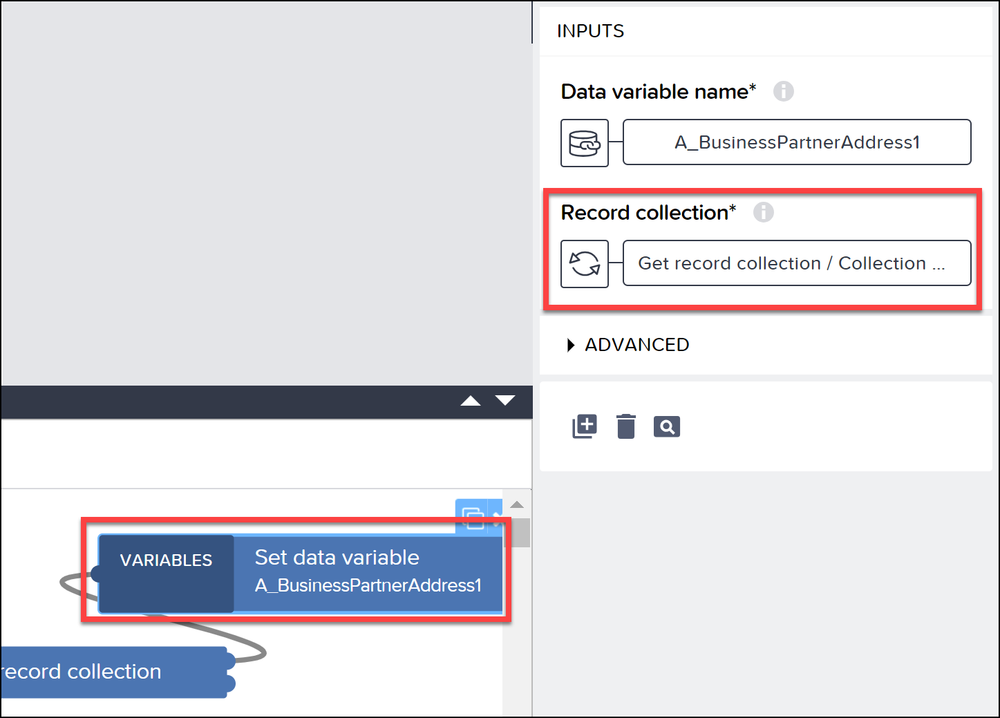

5. Add an alert flow function in case the delete fails, and set the text to **Output value of another node → Delete record/Error**.

    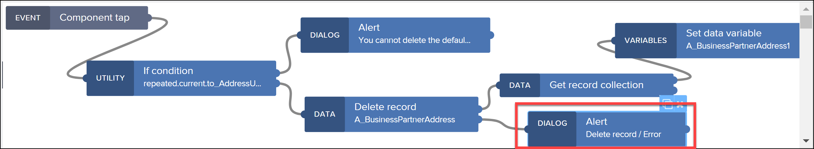


### Create page for displaying business partners
Now you will create the home page that displays a list of business partners, for which the user select one to maintain its addresses.

1. Click **Business Partner Addresses** (current page, in the top left).

    You will already have a **Home Page**. Click on it.

    

2. Click **Variables → Data Variables**, and create a data variable based on ***A_BusinessPartner***.

    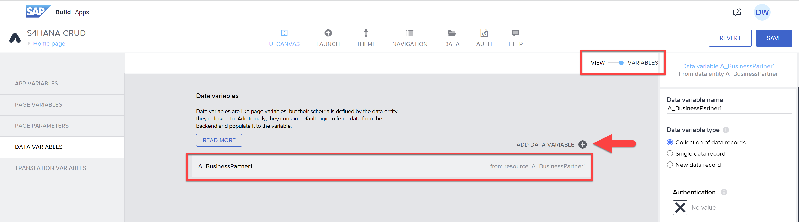

3. Configure the filter or paging of the data variable so that you do not get 1000s of business partners -- this will freeze your app.

    As an example, I created a filter that returns only records where the **SearchTerm1** field has a certain flag (using the **Object with properties** binding).


    To do this, I clicked **Filter Condition → Custom Condition**.

    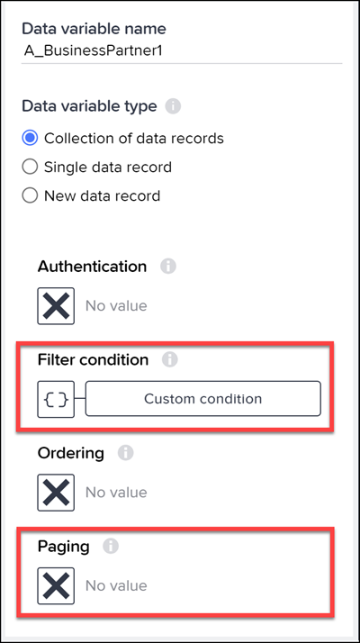

    Then I selected the property **SearchTerm1** and set it to `DBW`. Use whatever filter works for you on your system.

    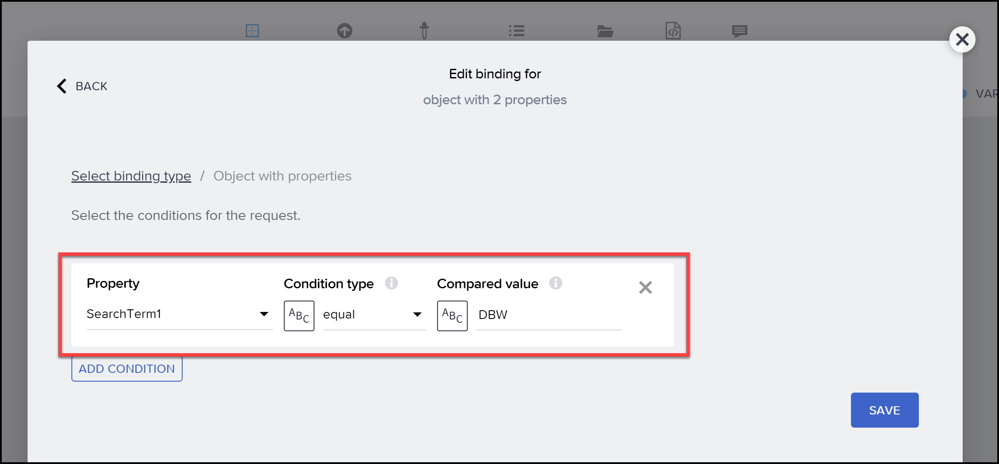

4. Click **View** to return to the UI canvas.

5. Remove the text component and add a list item component.

    Change the **Content** property of the title to `Business Partners`.

    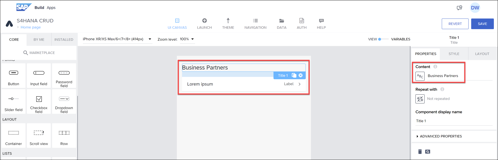

 6. Click the list item, and configure it's properties as follows:

    | Property | Value | 
    |-----------|----------|
    | Repeat with | data variable ***A_BusinessPartner1***  | 
    | Primary label | data item in repeat **current.BusinessPartnerFullName**  | 
    | Secondary label | data item in repeat **current.BusinessPartner** | 

    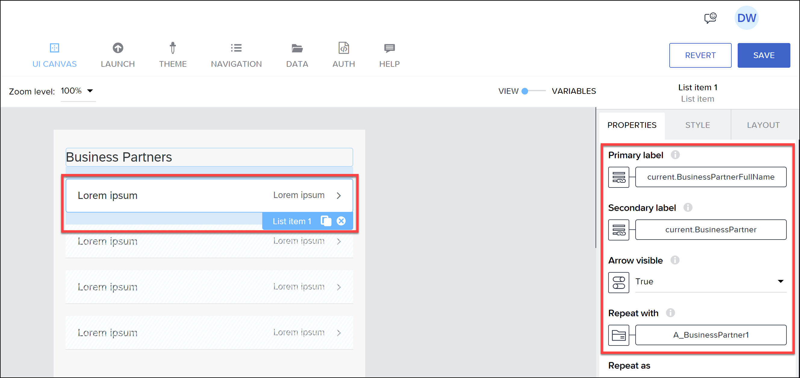

6. With the list item selected, open the logic canvas.

    Add an **Open page** flow function, and configure it as follows:

    | Property | Value | 
    |-----------|----------|
    | Page | **Business Partner Addresses**  | 
    | Parameters → BPID | data item in repeat **current.BusinessPartner**  | 

    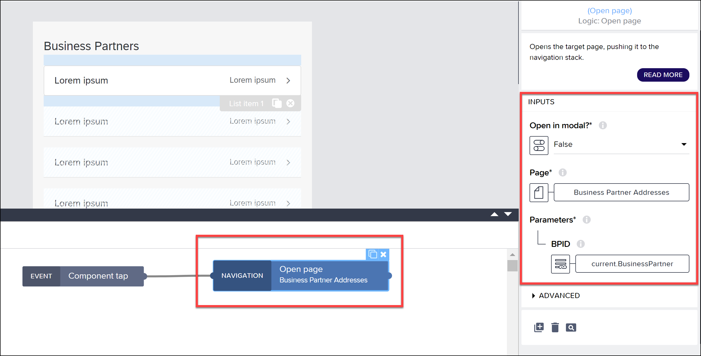


### Test app
Now you can test the app.

1. Go to the **Launch** tab, and then click **Open preview portal**. 
    
    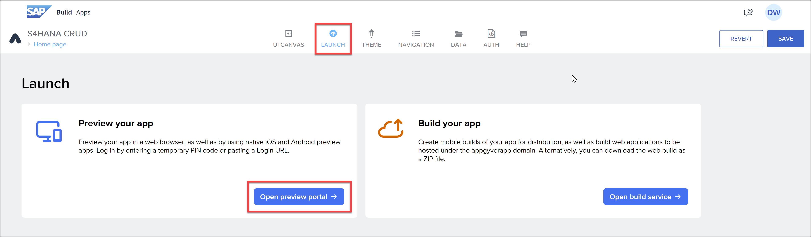

2. Open up your SAP Build Apps preview app on your mobile device.

    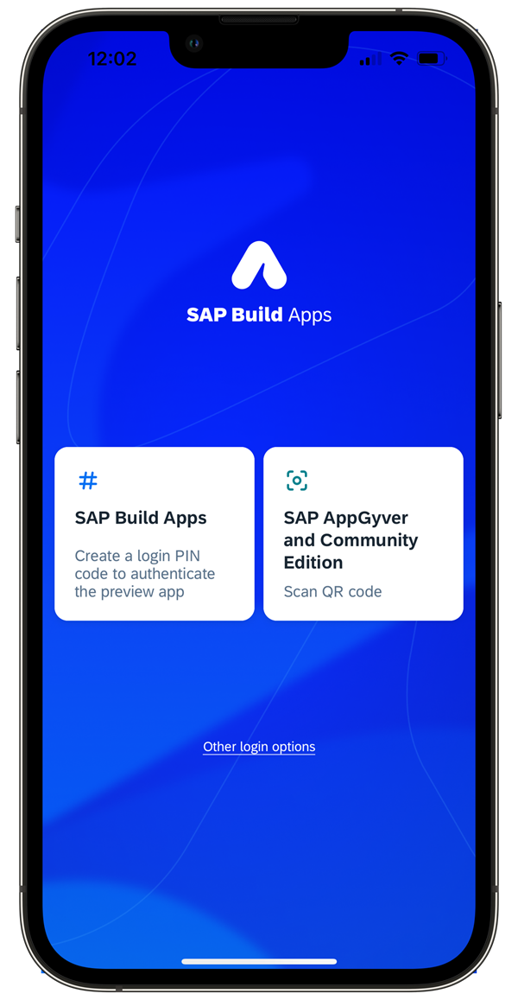

    Either click **SAP Build Apps** (for EU10) or **Other login options** (for other landscapes) to get a code.

    

3. Enter the code in the preview portal, and press **Enter**.

    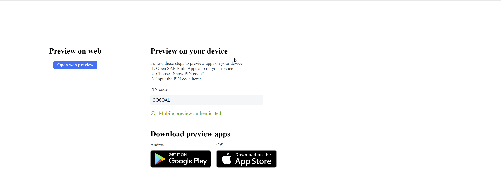

    This will update the preview app, and show all your apps in the current tenant.
    
    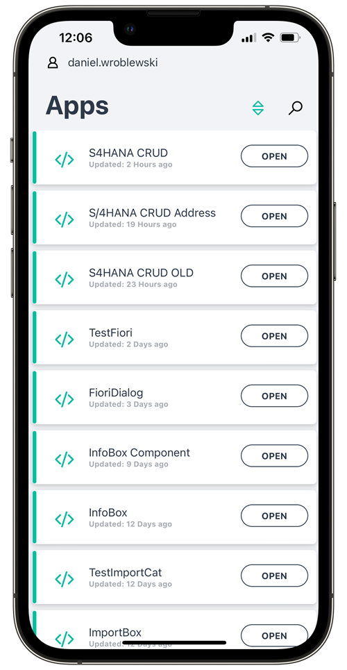

 4. Click **S4HANA CRUD** to open the app.

    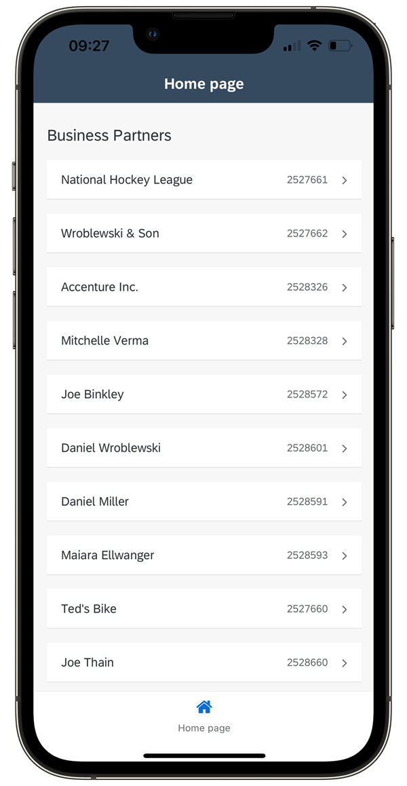

Now use the app, and try out the following:

- Click on a BP with addresses, and see if you see the addresses.
- Click on a BP with addresses, and try to add an address.
- Click on a BP with no addresses, and try to add an address.
- Click on a BP with addresses and try to update an existing address.
- Click on a BP and try to delete the default address.
- Click on a BP and try to delete a non-default address.
- Try to add an address with country = `GB` (you should get an error since there is no way to add a postal code).

<iframe width="560" height="315" src="https://www.youtube.com/embed/tl5rdBKD3bY" frameborder="0" allowfullscreen></iframe>
