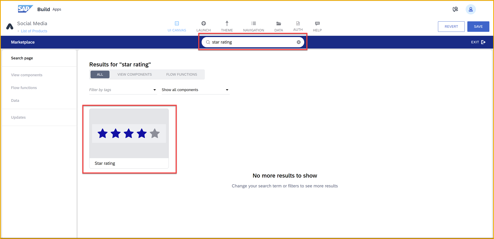

 

# Create a Composite Component (List with Rating)
<!-- description --> Create a composite component made by mashing up a Large Image List Item with a Star Rating, so users can rate products.

## Prerequisites
- You have set up SAP Build App and have entered the lobby.


## You will learn
- How to create a composite component
- How to add properties to your component
- How to bind internal properties to component properties
- How to use a container to organize your component
- How to install components from the Marketplace, and create duplicates to modify


## Intro
This tutorial series lets you become proficient in SAP Build Apps in about an hour. Among other things, it will teach you:

- How to build your own composite components
- How to install components from the Marketplace
- How to use styling to modify the look and feel and the alignment of components
- How to connect to a backend through an SAP BTP destination
- How to connect to a OData backend with a URL
- How to create backend entities and functions with Visual Cloud Functions
- How to connect to those entities and functions from your front end
- How to bind component properties to your data
- How to create custom events
- How to reuse logic flows


#### This tutorial

This tutorial shows you how to mashup up 2 components into your own composite component.

The specific component you will build enables you to display business data as a list -- products in this case -- and to display a rating in the form of 5 stars. The component will have 2 new properties:

- Rating, which will tell the component how many stars to highlight and will be displayed as a number with 1 decimal point.

- RatingCount, which will tell the component how many ratings were received for this item, and will be displayed along the rating.

The component will look like this in design mode.


The component will look like this in runtime mode.


### Create a new app project


1. Go to the SAP Build lobby, and click **Create**.
   
    

    Select **Build an Application**.

       

    Select **Web & Mobile Application**.

    

    For the project name, enter `Social Media`, then click **Create**.

    >You will get a skeleton project, with a page, a title component, and a text component.
    >
    >SAP Build Apps lets you create apps by dragging and dropping components onto the canvas, and then configuring those components by changing, for example, the text in a text component or the image to display in an image component. 


2. Select the text component, and click the **X** to delete it.

    

3. Change the text of the title to `Products`.
   
    

4. Click on an open area in the canvas, and in the **Properties** tab, change the name of the page to `List of Products`.

Your app should look like this:


### Install needed components
You will make a custom component based on 2 components from the component marketplace, a rich source of more complex components for your apps. You will need to install those components first.

1. In the components area, click **Marketplace**.
    
    

2. Search for **large image list item**, and click on the component thumbnail.
    
    

    Click **Install** (right).

    >If the component is already installed, instead of the **Install** button, it will show **Installed** on the right.
    >
    >

    The component will now be in the **Installed** tab.

3. Open the Marketplace back up, search for **star rating**, and install that component.

4. In the **Installed** tab, find the Large Image List Item, click the 3 dots, and select **Duplicate template**.

    

    Do the same for the Star Rating.

    Click **Save** (upper right).

    You should now have a copy of both components in the **By Me** tab.

    

    >You can now make any changes you want to the components under **By Me** and the originals will not be changed.


### Mash up the new components
Our goal is to both show a list of products, and also to show a rating for each. To do this, you will take the 2 installed components and put them together. 


1. Drag a Large Image List Item onto the canvas from the **By Me** tab.
   
2. While the component is selected, open the **Component template editor** (at the bottom of the **Properties** pane).
   
    

    > **Template Editor**
   
    >The template editor lets you make changes to existing components -- add components, change component properties, add internal properties and bindings. The stripes in the canvas indicate you are in the template editor.
   
    >
   
    >The template editor lets you make changes to existing components, but the changes will affect all such components in the current project. That is why we made a duplicate, in case we would want to use the original version.
   

3. In the template editor, select the paragraph component and click the **X** to delete it.

    

4. In the Tree view (bottom right), under the Title, add a container, a star rating (from **By Me** tab), and 2 text components, according to this hierarchy:

    

    On the canvas, the component should look like this:

    

5. Select Container 2, and set the layout to horizontal, and align components to vertically to bottom.

    

    In the **Layout** tab, set its width to **Fit to content**.

6. Select the star rating component, and set the **Maximum value** property to 5.

In the next step we will continue to work in the component template editor.

>**Tree View**

>The tree view is indispensible for making sure your hierarchy of components is OK (e.g., components are within a container).
>
>Consider renaming the components you drag onto the canvas, so when viewing the tree view you can tell what they are for. The component name is under the **Properties** tab, under the **Advanced** section.
>
>
>
>


### Add component properties
We want the component to show the rating and rating count for each of the products, so we need properties to hold this data.

1. Open **Properties**.
   
    

2. Click **Properties** (on the left), and add the following properties:

    | Field | Type |
    |-------|------|
    | Rating | Number |
    | RatingCount | Number |

    

3. Go back to **View**.

4. Select the first text component, and set the **Content** property to the following formula:

    ```JavaScript
    FORMAT_LOCALIZED_DECIMAL(internalProps.Rating, "en", 1,1)
    ```

    

    Under **Layout**, set the width to be exactly 40px wide (select **Exact size** and enter `40`).

    

5. Select the second text component, and set the **Content** property to the following formula:

    ```JavaScript
    "(" + internalProps.RatingCount + ")"
    ```

    Under **Layout**, set the width to be exactly 40px wide.

6. Select the star rating component inside our composite component.

    Open the component template editor for our embedded star rating component.

    

    - In the Tree view, expand the nodes and select **Icon: Full**.

        

        Under **Style**, edit the **Primary Icon** style. 

        
            
        Change the color binding type to static color, enter the color `#F0AB00`, then click **Overwrite**.

        

    - Select **Properties**, then **Properties** on the left side, and then select the **Value** property.

        

        In the **Properties** pane, set **Two-way binding?** to **No**.

        Click **Exit**.

7. We still need to make a binding change within the composite component -- set the rating component value to the component's `Rating` property -- so we need to open the template editor for the composite component.

    So, again, select the composite component, and reopen the component template editor.
   
    

    Select the star rating, and set the **Value** property to the following:

    **Component properties > Composite component internal property > Rating**

    Click **Save**.

    

8.  Click **Exit** (from the component template editor), and then **Save** (upper right).

>**Styles**

>When we changed the color of the stars to orange, we clicked **Overwrite**, which meant we changed it for the **Primary Icon** style, which affects all icons.
>
>We could have instead clicked **New Style** and created a new style, which we could then apply to any icon we wanted orange. All other icons would remain the default style.
>
>
>
>The new style would now be in the list of styles you could choose for the current component type.
>
>
