 

# Create a Social Media Backend
<!-- description --> Use the Visual Cloud Functions, a part of SAP Build Apps, to build a backend to store social media information for each product, and create a function to do calculations on the server.

## You will learn
- How to create entities in Visual Cloud Functions
- How to create a function in Visual Cloud Functions
- How to deploy your backend project


## Intro
The application you are building will get business data from the Northwind OData service, but you will also want to create and manage your own data and mash it up in the front end with your business data.

Specifically, you will want to keep track of product ratings, as well as comments about the products.

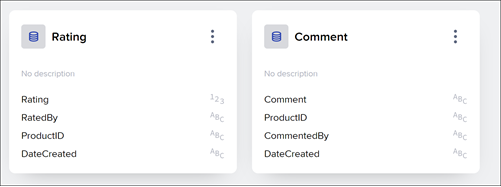


### Create a new backend project
Go to the SAP Build lobby, and click **Create**
   
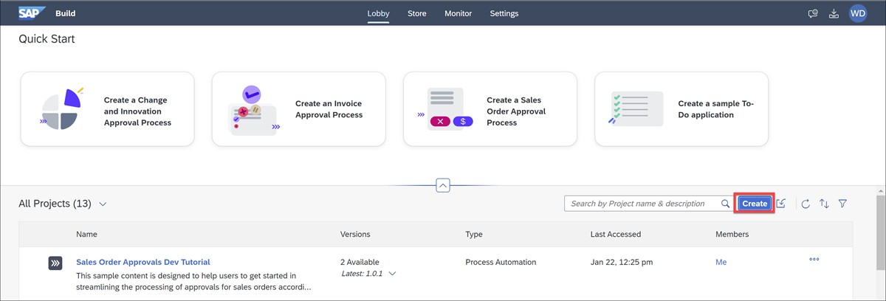

Select **Build an Application**.


Select **SAP Build Apps**, and then **Application Backend**.

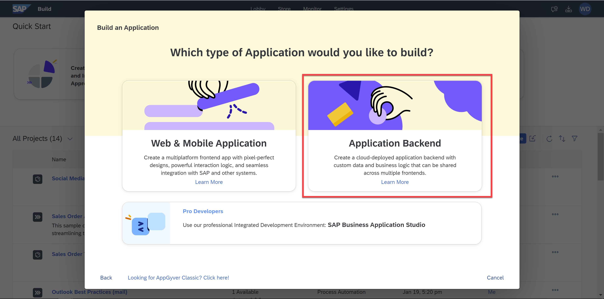

For the project name, enter `Social Media Backend`, then click **Create**.


### Create Rating entity
Every time a user rates a single product, we want to store that as a single record in an entity.

1. In the **Entities** tab, click **Create new**.

    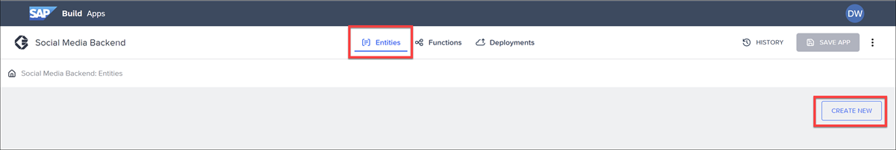

    Set the entity title to `Rating`, and click **Add**.

2. Add the following fields to the entity:

    | Field | Type |
    |-------|------|
    | Rating | Number |
    | RatedBy | Text |
    | ProductID | Text |
    | DateCreated | Date/time |

    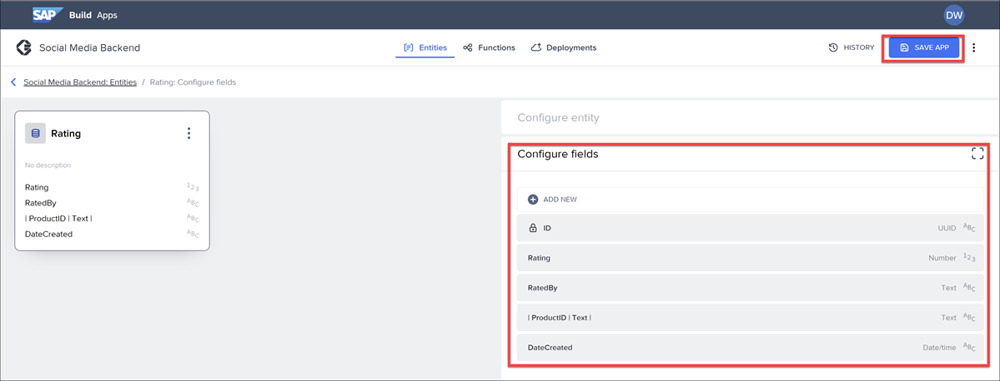

3. Click **Save App**.


 
### Create Comment entity
Every time a user adds a comment about a product, we want to store that as a single record in an entity.

1. In the **Entities** tab, click **Create new**.

    Set the entity title to `Comment`, and click **Add**.

2. Add the following fields to the entity:

    | Field | Type |
    |-------|------|
    | Comment | Text |
    | ProductID | Text |
    | CommentedBy | Text |
    | DateCreated | Date/time |

3. Click **Save App**.


### Create function
We want to create a function that will aggregate the ratings of the products and return a single average rating for each product. If there are no ratings for a product, no record is returned for that product.

Functions are created using the standard SAP Build Apps formula, based on JavaScript syntax.

1. In the **Functions** tab, click **Create new**.

    Set the name to `AverageRating`, and click **Create**.

    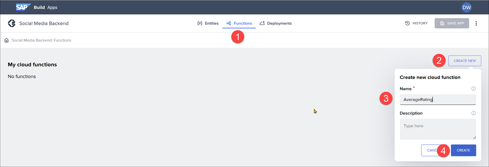

2. Click the **+** sign in the middle, then **List records**.

    
    
    Under **Configuration**, set the entity to Rating.

    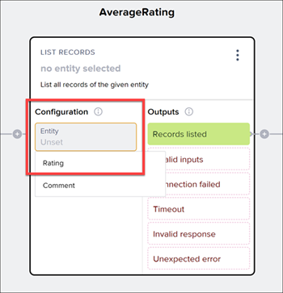

3. Click on **End execution** (on the right), and then on **Execution Finished**.
   
    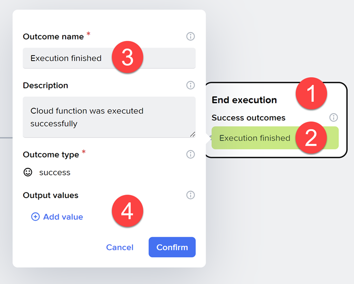

    Under **Output values**, click **Add value**, and set the the following:
    
    - Set **Name** to `Ratings`

        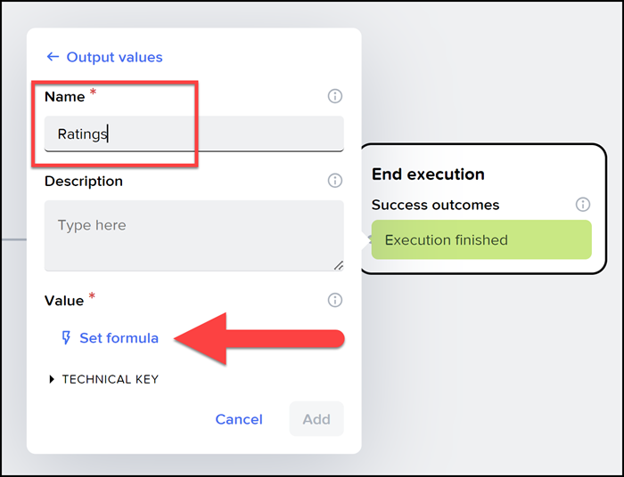
  
    - Click **Set formula** and enter the following formula:

        ```JavaScript
        GROUP(outputs["List records Rating / Records listed"].records, item.productId, {productID: key, avg: AVERAGE(PLUCK(items,"rating")), count: COUNT(items) } )
        ```

    Click **Confirm**, then click **Add**, and then **Confirm**.

    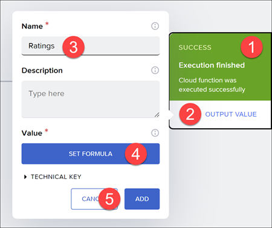

4. Click **Save App**.

>**What the formula does**
>
>The `GROUP` function takes our list of rating records, groups them by the product ID, and creates a new list with one element for each product ID.
>
>The object for each product contains the product ID, the average rating for all the ratings for that product, and the number of ratings for that count.
>


>**Inputs**
>
>On the left, you can define inputs to the function, so the user could send a specific product ID and the calculations could be done only for that product..
>

### Deploy backend
In the **Deployments** tab, click **Review and Deploy**.

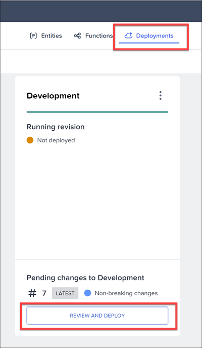

After reviewing the changes, click **Deploy to Development**.

It should take about a minute or two (going from **Not deployed** to **Missing** to **Progressing** to **Healthy** status). Once you see **Healthy**, you can add data to the entities and make calls from your front-end app. We will do this in the upcoming tutorials.


