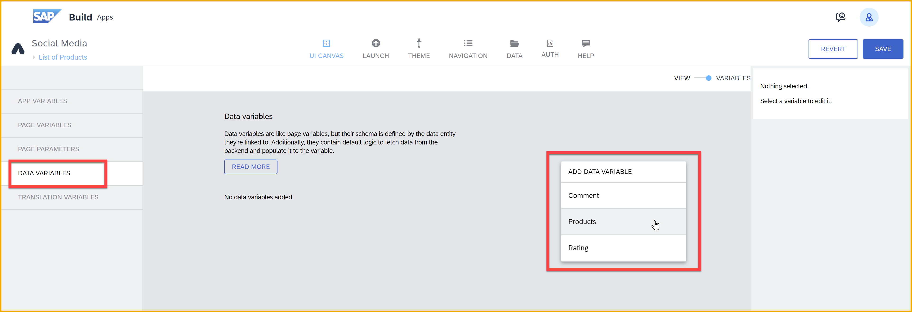
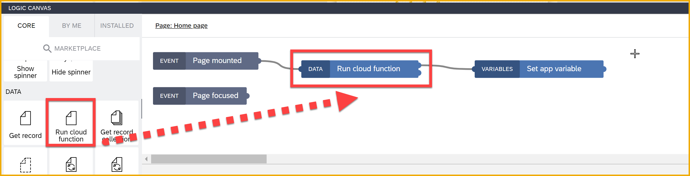
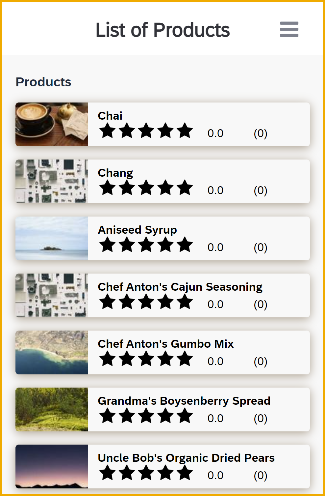

 

# Create a Product List Page with Ratings
<!-- description --> Now that you have your backend, you can finish the product list page by adding data resources and binding the properties of your list item composite component.

## You will learn
- How to enable BTP authentication
- How to set up navigation between pages
- How to use destinations (or hard-coded URLs) to access data services
- How to set up data resources for your custom backend entities
- How to call backend functions
- How to bind data to your composite component

## Intro
After creating a composite component and setting up your backend, you will now create the front end UI that will consume both business data and your custom data.

### Add name of page to navigation
SAP Build Apps lets you create a navigation menu so you can go directly to different pages in your app.

1. Go back to your Social Media app.
   
2. Open the **Navigation** tab.
   
3. Click on the List of Products page link.
   
    Change the **Tab name** to `List of Products`.
   
    

4. Click **Save**.

### Enable SAP BTP authentication
You need to enable SAP BTP authentication since you want to use entities and functions from Visual Cloud Functions in your app.

1. Go to the **Auth** tab.

2. Click **Enable Authentication**.

    

3. Select **SAP BTP Authentication**.

    On the confirmation popup, click **OK**. 

### Create data resource for Northwind
As the business data, we will use the Northwind OData service, but we could have easily used a destination to an S/4HANA system.

In this step, if you want to use a destination that you have already set up to Northwind, you can follow the instructions in the second tab.

[OPTION BEGIN [Without destination]]

1. Open the **Data** tab.

2. Under **SAP Build Apps classic data entities**, click **Create Data Entity**, and select **OData integration**.

    

    Set the **Base API URL** to `https://services.odata.org/v4/northwind/northwind.svc/`

    Click **Verify URL**.

    On the left, enable the **Products** entity.

    Click **Save Data Resources**.

    
   
3. Click **Save** (upper right**).

[OPTION END]

[OPTION BEGIN [With destination]]

These instructions are for when you have a destination to the Northwind OData service. It is to illustrate how to connect to a data source via a destination, like for S/4HANA.

For more information on creating destinations that can be consumed by SAP Build Apps, see [BTP Destinations Integration](https://help.sap.com/docs/BUILD_APPS/431746e4c663458aa68d9754b237bfc6/9e468c9c15914739a483c718700caae1.html).

1. Open the **Data** tab.

2. Click **Add Integration**. 

    

    Then click **BTP Destinations**.

    

3. Pick the `Northwind` destination on the left.

    

4. Click **Install Installation**.

    Select the  `Products` entity, and then click **Enable Data Entity**.

    

    Click **Save**, the **Exit**.

[OPTION END]

### Create data resources for backend
1. Still on the **Data** tab, click **Add Integration**.

    Click **Cloud Functions**.

    

2. Select **Social Media Backend**
   
    

3. Click **Install Integration**.

4. Select the **Rating** entity, and click **Enable Data Entity**.

    Select the **Comment** entity, and click **Enable Data Entity**.

    

6. Click **Cloud functions**.
   
   
   
   Select **AverageRating**, and then click **Enable Cloud Function**.

7. Click **Save**, then **Exit**.

### Create variables
1. Go back to the UI canvas.

2. Select **Variables**.

3. Under **App Variables**, click **Add App Variable**.

    - Select the new variable (i.e., `variable1`), and rename it to `Ratings`.
    - Set the type to **List**, and the list item type to **Object**.

    >On the one hand, a type of object with no fields has no schema, so it is more difficult to work with in the formula editor. But on the other hand, it is compatible with any object and saves us the time of defining all the fields.

3. Under **Data Variables**, click **Add Data Variable**.
    
    Select **Products**.

    Open the logic pane for the **Products1** data variable, and remove the Delay flow function.

    

4. Click **Save** (upper right).

### Bind composite component
Now that we have all the data in variables, we want to bind them to the list component.

1. Go back to **View**.

2. Select the Large Image List Item, and in the **Properties** tab, set the following:

    

    | Field | Binding |
    |-------|---------|
    | Repeat with| The data variable **Products**|
    | Title label | Data item in repeat: `current.ProductName` |
    | Rating | Formula
&nbsp;
`DEFAULT(FIND_BY_KEY(appVars.Ratings, "productID", STRING(repeated.current.ProductID)).avg,0)` |
    | RatingCount | `DEFAULT(FIND_BY_KEY(appVars.Ratings, "productID", STRING(repeated.current.ProductID)).count,0)` |
    | Image source | For fun, I wanted each product to have a picture. The simplest was to take a service that returns a picture. Here's a formula to return a cat picture.
&nbsp;
 `"https://cataas.com/cat/says/" + repeated.current.ProductID`     |
    

### Get the rating data
1. Click an open area on the canvas, and open the logic pane.

2. For the Page mounted event, add an **Execute cloud function** flow function, and then a **Set app variable** flow function.

    Connect them like ths:

    

3. Configure the Execute cloud function to call the `AverageRating` function (this is probably already set since you only have one function).

    

4. Configure the Set app variable.

    | Field | Value |
    |------|--------|
    | Variable name | `Ratings` |
    | Assigned value | Formula
&nbsp;
`outputs["Execute cloud function"].values.ratings` |

5. Click **Save** (upper right).

### Run the app
1. Click the **Launch** tab, and then **Open Preview Portal**.

    

2. Click **Open web preview** (left).

3. Select your project, **Social Media**.

>The above is shown with the browser's developer tools, with the iPhone device set.

All of the products are shown, and all the ratings are 0 since we did not create a page to allow the user to add them. You'll do that in the next tutorial.

