 

# Create the Product Page UI with Ratings/Comments
<!-- description -->Create the user interface for the product page, which shows the product and lets users add a rating and comments. 

## You will learn
- How to create a form with containers
- How to stylize components
- How to trigger a custom event
- How to paginate data

## Intro
In the previous tutorial, you set up all of the data variables and global logic for the page. In this tutorial, you will create the actual UI, plus any required additional logic.


### Display product name and current rating
1. Go back to the Product Page page.

2. Drag onto the canvas a container, and in the container add title, star rating (in **By Me** tab), and a text component.

     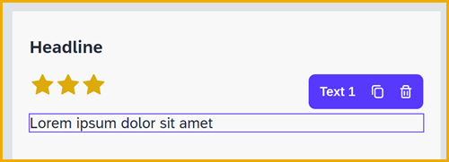

3. Select the container, and then in **Layout** tab set the layout to horizontal, and set the align components to middle.

    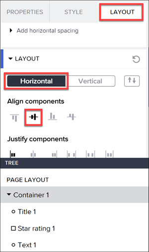

4. For the title, set the **Content** to **Data and Variables > Data Variables > Products1 > Productname**.

    - In the **Layout** tab, set its width to **Fit to content**.

5. For the star rating:

    - Go to **Properties** tab, and set **Maximum value** to 5.
    - Set the **Value** to the following formula:
  
        ```JavaScript
        DEFAULT(FIND_BY_KEY(appVars.Ratings, "productID", STRING(params.productID)).avg,0)
        ```

    - Set **View only?** to true.
    - Go to **Layout** tab and set its width to **Fit to content**.

6. For the text component, set the **Content** to the following formula:

    ```JavaScript
    FORMAT_LOCALIZED_DECIMAL(DEFAULT(FIND_BY_KEY(appVars.Ratings, "productID", STRING(params.productID)).avg,0), "en", 1,1) 
    ```

>**What do the formulas do?**
>
>The formulas for the **Rating** and **RatingCount** first get the record in the **Ratings** app variable with a product ID the same as the current product.
>
>Then it takes the average rating to display in the star rating control as stars, and the number of ratings with 1 decimal place to display in the text field.  


### Let users rate product
1. Add a List divider component next onto the canvas.

    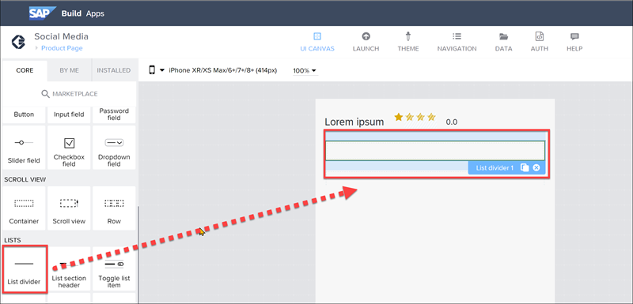
    
    Double-click the list divider, which opens the style editor. 
    
    >The style editor is similar to the template editor (which is opened by the icon at the bottom of the **Properties** tab), except that the style editor only lets you change the styles of the component or the component's parts. 
   
    Change the following properties under **Style**:

    - **Border color** to Positive (under **Follow smart content color**)
    - **Border width** to **Thick**
    - Click **Exit**.

    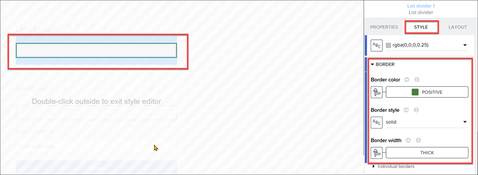

2. Copy and paste the list divider so you have 2 lines in a row.

    >The lines look like boxes but will be displayed as lines.

3. In between the dividers, add a container, with a text and star rating component, so it looks like this.

    

    Change the layout of the container to horizontal.

4. For the text box, change the width to **Fit content**.

    Edit the current style, and change **Typography > Text size** to small text.

    Set the Content to `Rate this product`.

5. For the star rating, change the following bindings:

    | Field | Value | 
    |-------|---------|
    | Maximum value | 5 | 
    | Value | **Page variable > rating** | 
    | View only? | **Page variable > ratingcomplete** | 

6. Click on the star rating, and open the logic pane. 

    Change the event to **Component: Star rating > Property 'Value' changed**.

    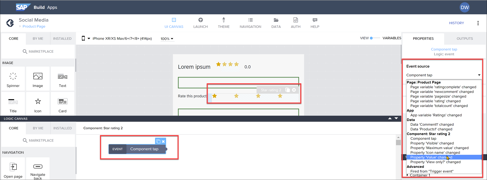
    
    Add flow functions after the event so the logic pane looks like this:

    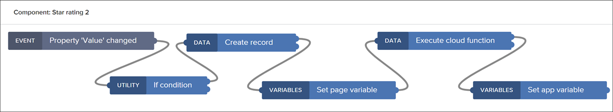

    >**What's going on?**
    >
    >The logic flow is intended to do the following:
    >1. **IF:** Check if the rating was changed to a number above 0.
    >2. **Create record:** Add a record to the Rating entity representing this rating.
    >3. **Set page variable:** Indicate that the user gave a rating and disable the rating component.
    >4. **Execute cloud function:** Retrieve the average ratings for all products, since we have a new rating.
    >5. **Set app variable:** Save the average ratings
    >
    >All of this should update the overall rating for the product at the top of the page. 

7. Set the bindings for the flow functions.

    - For **If condition**, set the condition to the following formula:
  
        ```JavaScript
        pageVars.rating != 0
        ```

    - For **Create record**, set the resource to Rating.

        For the Rating record, click **Custom object** and set the following:

        | Field | Value | 
        |-------|---------|
        | Rating | **Page variable > rating** | 
        | RatingBy | Any static text (I wrote static text `daniel`). In the future, you would get the current user and bind that. | 
        | ProductID | **Page parameter > productID** | 
        | DateCreated | Formula `NOW()` | 

        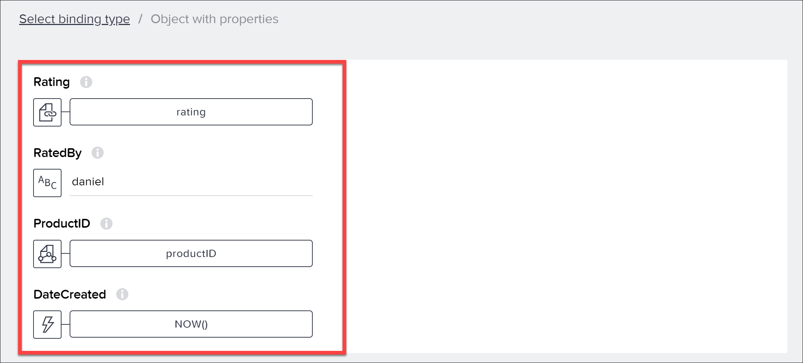

    - For **Set page variable**, set the variable **ratingcomplete** to true.

    - For **Execute cloud function**, set the function to AverageRating.

    - For **Set app variable**, set the **Ratings** variable to the following formula:

        ```JavaScript
        outputs["Execute cloud function"].values.ratings
        ```

8. Click **Save**.

9. Click **Save** (upper right).

You can now test this functionality. Open the app, navigate to the product page of one of the products, and give it a rating.


After clicking a rating of 4, the overall rating of the product changes to 4. At the same time, the rating component is disabled so you cannot rate the product again.

If you want, you can go back to the product list, then navigate again to this product, and give another rating, and see what happens.

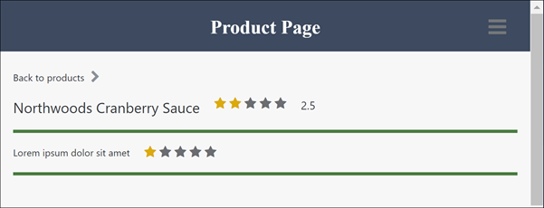


### Create form to add a comment
1. Under the second list divider add the following:
   
    - Text component

    - Input field

    - Button

    

2. For the text field, change the text to `Add Comment`.

    In the **Layout** tab, change the bottom gap to 1px.

3. For the input box, do the following:

    - Remove the **Label** text.
    - Bind **Value** to **Page variable > newcomment**.

    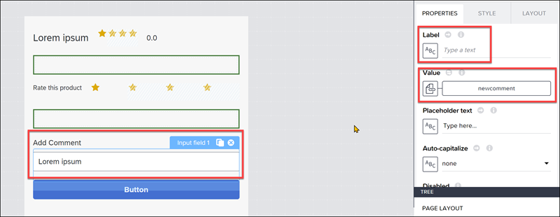

4. For the button, change the **Label** to `Post`.

5. Select the button, and open the logic pane.

    Set up flow functions as follows:

    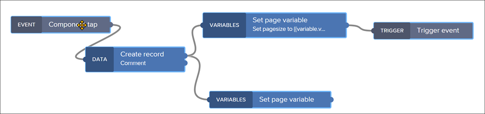

6. Configure the flow functions as follows:

    - For the Create record:

        Set the resource to **Comment**.

        For the Comment record, click **Custom object** and set the following:

        | Field | Value | 
        |-------|---------|
        | Comment | **Page variable > newcomment** | 
        | ProductID | **Page parameter > productID** | 
        | CommentedBy | Any static text (I wrote static text `daniel`). In the future, you would get the current user and bind that. | 
        | DateCreated | formula `NOW()` | 

        

    - For the bottom Set page variable:
  
        Set the variable to **newcomment**. Leave everything else alone so that it resets to an empty string.

    - For the top Set page variable:

        Set the variable to **pagesize**, and set the assigned value to the following formula:
        
        ```JavaScript
        pageVars.pagesize + 1
        ```

    - For the Trigger event, set the **Triggered event** to **Product Page / Refresh Comments** event.

7. Click **Save**.

>**What's going on?**
>
>The logic flow is intended to do the following:
>1. **Creates record:** Add a record to the Comment entity representing this rating.
>2. **Set page variable (bottom):** Clear the comment input box.
>3. **Set page variable (top):** Add one to the page size -- since we want add the new comment to the list of comments but keep exactly the comments that were displayed before.
>4. **Trigger event:** Retrieve the comments again, since we have a new comment to display.
 


### Display comments
1. Below the button, add the following:

    - Text component

    - Container

        Inside the container add 2 text components.

    - Button (under the container)

    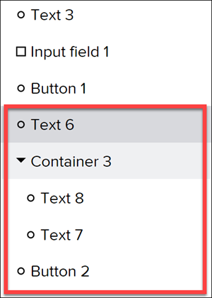

2. For the first text component:

    - Set the **Content** to `No posts yet`.
    - Set **Visible** (in **Advanced Properties**) to the formula:

        ```JavaScript
        IS_EMPTY(data.Comment1)
        ```

3. For the container:

    - Go to the **Style** tab, and edit the **Layout Container** style and change padding to 4px all around.
    - Under **Effects**, enable the shadow, set shadow to `Content Shadow 1` and set the shadow color to static color `#AF9E8D`.
    - Go to the **Properties** tab, and set **Repeat with** to **Data variable > Comment1**. 

4. For the first text component in the container:
    - Set the Content to the following formula:

        ```JavaScript
        FORMAT_DATETIME_LOCAL(repeated.current.dateCreated, "YYYY-MM-DD HH:mm:ss") + " - " + repeated.current.commentedBy
        ```
    - Go to the **Style** tab, edit the Primary Paragraph style, and under **Typography** set the text size to small.

5. For the second text component in the container:

    - Set the Content to **Data item in repeat > comment**.

6. For the button:

    - Set **Content** to `More`.
    - Under **Advanced Properties**, set **Visible** to the following formula:

        ```JavaScript
        pageVars.totalcount>pageVars.pagesize
        ```

7. Select the **More** button, and open the logic pane.

    - Add **Set page variable**, and set **pagesize** to the following formula:

        ```JavaScript
        pageVars.pagesize + 3
        ```

    - Add a Trigger event and set the **Trigger event** to **Product Page / Refresh Comments** event.

    


### Run the app
Go to the **Launch** tab, and click **Open Preview Portal**.

Click **Open web preview**, and select the Social media project.

The List of Products page should open, showing the list of Northwind products, with a cat picture for each. And for each it should show:

- Stars representing their average rating (from the Visual Cloud Function)
- A 1-decimal number representing the average rating
- A number in parentheses representing the number of ratings 

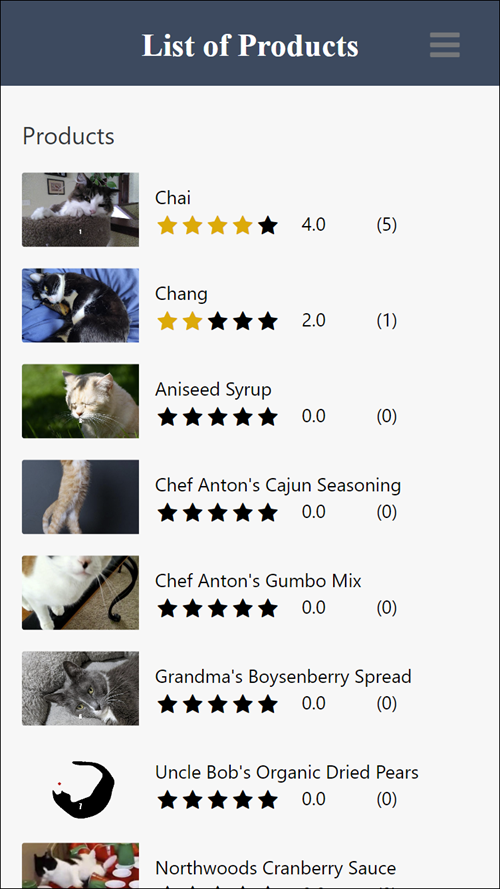

Click one of the products, and you get to the Product Page.

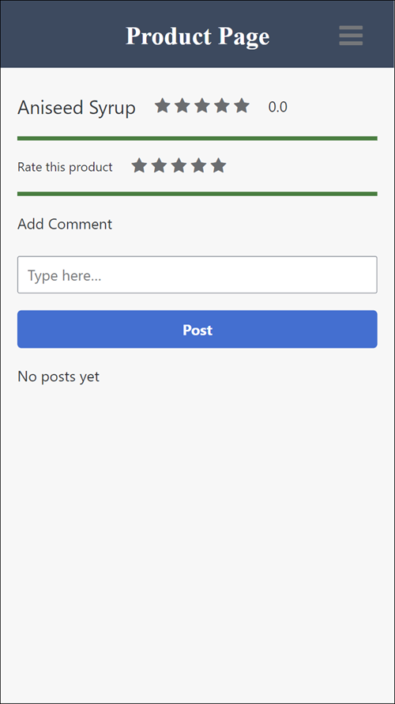

Click the hamburger menu (top right), and you can navigate back to the home page.

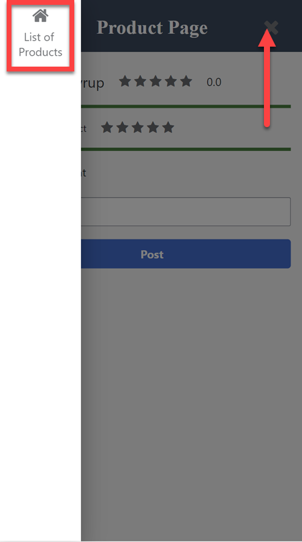

On the Product Page, you can rate the product, and the average rating will update.

And you can add a comment.

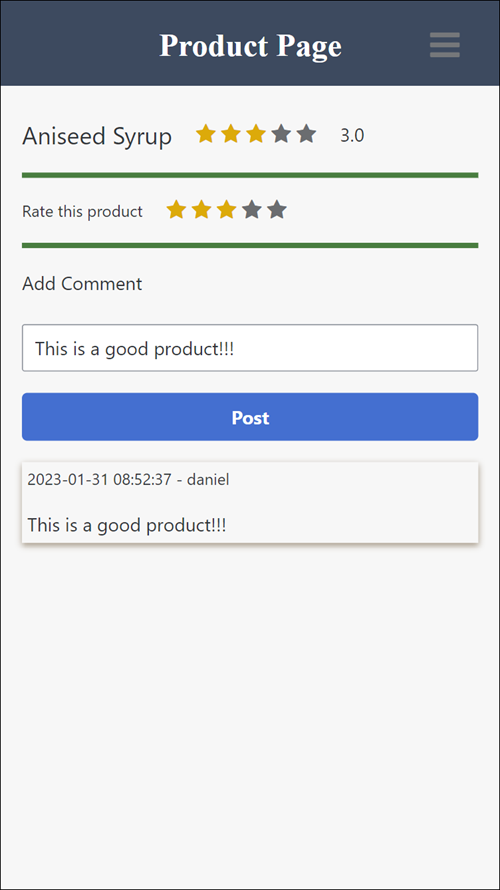

Once you have more than 3 comments, you can use the **More** button to see earlier comments.

