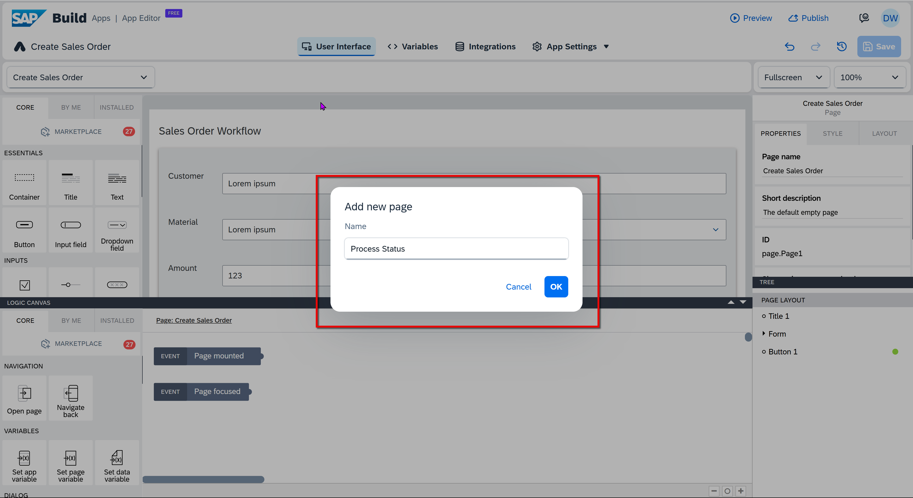
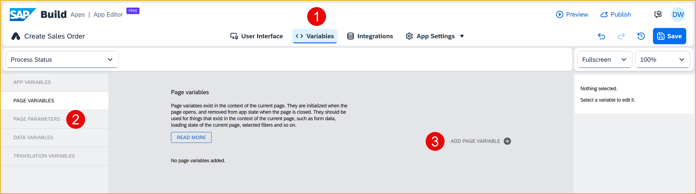
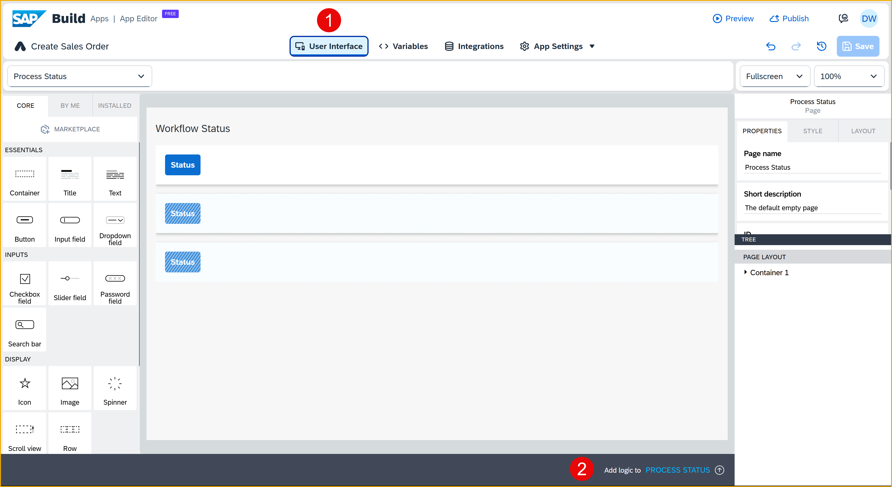
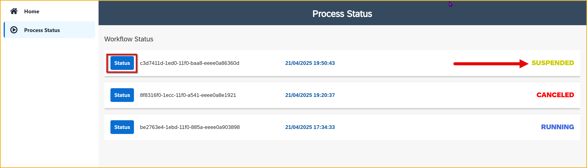

 
# Check Status of Process from SAP Build App
<!-- description --> After triggering a process, you can check the status of that process using the Retrieve Instances flow function.

## Prerequisites
- You created the Sales Order Trigger application, as described in [Create SAP Build App to Trigger Workflow](build-apps-workflow-trigger).

## You will learn
- How to retrieve the instances for a process
- How to check the status for a specific instance

## Intro
In addition to triggering a workflow, you can get the status of a workflow, the tasks within a workflow, and a whole lot more.

In this tutorial, we will create a new page to display the processes we have triggered (including its ID, status and time it was triggered), and let the user click a button for each to check if its status was updated.

>We will use the process flow functions that come with SAP Build Apps, making this task quite easy. You can also use a wide range of APIs to interact with processes, and these are described in the [SAP Business Accelerator Hub](https://api.sap.com/package/SAPProcessAutomation/all). Select the API you are interested in, and then click **View the API Reference**.


### Create page to display process instances
You will create a separate page to display the process instances, including each one's ID, time it was triggered, and its status.

1. In the top-left of your project, open the page dropdown and click **Add New Page**.

    

    For **Name**, enter `Process Status`.

    Click **OK**.

    

2. Add a container into the page.

    

    Right-click the container, and select **Copy**.

    

    Right-click the container, and select **Paste**.

    

    This will create nested containers.

    

4. Copy the following text:

    ```Container Code
    H4sIAAAAAAAACt1ZbW/bOBL+Kwb3DtgAolcSKYkUsB+8TnJrbJrkNukVRV0YfBnZQmVJkOg0uaL//UDLSpzEybKtvR/O+WDJEjkzzzzPcMh8QeauBpQiVS3rqoTSTMrWiFIB8lBuYInSLw/P7E2uUYooEzQQWmMWqhhTSWLM4oxgBSJiPBacCoo8pPO2LsTdrBRLa2NclUbkJTQDgjy0+fEGGpMrUcxkdTsrxF21MshDopm31tpN3uayAJSaZgUekkJ9mjfVqtSTpZjb4eirh1pzZ1/5guaiHmUGGnvdVqtG2TfMApY2mhtRrOz9P9paqLycz+7Dmp3ZWeaiPimFLEB31vqJZ6oQbYtSdO+cWuSFbqBE6YcNHsRnEAYywVQkgGkEAsuIExwA5TyKfa2j+Dke17kpYBA8YKFWramWOCEkAJkQDDThmNKAYcligXXAIKGx9qXPtzBSVWnWyUHvquZTVlSfB1dGmFVrg97G7++DauPSZZMvRXP3GLKPX70eNR0mUocR1lGUYMqTGDNGNWZBwDPCmYaMvMai4P+MRSojcaAVwZwFAlOdMcwYCTDEgdQBi6TP9Wt4hIfBQxT5vJwYWK4zC6WFxkNZAbfHeQPK5FWJUtRUn5F3YOzqjk9j0VgcGqhBmEeWajEHfCOa3M6CPPQJ7tbDKgVt21e2dthAW1dlC6OmEXfW8vNcBFHIqKYaRyGJMY0yhgWRHMswjgKaSJ+z8HkuflsZU5U7JB0CREpBiHloJR35AktFYxwqHygJQyoh2EpQISQUKEW7dbw2u8EpE0X7SNg6X0LZ5lXZ/gYLcZNXDUpRlpvrarypE39Tll5SPSSBhFglmFIIMeWgscx8jinogIgwoMpXO2ol3JoduAodKBb4AodaWlwFwyILKY4zqQMeZjqJyK5SuRV3RyPQ93RRq6aB0gxzbcN9gvxS3J5BOTcLlEa+73uohQKUWfOtS4aHytVSQnORneUltCj1/zI9XTD7ToyHFpDPF+ZlHnzOtQ0EEf+f/d3Wyy2Y/6xNvpThS9GIeSPqxUupZoopKoMEB0lGMSVJjKWOqC1oEZMh89W6z9iV6vAQqYbbuoHWot8n+wvKqma5KgRK0enFn29G17Pj0fXJ9eTNyezsYjw6+7mnx7CnRWtEY0CPjDeYouPjX968+eX9+/fvB7//ni6XadtO0dGg+yAPtarJa/Pi5GcXF3+8vey/elPetOfgFB15U3RvsbvdbdPiCDWUGkqVW9p9+LBN7c2E1qV+NvTxo4eyVbmu4HbAbieRhzr/0Mev+9eDqorqMd3bpWgM3qQPd88fyH81upwt8vmisMy2zHSpd1lVmndrLaAUJb6/f6UZuDUju04+LJHfrRotNGc8JFjxzLZFGcM8yigmIREx1xGju9qirpl8LpvvbSZdKmTbLU9PWfF6fh+JcIP0tgwnpzs1Z1bt4NdfB1P059vz88n5v6bIm6KfaBDzk2CKvL8adfX26vLk/PjkuBs3Ho/Hvu8wbjw6H5+c9cNOT31/PWyKfvL97vro6Ghb6JPTnydXs5N/v/0WeZtV213fB3f0NLofmHQr9qOnwf/AtA/QHL2OjXNdsmR6VpQmp8hDvZtPitFO8cNtLUr9br22PdE+P7T2m74sfct+qPuzLXX1uV23oLcoDQLfQ3copb6H/rtpbVOS3nuTOu451yXFh5DrmAx5EkZMRcjrt/1w03cCTZcbC3+urx8/XX9fbTfZ3+xJakRtsyGKwm43zvu9y2aOQfc4b8dVmeXzVSO2qokbHo7NRtfdZ1rxyB+GgvlUhnvGw8WTw+Ph2Gd3O/Ew0kJFQ0oSnnC2ZzxcPDk8Ho6nDWs8BMtIErBhmCQcCNm3Xhw8OTwejjvcNR4yCllE5DDmQZZQtWc8XDw5PB6Opy/dSQ0BEWfxUAlOJdk3Hi6e/BgeG2+NkH1E30uP/qTi3nI6uD8EcbTkuJDtsNQfoLoacqsAOwxtnzk6GnNcjnZF1e1/He040vbVoJyNOa4pLwXlDJ7jFuhFSnQBuaje0dLazTiSoHQ2lOCTQMd7Vr2LJwdXveM/dl5lE3EG39FaV3IDlcVcDyGKwSewZ/BdPPkB8G133+00RnW98Wy5KkxeF8LYrS/6+j8jA/omihsAAA==
    ```

    Right-click **Container 2** -- either on the canvas (it should still be selected) or in the tree view -- and select **Paste**.

    

    You should now see the skeleton layout.

    


### Create page variable
After retrieving the process instances, you will need a place to store the information. 

1. Click **Variables**.

2. Click **Page Variables**, and then click **Add Page Variable**.

    

    Choose **From existing schema**.

    

3. Select **Process**, then navigate to **Order Processing > Retireve process instances > Output Schema**.

    Click **Create**.

    

4. Change the name of the variable to **processInstances**.

    

5. Click **Save** (upper right).


### Retrieve statuses
1. Click the **User Interface** tab.

    Open the logic pane by clicking **Add logic to Process Status**.

    

3. Under **Processes**, drag in a **Retrieve Instances** flow function and connect it to the **Page Mounted** event.

    

    With the flow function selected, set **Process** to **Order Processing**.

    

    With the flow function selected, set the **startedBy** property to **Data and Variables > System Variables > Currently logged in user >  email**.

    >You can filter it to whichever user you want, or perhaps not filter the list at all.

    

    With the flow function selected, set the **orderBy** binding type to **Static text**. Then, select **startedAt desc**.

    

4. Drag a **Set page variable** flow function and connect it to the top output of the **Retrieve instances** flow function.

    

    Set **Variable Name** to **processInstances** (this should already be set).

    Set **Assigned Value** to **Output Value of Another Node > Retrieve Instances > Success**.

    


### Add navigation
You will create navigation so the user can open up the process status page from the home page.

1. Open the **App Settings > Navigation** tab.

    

2. Click **Add Item**. This will add a row to the navigation.

    

3. Select the new navigation menu item, and set the following in the **Properties** pane on the right:

    | Field | Value |
    |-------|-------|
    | Icon | **play-circle** |
    | Tab Name | **Process Status** |
    | Page | **Process Status** |

    

4. Select the **Empty Page** menu item, and change its **Tab name** to **Home**.

    

5. Click **Save** (upper right).


### Run app
Run the app, and click the new **Process Status** navigation menu item.


You should now see the process instances that you started. The exact data will depend on how many you created and their statuses.


### Create logic to retrieve status
To get any status that changed, you can just refresh the page. But now you will create logic for the status button to retrieve the latest status for a specific process instance.

1. Click the **User Interface** tab.

    >Make sure you are on the **Process Status** page.
   
    Click the first **Status** button, and make sure the logic canvas is open. If it's not open, click **Show logic for Button 1**.

    

3. Under **Processes**, drag in a **Retrieve Instances** flow function and connect it to the **Component Tap** event.

    

    Set the **Process** to **Order Processing**.

    Set **id** to the following formula:
    
    ```JavaScript
    repeated.current.id
    ```

    


4. Drag a **Set page variable** flow function and connect it to the top output of the **Retrieve instances** flow function.

    

    Set **Variable Name** to **processInstances.responseArray**.

    Set **Assigned Value** to the following formula:
    
    ```JavaScript
    SET_ITEM_AT(pageVars.processInstances.responseArray,repeatedInfo.current.index,SET_KEY(pageVars.processInstances.responseArray[repeatedInfo.current.index],"status",outputs["Retrieve instances"].workflowInstances.responseArray[0].status))
    ```

    


### Run app
Run the app again (it should refresh on its own), and click the navigation to go to **Process Status**. You should see something like this.


Go to SAP Build Process Automation, and suspend the process.


Go back to your app and click **Status** for the process. The status should change to **Suspended**.


