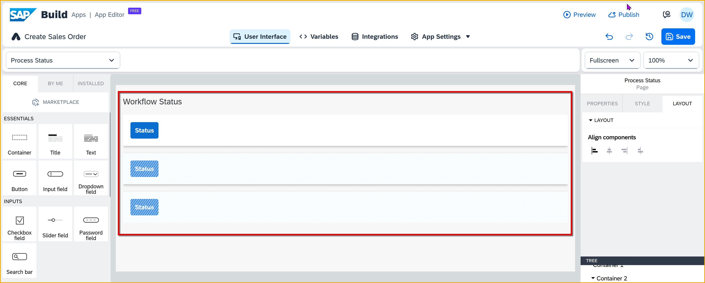
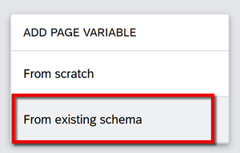
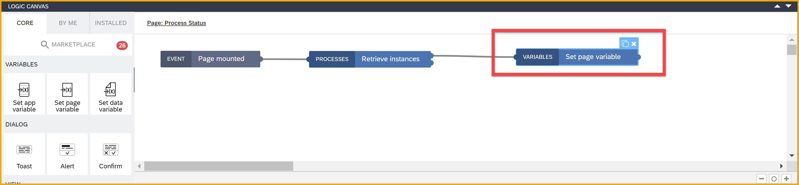

 
# Check Status of Process from SAP Build App
<!-- description --> After triggering a process, you can check the status of that process using the Retrieve Instances flow function.

## Prerequisites
- You created the Sales Order Trigger application, as described in [Create SAP Build App to Trigger Workflow](build-apps-workflow-trigger).

## You will learn
- How to retrieve the instances for a process
- How to check the status for a specific instance

## Intro
In addition to triggering a workflow, you can get the status of a workflow, the tasks within a workflow, and a whole lot more.

In this tutorial, we will create a new page to display the processes we have triggered (including its ID, status and time it was triggered), and let the user click a button for each to check if its status was updated.

>We will use the process flow functions that come with SAP Build Apps, making this task quite easy. You can also use a wide range of APIs to interact with processes, and these are described in the [SAP Business Accelerator Hub](https://api.sap.com/package/SAPProcessAutomation/all). Select the API you are interested in, and then click **View the API Reference**.


### Create page to display process instances
You will create a separate page to display the process instances, including each one's ID, time it was triggered, and its status.

1. Click **Create Sales Order** page area in the top left.

    

2. Click **Add New Page**.

    For **Name**, enter `Process Status`.

    Click **OK**.

    

3. Delete the title and text components on the page, so the page is empty.

    

4. Copy the following text:

    ```Container Code
    H4sIAAAAAAAACt1ZXW/buBL9KwG7QBNANESJFCUD+9C6zSK4QZq7abEPcRAMyaEjVJYMSU6TLfLfLygrjlPbWab5uMUmD5YtkWfmcOYMOfpO2usZkiHR1XRWlVi2B2XTQqmRBCRvcUqG3+/uuS+5IUMSxWCsEIKmUkeUs8zS1DKkQjClZQZaWEECYvJmVsD1eQlThzGqyhbyEusdRgLS/3iJdZtrKM5VdXVewHU1b0lAoJ40Du0yb3JVIBm29RwDokB/ndTVvDQHU5i44eQmIE177R75TiYwe2dbrN11U81r7Z5oL3DqvPmK12RIfmtmoPNycr506vzQzTGB2ccSVIFmgXU77bkuoGnIkCxN0xd5YWosyfC0Z4NBokwaSmq5Rso1N44XSbVOuVYsUTKW62x8ztsCV5nQ86atplTGMUMlY4pcZpRzllKVJkANS1HyxIQqzFYY0lXZdktDjutKY9NgQ4L7vL0WRb0px3U+hfr6PlVnN0HPllVxhFYZyowSlKeRpKlWQJW1WabTDBMWPhQ70cvEDhT5pDxocdp5gqXjKCC2wKsPeY26zauSDEldfSPBwyReQjHHp9AYQ8hSBkgh0YryGBOaJuByLYxSnnFmlCIBqXGG0N4zYQYTpJdQ52765XrOFnFxm9iNM2I9iLWGBA0KCmkYU254QoEboFZHYRIjRCpL1pfl/bxtq3JDFEeIQmuMaBa5KBYhUKV5QiMdIo+jiCtkK2tVgMKCDMlJC+18LYA72J4yC0VzL6JNPsWyyauyeY8XcJlXtQuyvP1cjfrUeOkFmz0c8NxKSAREVCmRUB5JTTNjUqoksDiMWMoTWGf2z+rbKq1r0a2rYj4tGzKM18j6P6qkQQvzYrNMJpk0UaIZ5ZF1wgaGpkyHFBOreRrr0IabEh+LYueNd8FY0hI9lpZ7AuDynjYt1G7uu4GjqujCq62hbGZQL6JrYwSCuXTZZnoReQ9N3pBhuPj2h9ORIVt8Obmo8/Jrd+9uacJ1sgMyK0DjaCn4d0bu9IL1mKqlOMYQSUYFTwzlnEc04xmnmVUJD3WoUkg3VC28alcluE93MEynLAQaGeXSHVIKNuI0scqwLLJGinhT0VqJQLya1dg4Gm/D8DuxVT2dF+CEt1M7NAM9rx3tg9wx2+g6nzkqDj99+s+X493+4/bhYEz6x8dkLxiT3IzJnvMJZ1gaLHWODRmeni5nd0QtBrjtjyFnZwGx87JTf/dkj0POApI3x1Xekd4vTl5eYt3g0phBXl7urlyejkk9JsGKbbeXY3IWnI6JHpNVg8/27n50hp/tkZubtaAu51OF9Sd7mJe4iK8GC9RtVwHWxfIlc7+XwWOoYVLD7OJHPbxTxBCMMGksqEEOlGuZ0QxMTC1D1GFqMNRsmxJ4l/+fV4J/Z75HSZJwmQoaS7SUi4hTyLSryNLYmEkm7AbSu3yPf4F87/xG8659fNovhz4m++/wfhURWHHjX6QF1kSYyVDTOE1TyiVkVCEwmoDU3MpIMR5v04L4ZY4Cr5Tfj0leiyaSKrVUohCUiyylikFMkdk0zIwVqdxWrPmvkbyLbf3jM7edN49MW4f0C+Vs58CzJKxeVKNty9CfY1YX4mB/d8ta7Pz++87bP78cHR0c/fE22BmTN2H3NybBPwwavTsafTz8+OFtMCZvPowYj0f/POjky8nxx6MP/aj9fbkvwo6gN2GYdrB7e3ur8XGwv3twcv7xv1/eHe4+MlaCpV97wQ9+/fyUS6/3fnT75+e8I2XvYVaeFvoH+yQgt1aSYJkKLiBtVbZ/YT65cJzL7vz1KmflBwrD4t9JafWt6RSwb1G2oBa78kWjYxgPl+BDz4bkbZthtBy4s9qUdEXJA8yzg/UgWOQL5tmX2QC27M14InkeCDcg9YdCTxzPjeg2nNgXx7PvsgFn0XvxhPFsa2yKhr614QnkeWraCuS9QJ5bsq1A3ivkuavZFgncF8ezQb8Jp2/SO6ArMmQsDMg1GfIwIH8/QYc6MwUKIVM2MBhZZVwS967g5ULQv+X1Qu+dpOfm8/273efJauv30ZYMW5i5/SwUhdsSH9222vs5dha382ZUlTafzGtYeaXgx4enVHZ8oBUKEj7gJsUI9DPz4WPJ0/lI4o6PTG7hw1PNOz5SZIxbGKSZSFkinpkPH0tePj48a07HhzFGyoQNYptIxZ6bDx9LXp4Pz9rY8RFrbVUsBmHGw4zx59YPD0teng/PGr54DatEmBg7kBI5U+aZ+fCx5BX01K80L/KFcYAoGSQiFJY/d33xseQV+PDbQXR8gAltKqJBAnEcCfncfHhY8vJ8eO50Fu8lhWCCyYFSYCVnz8yHjyVP4OPs5uZ/MP2zS7wiAAA=
    ```

    Select **Page Layout** in the tree view at the bottom right, and press **Control-V** or **Command-V** on a Mac.

    

    You should now see the skeleton layout.

    


### Create page variable
After retrieving the process instances, you will need a place to store the information. 

1. Click **Variables**.

2. Click **Page Variables**.

    Click **Add Page Variable**.

    

3. Change the name of the new variable to `processInstances`.

4. Change the type of the variable to **List**.
   
    Change the **List Item Type** to **Object**.

    

5. Click **Save** (upper right).


### Retrieve statuses
1. Click **UI Canvas**, and then click **Page Layout** in the tree view on the bottom right.

    

2. Open the logic pane.

3. Under **Processes**, drag in a **Retrieve Instances** flow function and connect it to the **Page Mounted** event.

    

    With the flow function selected, set **Process** to **Order Processing**.

    

    With the new flow function selected, set the **startedBy** property to **Data and Variables > System Variables > Currently logged in user >  email**.

4. Drag a **Set page variable** flow function and connect it to the top output of the **Retrieve instances** flow function.

    

    Set **Variable Name** to **processInstances** (this should already be set).

    Set **Assigned Value** to **Output Value of Another Node > Retrieve Instances > ResponseArray**.

    


### Add navigation
You will create navigation so the user can open up the process status page from the home page.

1. Open the **Navigation** tab.

2. Click **Add Item**.

    

3. Select the new navigation menu item, and set the following in the **Properties** pane on the right:

    | Field | Value |
    |-------|-------|
    | Icon | **play-circle** |
    | Tab Name | **Process Status** |
    | Page | **Process Status** |

    

4. Click **Save** (upper right).


### Run app
Run the app, and click the new **Process Status** navigation menu item.


You should now see the process instances that you started. The exact data will depend on how many you created.


### Create logic to retrieve status
We will create logic for the status button to retrieve the latest status for a specific process instance.

1. Click **UI Canvas**.
   
2. Click the first **Status** buton, and open the logic canvas.

    

3. Under **Processes**, drag in a **Retrieve Instances** flow function and connect it to the **Component Tap** event.

    

    Set the **Process** to **Order Processing**.

    Set **id** to the following formula:
    
    ```JavaScript
    repeated.current.id
    ```

    


4. Drag a **Set page variable** flow function and connect it to the top output of the **Retrieve instances** flow function.

    

    Set **Variable Name** to **processInstances** (this should already be set).

    Set **Assigned Value** to the following formula:
    
    ```JavaScript
    SET_ITEM_AT(pageVars.processInstances, repeatedInfo.current.index, SET_KEY(pageVars.processInstances[repeatedInfo.current.index],"status",outputs["Retrieve instances"].workflowInstances.responseArray[0].status))
    ```

    


### Run app
Run the app again (it should refresh on its own), and click the navigation to go to **Process Status**. You should see something like this.


Go to SAP Build Process Automation, and suspend the process.


Go back to your app and click **Status** for the process. The status should change to **Suspended**.


