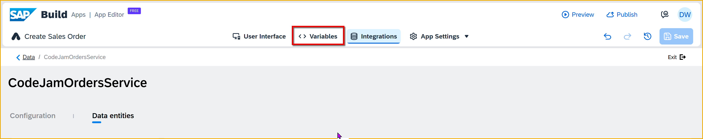
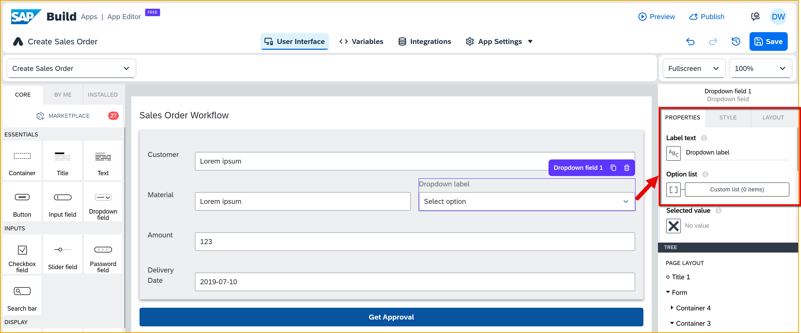

  

# Populate Dropdown with SAP Data (ES5)
<!-- description --> Populate a dropdown field with SAP data, in this case with data from ES5 gateway demo system.

## Prerequisites
- You or IT has set up a user with the ES5 gateway demo system, as described in the tutorial [Create an Account on the SAP Gateway Demo System](https://developers.sap.com/tutorials/gateway-demo-signup.html)
- You or IT has created a destination called **ES5-Shop** to the `ES5 EPM_REF_APPS_SHOP_SRV` OData service -- a similar service setup is described in the tutorial [Connect the SAP BTP Training Subaccount to Your Gateway Demo System Account (ES5)](https://developers.sap.com/tutorials/workzone-connect-gateway.html).

 

## You will learn
- How to create a data source to SAP data
- How to make a call to an SAP backend API
- How to populate a dropdown list from backend data


## Intro
Previously, we created an input box for the user to enter a material ID for the sales order. Now, we want to make a call to an SAP backend, retrieve product data, and populate a dropdown box so the user can choose from a list of products.

>**Before You Begin:** You or IT needs to have set up a user with the ES5 gateway demo system, as described in the tutorial [Create an Account on the SAP Gateway Demo System](https://developers.sap.com/tutorials/gateway-demo-signup.html).

>Then, you or IT needs to have created a destination called **ES5-Shop** to the `ES5 EPM_REF_APPS_SHOP_SRV` OData service -- a similar service setup is described in the tutorial [Connect the SAP BTP Training Subaccount to Your Gateway Demo System Account (ES5)](https://developers.sap.com/tutorials/workzone-connect-gateway.html).
>

---

### What data will you use?
>**IMPORTANT:** If you are in a workshop, the ES5-Shop destination has already been created for you and you can skip this step.

SAP Build Apps can make API calls via destinations to backend services set up in SAP BTP. So you need to set up a destination to the ES5 gateway service.

The instructions for setting up the destination are in the tutorial [Connect the SAP BTP Training Subaccount to Your Gateway Demo System Account (ES5)](https://developers.sap.com/tutorials/workzone-connect-gateway.html).

We will use a product table from the Shop service, so the URL for the destination must be:

```URL
https://sapes5.sapdevcenter.com/sap/opu/odata/sap/EPM_REF_APPS_SHOP_SRV
```


 


### Create a data resource to ES5
A data resource defines a connection to a backend, and when executed, will bring back the data we want.

1. Go to the **Data** tab, and the **Add Integration**.

    

2. Click **BTP Destinations**.

    

3. Select your ES5 destination.

    

    >**IMPORTANT:** If you are in a workshop, use the **ES5-Shop** destination.
    
4. Click **Install Integration**.

    

    Select the `Products` entity on the left, and click **Enable Data Entity** on the right.

    

5. Click **Save** (upper right).
   

### Create data variable
After retrieving the data, we need a place to put it, with the proper schema so we can reference all its fields.

1. Click **UI Canvas**, and then click **Variables**.

    

2. On the left, click **Data Variables**.
   
    Then click **Add Data Variable**, and select `Product`

    

3. Click on the new variable, and open the logic pane by clicking **Create sales order** at the bottom of the page.

    

4. Click on the **Delay** flow function, and delete it by clicking the **X**.

    

5. Click on the new variable again, and on the right-side of the page, go to **Paging** and click on the **X**, and then click **Object with properties**.
   
    

    For **Page size**, click the **X**, select **Static number**, and change the number to `10`.

    For **Include total count**, click the **X**, select **Static true/false**, and change the value to `True`.

    
    
    Click **Save**.

6. Click **Save** (upper right).
   


### Create dropdown for materials
1. On your **Create Sales Order** page, go back to UI canvas by clicking **View**.

    >You can close the logic pane if it interferes with your work.
   
2. Drag a dropdown field next to the input box for the **Material**.
   
    

    It should look like this.

    

3. Click on the dropdown box, and change the following properties.

    

    | Field | Value |
    |-------|-------|
    | **Label text** | Delete `Dropdown label` |
    | **Option list** | Click the list of values icon, and set the binding to a formula, and set the formula to the following:<div>&nbsp;</div>`MAP(data.Products1, {label: item.Name, value: item.Id})` |

4. You will have to bind the dropdown field to the `Trigger Workflow1` data variable (as we did for the input field for material).
    
    For the **Selected value** field, set the binding to: **Data amd variables > Data variable > Trigger Workflow1 > material**. 

    

5. Click **Save** (upper right).


### Run app
Run the app again.

>If you already have a browser tab open to the web preview, it will refresh whenever you save the project.
>
>Otherwise, to run the app, go to the **Launch** tab, then **Open Preview Portal > Open web preview**, and then click **Open** for the `Sales Order Trigger` project.

5. Enter the following values in your form:

    | Field | Value |
    |-------|-------|
    | Customer | `Dinah's Bikes` |
    | Amount  | `2000` |
    | Delivery Date  | `2023-04-01` |

For the material, select `Notebook Basic 15` from the dropdown for the material -- one of the products from the ES5 system.

This will also update the text field with the ID for the product.


Click **Get Approval** to trigger the workflow. 

Go to the **Monitor** tab, and you should see your instance, showing the `orderAmount` of 10000 and the `material` as `HT-1000`.
