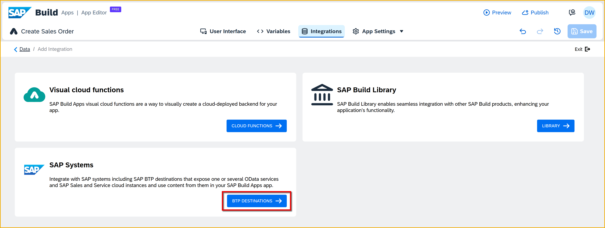
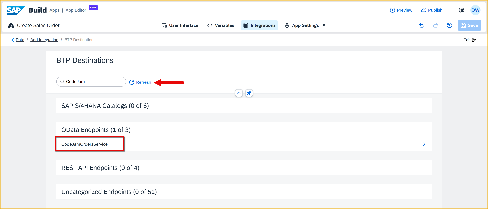
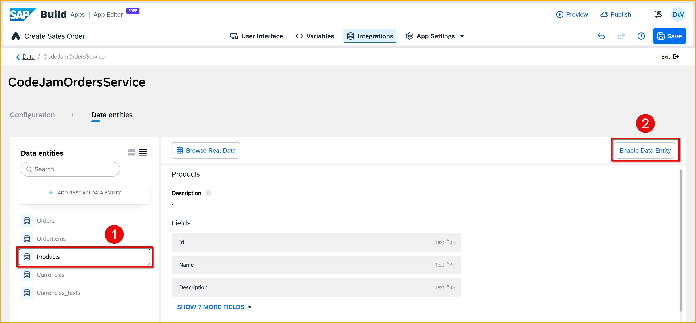
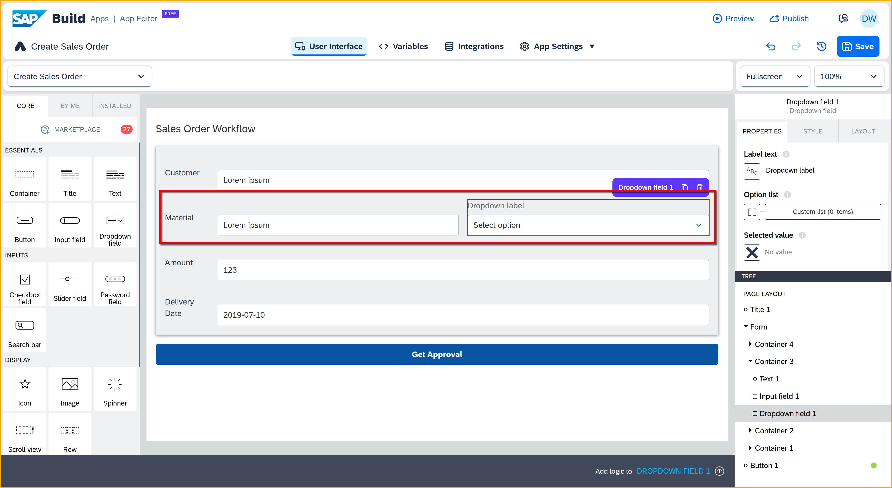

  

# Populate Dropdown with Products
<!-- description --> Populate a dropdown field with product data, so that you can provide the user with a choice field.

## Prerequisites
- You have completed the the tutorial [Create SAP Build App to Trigger Workflow](build-apps-workflow-trigger)

## You will learn
- How to create a data source to SAP data
- How to make a call to an SAP backend API
- How to populate a dropdown list from backend data

## Intro
Previously, we created an input box for the user to enter a material ID for the sales order. Now, we want to make a call to an SAP backend, retrieve product data, and populate a dropdown box so the user can choose from a list of products.

### Create a destination to the CAP service
You will use a CAP service that we created for this tutorial, which contains an entity called **Products**, to population a dropdown box.

Follow the instructions in Step 4 of [Set Up Prerequisites for SAP Build CodeJam](codejam-0-prerequisites).

### Create a data resource
A data resource defines a connection to a backend, and when executed, will bring back the data we want. Here, we need to define the connection to the CAP service hat contains our products.

1. Go to the **Integrations** tab, and the **Add Integration**.

    

2. Click **BTP Destinations**.

    

3. Select your **CodeJamOrdersService** destination.

    >If you just created the destination, you may need to click **Refresh**.

    
    
4. Click **Install Integration**.

    

    Select the **Products** entity on the left, and click **Enable Data Entity** on the right.

    

5. Click **Save** (upper right).
   

### Create data variable
After retrieving the data, you need a place to put it, with the proper schema so we can reference all its fields.

1. Click **Variables**.

    

2. On the left, click **Data Variables**.
   
    Then click **Add Data Variable**, and select **Products**.

    

    You should get a new data variable defined for your **Products** entity.

    

3. Click **Save** (upper right).
   

### Create dropdown for materials
1. Click **User Interface** to return to the UI of the page.
   
2. Drag a dropdown field next to the input box for the **Material**.

    >You will likely have to select the **Material** input field and then expand the tree view on the bottom right. Also make sure for **Container 3**, for the material, you have text, input, and dropdown components at the same level.
   
    

    It should look like this.

    

3. Click on the dropdown box, and change the following properties.

    

    | Field | Value |
    |-------|-------|
    | **Label text** | Delete **Dropdown label**. |
    | **Option list** | Click the list of values icon, and set the binding to a formula, and set the formula to the following:
&nbsp;
`MAP(data.Products1, {label: item.Name, value: item.Id})`
&nbsp;

&nbsp;
Click **Save** twice on the formula pop up. |

    >**What does the formula do?**
    >
    >A dropdown field wants the options as a list of objects, with each object having 2 fields: `Name` for the display name, and `Id` for the underlying value of the option. The `Map` function takes the data in the data variable and converts it to the format we need.

4. You will have to bind the dropdown field to the `SalesOrderDetails` page variable (as we did for the input field for material).
    
    From the properties tab, for the **Selected value** field, set the binding to: **Data and variables > Page variable > SalesOrderDetails > context > salesorderdetails > material**. 

    

    Click **Save**.

5. Click **Save** (upper right).

 

### Run app
Run the app again.

>If you already have a browser tab open to the web preview, it will refresh whenever you save the project.
>
>Otherwise, to run the app, click **Preview** at the top of page, then click **Open Web Preview**, and then click **Open** for the `Create Sales Order` project.

5. Enter the following values in your form:

    | Field | Value |
    |-------|-------|
    | Customer | `Dinah's Doughnuts` |
    | Amount  | `2000` |
    | Delivery Date  | `2023-04-01` |

For the material, select `Notebook Basic 15` from the dropdown for the material -- one of the products from the CAP service.

This will also update the text field with the ID for the product.

Click **Get Approval** to trigger the workflow. 

Go to the Build lobby and access the **Monitor** tab, and you should see your instance, showing the `orderAmount` of **2000** and the `material` as **HT-1000**.
