  

# Create SAP Build App to Trigger Workflow
<!-- description --> Trigger a workflow created in SAP Build Process Automation from an app created with SAP build Apps.

## Prerequisites
- You set up SAP Build App and entered the lobby, as described in [Set Up SAP Build Apps on an SAP BTP Trial Account](https://www.youtube.com/watch?v=ZpQM2B1v2GY).<div><iframe width="560" height="315" src="https://www.youtube.com/embed/ZpQM2B1v2GY" frameborder="0" allowfullscreen></iframe></div>
- You set up SAP Build Process Automation, and created the process described in the tutorial group [Create a Sales Order Process and Enable Triggering Via API](https://developers.sap.com/group.sap-build-apps-process-trigger-enable.html).
- You have set up a service key for the SAP Build Process Automation service, and a destination to the service, as described in Step 1 of [6 - Trigger Process from Your App](codejam-06-connect-app-process).


## You will learn
- How to create a simple UI
- How to create a form
- How to stylize your UI
- How to trigger from your app a workflow in SAP Build Process Automation


## Intro
This tutorial shows you how to use SAP Build Apps to create and stylize a simple, one-page app that triggers an SAP Build Process Automation workflow.

Specifically, the app lets the user enter sales order details and then send these to a process for approval. (In a real-world scenario, the sales order would then be created in SAP S/4HANA Cloud, but that is not part of our flow.)

Your app will look something like this:

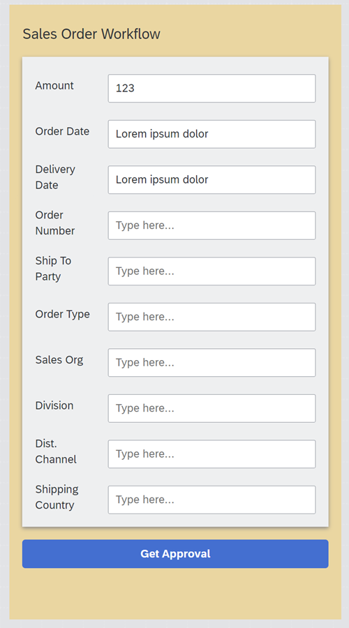


### A few important UI concepts

Before you begin, we want to help you understand how apps are developed with SAP Build Apps.

Every app is built on a UI canvas – the canvas is the background of the app. On the canvas, you drag and drop components: text fields, input boxes, toggle bars, images and many other components you want the user to interact with.


Every component has properties, for example: the text to display, the value of the input box and so forth. You select the component and then its properties appear in the **Properties** pane to the right.


Each property is bound to something, for example:

- **Static text** -- in the screenshot, the button component's **Label** property is bound to the static text **Button**

- **Variable** -- whose value can be updated elsewhere, for example in response to user action

- **Data from an SAP backend**
  
- **Formula**

- **Output of flow function in logic**

For the property, you click the binding button ...


... and then select from a menu of binding types.


Finally, for every component there are events, for example, when a user taps a button or enters data in an input box. You can capture these events and then perform an action – like display a dialog, create data in a backend, change the value of variables and much more.

This is done on the logic canvas. Select a component (or no component if you want to capture app events), and then open the logic canvas.


You then drag and drop flow functions and connect them to events. The flow functions are executed whenever that event occurs. And, of course, each flow function has its own properties to bind 😺.


### Create a new app project
1. Go to the SAP Build lobby, and click **Create**.

    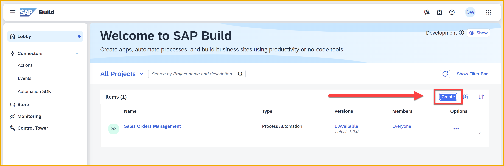

2. Select **Build an Application**.

    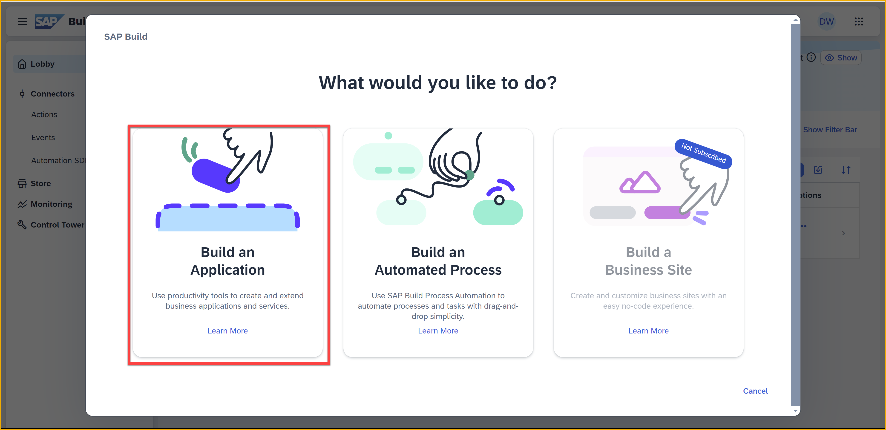   

    Select **SAP Build Apps**.

    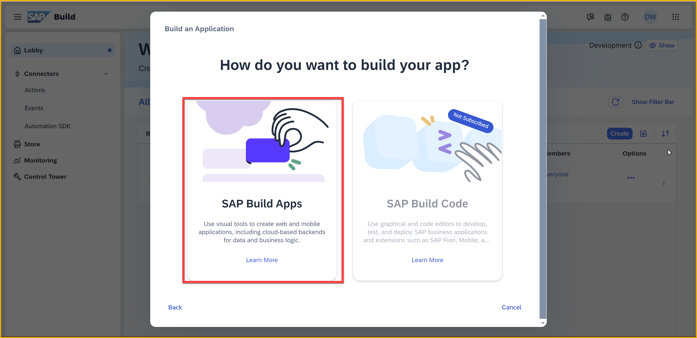   

    Select **Web & Mobile Application**.

    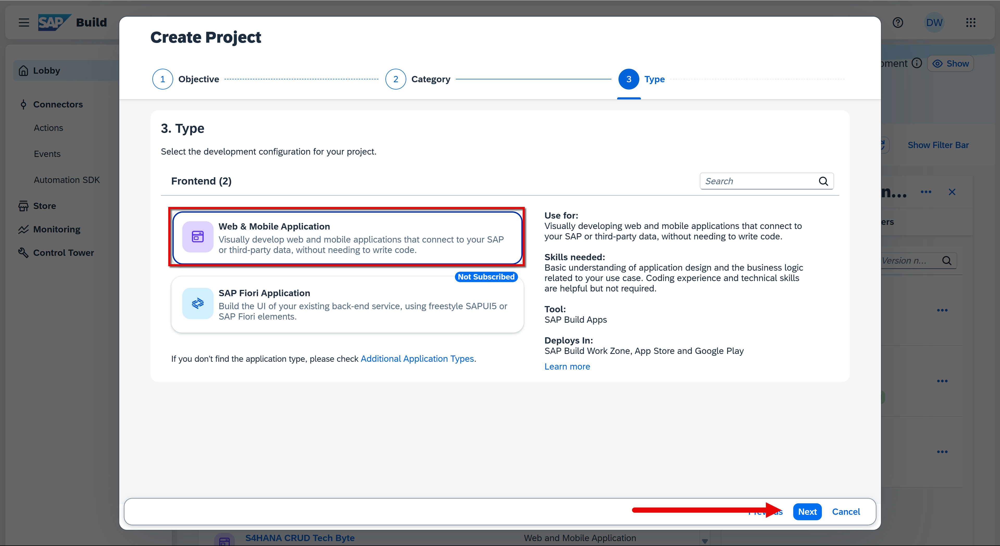

3. For the project name, enter `Create Sales Order`.
   
    For the description, enter `Application to enable business users to request creation of a sales order`.
   
    Click **Create**.
  
    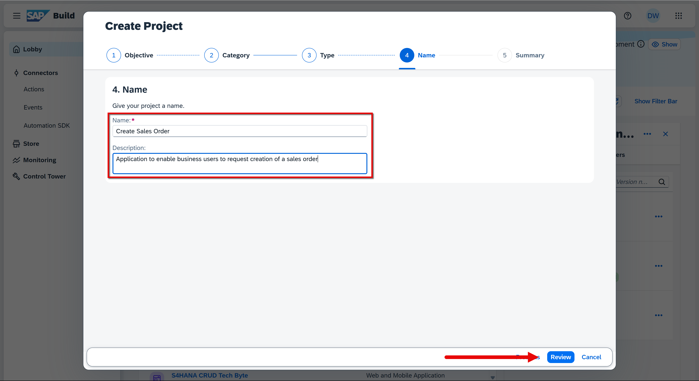

    Your new project should open in a new browser tab.
   
    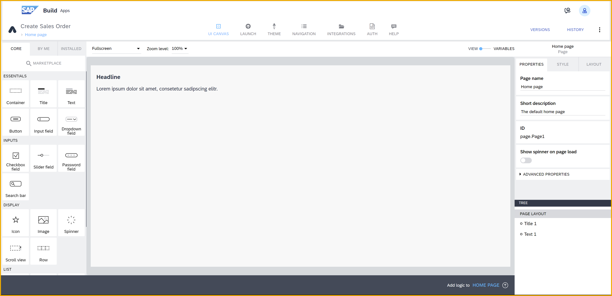


### Create the sales order page
By default your new application contains a page with title and text fields. In this step, you will focus on turning this page into your app – by adding components like input boxes and buttons, and then styling them. 

This is known as creating the user interface, also known as the UI.

>Note that there are 2 tabs for this tutorial step (above). 
>
>- With **Quick Import of UI**, you can skip most of the work and simply import our skeleton project. You will bypass the nitty gritty of adding and stylizing components, but you will learn how to import one SAP Build Apps project into an existing project. This way is much faster.

>- With **Create from Scratch**, you can create the UI yourself. This will take longer but you will learn about UI components, stylizing them, and organizing them on the page.


[OPTION BEGIN [Quick Import of UI]]

We really want you to see some of things related to stylizing you can do with SAP Build Apps. But we understand that stylizing a UI may be tedious for some people.

If you really want, you can skip doing the stylizing and instead import the project already stylized. If you want to take this route, do the following:

1. Download the file [`Sales-Order-Trigger.zip.gpg`](https://github.com/sap-tutorials/sap-build-apps/raw/main/tutorials/build-apps-workflow-trigger/Sales-Order-Trigger.zip.gpg).

2. Click the 3 dots next to **History** in the upper-right corner.

    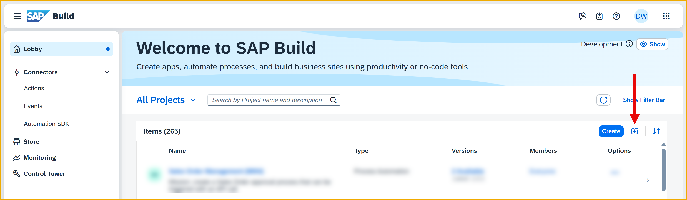

3. Select **Replace**.

4. Select the file you downloaded.

5. Click **Replace**

    The project will be filled in with the UI for entering a sales order.

    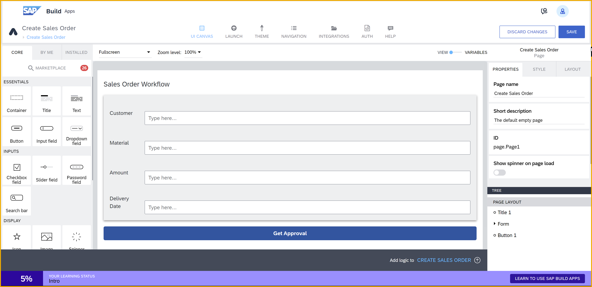

[OPTION END]


[OPTION BEGIN [Create from Scratch]]

1. Select the text field, and delete it.

    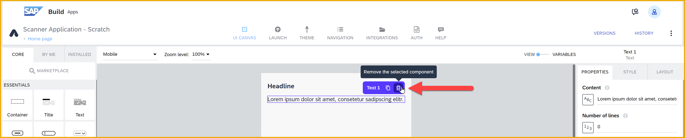

2. Click on an open area (this brings up the **Properties** tab for the app instead of for a specific component), and in the **Properties** tab, change the **Page name** to `Create Sales Order`.

    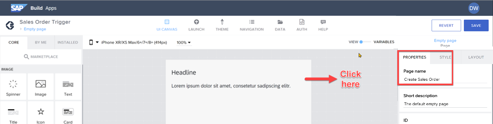

3. Double-click the title field, and change the text to `Sales Order Workflow`.

    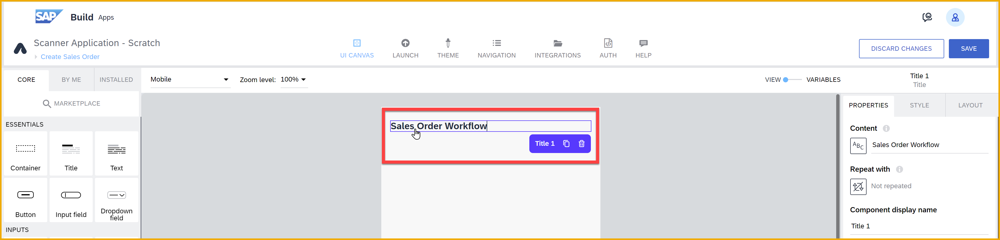

4. To the canvas, drag a container component. 

    >Container components let you group components and configure the collection of the components as a single unit.

    With the container selected, change its name to `Form`.

    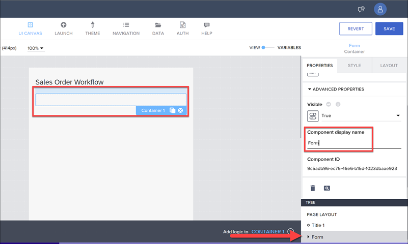

    Still with the container selected, open the **Style** tab, click the dropdown icon for the Layout Container, and click **Edit**. 

    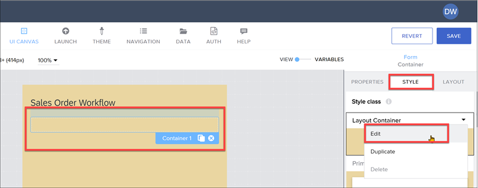

    - For the background color, under **Universal Background Colors**, select **Level 4 background**.

    - For padding, set the padding on all 4 sides to 16px by clicking each rectangle, going to **Theme**, and selecting the **L** size.

        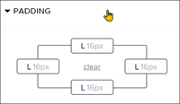

    - For **Effects**, create a shadow by setting these properties:

        | Field | Value |
        |-------|----------|
        | **Enable Shadow**    | True   |
        | **Shadow size**    | Content Shadow 0   |
        | **Shadow color**    | `#8e8989`<div>&nbsp;</div>Click the **X**, and then select **Static color**. You can then copy and paste in the color code, or use the color picker to choose a color. |

    - Let's save the style by scrolling up in the **Style** tab, clicking **New Style**, entering `Layout Form Container`, and clicking **OK**. 

        

    This saves the new style in the **Style** tab.

5. Into this container ( **Form** ), drag in another container.
   
    >It may be easier to drag it into the **Tree** view on the lower right, so you can put it precisely where you want. The **Tree** makes it easier to select specific components and to create a hierarchy of components on the page.

    Inside the new container add a text and input field. The result should look like this:

    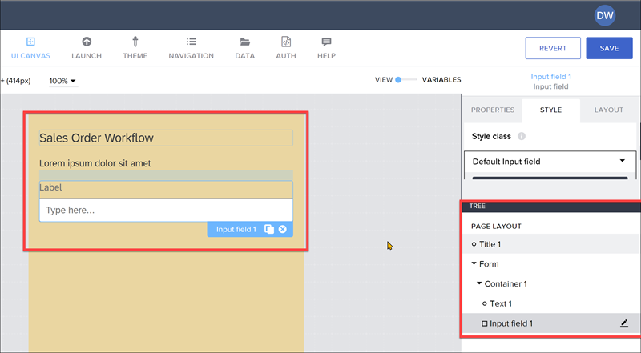

    Select the new, inner container ( **Container1** from the **Tree** view), go to **Layout** tab, and under **Layout** set the container to **Horizontal**. Then, set **Align components** to middle.

    
    
    Select the text field, go to the **Layout** tab, then **Width and Height**, and set the width to exactly 75px.

    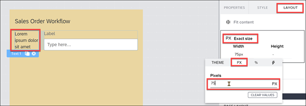
    
    Select the input field, and in the **Properties** tab, delete `Label` from the **Label** property.  

    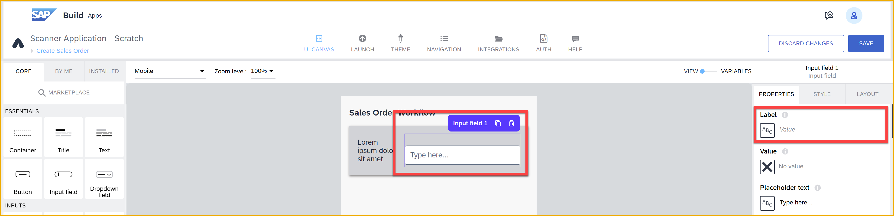

6. From the **Tree** view, select the inside container ( **Container1** ).

    
 
    Duplicate the container by clicking on the **Duplicate** icon.
   
    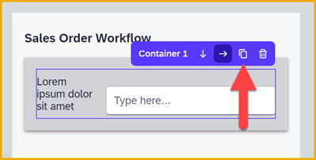
 
    Repeat this 2 more times, until you have 4 fields.

    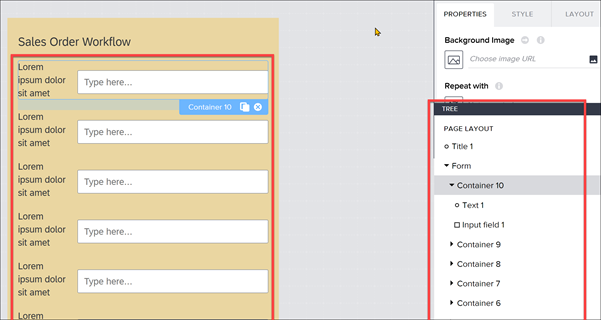

7.  Click on each field label and change it to the following field names, in this order:

    | Fields | 
    |-------|
    | Customer    | 
    | Material    | 
    | Amount    | 
    | Delivery Date    | 

    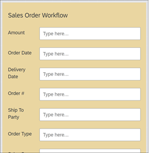

8.  At the bottom of the page (outside the outside container), add a button.

    In the **Properties** tab, set the **Label** to `Get Approval`.

    

9. Click **Save** (upper right).

[OPTION END]


### Enable SAP BTP authentication
You need to enable SAP BTP authentication because you want to use SAP BTP destinations, and users need to be authenticated to use them.

SAP BTP destinations are connections to backend services – each specifies the location of a backend and how the user will be authenticated. The destinations can be used by the various services within SAP BTP, including SAP Build Apps.  

SAP BTP authentication also has the benefit of requiring authentication in your app and reusing the built-in SAP BTP authentication mechanism.

1. Go to the **Auth** tab.

2. Click **Enable Authentication**.

    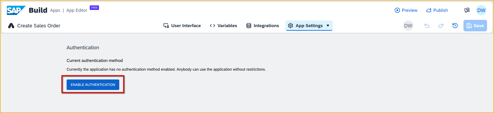

3. Select **SAP BTP Authentication**.

    On the confirmation popup, click **OK**. 

4. Click **Save** on the upper right corner.


### Create data resource to process
When you created your process and then deployed, you also published it so it can be discoverable by SAP Build Apps. You will now tell your project to use this process.

1. Open the **Integrations** tab, at the top of the page.

2. Click **Add Integration**.
   
    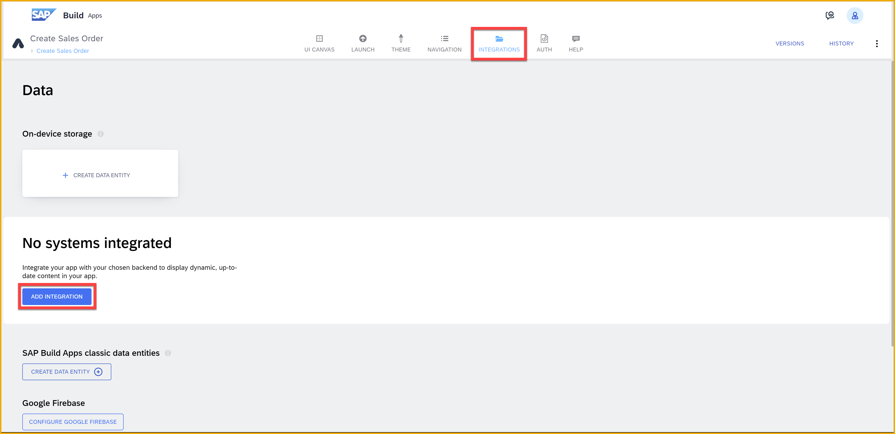

3. Click **Library**.

    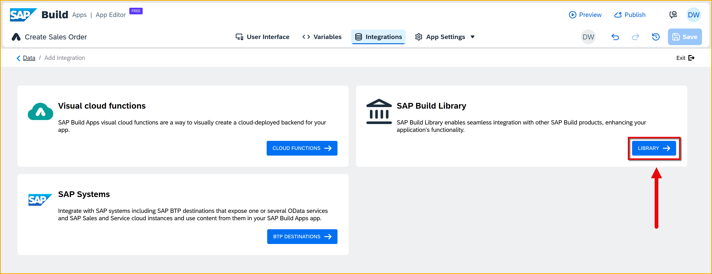

4. You can see each process you (or a colleague) published, plus that process's project name. 
   
    Click the process you published, **Order Processing**.  
   
    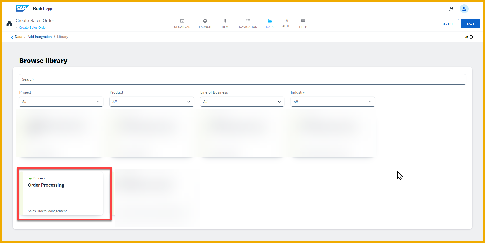
 
    >If you are unable to see the process here, please ensure that Step 6 of [Run the Sales Order Business Process](spa-academy-run-salesorderprocess) is complete.
 
5. Click **Enable process**.

    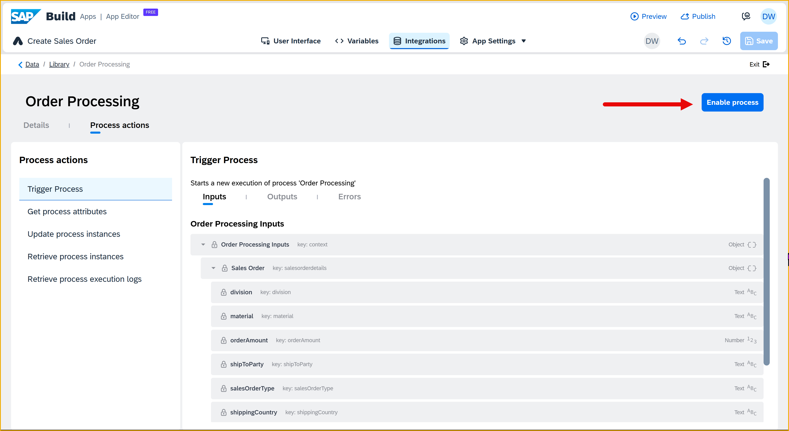

6. Click **Save** (upper right).


### Create page variable
You need a place to put the values the user will enter, so that you can later pass them to the process. For this, you can create a page variable.

1. Back on the UI canvas (click the **UI Canvas** tab at the top), select **Variables**.

2. On the left, click **Page Variables**.

    >If you get a big text box saying **Welcome to Variables**, you can read it but then you can close it by clicking the **X**.

    >
   
3. Click **Add Page Variable**. 

    Change the name of the variable to **SalesOrderDetails**.

    Make the variable of type **Object**.

    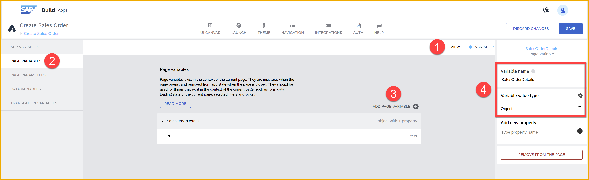

4. Select the **id** field of the page variable, and click **Remove Object Property**.

    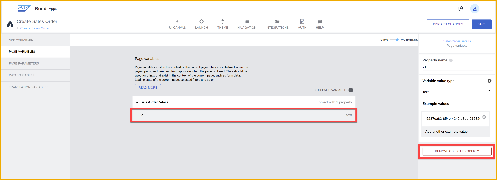

5. Select the page variable, and under **Add new property** enter `amount`, and then press **Enter** or click the **+** icon.
    
    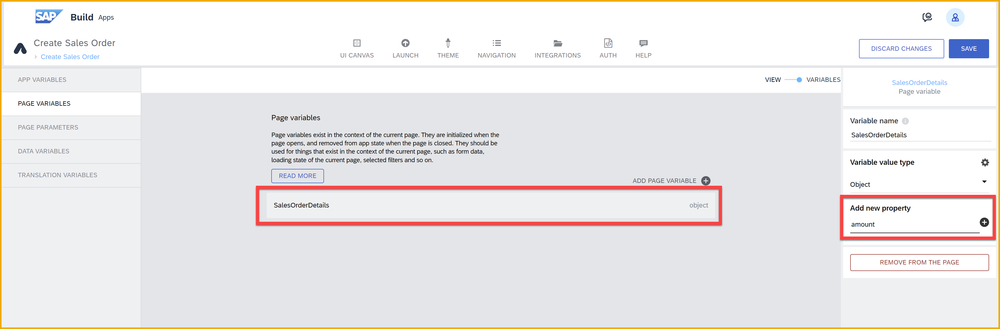

    Do this for all the needed fields:

    | Name | Type |
    |-----|------|
    | amount | Number |
    | customer | Text |
    | deliverydate | Date text |
    | material | Text |

    Your variable should look like this, with all fields of type text:

    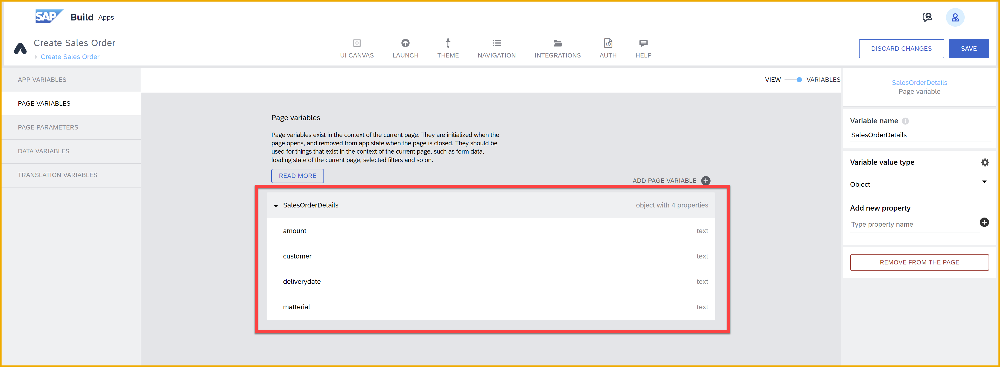

6. Select **amount** and change its type to **Number**.
    
    Select **deliverydate** and change its type to **Date text**.
    
    Your variable should look like this:

    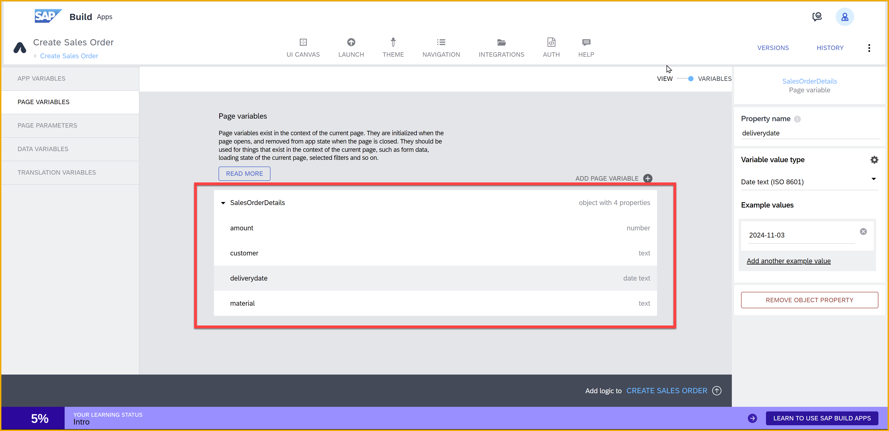

5. Click **Save** (upper right).


### Bind page variable to UI elements
We created a variable for the sales order data, but now we need to get the data entered by the user into the variable. We do this by binding the variable to UI elements, specifically, to the input boxes.

Whenever someone types into the input box, the value is automatically copied into the variable.


1. Go back to **View** so you can see the UI canvas.
   
2. Click on the first input field (for **Customer**).

    In the **Properties** tab, click the **X** next to the **Value** field, and select **Data and Variables > Page Variables > SalesOrderDetails > customer**.

    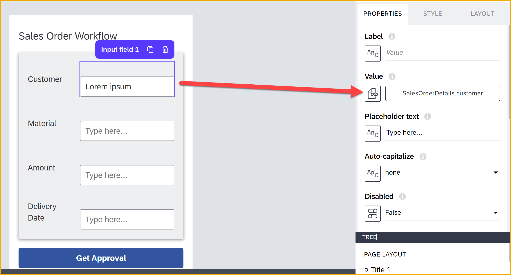

    Click **Save**

3. Click on the second input field (for **Material**).

    In the **Properties** tab, click the **X** next to the **Value** field, and select **Data and Variables > Page Variables > SalesOrderDetails > material**.

    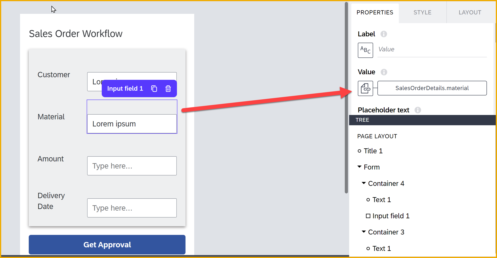

    Click **Save**

4. Click on the third input field (for **Amount**).

    In the **Properties** tab, click the **X** next to the **Value** field, and select **Data and Variables > Page Variables > SalesOrderDetails > amount**.

    Click **Save**

5. Click on the fourth input field (for **Delivery Date**).

    In the **Properties** tab, click the **X** next to the **Value** field, and select **Data and Variables > Page Variables > SalesOrderDetails > deliverydate**.

    Click **Save**

6. Click **Save** (upper right).


### Add logic to trigger workflow
We need to set up the logic so when someone clicks the **Get Approval** button (an event), we send the sales order data to our SAP Build Process Automation workflow using the data resource we previously created. 

1. Click on the **Get Approval** button, and open the logic canvas by clicking **Add logic to Button1** at the bottom right.

    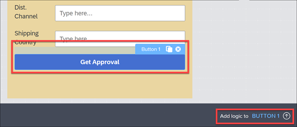

2. Drag a **Trigger Process** flow function onto the canvas, and connect the component tap event to it.
   
    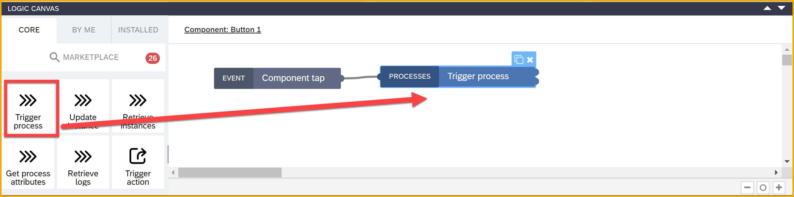

3. Click on the **Trigger Process** flow function and configure it in the **Properties** pane on the right.

    For **Process**, this should already be set to **Order Processing**, since you have only one process enabled.

    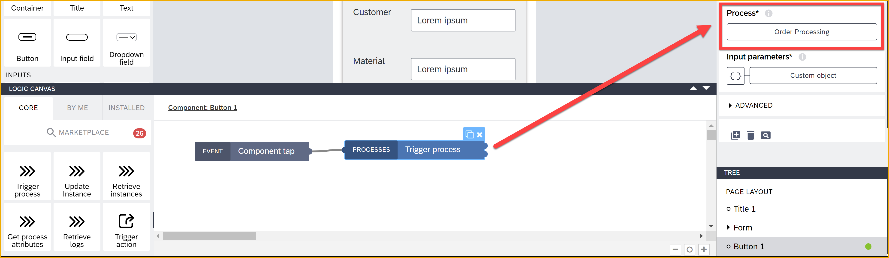
    
    For **Input Parameters**, click **Custom object**. Here you could create all kinds of separate bindings for each of the fields from our process. But we will use a formula instead to make it easier.

   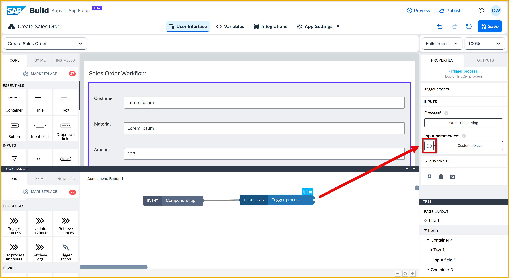    

    Click the **X** to close the dialog.

4. Under **Input Parameters**, click the binding type.
   
    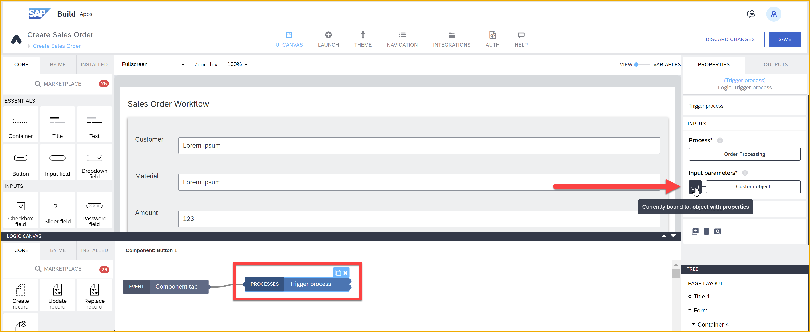

    Select **Formula**.

    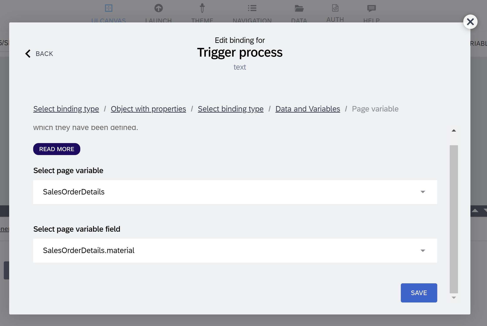

    Enter the following formula:
    
    ```JavaScript
    {salesorderdetails: {division: "1010", material: pageVars.SalesOrderDetails.material, orderAmount: NUMBER(pageVars.SalesOrderDetails.amount), shipToParty: pageVars.SalesOrderDetails.customer, salesOrderType: "OR", shippingCountry: "Barbados", salesOrganisation: "10", distributionChannel: "1000", expectedDeliveryDate: pageVars.SalesOrderDetails.deliverydate}}
    ```

    Click **Save**.

5. Drag a **Toast** flow function onto the canvas, and connect the **top** output of the **Trigger process** flow function to it.

    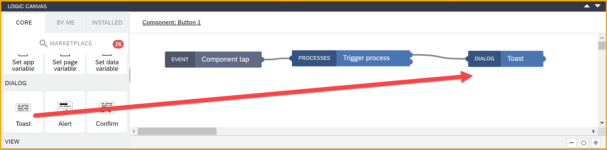

6. Click on the **Toast** flow function and configure it in the **Properties** pane on the right.

    For **Toast message**, click on the **ABC**, and then select **Formula > Formula**.

    

    Erase the quotation marks, and enter the following formula:

    ```JavaScript
    "Triggered process with ID: " + outputs["Trigger process"].newProcessInstance.id
    ```

    Click **Save**.

7. Click **Save** (upper right).


### Run app
1. Click the **Launch** tab, and then **Open Preview Portal**.

    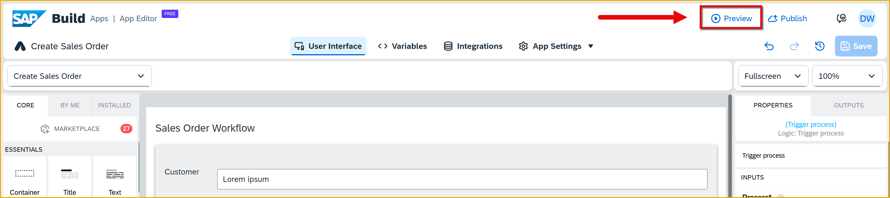

3. Click **Open web preview** (left).

4. Select your project, **Select Order Trigger**.

    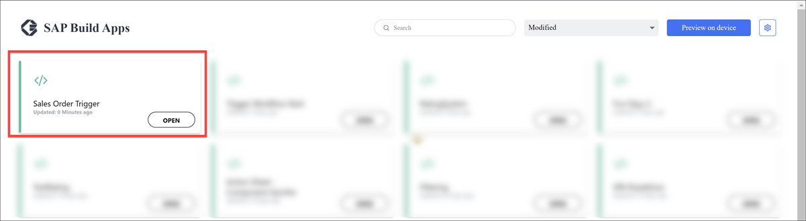

5. Enter the following values in your form:

    | Field | Value |
    |-------|-------|
    | Customer | `Joe's Bikes` |
    | Material | `HT-1000` |
    | Amount  | `100000` |
    | Delivery Date  | `2023-03-31` |

6. Click **Get Approval**. 

Your process should be triggered and require approval (since the amount is 100,000 or above).

You should see the toast message indicating the workflow was triggered, and with the process instance ID.

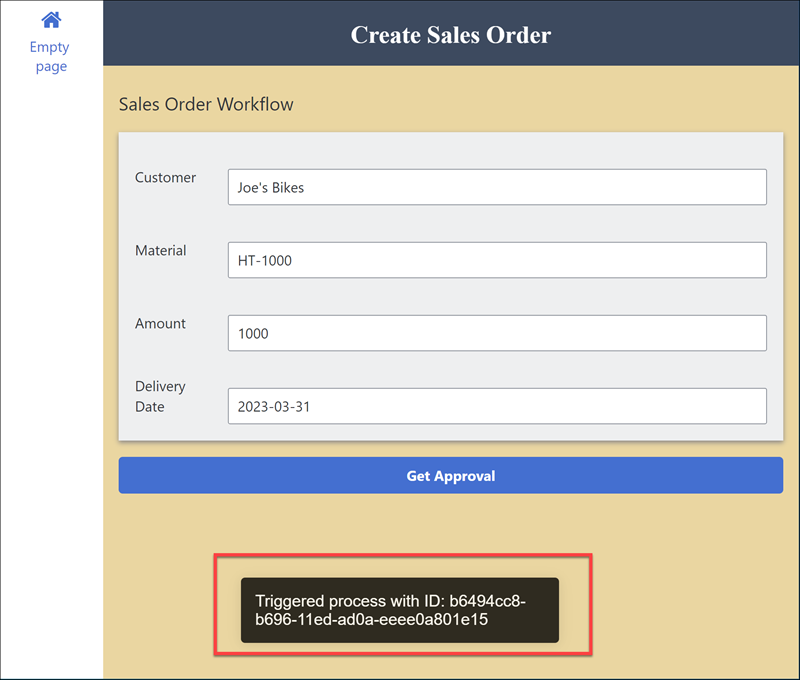

You can also see the results of the call in SAP Build Process Automation.

Go to the **Monitoring** tab from the lobby, then under **Monitor** section, access the **Process and Workflow Instances** tile. The first one should be the one you just triggered.

- You can see the new process instance.
  
- You can see the process ID is the same as in the toast message in the app.
  
- You can see the context, which is the values sent when triggering the process (4 of them, in yellow, you entered in the input fields and the others were hardcoded in the formula for the **Trigger Process** flow function).
  
- You can also see the execution log, which shows that the process was automatically approved and stopped when it sent a notification, which needs to be acknowledged.If you expand the approval step you can see more information, including who the approval request was sent to.

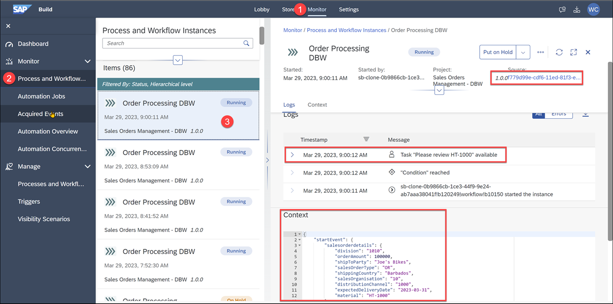


