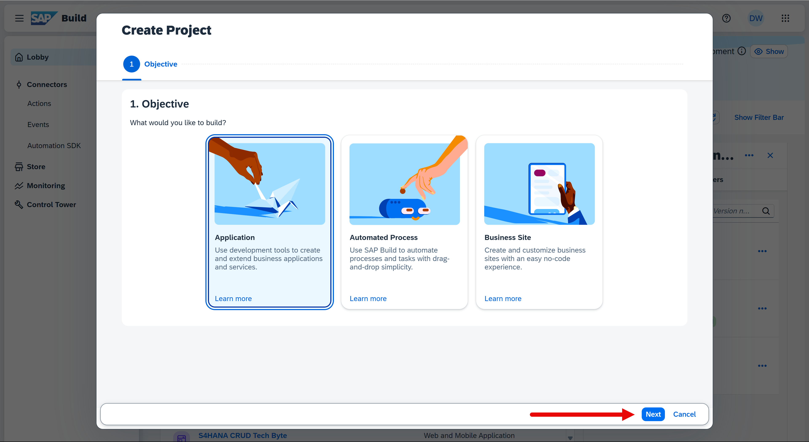
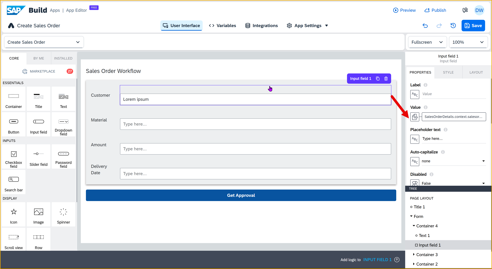
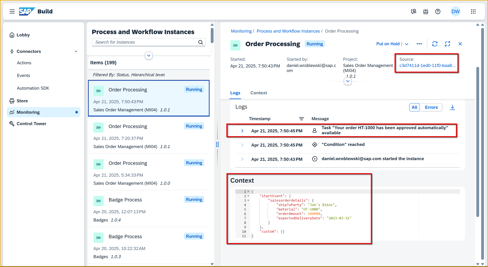

  

# Create SAP Build App to Trigger Workflow
<!-- description --> Trigger a workflow created in SAP Build Process Automation from an app created with SAP build Apps.

## Prerequisites
- You have set up SAP Build App and have entered the lobby.
- You have set up SAP Process Automation, and created the process described in the tutorial group [Create a Sales Order Process and Enable Triggering Via API](https://developers.sap.com/group.sap-build-apps-process-trigger-enable.html).
  - You will have to know the `definitionId` for the process you created.
- You have set up the destination to SAP Build Process Automation, as described in [Create Destination to Trigger Process from any Service](https://developers.sap.com/tutorials/spa-create-service-instance-destination.html).
  - You will have to know the name of the destination.


## You will learn
- How to create a simple UI
- How to create a form
- How to stylize your UI
- How to trigger from your app a workflow in SAP Build Process Automation


## Intro
This tutorial shows you how to use SAP Build Apps to create and stylize a simple, one-page app that triggers an SAP Build Process Automation workflow.

Specifically, the app lets the user enter sales order details and then send these to a process for approval, before the sales would be automatically created in S/4HANA Cloud.

Your app will look something like this:


&nbsp;

>**Before You Begin:** You will need:
>
>- The name of the SAP BTP destination to your SAP Build Process Automation instance (for workshops, this will be done for you). The destination **MUST** be configured with the URL of the entire path of the SAP Build Process Automation [Workflow Instances API](https://api.sap.com/api/SPA_Workflow_Runtime/resource).
>
>- The `definitionId` for your specific workflow, which you can find within your trigger in SAP Build Process Automation project. You can get this by going to your triggers in the Deployed version of your project, and clicking **View**.

>    


---

### Create a new app project
Go to the SAP Build lobby, and click **Create**.


Select **Build an Application**.

   

Select **Web & Mobile Application**.


For the project name, enter `Sales Order Trigger`, then click **Create**.
  


### Create the sales order page
By default your new application contains a page with title and text fields. In this step, you will focus on turning this page into your app, including how to build a UI and stylize the UI elements.

>Note that there are 2 tabs for this step. 
>
>- You can do the first tab, **Basic steps**, which we recommend and which will teach you about UI components, stylizing them, and organizing them on the page.
>
>- You can instead do the second tab, **Import Project**, which will bypass the nitty gritty of adding and stylizing components, and instead teach you how to import an SAP Build Apps project into an existing project. This way is much faster.
 

[OPTION BEGIN [Basic steps]]

1. Select the text field, and click the **X** to delete it.

    

2. Click on an open area, and in the **Properties** tab, change the **Page name** to `Create Sales Order`.

    
   
3. Select the **Style** tab.
   
    
   
    Click the **Background color** color (App Background), and then select **New Palette**.

    
    
    For the color, enter `#F3D6A0`, name the color `SAP Orange Light`, and click **Save**.

4. Click the title field, and in the **Properties** tab change the **Content** text to `Sales Order Workflow`.

    

5. To the canvas, drag a Container component. 

    With the container selected, in the **Properties** tab under **Advanced Properties**, change the **Component display name** to `Form`.

    

    Still with the container selected, open the **Style** tab, and click **Edit** for the Layout Container. 

    

    - For the background color, select **Level 4 background**.

    - For padding, set the padding on all 4 sides to 16px by going to **Theme** and selecting the **L** size.

        

    - For **Effects**, create a shadow by setting these properties:

        | Field | Value |
        |-------|----------|
        | **Enable Shadow**    | True   |
        | **Shadow**    | Content Shadow 0   |
        | **Color**    | Any static color you like (I chose #8e8989)   |

    - Let's save the style by scrolling up, clicking **New Style**, entering `Layout Form Container`, and clicking **OK**. 


6. Inside the outer container, add another container, and inside that container add a text and input field. The result should look like this:

    

    For the inner container, go to **Layout** tab, and under **Layout** set the container to **Horizontal**. Then, set **Align components** to middle.

    
    
    For the text field, go to **Layout** tab and set the width to exactly 75px.

    
    
    For the input field, delete `Label` from the **Label** property.  

7. From the **Tree** view, copy the inside container and paste it inside the outer ( **Form** ) container until you have 4 fields. 

    

8. Click on each field label and change it to the following field names, in this order:

    | Fields | 
    |-------|
    | Ship To Party    | 
    | Material    | 
    | Order Amount    | 
    | Delivery Date    | 

    

9. At the bottom of the page (outside the outside container), add a button.

    In the **Properties** tab, set the **Label** to `Get Approval`.

    

[OPTION END]

[OPTION BEGIN [Import Project]]

Sometimes, stylizing a UI is tedious. But we want you to see some of things you can do with SAP Build Apps.

If you really want you can skip this step, do the following:

1. Download the file [`Sales-Order-Trigger.zip.gpg`](https://github.com/sap-tutorials/sap-build-apps/raw/main/tutorials/build-apps-workflow-trigger/Sales-Order-Trigger.zip.gpg).

2. Click the 3 dots next to **History** in the upper-right corner.

     

3. Select **Replace**.

4. Select the file you downloaded.

5. Click **Replace**

Click **Done** and you can go to the next step.

[OPTION END]


### Enable SAP BTP authentication
You need to enable SAP BTP authentication since you want to use SAP BTP destinations.

1. Go to the **Auth** tab.

2. Click **Enable Authentication**.

    

3. Select **SAP BTP Authentication**.

    On the confirmation popup, click **OK**. 


### Create data resource to SAP Build Process Automation
As part of setting up SAP Build Process Automation, you created a destination so you can make calls to the SAP Build Process Automation APIs, including the one that lets you trigger a workflow.

Now you will set up the connection from your app to SAP Build Process Automation on your tenant, using that destination.

1. Open the **Data** tab, at the top of the page.

2. Scroll down, and click **Create Data Entity > SAP BTP Destination REST API Integration**.

    

    The configuration screen appears, starting with the **Base** panel.

3. On the **Base** panel, enter the following:

    | Field                | Value                                         |
    | -------------------- | --------------------------------------------- |
    | Data resource name   | `Trigger Workflow`                             |
    | BTP destination name | `sap-process-destination` (or the destination you created, if you created your own) |

    

    Under **Resource schema**, click **Add New** and add a field of type ***Object*** and with the name `salesorderdetails`.

    Click on the new field, and add the following sub-fields to the object:

    

    >**IMPORTANT:** Click on the **Add New** button **BELOW** the `salesorderdetails` field.

    | Field Name           | Type   |
    | -------------------- | ------ |
    | **`ShipToParty`**          | ***Text***   |
    | **`Material`**             | ***Text***   |
    | **`OrderAmount`**          | ***Number*** |
    | **`ExpectedDeliveryDate`** | ***Text***   |
    | **`Division`**             | ***Text***   |
    | **`SalesOrderType`**       | ***Text***   |
    | **`ShippingCountry`**      | ***Text***   |
    | **`SalesOrganisation`**    | ***Text***   |
    | **`DistributionChannel`**  | ***Text***   |


4. Click the **create** panel.

    Then enable the create action with the toggle button.

    

    <br>

    

1. For **Request headers**, click the binding **X**, then **List of values**.

    Click **Add a value**, and add the following key-value pair:

    | Field            | Value              |
    | ---------------- | ------------------ |
    | **Header name**  | `Content-Type`     |
    | **Header value** | `application/json` |

    Click **Save**.

2. For **Request body mapper**, click the binding **X**, then **Formula > Create formula**.

    Enter the following for the formula -- replace `<your definition ID>` with the ID for your process:

    ```JavaScript
    ENCODE_JSON({  "definitionId": "<your definition ID>",  "context":  query.record })
    ```

    Click **Save** twice.

3. Click **Save Data Resource** (bottom right).

    Click **Save** (in the upper right to save all your changes to the project).


### Test the trigger

1. Open the data resource again by clicking it.
   
    

2. Click **create** on the left, and then the **Test** tab.

3. Enter values for the fields (really, you only need to enter an order amount), and then scroll down and click **Run Test**.

    >**IMPORTANT:** Date fields must be in the format of `2022-12-25` and the order amount must be a number.

    


If all works OK, you will get a **201** status code and a response with information about the process instance you just triggered, something like this:

```JavaScript
{
  "id": "54988e48-8056-11ed-9a13-eeee0a99244a",
  "definitionId": "us10.my-account.salesorderapprovals.orderProcessing",
  "definitionVersion": "6",
  "subject": "Order Processing",
  "status": "RUNNING",
  "businessKey": "54988e48-8056-11ed-9a13-eeee0a99244a",
  "parentInstanceId": null,
  "rootInstanceId": "11118e48-8056-11ed-9a13-eeee0a99244a",
  "applicationScope": "own",
  "projectId": "us10.my-account.salesorderapprovals",
  "projectVersion": "1.0.5",
  "startedAt": "2022-12-20T11:06:19.318Z",
  "startedBy": "sb-clone-41c25609-33a1-9999-97d8-34fcd2316008!b3591|workflow!b116",
  "completedAt": null
}
```


> **COMMON ISSUES**
>
>**404:** The API did not recognize the name of your process (i.e., `definitionId` in the request body mapper) or the path to the service is wrong -- both in the **create** tab.
>
>**415:** You did not send the `Content-Type` request header.
>
>**422:** This basically means that the API heard your call but it didn't like something in the request body.
>
>- The format of a field may be wrong, for example, text for a number field or an invalid date format (dates must be in this format: `2023-01-31`). 
>
>**500:** This may mean that your URLs are wrong, especially, you may have the wrong URL for OAuth authentication, such as you forget to add the path `/oauth/token`.
>
>Note that fields names are case sensitive. This will not cause an error in the API call, but the values will not be passed to the workflow properly and you will not see the values in the workflow forms.

If you've gotten to here, your integration with SAP Build Process Automation is working!!

You can go into the SAP Build Process Automation monitoring and see there the process you just triggered, and check the context to make sure the parameters were sent properly.


You can also check the Inbox to see the forms were created and the values properly passed into the workflow.


### Create data variable
1. Back on the UI canvas, select **Variables**.

2. On the left, click **Data Variables**.
   
3. Click **Add Data Variable**, and choose **Trigger Workflow** as the data resource on which to base the data variable.

    >The schema of the data variable will be the same as the data resource.

    

4. On the right, choose **New data record**.

    

5. Click **Save** (upper right).


### Bind data variable to UI elements
1. Go back to **View** so you can see the UI canvas.
2. Click on the first input field (for **Customer**).

    In the **Properties** tab, click the **X** next to the **Value** field, and select **Data and Variables > Data Variables > Trigger Workflow1 > shipToParty**.

    

    Click **Save**

3. Click on the second input field (for **Material**).

    In the **Properties** tab, click the **X** next to the **Value** field, and select **Data and Variables > Data Variables > Trigger Workflow1 > material**.

    Click **Save**

4. Click on the third input field (for **Amount**).

    In the **Properties** tab, click the **X** next to the **Value** field, and select **Data and Variables > Data Variables > Trigger Workflow1 > orderAmount**.

    Click **Save**

5. Click on the fourth input field (for **Delivery Date**).

    In the **Properties** tab, click the **X** next to the **Value** field, and select **Data and Variables > Data Variables > Trigger Workflow1 > expectedDeliveryDate**.

    Click **Save**

6. Click **Save** (upper right).


### Add logic to trigger workflow
1. Click on the **Get Approval** button, and open the logic canvas by clicking **Add logic to Button1** at the bottom right.

    

2. Drag a **Create record** flow function onto the canvas, and connect the component tap event to it.
   
    

3. Click on the **Create record** flow function and configure it in the **Properties** pane on the right.

    For **Resource name**, this should already be set to **Trigger Workflow**, since you have only one data resource.

    
    
    For **Record**, you have to bind each of the data variable fields to the appropriate record field. 

    There are many ways to do binding. For **Record**, you will use a formula. Click on the object binding button:
    
     
    
    Click **Formula**, then click on the existing formula, and replace it with the following:
   
    ```JavaScript
    {salesorderdetails: {division: "1010", orderAmount: NUMBER(data["Trigger Workflow1"].salesorderdetails.orderAmount), shipToParty: data["Trigger Workflow1"].salesorderdetails.shipToParty, salesOrderType: "OR", shippingCountry: "Barbados", salesOrganisation: "10", distributionChannel: "1000", expectedDeliveryDate: data["Trigger Workflow1"].salesorderdetails.expectedDeliveryDate, material: data["Trigger Workflow1"].salesorderdetails.material}}
    ```

    Click **Save**.
    
    >**What does the formula do?**
    >
    >The 4 main fields we want to send should already be in our data variable, since we bound it to the input boxes. But we need to:
    >
    >- Send values for some other fields.
    >- Format the number value for the order amount.
    >- Set the order date to today.
    >
    >You can do all this field by field -- using the **Object with properties** binding -- but to save time we gave you the formula.
    >
    >If you want to explore, open the binding for the **Record** field and select **Object with properties** and you can see the UI where you can set each field by hand.
    
  


5. Drag a **Toast** flow function onto the canvas, and connect the **top** output of the **Create record** flow function to it.

    

6. Click on the **Toast** flow function and configure it in the **Properties** pane on the right.

    For **Toast message**, click on the **ABC**, and then select **Formula > Formula**.

    Erase the quotation marks, and enter the following formula:

    ```JavaScript
    "Triggered process with ID: " + outputs["Create record"].response.id
    ```

    Click **Save**.

7. Click **Save** (upper right).


### Run app
1. Click the **Launch** tab, and then **Open Preview Portal**.

    

3. Click **Open web preview** (left).

4. Select your project, **Select Order Trigger**.

    

5. Enter the following values in your form:

    | Field | Value |
    |-------|-------|
    | Customer | `Joe's Bikes` |
    | Material | `HT-1000` |
    | Amount  | `1000` |
    | Delivery Date  | `2023-03-31` |

    For the remaining fields, enter what you'd like.

6. Click **Get Approval**.

You process should be triggered and require approval (since the amount is 1000 or above).

You should see the toast message indicating the workflow was triggered, and with the process instance ID.


You can also see the results of the call in SAP Build Process Automation.

Go to the **Monitor** tab, then **Process and Workflow Instances**. The first one should be the one you just triggered.

- You can see the new process instance.
- You can see the context, which is the values sent with the API.
- You can also see the execution log, which in this case ran the auto-approve task because the amount was below 100000.

The context field in yellow are the ones that you entered via the UI.



You can also see that the process instance ID is the same: in the toast message and in the upper right of the Monitor tab.

