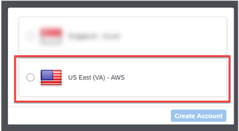

  

# Set Up Prerequisites for SAP Build CodeJam
<!-- description --> Get ready for your SAP Build CodeJam now!

## Prerequisites
- Do this before you come to CodeJam ⏱️
- Bring your laptop 💻
- Bring your device 📱
- Bring your brain 🧠
- Be ready to have FUN! 🤗

## You will learn
- How to set up the SAP BTP trial account
- How to set up SAP Build Apps
- How to set up SAP Process Automation
- How to get access to and create a destination for the SAP Gateway Demo System (ES5)

## Intro

### Create SAP BTP trial account
If you do not already have an SAP BTP Trial account, follow this tutorial: [Get a Free Account on SAP BTP Trial](https://developers.sap.com/tutorials/hcp-create-trial-account.html)

> **IMPORTANT:** For SAP Build and this CodeJam, create your SAP BTP trial account on the **US EAST (VA) - AWS** region.

>

<!-- border -->

### Install SAP Build Apps
To install SAP Build Apps on your SAP BTP trial account, watch and follow along with this video from **Daniel Wroblewski**.

<iframe width="560" height="315" src="https://www.youtube.com/embed/ZpQM2B1v2GY" frameborder="0" allowfullscreen></iframe> 

### Install SAP Build Process Automation
To install SAP Build Process Automation, watch and follow along with this video from **Daniel Wroblewski**. 

> STOP the video at **1:10 mins**. We do **NOT** want you to install Desktop Automation agent.

<iframe width="560" height="315" src="https://www.youtube.com/embed/2gB7ipo8TNY" frameborder="0" allowfullscreen></iframe> 

### Get ES5 account
Follow the tutorial [Create an account to the SAP Gateway Demo System (ES5)](https://developers.sap.com/tutorials/gateway-demo-signup.html).

<!-- border -->

### Create destination for ES5
Open the [SAP BTP Cockpit](https://account.hanatrial.ondemand.com/trial/#/home/trial) where you will create connectivity between SAP BTP and the SAP Gateway Demo system account.

1. Download the destination definition file [`ES5-Shop`](https://raw.githubusercontent.com/sap-tutorials/main/tutorials/codejam-0-prerequisites/ES5-Shop).

2. In the SAP BTP cockpit, click **Connectivity >  Destinations**.

    <!-- border -->
    

3. Click **Import Destination**, and then select the `ES5-Shop` file you downloaded.

    <!-- border -->
    

    The draft destination will be filled in except for your credentials.

    

4.  Enter your ES5 user and password.

    Click **Save**.

    >No need to test the connectivity because you will get a **401** error whether or not your credentials are correct. 

### Congratulations!
Congratulations, you are now ready for our **SAP Build CodeJam**. Have a safe journey and the SAP Advocates Team looks forward to seeing you on the day of your event.

Make sure you keep watching your specific **CodeJam event page** [here](https://groups.community.sap.com/t5/sap-codejam/eb-p/codejam-events).
