  

# Set Up Prerequisites for SAP Build CodeJam
<!-- description --> Get ready for your SAP Build CodeJam now!

## Prerequisites
- Do this before you come to CodeJam ⏱️
- Bring your laptop 💻
- Bring your device 📱
- Be ready to have FUN! 🤗

## You will learn
- How to set up the SAP BTP trial account
- How to set up SAP Build Apps
- How to set up SAP Process Automation
- How to get access to and create a destination for the SAP Gateway Demo System (ES5)

## Intro

### Create SAP BTP trial account
>**IMPORTANT:** For SAP Build and this CodeJam, you must have an SAP BTP trial account on the **US EAST (VA) - AWS** region.

>

If you already have an SAP BTP trial account in the  **US EAST (VA) - AWS** region, you can skip this step.

If you already have an SAP ID but not an SAP BTP trial account, you can go directly to [https://account.hanatrial.ondemand.com/trial](https://account.hanatrial.ondemand.com/trial) and create an SAP BTP trial account. 

If you do not already have an SAP ID, follow this tutorial: [Get a Free Account on SAP BTP Trial](https://developers.sap.com/tutorials/hcp-create-trial-account.html)

<!-- border -->
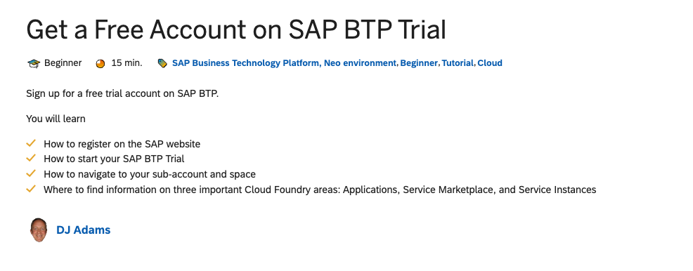

When you are done, you can get to your trial account by going to [https://account.hanatrial.ondemand.com/](https://account.hanatrial.ondemand.com/).

### Install SAP Build Apps
Here is video from **Daniel Wroblewski** showing how to install SAP Build Apps.

<iframe width="560" height="315" src="https://www.youtube.com/embed/ZpQM2B1v2GY" frameborder="0" allowfullscreen></iframe> 

If you prefer, here are the step-by-step instructions.

1. Go to the trial account (not the subaccount). Your screen will look something like this:

    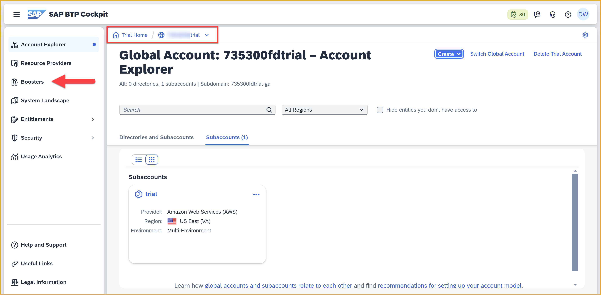

2. From the left-side menu, click **Boosters**.

    Search for the `SAP Build Apps`, and then click the tile for the **Get Started with SAP Build Apps - Detailed Account Setup**.

    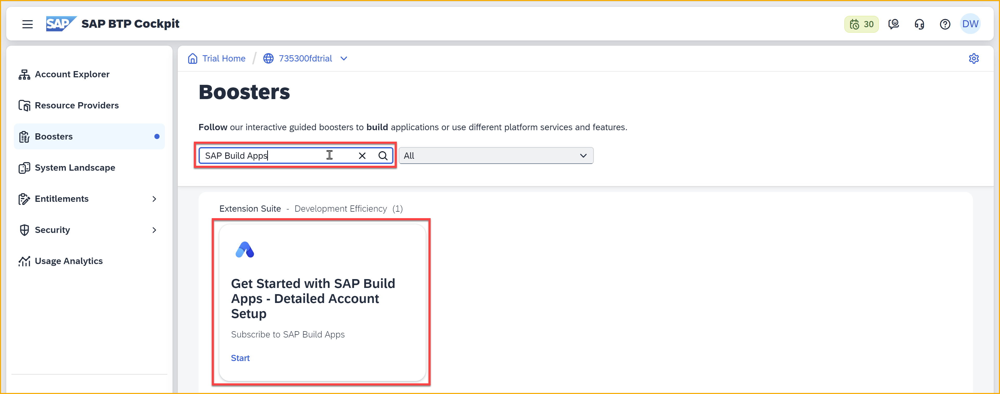

    Click **Start**.

    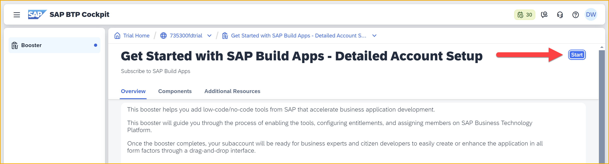

3. After the system checks prerequisites, click **Next**.

    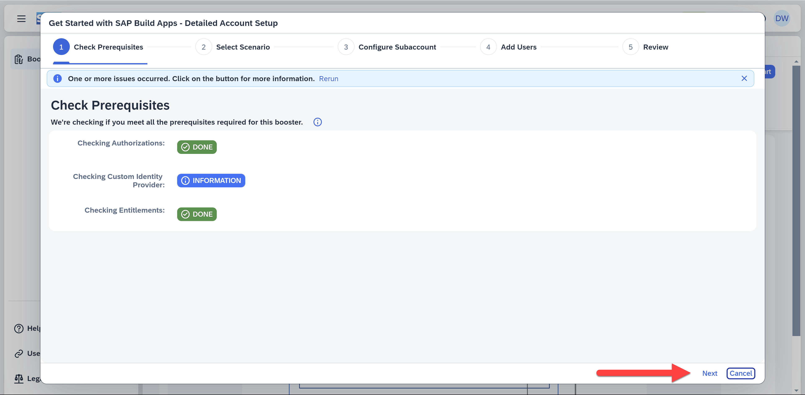

    Choose **Select Subaccount**, and click **Next**.

    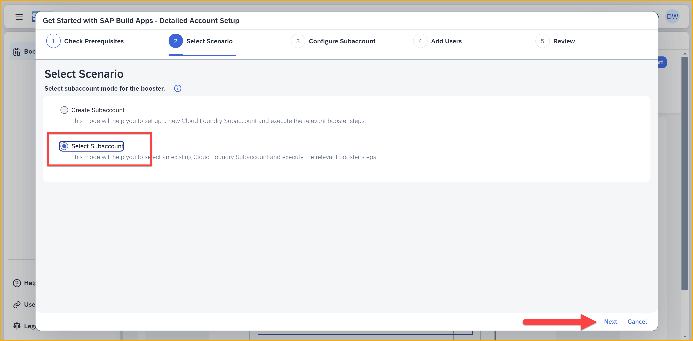

    >Your trial account can have only one subaccount, so you must use the existing one.

    On the **Configure Subaccount** page, just click **Next**.

    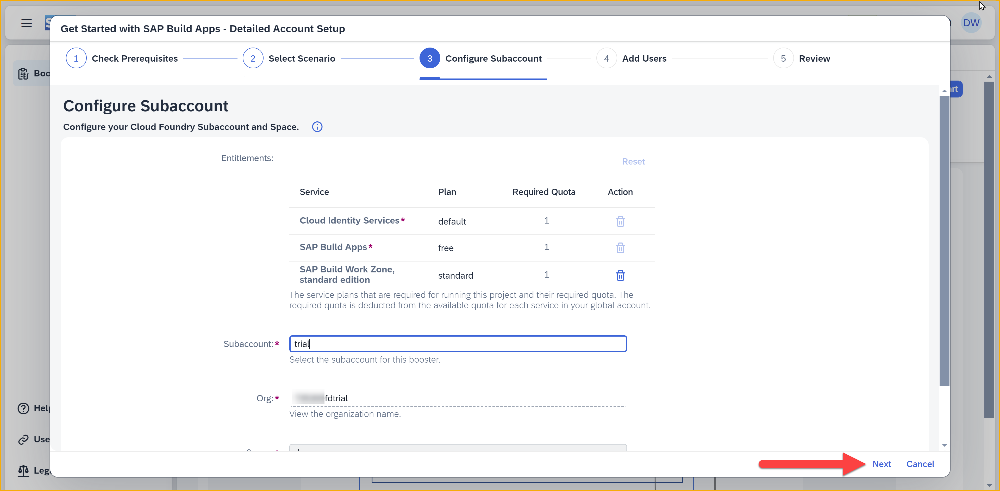
    
    On the **Add Users** page, just click **Next**.

    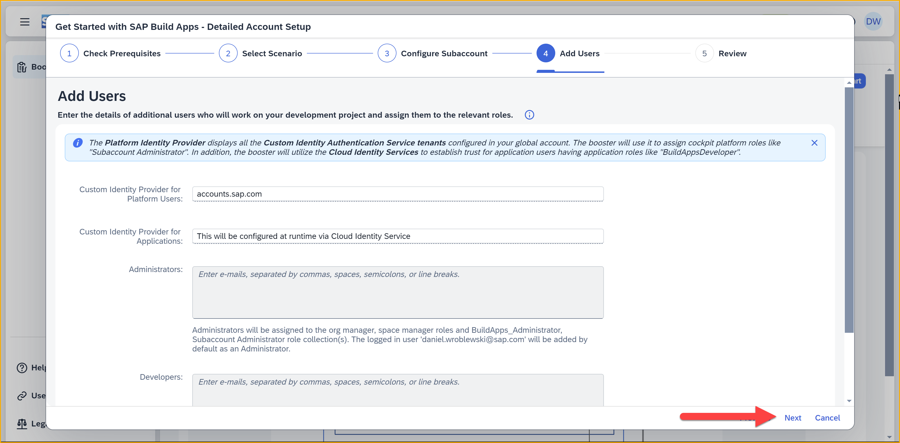

    On the **Review** page, click **Finish**.

    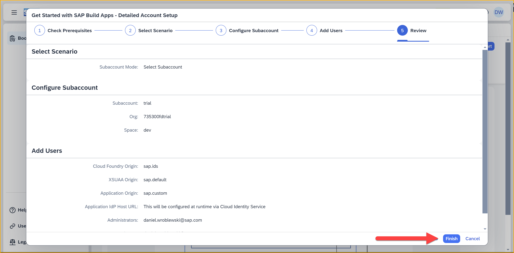

    The wizard will start to install all the needed components.

    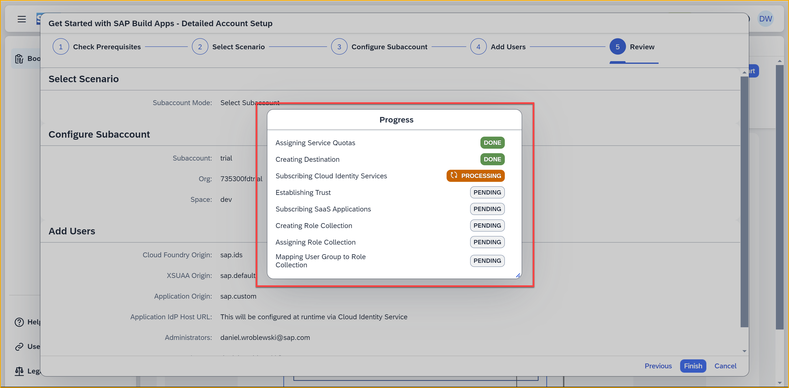

4. When the installation is complete, you will see the following. 
    
    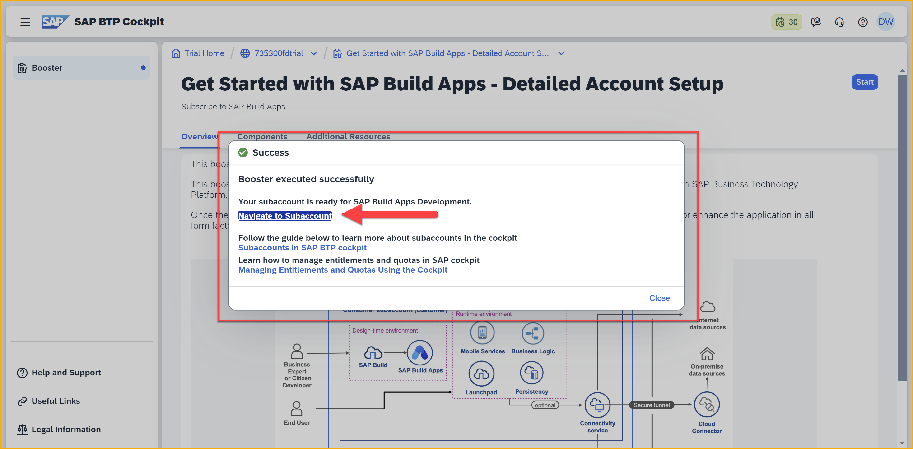
    
    Click **Navigate to Subaccount**, and then click **Instances and Subscriptions** to see that SAP Build Apps was installed.

    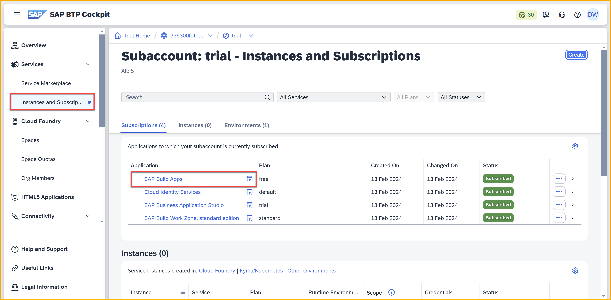

5. But SAP Build Apps must run on a custom identity provider – the part of SAP BTP that defines all the users. And though the custom identity provider and your user in it are automatically created for you, you must create a password for your user.

    An email has already been sent to the email you used to create your SAP BTP trial account.

    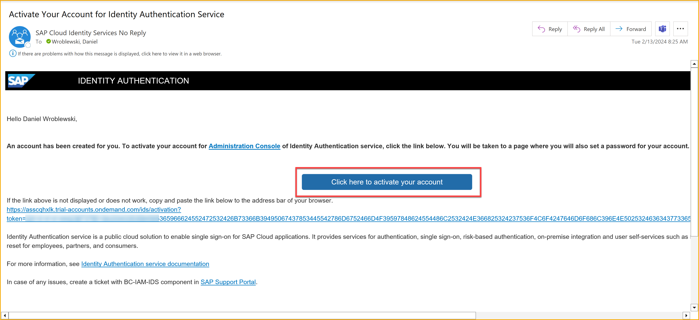

    Click the blue button **Click here to activate your account**.

5. Enter a password (twice), and click 

    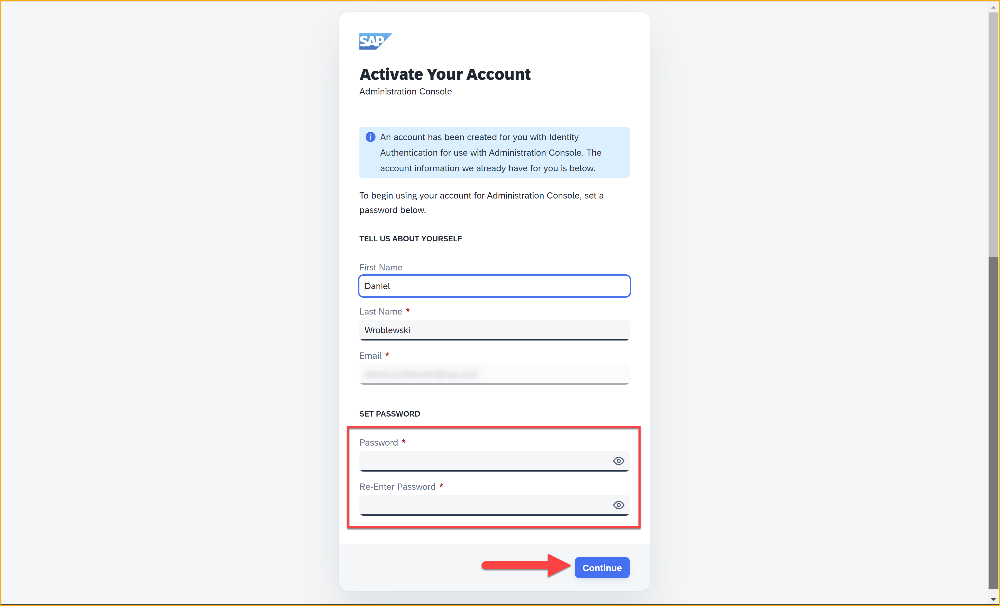

    Your account in the new custom identity provider is activated. 

    The admin screen for the custom identity provider opens. You will not need this and you can close the window.

If you want to test, go back to the **Instances and Subscriptions** screen (it should be open on your previous tab).

Click the icon next to SAP Build Apps. The SAP Build lobby will open up, empty. This indicates you are logged in with your custom identity provider user and all is working OK.

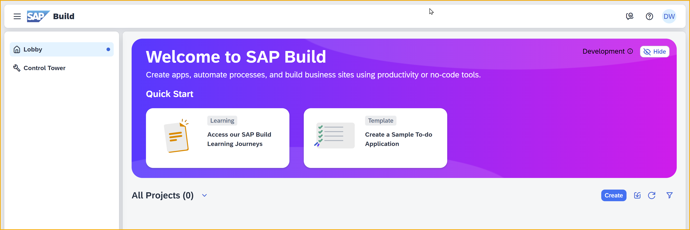

### Install SAP Build Process Automation
Here is video from **Daniel Wroblewski** showing how to install SAP Build Process Automation.

>STOP the video at **1:10 mins**. You do **NOT** have to install the Desktop Automation agent.

<iframe width="560" height="315" src="https://www.youtube.com/embed/2gB7ipo8TNY" frameborder="0" allowfullscreen></iframe> 

If you prefer, here are the step-by-step instructions.

1. In the **Instances and Subscriptions**, click **Create**. 

    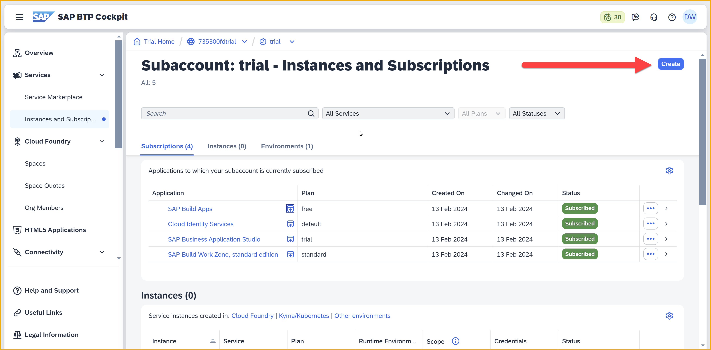

2. Set the following fields:

    | Field | Value|
    |-------|------|
    |  Service      | **SAP Build Process Automation**     |
    | Plan        |  **Standard**     |
    | Instance Name       | `spa-service`     |

    Click **Create**.

    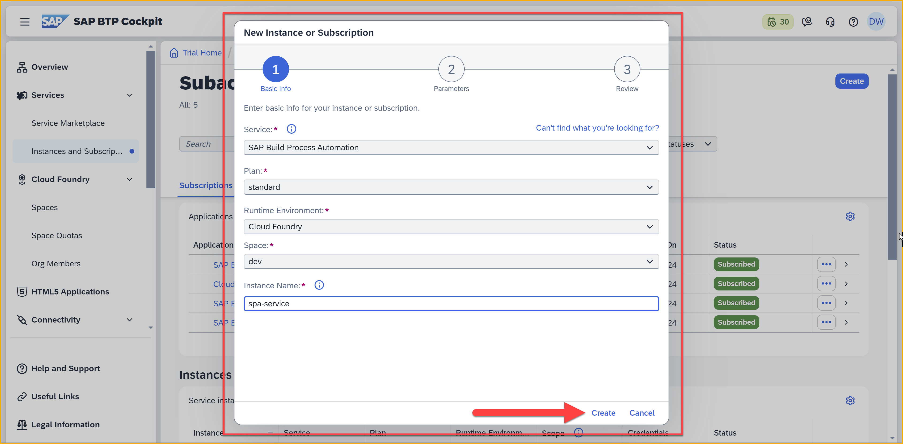

    The wizard will run and you will see **Creation in Progress** (the service appears under **Instances**).

    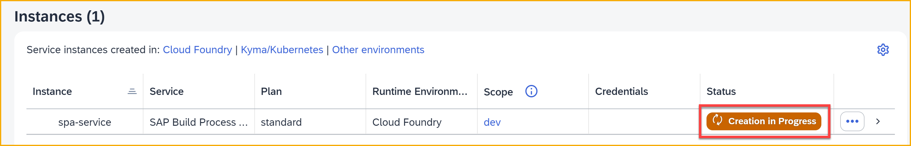

    After a few minutes, it will turn green to **Created**.
    
    

3. In the same **Instances and Subscriptions**, click **Create** again. 

4. Enter the following:

    | Field | Value|
    |-------|------|
    |  Service      | **SAP Build Process Automation**     |
    | Plan        |  **Free**     |

    Click **Create**.

    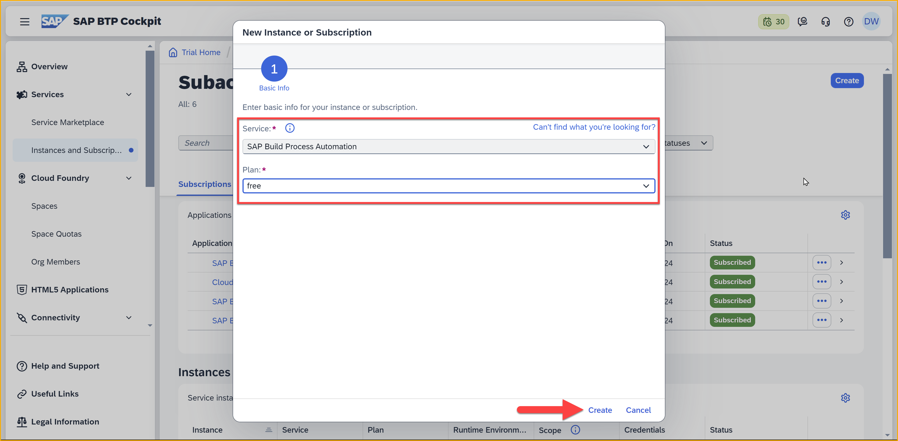

    The wizard will run and you will see **Processing**. 

    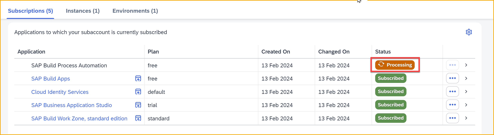

    >**IMPORTANT:** It may take as long as a half-hour to complete the subscription to SAP Build Process Automation. You can proceed to the next step in this tutorial and to the following tutorials, since they involve SAP Build Apps only.
    
    >**But when the subscription is complete,** remember to return to this step and finish it. 

    When complete, the status will turn green to **Subscribed**.

    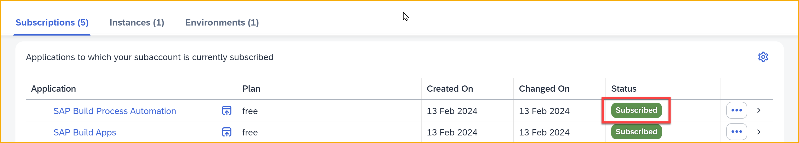

5. On the left-side menu, go to **Security > Users**.
   
    Select your user for the custom identity provider.

    >That's the user with your email and whose **Identity Provider** field says **Custom IAS tenant**.

    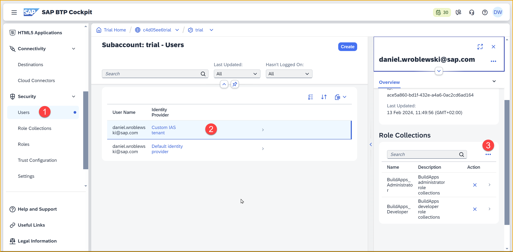

6. Once your user is selected, click the 3 dots under **Role Collections**.

    Select **Assign Role Collections**.

    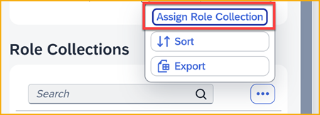

    In the dialog, enter `process` in the search box, select all the roles, and click **Assign Role Collection**.

    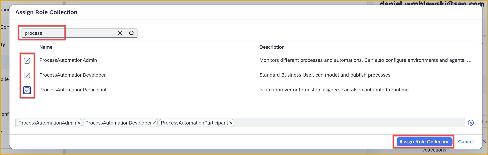

If you want to test, go back to the **Instances and Subscriptions** screen. Click the icon next to SAP Build Process Automation, which will open the SAP Build lobby.

Click on **Create** and try to create **Build an Automated Process > Business Process** project – if you can, this indicates you are logged in with your custom identity provider user and all is working OK.

### Get ES5 account
Follow the tutorial [Create an account to the SAP Gateway Demo System (ES5)](https://developers.sap.com/tutorials/gateway-demo-signup.html).

<!-- border -->
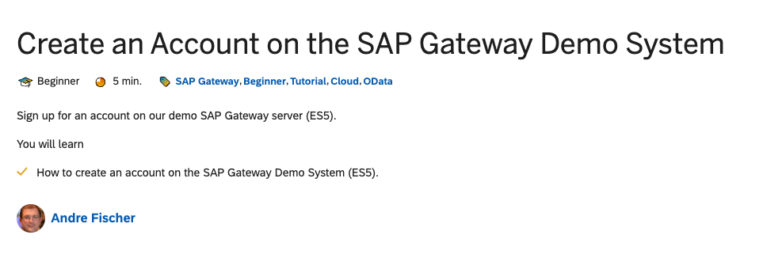

>ES5 is a publicly available demo system for SAP NetWeaver, which includes many of the services provided by typical SAP backends. We will use it to provide a list of products and images for our app, and mimic how an SAP Build Apps app would connect to an SAP backend. 

### Create destination for ES5
Open the [SAP BTP Cockpit](https://account.hanatrial.ondemand.com/trial/#/home/trial) where you will create connectivity between SAP BTP and the SAP Gateway Demo system account.

1. Download the destination definition.
   
    Click this [ES5-Shop](https://github.com/sap-tutorials/sap-build-apps/blob/main/tutorials/codejam-0-prerequisites/ES5-Shop) link to the GitHub download page for the destination, and then click the download button in the GitHub menu.

    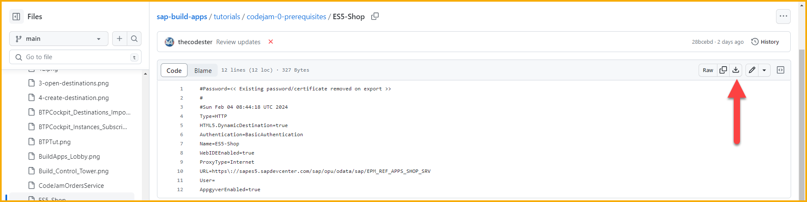

2. In the SAP BTP cockpit, click **Connectivity >  Destinations**.

    <!-- border -->
    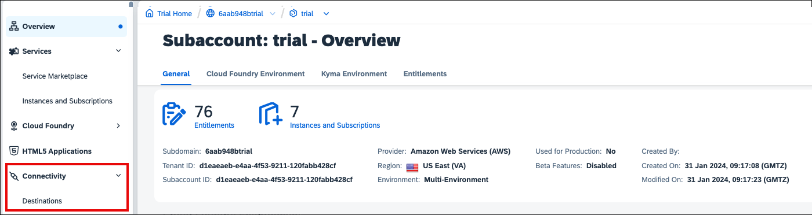

3. Click **Import Destination**, and then select the `ES5-Shop` file you downloaded.

    <!-- border -->
    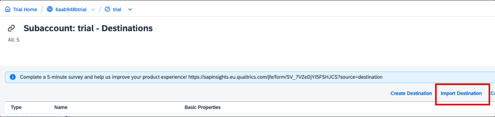

    The draft destination will be filled in except for your credentials.

    

4.  Enter your ES5 user and password.

    Click **Save**.

    You can test the destination and you should get a **200: OK** response.
    
    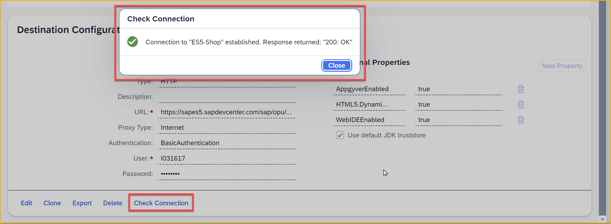

### Congratulations!
Congratulations, you are now ready for our **SAP Build CodeJam**. Have a safe journey and the SAP Advocates Team looks forward to seeing you on the day of your event.

Make sure you keep watching your specific **CodeJam event page** [here](https://groups.community.sap.com/t5/sap-codejam/eb-p/codejam-events).

>**IMPORTANT:** You do not need to continue until you arrive at your event.
