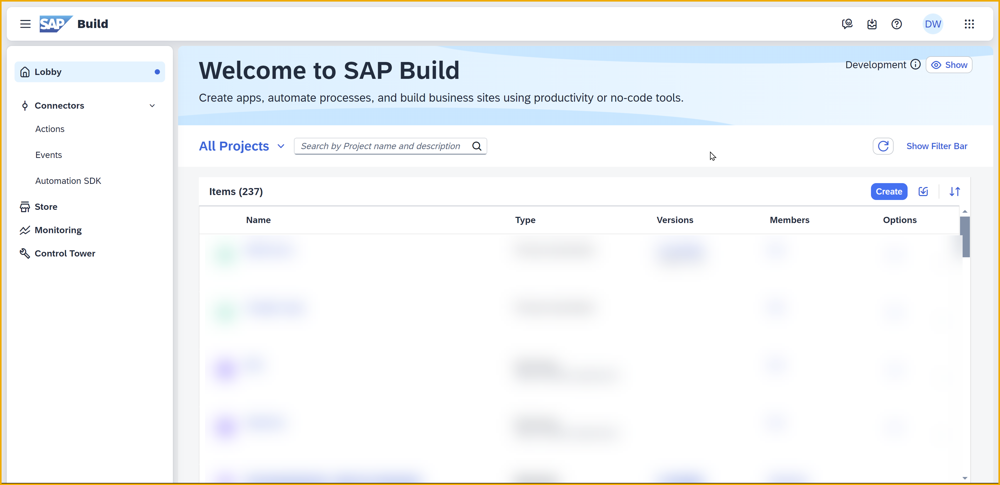
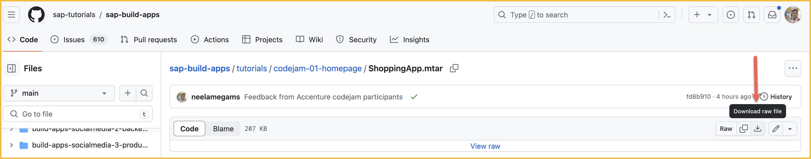
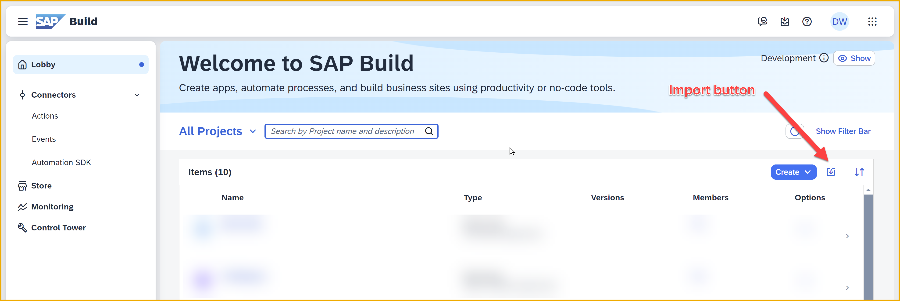
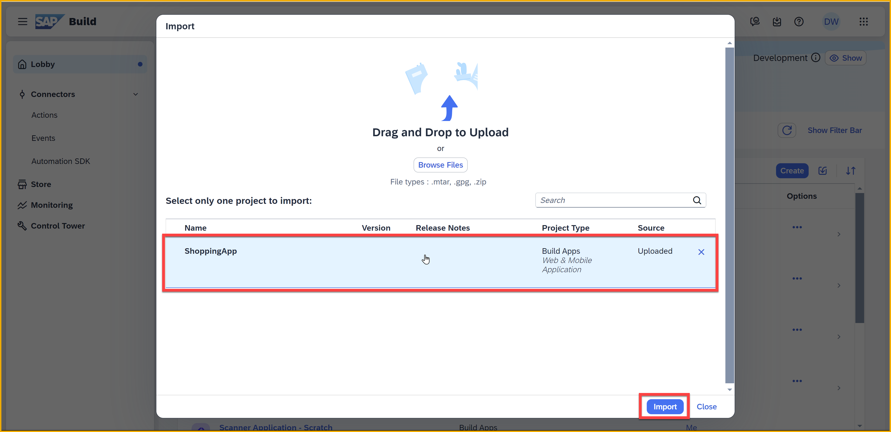
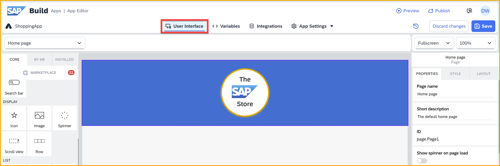
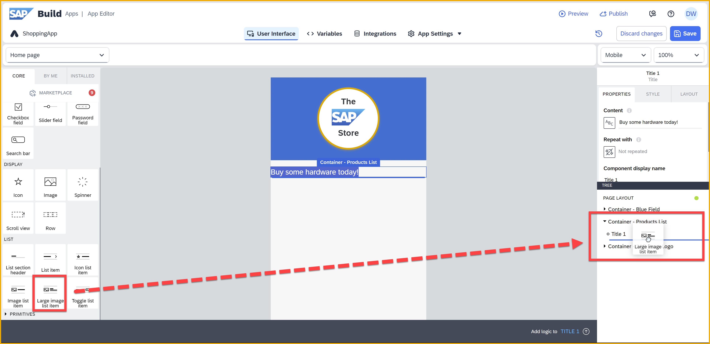
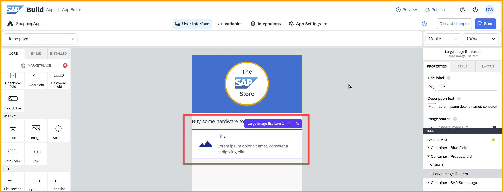
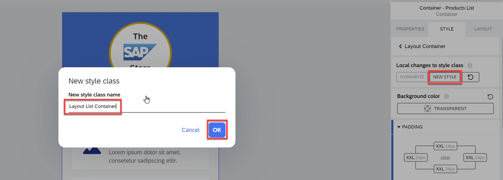
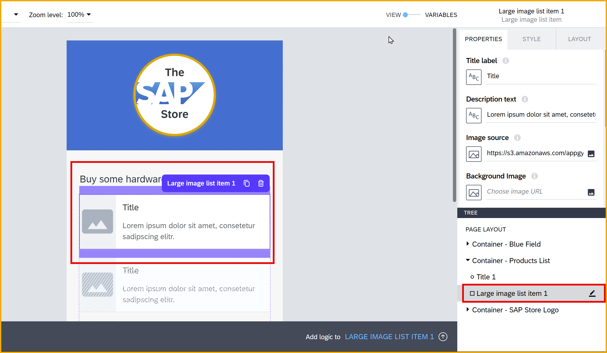
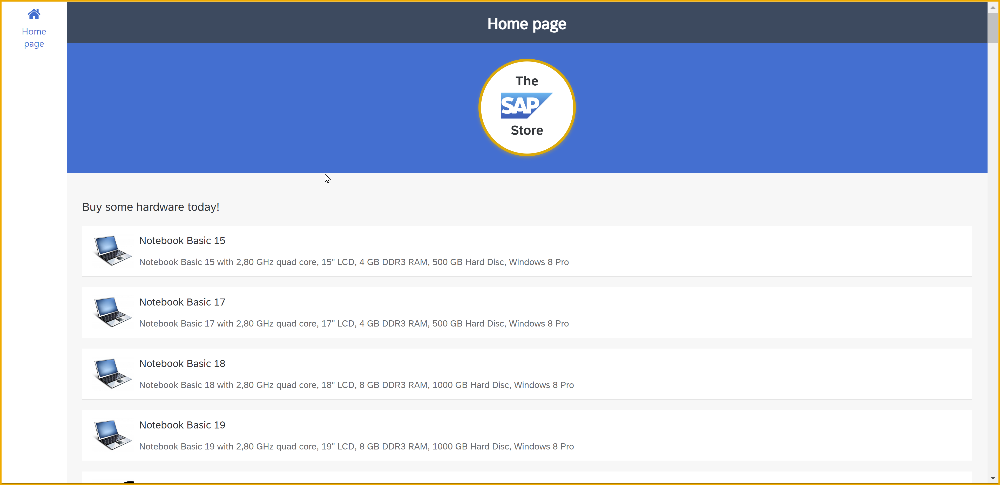

   
# 1 - Create the Product List Page
<!-- description --> Import a skeleton project for the SAP Build CodeJam, and create a simple product list page based on data in our CAP service.

 
## Prerequisites
- You have completed the previous tutorial for the SAP Build CodeJam, [Set Up Prerequisites for SAP Build CodeJam](codejam-0-prerequisites).

## You will learn
- How to create a new SAP Build Apps project
- How to import a project
- How to get data from a destination
- How to add components to a page
- How to bind data to UI elements
- How to change component styles
- How to preview your app

## Intro
In this exercise, you will be importing an already created skeleton app to your SAP Build Apps lobby. We've provided the skeleton app so you do not have to create all the UI elements for all the pages.

For this page, the product list page, you will design the entire UI, including styles and layout. For all pages, you will create the data connections, variables, logic, and navigation.

For this product list page, you will connect to our CAP service to get names, descriptions and images of products. At the end of this exercise, your homepage (product list page) will look something like this.

### Open the SAP Build lobby
If you already have the SAP Build lobby open from doing the prerequisites, you can skip this step.

Otherwise, here's how to open the lobby.

1. Go to your trial account at [https://account.hanatrial.ondemand.com/](https://account.hanatrial.ondemand.com/).

    Sign in if necessary

2. Click **Go To Your Trial Account**.

    

    This brings you to your "global" trial account.

3. Click your subaccount tile.

    

3. Click **Instances and Subscriptions**.

    

4. Click the icon next to **SAP Build Apps** or next to **SAP Build Process Automation**.

    

    Sign in with your custom IDP (identity provider) user you created when installing SAP Build Apps.

    This should open the SAP Build lobby. Yours should be empty.

    

  

### Import the skeleton app project

1. Download this skeleton project.

    Click [ShoppingApp.mtar](https://github.com/sap-tutorials/sap-build-apps/blob/main/tutorials/codejam-01-homepage/ShoppingApp.mtar), and then click the download button.

    

2. In the SAP Build lobby, click the **Import** button.

    

3. Click **Browse files** to select the project file you downloaded. After a few seconds, it will be uploaded.

    

    Select the file, and click **Import**.

    

    When complete, the project should be added to the lobby.

    In the **Import** dialog, click **Close**.
    
        
    
4. Click the project **ShoppingApp** to open it.

### Enable BTP Authentication
You need to enable SAP BTP authentication because you want to use SAP BTP destinations, and users need to be authenticated to use them.

SAP BTP destinations are connections to backend services – each specifies the location of a backend and how the user will be authenticated. The destinations can be used by the various services within SAP BTP, including SAP Build Apps.

1. With your new project open, go to **App Settings > Authentication**.

    

    Click **Enable Authentication**.

    

2. Select **SAP BTP Authentication**.

    
    
    Click **OK**.

3. Click **Save** (upper right).

    

### Enable a data entity
Since you have already performed the steps in the prerequisites tutorial, you should have a destination to our CAP service, including to the **Products** entity that returns a list of products.

Now you must create the connection between your app and our CAP service.

1. Open the **Integrations** tab.

    

    >You will see a warning since we created logic (to save you time) but we left it to you to create the data resources on which the logic is based. You can ignore the warnings.

    >

    Click **Add Integration**.
   
2. Click **BTP Destinations**.
    
    

3. Find the **CodeJamOrdersService** destination, and click it.

    

    This will show all the entities available in this service.

    

4. Click **Install Integration** (top right).
   
5. Select the **Products** entity (you can use the search at the top of the column), and click **Enable Data Entity**.

    

    You should see the entity as **Enabled**.

    

    You can also click on **Browse Real Data** to see the data inside the service entity.

    

6. Click **Save** (upper right).

    Click **Exit** (upper right) to return to the previous – **Integrations** – screen. 

    

    You should now see the **Products** entity in the **Integrations** tab.

    

### Create a data variable
Data variables are used for holding data from external data sources, such as SAP systems or third-party APIs. When created, they automatically come with their own logic canvas and with logic that retrieves the data –- you do not have to worry about this logic. 

You can "bind" the data in the variable with your UI components in order to display the data.  

1. Click **Variables**.

    >

    >If you get a big text box **Welcome to variables**, you can read it but then you can close it by clicking the X.

    >
    >
    >SAP Build Apps provides embedded help when and where you need it. But if it is too much for you, you can always turn it off by going to the **Help** tab, and checking the checkbox for turning it off.
    >
    >

2. Click **Data Variables** on the left.

    Then click **Add Data Variable**.
   
    

3. Choose the **Products** data resource.

    

    Keep the default selections shown on the right pane as it is -- with **Collection of data records** selected.

    

    >These settings determine the type of data variable (e.g., whether a collection of records or a single record), the default logic for retrieving data, and the filtering, pagination and other settings when retrieving data.

4. Click **Save** (upper right).
   

 

### Add container to the homepage
Containers are components that can hold other components, and let you configure the spacing, the background color and more. Containers give you a lot of flexible to make the UI the way you want.

1. Click **User Interface**.
   
    

    Since we want eventually our app o be a mobile app, let's change the form factor by clicking the UI size dropdown on the upper right, and selecting **Mobile**.

    

    The canvas should look like this.

    

2. From the **Core** tab of the left pane, under **Essentials**, drag a **Container** component onto the canvas.

    

3. With the container selected, double-click the component's name (in the canvas).
    
    

    Change the name of the component to `Container - Products List`.
    
    

    The names of components just help you manage the components and your project while you are building it. Users of your app will not be aware of them.
    
>The name of the component could have alternatively been renamed by changing it in the **Properties** tab, under **Component Display Name**.

### Add components to your container
1. Into your container, drag and drop a **Title** field. The result should look like this:

    

    >It may be easier to drag it into the **Tree** view on the lower right, so you can put it precisely where you want. The **Tree** view makes it easier to select specific components and to create a hierarchy of components on the page.

2. With the **Title** component selected, click the word **Headline** to select it. 

    

    Then copy and paste `Buy some hardware today!` to change the text.

    >You can also change the text in the **Properties** tab by changing the value of the **Content** property. You will have to use this method if the text is based on a formula or other binding not static text.

3. From the **Core > List** section (nearly at the bottom of the left-side components pane), drag a **Large image list item** into the **Container - Products List** container inside the **Tree View** (after the title component).

    

    Make sure both the title and list item are inside the container at the same level.
    
    The UI should look like this:

    

4. With the **Large Image List Item** selected, click the binding icon for the **Repeat** property.

    

    Click **Data and Variables**.

    

    Click **Data Variables**.

    

    Select your **Product1** data variable, and click **Save**.

    

    The UI should look like this with the component showing 3 times -- which shows that in runtime it will be repeated for the number items in your list. 

    

### Stylize the container
As an example of how to stylize a component, let's add space around our container.

1. From the **Tree** view (bottom right), select the container **Container - Products List** again.

    Open the **Style** tab from the right pane, click the dropdown icon for the **Layout Container**, and click **Edit**.

    

    >Each component has a default style, plus additional alternative built-in styles you can choose. In addition, you can make changes to the current style, which changes the style for the current instance of the component only.

    >If you want, you can update the default style with your changes so it affects all components ( **Overwrite** ), or you can save your changes to a new style ( **New Style** ). 

2. Expand the **Padding** settings. Here you can set the padding for all 4 directions.

    
    
    Set the padding on all 4 sides to 24px. For each rectangle:
    
    - Click the rectangle.
    
    - Go to the **Theme** tab.

    - Selecting the **XXL** size.
   
    

    You should be able to see some nice padding around the content.
    
    

3. Let’s save the style by scrolling up in the **Style** tab, clicking **New Style**, entering `Layout List Container`, and clicking **OK**. 

    This saves the new style in the **Style** tab and now can be used on other containers in your app.

    

4. Click **Save** (upper right).

### Bind data variable to UI elements
You created a data variable for the **Products** data, and the logic for retrieving the data was created automatically. Now you need to tell the app what to display.

To do this, you create bindings for your UI components, indicating what data you want to display in your component, whether from:

- Static values

- Calculated values

- Values from variables

- ... or other sources

>**How binding works**
>
>When you configure a UI component (or later a logic component called a "flow function"), generally you do this with binding.
>
>For most properties, there is a binding icon that indicates what type of binding is used. For example, you can use **static text** for a text field, or you can show text from a backend service and use a binding to a data variable. 
>
>In the example below, it shows an icon with **ABC**, meaning that this is static text that will not change.

> 

>If you want to change the binding type, just click the binding icon/square and you will be shown binding types that are valid for the current property.
>
>If you want to keep the binding type, but change the actual binding (e.g., the text to display), then update the field to the right of the binding icon.

1. Select the **Large image list item** on the canvas.
   
    

2. In the **Properties** tab, select each of the binding icons for the 3 properties we want to set.

    
    
    Set each property by clicking the binding icon and the setting the binding as follows:

    | Field | Binding |
    |-------|---------|
    | Title label | **Data item in repeat > current > Name** |
    | Description text | **Data item in repeat > current > Description** |
    | Image source (see note below) | Formula > `'https://ui5.sap.com/test-resources/sap/m/demokit/cart/webapp/localService/mockdata/images/' + repeated.current.ImageUrl` |

    >To set a formula, click on the default formula. 
    >
    >
    >
    >This opens the formula editor with the default formula loaded. Select all of the default formula, and replace with the formula we gave you.
    >
    >

    >The formula for the image may appear in red as an error, but it will still work. Go ahead and save it!
    >
    >One of the strengths of the formula editor is that it checks the data types of the properties you are setting to try to determine if the formula is compatible. Here, it is expecting a value defined as an image URL, but our text – which is a valid URL – will work just as well.

    Click **Save** in the formula editor.
    
3. Click **Save** (upper right).

>**What's with the repeat?**
>
>The **Repeat with** property lets you create multiple copies of a component by supplying a list – this will repeat the component based on the number of elements in your list, for example, the number of products in our list. The list can be hardcoded, or can be located in a variable (like in our case), or based on a formula.
>
>Once you set the **Repeat with** property, you then get the **Data item in repeat** binding option for the other properties in the component. You can now access values within each list item. So the data in the first item will be displayed in the first copy of the component, the data in the second item in the second copy of the component, and so on.

>

>That is what we did. We had a data variable as a list of product objects, repeated our component based on the number of products in the data variable, and then accessed individual fields (like the title and description) to be displayed in the component. 

### Test the App
1. At the top left, click **Preview**.

    

2. Click **Open web preview**.

    

    You will get a list of apps in your lobby – at this point you should have just one. 
    
    
    
    There is a search bar to help you find your app when you become a master and build dozens and dozens of apps.

3. Click the **ShoppingApp** tile.
   
    You should be able to view the list of products.
   
    

