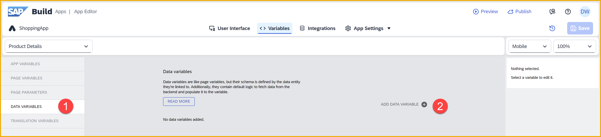
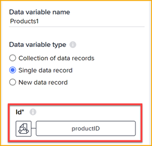
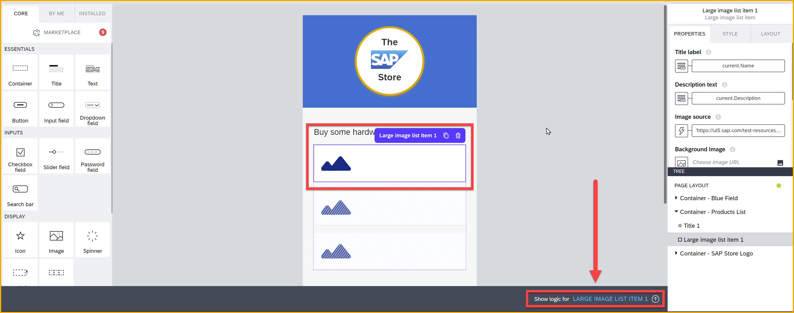

  

# 2 - Configure the Product Details Page
<!-- description --> Set up the product detail page – including variables, binding, styling, and logic – as part of the SAP Build CodeJam.


## Prerequisites
- You have completed the previous tutorial for the SAP Build CodeJam, [Create the Product List Page](codejam-01-homepage).


## You will learn
- How to set up a details page
- How to set up navigation from the main page to the details page
- How to use page parameters for navigation


## Intro
Your app has a product list page, as well as the UI for a product details page that was already provided in the skeleton project.

In this exercise, you will enhance the **Product details** page by connecting to the required data and binding that data to appropriate components. You will also create the navigation so that when a user clicks on a product on the product list page, the user will be taken to the product details page and be shown the product information.


### Create a page parameter
The product details page will show the details of a specific product, but you need to give the ID of the product to display.

Therefore, you will create a page parameter on the product details page to hold the ID. The page parameter also makes it so when another page (product list page) wants to navigate to the details page, it will be required to provide a product ID. 


1. In the upper-left corner, below the app name, **ShoppingApp**, click the link with the name of the current page – **Home page**.
   
    
   
    This will take you to the area for managing the app's pages. Click the **Product Details** tile to go to the page.

    
   
2. Toggle to **Variables**.
   
    

    On the left, click **Page Parameters**, and then click **Add Parameter**.

    Rename the parameter to `productID`. Keep the **Parameter value type** as **text**.   

       

    >**Page parameters** are variables that are required to be passed when navigating to a particular page.

3. Click **Save** (upper right). 
   


### Create a data variable
Once you know the product for which you want to retrieve its details, you will need a data variable to hold the data, just as you created for the product list page. But this time, you need a variable to hold only a single object, and not a list of objects.


1. Staying in the **Variables** area, click **Data Variables** on the left side.

    

2. Click **Add Data Variable** and choose **Products**. 
   
3. With the new variable still selected, change the **Data variable type** to **Single data record**. 

    


    >There are 3 kinds of data variable, which determines its underlying data type (list vs. object) and the inputs that are required:
    >
    >**Collection of data records:** A list of objects. This is what was automatically selected when you created a data variable for the products in the product list page. No inputs are required.  
    >
    >**Single data record:** Just a single object. You will generally have to provide a key so SAP Build Apps knows which object to return.
    >
    >**New data record:** Just a single object. This object is empty but contains the schema for this data resource so it can be easily bound to UI components for the user to enter their data, and to flow functions to the data resource can be updated.

4. Map the **Id** field to the page parameter **productID**, which will contain the desired product when navigating to this page.

    To do this, click the **X** next to **Id**.
    
    
    
    Then select **Data and
     Variable > Page parameter > productID** and click **Save**. 

    The result should look like this:

    

5. Click **Save** (upper right).


### Create a page variable
Page variables are used to store all kinds of temporary data that is used by the current page.

In this case, you will create a page variable to store the quantity of the item the user wants. This variable will be bound to an input box so the user can easily enter the quantity.


1. On the left, click **Page Variables**

2. Click **Add Page Variable**. 

3. Change the name of the variable to `quantity`.

    Change the type to **Number**.

    Set the **Initial value** to `1`.

    The result should look like this:

    

4. Click **Save** (upper right).


### Map fields to components
The product details page already contains the UI components needed to display the product details. But now you need connect the data from your data variable to the appropriate fields.

1. Toggle back to **View**.

2. Select the UI component **Title - Product Name** (use the Tree view).

    Under the **Properties** tab, click the **Content** icon. 

    
    
    Select **Data and Variables > **Data variable** > Products1 > Name**. Then set the preview value to `Product Name`.

    Click **Save**.

    

3. Select the UI component **Text - Description** (use the Tree view).
    
    Under the **Properties** tab, click the **Content** icon, then select **Data and Variables > **Data variable** > Products1 > Description**. 

    Set the preview value to `Product description`.
    
    Click **Save**.

3. For the next 4 fields, you will use formulas. Set the following bindings:

    | UI element   |  Formula |
    |---|---|
    | **Text - ID**   |  `"ID: " + data.Products1.Id` |
    | **Text - Price**  | `"Price: $" + FORMAT_LOCALIZED_DECIMAL(NUMBER(data.Products1.Price), "en", 2,2)`  |
    | **Text - Supplier**  | `"Supplier: " + data.Products1.SupplierName` |
    | **Text - Weight**  |  `"Weight: " + data.Products1.WeightMeasure + " " + data.Products1.WeightUnit`  |

    The end result after the mapping to these fields should look like this.

    

    >Formulas let you manipulate the data before displaying.
    
    >Here, the ID is displayed with a prefix, the price is formatted, the supplier is displayed with a prefix, and the weight units and amount are concatenated. 

    >In an upcoming step, for the total, you will do some calculations as well.

5. Select the **Input field - Quantity**.

    Under **Properties**, click the **X** next to the **Value** property.

     
    
    For the binding, select **Data and Variables > Page variable > quantity**, and click **Save**.


6. Select the **Text - Total** component. 
   
    Under **Properties**, click the **ABC** next to the **Content** property.

    
    
    For the binding, select **Formula** and replace the formula with the following:

    ```JavaScript
    "Total Cost: $" + IF(IS_NULLY(data.Products1.Price),"", FORMAT_LOCALIZED_DECIMAL(pageVars.quantity * NUMBER(data.Products1.Price), "en", 2,2) )
    ```

    > **What does the formula do?**

    >The formula checks if the price exists. If it doesn't, you just print out nothing. If it exists, you convert it to a number (the API provides it as a string), then multiply it by the quantity, and then format it with 2 decimal places. Finally, you precede everything with a dollar sign.

    Click **Save** twice.

7. Click **Save** (upper right).


### Set up navigation to details page
Your details page is all set up, but there is no way to get to it. So you will set up navigation whenever anyone selects a product on the product list page.


1. Navigate back to the **Home page** by clicking on the **Product Details** link on the upper-left corner, below the app name.

    

    Select the **Home page** tile.
   
2. With the **Large Image List Item** selected, click the **Add logic to Large Image List Item 1** link at the bottom of the canvas.
   
    
    
    A **logic canvas** pane opens below.

    >The logic canvas is where you can add flow functions to perform actions in response to user actions or changes in the state of the app (like changes in the value of variables, or when a page is loaded).

    >There are different logic panes for each component, data variable, and page.

3.  From the **Logic Canvas** area on the left, drag and drop onto the logic canvas an **Open Page** function in the **Navigation** section of flow functions.
   
    

4.  Connect the **Open page** flow function to the **Component tap** event. 

    Do this by clicking on the little outgoing knob on **Component tap** and dragging it to the incoming knob of **Open Page**.

    Make it look like this:

    

5. Click on the **Open Page** flow function.

    >On the right-side pane, you can configure the flow function, similar to binding for visual UI components.
    >
    >

    Set **Page** to **Product Details**.

    >Notice that SAP Build Apps now recognizes that this page requires a page parameter called **productID** to be passed, and creates a field for you to configure.
    
    Click on the **X** next to **productID**, and set its value to **Data item in repeat > current > Id**.

    

    

    >SAP Build Apps knows you are in the logic canvas of a repeated UI element, so it provides the **Data item in repeat** binding type. When the user will click on a product, SAP Build Apps will send the ID of that product to the **Product Details** page.


6. Click **Save** (upper right). 


### Test the app

1. Go back to your preview page, which should be updated when you save your project.

    >If your session timed out, start over by doing the following:
    >
    >1. Go to the **Launch** tab.
    >2. Click **Open preview portal**.
    >3. Click **Open Web Preview**.
    >4. Click on the **ShoppingApp** tile.

2. On the product list page, click **Notebook Basic 18**.

    You should be navigated to the respective **Product details** page. The page should look similar to this page.

    

    Change the **quantity** field. The **Total Cost** field should reflect the changes.

    >You have not set the logic for he **Add to Cart** button, so that will not do anything ... yet.