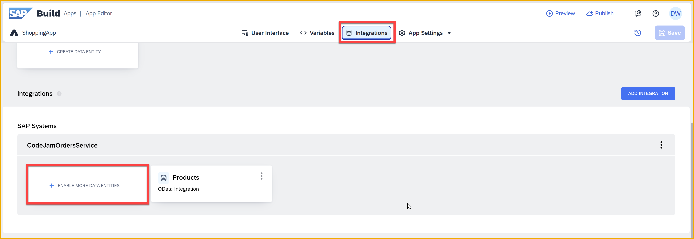
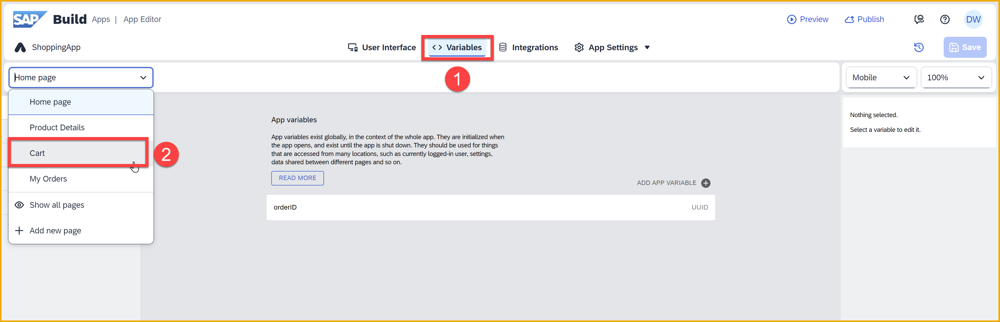
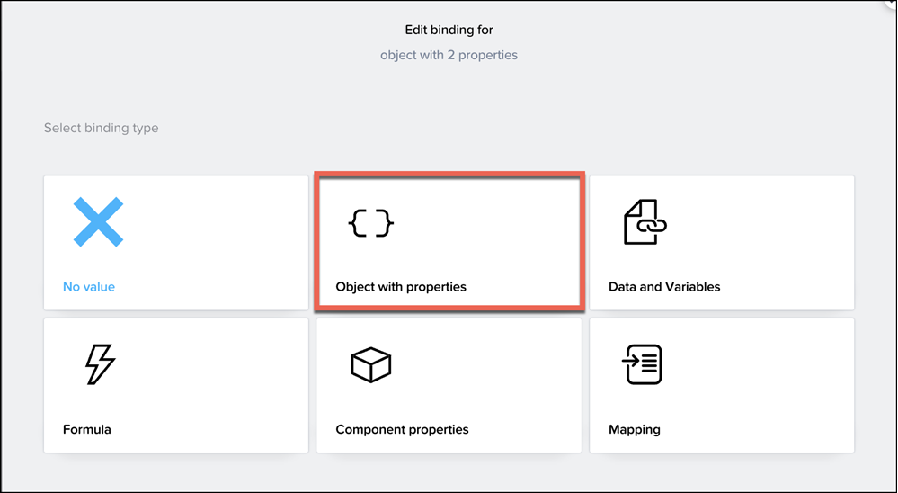

# 3 - Configure the Shopping Cart Page
<!-- description --> Set up the shopping cart page –- including variables, binding, styling, and logic -– and update your CAP service as part of the SAP Build CodeJam.
 

## Prerequisites
- You have completed the previous tutorial for the SAP Build CodeJam, [Configure the Product Details Page](codejam-02-product-detail-page).


## You will learn
- How to update a CAP service
- How to set up filter condition on a data variable
- How to add a navigation menu


## Intro
In this exercise, you will be enhancing the **Cart** page of the SAP Build CodeJam app.

You will:

- Retrieve data from our CAP service –- which we created for this CodeJam to maintain the data for your cart and later for the order once it is requested.

- Bind that data to your UI components.

- Create logic for deleting an order item from the cart (i.e., from the CAP service).

>A CAP service is a service built with the Cloud Application Programming Model. CAP is beyond the scope of this CodeJam, though we offer a separate CodeJam just on CAP. For more information about CAP, see [SAP Cloud Application Programming Model](https://pages.community.sap.com/topics/cloud-application-programming). 

>In the prerequisites you already created a destination to that CAP service.


### Create data resource for CAP service
Previously, we made a data resource to the CAP service and enabled the **Products** entity. Now we need some other entities.


1. Back in your **ShoppingApp** project, open the **Integrations** tab.

2. Look for **SAP Systems**, and under that **CodeJamOrdersService**

    Click **Enable More Data Entities**.

    

3. Select **Orders**, and click **Enable Data Entity**.
   
    

    Select **OrderItems**, and click **Enable Data Entity**.

    

4. Click **Save** (upper right).

    Click **Exit** to return to the previous screen. 
   
Scroll back to the top and you should now see **Orders** and **OrderItems** appearing under the **Integrations > CodeJamOrdersService** section.


You should also see that the red warnings are gone. Why is that?


### Create data variable
Now that we have connected to the **OrderItems** entity, let's create a data variable, which will automatically include the logic for making the call as well as provide a place to store the retrieved data.

1. Select the **Variables** tab.

2. Select the **Cart** page from the page dropdown.

    

3. Click **Data Variables** on the left side. 

    Click **Add Data Variable**.

    
   
4. Choose **OrderItems**.

    

    With **OrderItems** data variable selected, in the right pane, the type should already be set to **Collection of data records**. Keep this type.

    

4. Select the **X** next to **Filter condition**, then select **Object with properties**.

    
   
5. Click **Add Condition**.

    

    Set up the condition as follows:
   
    | Property | Condition type | Compared value |
    |----------|----------------|---------------|
    | **order_ID** | **equal** | Set the binding to **Data and Variables > App Variable > orderID**  |

    >**What's going on?**
    >
    >We have set up an app variable -- a variable type that can be used anywhere in the app -- to hold your order ID. And we created logic to set it to some dummy order so that you will get some data.
    >
    >Later in this tutorial, you will change the logic so you generate your own order ID.

    Click **Save**.

6. Click **Save** (upper right).
   


### Bind total text
In order to display the data in the cart from the **OrderItems** entity, you need to map the backend data that is in the data variable to the UI components.


1. Click **User Interface**.

2. Select the **Cart Total:** field and click the binding icon for its **Content** property.

    

    Instead of **Static value**, change the binding type to **Formula** and replace the formula with the following formula:
    
    ```JavaScript
    "CART TOTAL: $" + FORMAT_LOCALIZED_DECIMAL(NUMBER(SUM(MAP(data.OrderItems1,item.price * item.quantity))), "en", 2,2)
    ```

    > **What does the formula do?**
    >
    >The formula uses the **MAP** function, one of the more powerful and useful functions. Here, the function goes through all the order items, multiplies the quantity and the price, and creates a new list with just integers representing the total cost of each item.
    >
    >The **SUM** function then adds it all together, and then the formula formats the result.

    Click **Save** twice. 


3. Click **Save** (upper right).


### Add navigation menu item
Now that you have set up the **Cart** page, you need to let users get to the page. There are 2 ways users can navigate between pages.

You can create a button or other UI component, and then in the logic for the button click add an **Open Page** flow function. That is what you did to navigate from the product list page to the product detail page.

But users might want to navigate to the **Cart** page at any time. So you can create a static menu that is available all the time. Every new app comes with a menu and a single item to return to the home page. In this step, you will create a new menu item for the **Cart** page. 

1. Click **App Settings > Navigation**.

    You will see the **Home page** menu item already created for you.

    

2. Click **Add item**.

    This will add a menu item, but likely not to the page you want.

    

3. Select the new menu item, and on the right-hand side set the following properties:

    | Icon    |   Tab name  |   Page  |
    | --- | --- | --- |
    | `shopping-basket`    |   `Cart`     | `Cart` |

    

4. Click **Save** (upper right)


### Test the app
Return to your web preview.

>Once you saved your app, the page should refresh and you should see the **Cart** menu item below the Homepage icon on the left navigation menu.

Click **Cart**.

The **Cart** page should open and you will see the order items for a dummy cart which is hardcoded in the skeleton app. 


### Get your own cart
Currently, you are viewing a dummy cart. Now let's create your own cart.

1. Click **User Interface**.

2. Open the **Home Page**.

    

3. Click **Page Layout** in the tree view, and open the logic canvas.

    

    You should see the default logic.

4. Switch the logic by first disconnecting the connection between **Page focused** and **Set app variable**: to do this, click the connection and press the **Delete** key.

    Then connect **Page focused** to **Delay**.

    

    It should now look like this:

    

    > **What does the logic do?**
    >
    >The logic ... well, we will discuss this as a group. 😺
    >
    >See if you can figure out the logic here.


### Add items to cart
Now that you have a cart ID, you can add an item to the cart.

1. Navigate back to the product details page.

    

2. Select the **Add to Cart** button and click at the bottom **Add logic to Button - Add to Cart**. This opens the logic canvas pane.

    

3. From the **Core** pane of flow functions, drag and drop **Create Record** function and connect it to the **Component tap** like shown below.

    

4. Select the **Create Record** function, and in the **Properties** tab on the right side, set the following:

    - **Resource name** to  **OrderItems**.
    - **Record** to the following formula.

        ```JavaScript
        {price: NUMBER(data.Products1.Price), total: NUMBER(data.Products1.Price) * pageVars.quantity, product: data.Products1.Name, order_ID: appVars.orderID, quantity: NUMBER(pageVars.quantity)}
        ```

        >The formula will appear red with a warning, because the ID field is mandatory but the formula editor does not know that the ID will be auto-generated by the service. Just click **Save**.

        

5. Drag 2 **Alert** flow functions: connect one to the top output and one to the bottom output of **Create Record**.

    

    Select the top **Alert** and for the **Dialog title** choose **Formula**, and use the following formula.

    ```JavaScript
    data.Products1.Name + " (" + pageVars.quantity +  ") added to cart"
    ```
    
    Select the bottom **Alert** and for the **Dialog title** choose the binding **Output value of another node > Create Record > Error > message**.

6.  Click **Save** (upper right).


### Delete items from cart
Now that you enabled the user to add an item to the cart, let's add logic to enable someone to delete an item from the cart.

1. Navigate back to the **Cart** page.

2. Click the first **Delete** icon in the first row of the cart (or select it in the tree view).

    Then open the logic canvas if it's not already open.

    

3. Drag a **Delete Record** flow function onto the logic canvas and connect it to the top output of the existing **IF condition**.

    

    With the **Delete Record** selected, set the following:
    
    - **Resource name** to **OrderItems**.

    - **ID** to **Data item in repeat > current > ID**. 

         

4. Now that you deleted the item, you want to refresh the list of items.

    Drag a **Get Record Collection** flow function onto the logic canvas and connect it to the top output of the **Delete record**.

    

    With **Get Record Collection** selected, set the following:

    - **Resource name** to **OrderItems**.

    - **Filter condition** to **Object with Properties** and then click **Add Condition** and set as follows.

        | Property | Condition type | Compared vale |
        |----------|----------------|---------------|
        | `order_ID` | `equal` | **Data and Variables > App variable > orderID** |
    
    Click **Save**.
    

2. Now that you retrieved the new list of items, you have to update the data variable.

    Drag a **Set data variable** flow function onto the logic canvas and connect it to the top output of the **Get record collection**.

    

    With **Set data variable** selected, set the following:

    - **Data variable name** to **OrderItems1** (this should already be set).

    - **Record collection** to **Output value of another node > Get record collection > Collection of records**.


3. Click **Save** (upper right).


### Test the App
Open your app again, and navigate directly to the **Cart** page.

Your cart should be empty. This is because you now have your own cart, which starts empty.


>Note that we added a display of your cart ID, so you can debug if necessary and see what the app thinks is your cart ID, or if it is missing.

Go back to the home page (use the left-side navigation) and click the first product, then on the product details page, and change the quantity to `7`.


Click **Add to Cart**.


Go to the **Cart** page. You should now see the product you selected in your cart. 


You can also test deleting items from the cart ... it takes a few seconds for the UI to update after deleting an item.

And behind the scenes, you are reading and updating a CAP service.

😃


