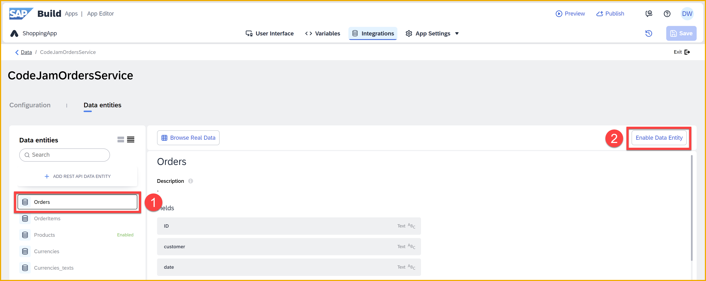

  

# 3 - Configure the Shopping Cart Page
<!-- description --> Set up the shopping cart page – including variables, binding, styling, and logic – as part of the SAP Build CodeJam.


## Prerequisites
- You have completed the previous tutorial for the SAP Build CodeJam, [Configure the Product Details Page](codejam-02-product-detail-page).


## You will learn
- How to setup a destination to a CAP service
- How to connect to a CAP service
- How to set up filter condition on a data variable
- How to bind repeating data to the UI elements
- How to add a navigation menu


## Intro
In this exercise, you will be enhancing the **Cart** page of the SAP Build CodeJam app.

You will:

- Retrieve data from our CAP service – which we created for this CodeJam to maintain the data for your cart and later for the order once it is requested.

- Bind that data to your UI components.

- Create logic for deleting an order item from the cart (i.e., from the CAP service).

>A CAP service is a service built with the Cloud Application Programming Model. CAP is beyond the scope of this CodeJam, though we offer a separate CodeJam just on CAP. For more information about CAP, see [SAP Cloud Application Programming Model](https://pages.community.sap.com/topics/cloud-application-programming). 


### Create a destination for our CAP service
In order to retrieve data from the CAP service, you need to create a destination in the SAP BTP cockpit, which you can then access from SAP Build Apps.

To save you time, we have given you all the information for the destination in a file you can import.

1. Download the destination definition.
   
    Click [`CodeJamOrdersService`](https://github.com/sap-tutorials/sap-build-apps/blob/main/tutorials/codejam-03-cart-page/CodeJamOrdersService), and then click the download button.

    

2. In the SAP BTP cockpit, click **Connectivity >  Destinations**.

    <!-- border -->
    

3. Click **Import Destination**, and then select the `CodeJamOrdersService` file you downloaded.

    The draft destination will be filled in.

    <!-- border -->
    

    Click **Save**.

4. Test the connectivity to the new destination by clicking **Check Connection**.
   
   You should receive **200: OK**. 


### Create data resource for CAP service
In order to fetch data from the CAP service, you need to create a data resource for the CAP service.

1. Back in your **ShoppingApp** project, open the **Data** tab.

    Click **Add Integration**.

    

2. Click **BTP Destinations**, and then select the **CodeJamOrdersService** destination.

    

    You will see a list of entities for this OData service.

    

3. Click **Install Integration**.

4. With the **Orders** entity selected, click **Enable Data Entity**.

    

5. With the **OrderItems** entity selected, click **Enable Data Entity**.

6. Click **Save** (upper right).

    Click **Exit** to return to the previous screen. 
   
You should now be able to see **Orders** and **OrderItems** appearing under the **Integrations > CodeJamOrdersService** section.


### Create data variable
Now that you have defined the connection to the CAP service, let's create a data variable, which will automatically include the logic for making the call as well as holding the retrieved data.

1. Navigate to the **Cart** page by clicking on the **Home pages** link on the upper-left corner, below the app name.

    Select the **Cart** tile.

    

2. Toggle to **Variables**.

3. Click **Data Variables** on the left side. 

    Click **Add Data Variable** and choose **OrderItems**.

    
   
    With **OrderItems** data variable selected, in the right pane, the type should already be set to **Collection of data records**. Keep this type.

    

4. Select the **X** next to **Filter condition**, then select **Object with properties**.

    
   
5. Click **Add Condition**.

    

    Set up the condition as follows:
   
    | Property | Condition type | Compared value |
    |----------|----------------|---------------|
    | **order_ID** | **equal** | `6c25e827-15c2-4e7f-be1a-89fb4304d4fa`  |

    >**IMPORTANT:** The order ID represents some dummy data we entered into the service so you will see some data in the UI. Later, you will update the condition so you only see your own data.
    >
    >DO NOT delete any order items.

    Click **Save**.

5. Click **Save** (upper right).
   


### Bind variable to cart items
In order to display the data in the cart from the **OrderItems** entity, you need to map the backend data that is in the data variable to the UI components.


1. Toggle back to **View**.

2. Select the **Row - Items** component.
   
    Set the **Repeat with** to the data variable **OrderItems1** (you just created).
    
    

    With the repeat set, we'll bind the individual text components.
   
3. In the Tree View, select **Row - Items > Cell #1 > Text - Product**.

    

    Once selected, in the **Properties** pane, click the **ABC** binding icon for the **Content** property.

    Choose **Data item in repeat > current > product**, and set **Preview Value** to `Product`.

    

    Click **Save**.

4. Repeat the binding for **Quantity**, **Price** and **Total** as follows:

    | UI Component    |   Tree View Location  |   Binding  | Preview |
    | --- | --- | --- | --- |
    | Quantity    |    Cell #2 > Text - Quantity   |  Data item in repeat > current > quantity    | `Qty` |
    | Price    |   Cell #3 > Text - Price   |  Data item in repeat > current > price   | `Price` |
    |  Total   |   Cell #4 > Text - Total |   Data item in repeat > current > total   | `Total` |

5. Select the **Cart Total: $** field and click the binding icon for its **Content** property.

    

    Instead of **Static value**, change the binding type to **Formula** and replace the formula with the following formula:
    
    ```JavaScript
    "CART TOTAL: $" + FORMAT_LOCALIZED_DECIMAL(NUMBER(SUM(MAP(data.OrderItems1,item.price * item.quantity))), "en", 2,2)
    ```

    > **What does the formula do?**
    >
    >The formula uses the **MAP** function, one of the more powerful and useful functions. Here, the function goes through all the order items, multiplies the quantity and the price, and creates a new list with just integers representing the total cost of each item.
    >
    >The **SUM** function then ads it all together, and then the formula formats the result.

    Click **Save** twice. 


5. Click **Save** (upper right).


### Add navigation menu item
Now that you have set up the **Cart** page, you need to let users get to the page. There are 2 ways users can navigate between pages.

You can create a button or other UI component, and then create logic to respond to a button click or other event, and then use the **Open Page** flow function. That is what you did to navigate from the product list page to the product detail page.

But users might want to navigate to the **Cart** page at any time. So you can create a static menu that is available all the time. Every new app comes with a menu and a single item to return to the home page. In this step, you will create a new menu item for the **Cart** page. 

1. Click the **Navigation** tab.

    You will see the **Home page** menu item.

    

2. Click **Add item**.

    This will add a menu item, but likely not to the page you want.

3. Select the new menu item, and set the following properties:

    | Icon    |   Tab name  |   Page  |
    | --- | --- | --- |
    | `shopping-basket`    |   `Cart`     | `Cart` |

    

4. Click **Save** (upper right)


### Test the app
Return to your web preview.

>Once you saved your app, the page should refresh and you should see the **Cart** menu item below the Homepage icon on the left navigation menu.

Click **Cart**.

The **Cart** page should open and you will see the order items for the dummy cart. 


