  

# 4 - Write Logic to Maintain the Cart
<!-- description --> Add data logic to make the cart functional, as part of the SAP Build CodeJam.

## Prerequisites
- You have completed the previous tutorial for the SAP Build CodeJam, [Configure the Shopping Cart Page](codejam-03-cart-page).


## You will learn
- How to create record on a CAP entity
- How to set error messages when a flow function fails


## Intro
In this tutorial, you will do the following:

- Create logic to create a cart for the current user.
- Enable the **Add to Cart** button on the product details page to add items to the cart.
- Change the **Cart** page so it displays the current user's cart.

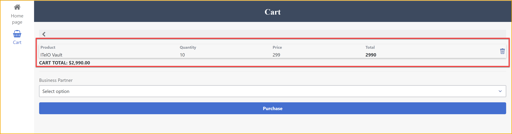
&nbsp;

#### Our Data Model

You have a CAP service that stores **Orders**, as well as **OrderItems**. Each order item has a reference to the order it belongs to.

Each order has one of the following statuses:

- **CART:** Indicates this is the current cart for the current user.
- **REQUESTED:** Indicates the cart has been submitted for approval (later you will create a process for this). Once the cart has been submitted, the app no longer can use that cart – it is now considered a requested order – and the app must create a new one for the user.
- **APPROVED:** Indicates the cart – or more accurately, the requested order – has been approved.

The app will maintain the current cart – with status **CART** – inside an app variable. When the app loads, there will be logic to determine if a cart exists or whether you need to create one.


### Create app variable to store cart ID
You will create an app variable to store the cart ID of the current user.

>**App variables** are variables that are accessible from any page. **Page variables** are variables that are accessible only on the page where they are defined.

1. Still on the **Cart** page, click the **UI Canvas** tab.

    Toggle to **Variables**.

    

3. On the left side, click **App Variables** (it likely is already selected).

    Click **Add App Variable**.

    With the new variable selected, change the following:

    | Variable Name | Type | 
    |-------|---------|
    | `orderID` | **UUID** | 

    

4. Click **Save** (upper right).


### Get or create cart
You will want to add items to the cart, but in order to add them to the CAP service, you need to know the ID of the cart (order).

When first running the app, you check if there is a cart stored in the app variable. If not, you check the CAP service to see if there is a stored cart for the current user. If yes, you take that order ID; if not, you create a new order with the status **CART**.

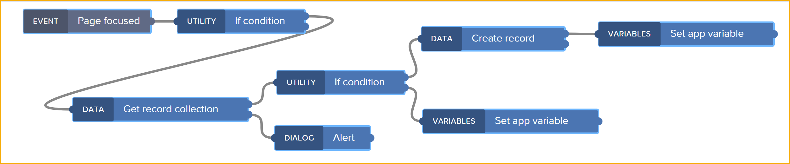

A cart is assigned to the current user by detecting the current user's email address and storing that in the `customer` field.

>Since the app uses SAP BTP authentication, you can determine a variety of properties about the current user, including the user's email address. You can find these fields using formulas and the `systemVars.currentUser` object.

>**IMPORTANT:** As of the writing of the tutorial, the current user could only be accessed when running the application on the web, not on a mobile device.

1. Navigate back to the home page – by clicking the name of the current page under the app name in the top-left corner.

    Select the **Home page** tile.

2. If the logic canvas is not open, click on an empty place on the UI canvas, and then click **Add logic to HOME PAGE** link at the bottom of the page. This opens the page's logic canvas.
    
    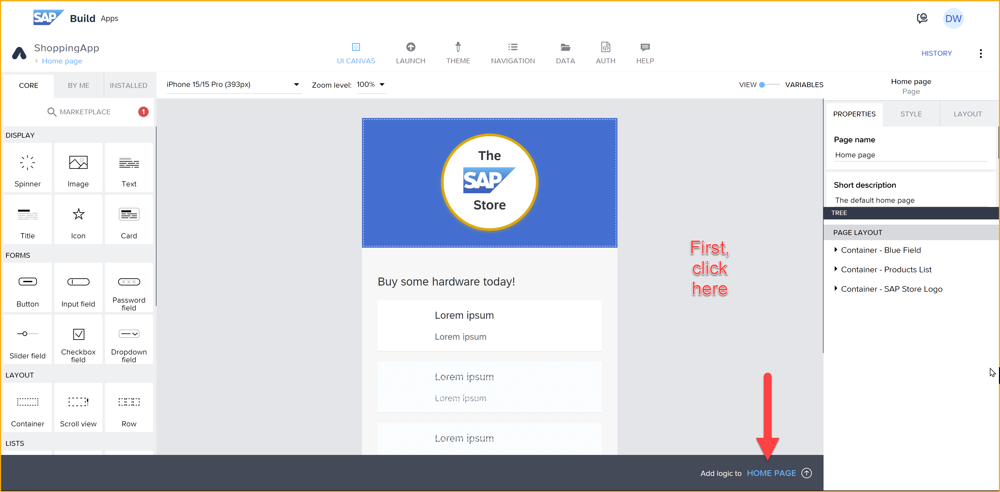

3. To the **Page focused** event, add flow functions and then connect them so they look like this.

    

    >**IMPORTANT:** A flow function can have multiple outputs (e.g., the first for success and the second for failure). Make sure to attach the flow functions to each other using the indicated outputs as shown in the screenshot.

    >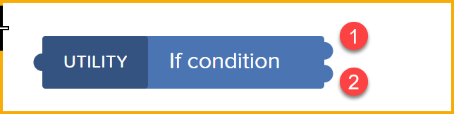
    
    >If you would want to connect your logic to a different event, you would just click the event flow function, and in the **Properties** pane (on the right) you can select from other possible events.

    >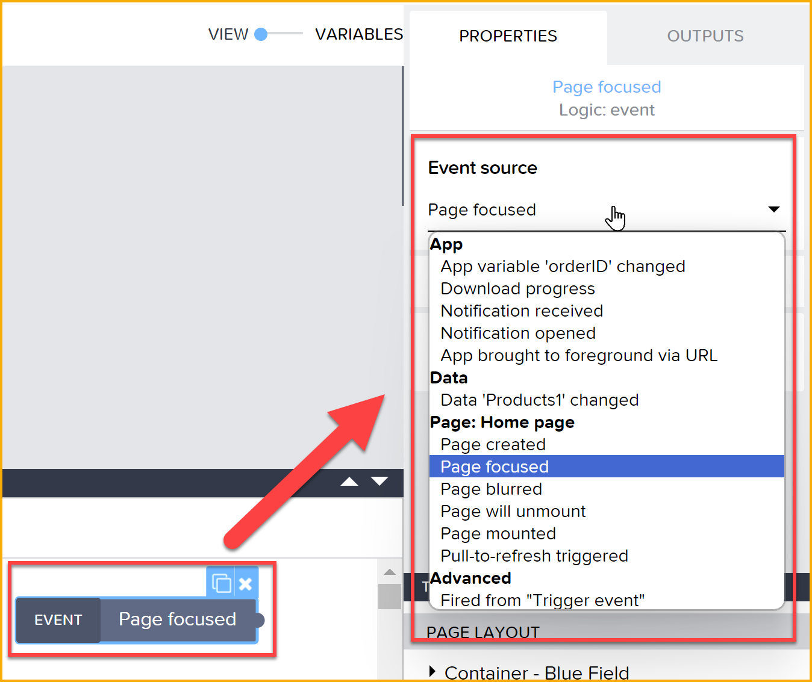

4. The first **If condition** checks if you have a cart already. If you have a cart, you do nothing. Otherwise, you proceed with retrieving or creating a cart.

    Select the **If condition** flow function, and on the right pane, click the binding icon for **Condition**. Select **Formula**, and use the following formula:

    ```JavaScript
    IS_EMPTY(appVars.orderID)
    ```

    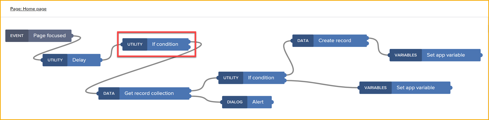

    >In case you were wondering, you added a **delay** function at the start of the flow to ensure that all the system variables – including for the user – are available before starting the flow.

5. If you do not have a cart, you use the **Get record collection** to retrieve the orders for the current user, filtering for any with the status **CART**.

    Select the  **Get record collection** flow function, and set the **Resource name** to **Orders**.

    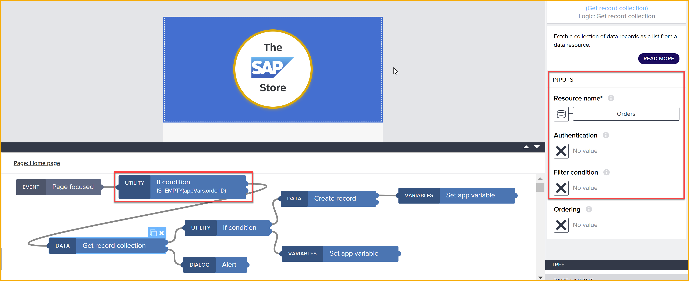

    Click the binding icon for **Filter condition**, then select **Object with properties**, and set up 2 filters by clicking **Add Condition** twice and setting them up as follows:

    

    | Property | Condition type | Compared value |
    |----------|----------------|----------------|
    | customer | equal | Set to formula: `systemVars.currentUser.email` |
    | status | equal | `CART` |

    Make sure to set **ALL** for **Matching ALL of these conditions** (it should already be set).  

    Click **Save**.

6. You now have to see if you were able to retrieve any orders for the current user that is a cart.

    Out of the top output of the **Get record collection**, you have an **If condition**. Select this flow function, and click the binding icon for **Condition**. Select **Formula**, and use the following formula – to check if there is no existing cart:

    ```JavaScript
    IS_EMPTY(outputs["Get record collection"].records)
    ```

    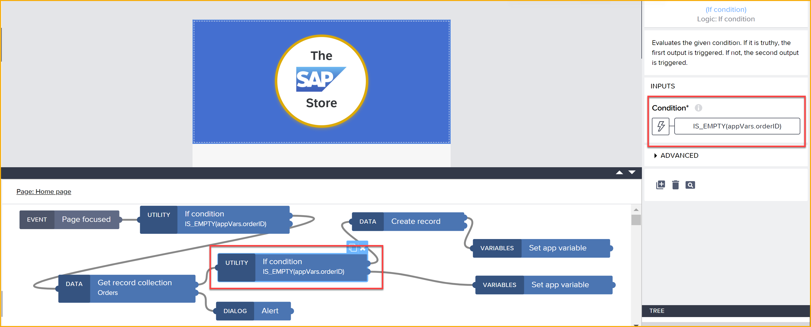
    
    Out of the bottom output of the **Get record collection**, you have an **Alert**, in case there is an error in the API call. Select this flow function, and click the binding icon for **Dialog title**. Select **Output value of another node > Get record collection > Error > message**, and then click **Save**.

    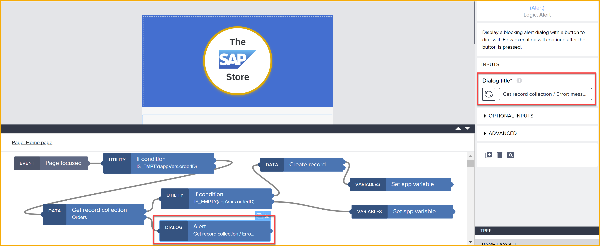

    >Feel free to move the flow functions around to make it easy to see them all.


7. The **Create record** is used to create a new cart if none has previously been found.
    
    Select this, and set the **Resource name** to **Orders**.

    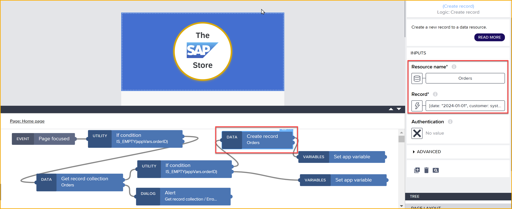

    For **Record**, select the binding icon, select **Formula**, and use the following formula:
    
    ```JavaScript
    {customer: systemVars.currentUser.email, status: "CART"}
    ```

    >The formula sets the customer to the current user, and sets the status of the record to **CART**, meaning it represents a cart and not an actual order yet.

    >The formula will appear red with a warning, because the ID field is mandatory but the SAP Build Apps formula editor does not know that the ID will be auto-generated by the CAP service. Just click **Save**.

8. Out of the top output of the **Create record** flow function, you now have to set the app variable to the ID of the new record you created.

    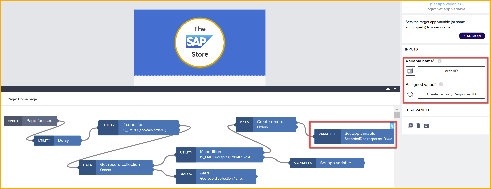

    For this **Set app variable** (top), set:
    
    - **Variable name** to `orderID` (probably already set).

    - **Assigned value** to **Output value of another node > Create record > ID**.


9. Out of the bottom output of the second **If condition** (meaning there already is a cart), you have a **Set app variable** flow function to set the app variable to the order ID you successfully retrieved.

    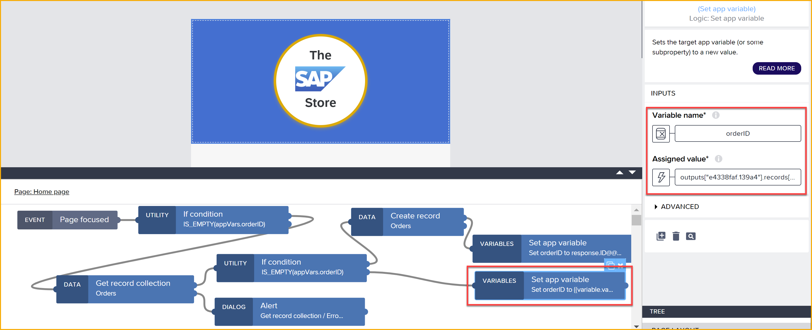

    Set **Variable name** to `orderID`.

    Set **Assigned value** to the following formula:

    ```JavaScript
    outputs["Get record collection"].records[0].ID
    ``` 

    >The `[0]` indicates the first record in the collection. There should be only one cart at a time, but just in case you just take the first one.


10. Click **Save** (upper right).


### Add items to cart
Now that you have a cart ID, you can add an item to the cart.

1. Navigate back to the product details page – by clicking the name of the current page under the app name in the top-left corner.

    Select the **Product Details** tile.

    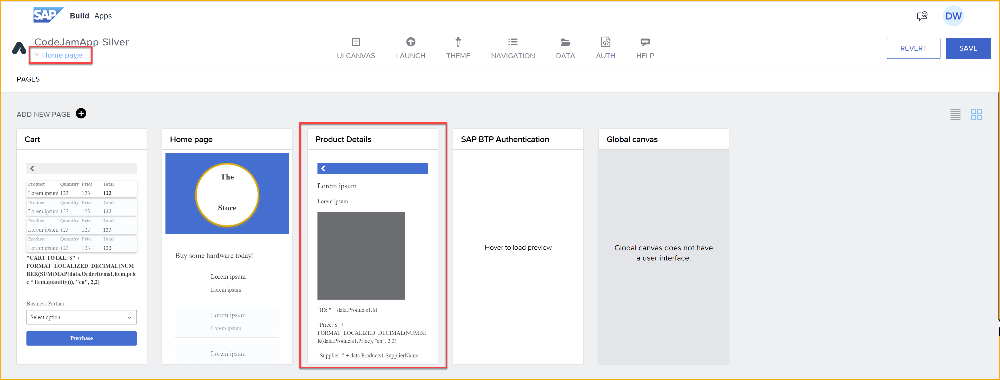

2. Select the **Add to Cart** button and click at the bottom **Add logic to Button - Add to Cart**. This opens the logic canvas pane.

    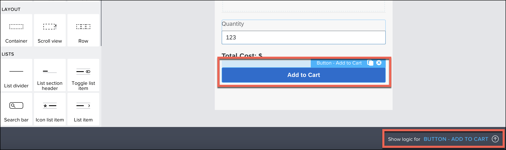

3. From the **Core** pane of flow functions, drag and drop **Create Record** function and connect it to the **Component tap** like shown below.

    

4. Select the **Create Record** function, and in the **Properties** tab on the right side, set the following:

    - **Resource name** to  **OrderItems**.
    - **Record** to the following formula.

        ```JavaScript
        {price: NUMBER(data.Products1.Price), total: NUMBER(data.Products1.Price) * pageVars.quantity, product: data.Products1.Name, order_ID: appVars.orderID, quantity: NUMBER(pageVars.quantity)}
        ```

        >The formula will appear red with a warning, because the ID field is mandatory but the formula editor does not know that the ID will be auto-generated by the service. Just click **Save**.

        

5. Drag 2 **Alert** flow functions: connect on to the top output and one to the bottom output of **Create Record**.

    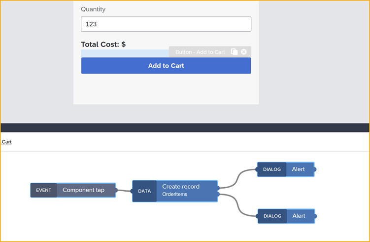

    Select the top **Alert** and for the **Dialog title** choose **Formula**, and use the following formula.

    ```JavaScript
    data.Products1.Name + " (" + pageVars.quantity +  ") added to cart"
    ```
    
    Select the bottom **Alert** and for the **Dialog title** choose the binding **Output value of another node > Create Record > Error > message**.

6.  Click **Save** (upper right).


### Add logic to delete record
Now that you enabled the user to add an item to the cart, let's add logic to enable someone to delete an item from the cart.

1. Navigate back to the cart page – by clicking the name of the current page under the app name in the top-left corner.

    Select the **Cart** tile.

2. Click the **Delete** icon in the first row of the cart, and open the logic canvas if it's not already open (by clicking **Add logic to Icon - Delete** at the bottom).

    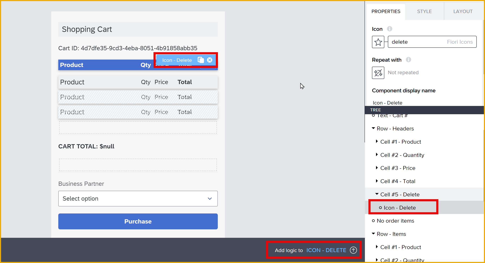

    >We have already added a few flow functions to prevent you from deleting our demo order.

3. Drag a **Delete Record** flow function onto the logic canvas and connect it to the top output of the **IF condition**.

    With the **Delete Record** selected, set the following:
    
    - **Resource name** to **OrderItems**.

    - **ID** to **Data item in repeat > current > ID**. 

     

4. Now that you deleted the item, you want to refresh the list of items.

    Drag a **Get Record Collection** flow function onto the logic canvas and connect it to the top output of the **Delete record**.

    With **Get Record Collection** selected, set the following:

    - **Resource name** to **OrderItems**.

    - **Filter condition** to **Object with Properties** and then click **Add Condition** and set as follows.

        | Property | Condition type | Compared vale |
        |----------|----------------|---------------|
        | `order_ID` | `equal` | **Data and Variables > App variable > orderID** |
    
    Click **Save**.
    
    

5. Now that you retrieved the new list of items, you have to update the data variable.

    Drag a **Set data variable** flow function onto the logic canvas and connect it to the top output of the **Get record collection**.

    With **Set data variable** selected, set the following:

    - **Data variable name** to **OrderItems1** (this should already be set).

    - **Record collection** to **Output value of another node > Get record collection > Collection of records**.

    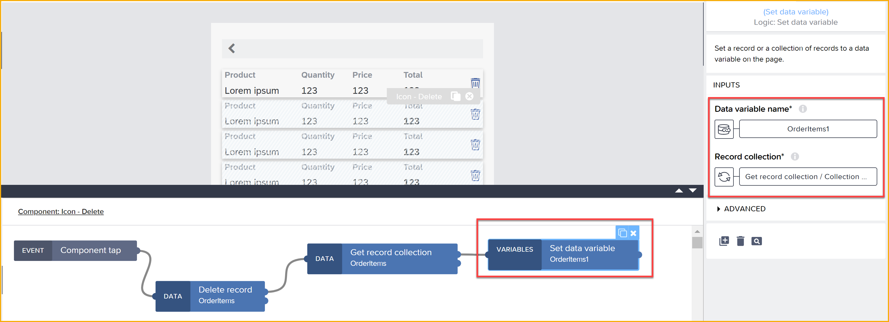

6. Click **Save** (upper right).


### Remove hard-coded cart
One more thing. Remember you hard-coded a default cart so you could see data in your cart?

Well, you want to remove that so you can have your own cart.

1. Toggle back to **Variables**.

2. Select **Data variables**, and then click on the variable **OrderItems1**.

    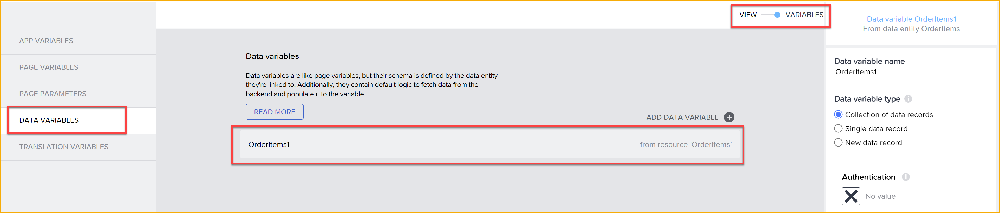

3. On the right side under **Filter condition**, click **Custom condition**.
   
    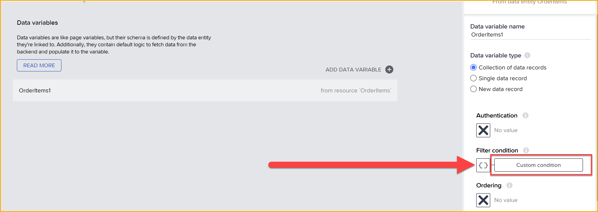

4. Instead of having the hardcoded cart ID, click on the binding icon, and select **Data and Variables > App variable > orderID**. 

    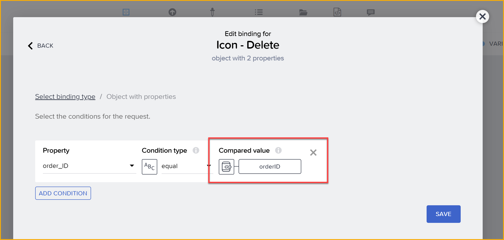

    Click **Save**.

5. Click **Save** (upper right).


### Test the App
Open your app again, and navigate directly to the **Cart** page.

Your cart should be empty. This is because you now have your own cart, which starts empty.

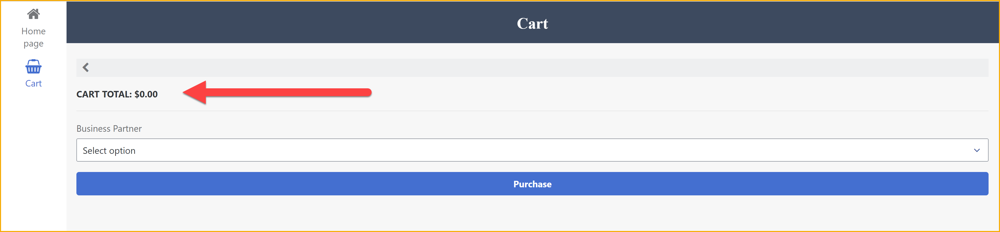

Go back to the home page (use the left-side navigation) and click the first product, then on the product details page, change the quantity to `7`  and click **Add to Cart**.

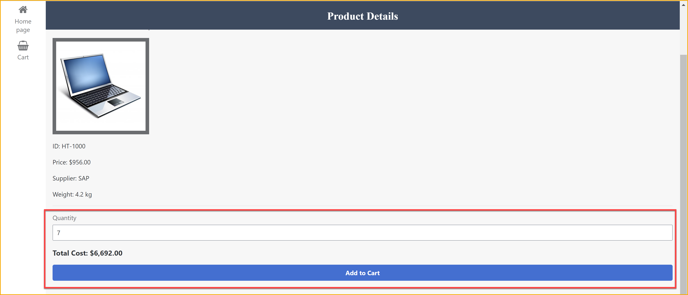

Go to the **Cart** page. You should now see the product you selected in your cart. 

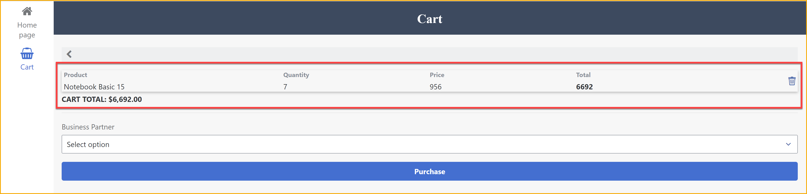

😃