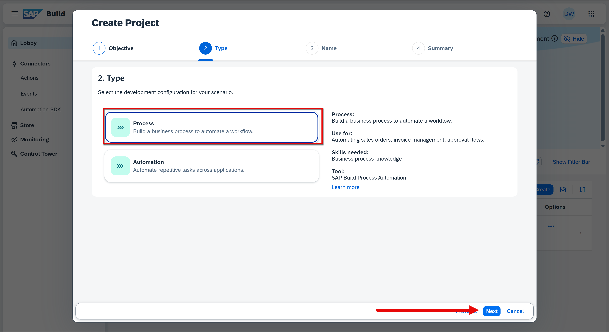
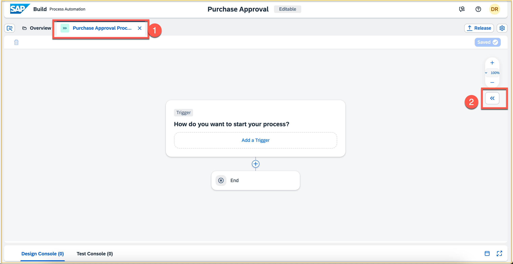
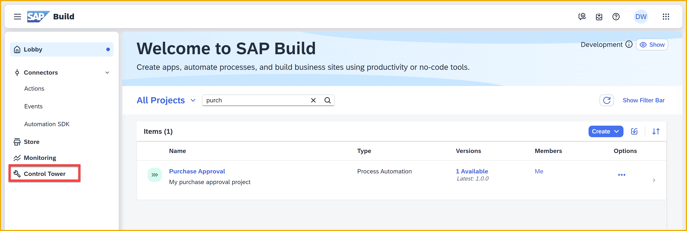
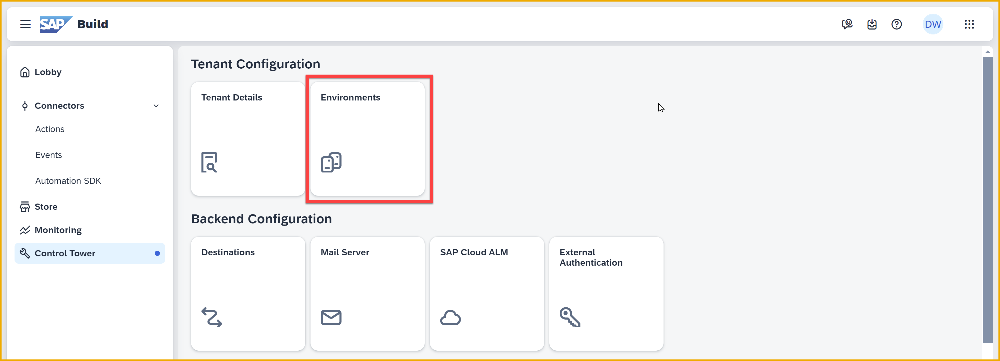
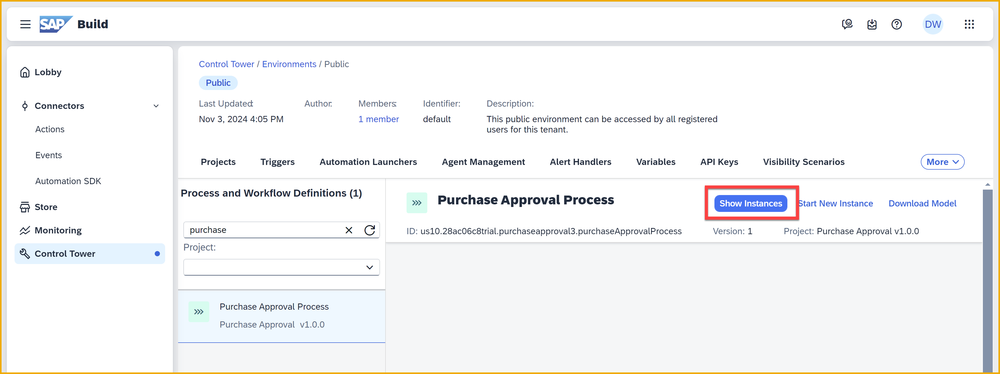
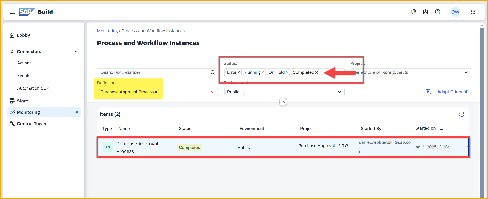

 


# 4 - Create a Business Process Project
<!-- description --> Create an empty business process to better understand how to release and deploy a process, and then start and monitor a process instance, as part of the SAP Build CodeJam.

 
## Prerequisites
- You have completed the previous tutorial for the SAP Build CodeJam, [Write Logic to Maintain the Cart](codejam-03-cart-page).
  

## You will learn
- How to create an empty SAP Build Process Automation project
- How to start an instance of your process
- How to monitor an instance of your process


## Intro
SAP Build Process Automation enables you to create workflows for running your day-to-day processes. In this tutorial, you will learn how to create an empty business process, how to release and deploy it, how to start an instance of it, and how to monitor that instance.

In the following tutorial you will add steps to your process, such as forms for triggering a process instance, approvals, checks of the the inputs, and more.


### Finish installing SAP Build Process Automation
You installed SAP Build Process Automation in **Step 3** of the [prerequisites tutorial](codejam-0-prerequisites). But the subscription to the service takes a long time and you may have skipped the final few actions in that step.  

- 👉 If you did not complete that step, go back to **the [prerequisites tutorial](codejam-0-prerequisites), Step 3, Bullet 5** and finish adding the role collections to your user.

    >If in the next step of this tutorial you get the following error when creating your automation project, you did not complete the prerequisites.

    >

- 👉 If you completed that step, just continue below.


### Create a process project
1. In the Build **Lobby**, choose **Create**.

    

    >If you also installed SAP Build Code, you will get a dropdown after clicking **Create**. If so, click **Create** again.

    >


2. Choose **Automated Process**, and then click **Next**.

     

    Choose **Process**, and then click **Next**.

    

    Enter the following:

    | Field | Value |
    | ------ | ------ |
    | **Project Name** | `Purchase Approval` |
    | **Description** | `My purchase approval project` |

    Click **Review**.

    

    On the **Summary** page, click **Create**.

    

    >You may get a disclaimer screen. If so, click **Accept**.

    >

3. Once the project is created, it will automatically try to create a process for the project.

    For **Name** of the process, enter `Purchase Approval Process`.

    Click **Create**.

     

    >You may get a message about the new layout editor or other news. Click **Close**.
    >
    >

    In your project, you will see an empty process with start and end nodes.

    

    >You will get in-app help to give you information about different parts of the user interface. If you click he questions marks around the screen, you can get additional information.
    >
    >You can hide the help by clicking the information button in the top right of he screen, in the header.


### Configure the process inputs
A process makes decisions based on data sent to it when it is triggered (the process inputs), as well as data from API calls made as part of the process (actions).

In this step, you will specify the inputs required for the process.

>In later tutorials, you will create an action to get data from APIs.

1. Click the **Purchase Approval Process** tab.

    Expand the side panel. 

    

2. In **Process Details** (side panel to the right), click **Variables**.

    Next to **Process Inputs**, click **Configure**.

    

3. In the **Configure Process Inputs** window, click **Add Input** 3 times to add space for the inputs.

    

    Add the following inputs as shown in the above screenshot, flagging them all as **Required**.

    >The **Identifier** field values – which are case-sensitive – are auto-populated. DO NOT CHANGE THESE.

    |  Field Name                | Type | Required |
    |  :-------------            | :------------- | :-------------: |
    |  `Order ID`                  | **String** | 	☑️  |
    |  `Total`                  | **Number** | 	☑️  |
    |  `Business Partner`          | **String** | 	☑️  |
  
    >The editor will remove leading and trailing spaces.

    After adding all 3 inputs, the dialog should look like this.

    

    >**DOUBLE-CHECK** that you set the **Total** field as a number, and made all the fields required.

    Click **Apply**.

4. Click **Save** (upper right).

    


### Create API trigger
A business process can be started in several ways. 

- **API:** SAP Build Process Automation defines a common API so that other apps can trigger processes.

- **Event:** An event from SAP S/4HANA Cloud – via SAP Event Mesh – can be set up to trigger a specific process.

- **Form:** You can build a form to give to your users that can be filled in and submitted to trigger the process. That form is created within the same project. Forms can also be built with SAPUI5.

- **Schedule:** You can simply schedule the process to start on a schedule.

For this process, we will create an API trigger so it can be started by an API call.

1. Click **Add a Trigger**.

    

2. Choose **API Trigger**.

    

3. For the trigger **Name**, enter `Purchase Approval Trigger`. 

    Click **Create**.

    

The process inputs are automatically added to the trigger. Click the **Trigger** block, and expand the side panel.


Note that API trigger's **Outputs** are automatically synchronized from the process inputs, meaning that the API will send these inputs and the rest of the process can use them.


### Release Project
To run the process, you must release and deploy it.

Releasing a project creates a version or snapshot of the changes, and deploying the project makes that version available in runtime to be consumed (or triggered). You can only deploy a released version of the project, and at a given time there can be multiple deployed versions of the same project.

1. Click **Release** (upper right).

    

2. In the **Release Project** dialog, you can decide what type of change you are making, what version number to create, and a description of the changes in this version.
    
    However, the first time you release the project, it will automatically be set to 1.0.0, and you can only add a description.

    Click **Release**.

    

3. At the top you have a dropdown that shows all the released and deployed versions, plus the current editable version.

    Select the version you just released (1.0.0). 

    >You could also click **Show project version**, which is displayed after releasing a version.

    

    This displays the released version.

    >

>Whenever you need to make changes to your process project, make sure you have the **Editable** version.

>


### Deploy Project 

1. Once the project is released -- and you are viewing the released version -- you will find a **Deploy** option on the top-right corner of the screen. 
   
    Click **Deploy**.

    

2. You will be asked to select an environment. Select **Public** and click **Deploy**.

    

    >SAP Build Process Automation enables you to create multiple environments with different security so you can control who can run and update processes, generally for different lines of business. For this CodeJam, you will work with the default **Public** environment, which allows everyone to deploy processes to the environment and execute those processes.

    >For more information, go to the SAP Build lobby and then **Control Tower > Environments**, or see [Environments](https://help.sap.com/docs/build-process-automation/sap-build-process-automation/environments).

3. A dialog is shown indicating what triggers will be created and deployed.
    
    Click **Deploy**.

    

    >Deploying will take a couple of seconds/minutes depending upon how big your project is and how many artifacts it has. Any errors during deployment are displayed in the **Deployment Console** at the bottom of the screen.

    Once the deployment is successful, you will see that this release has been deployed, and that it is the active version (since you can have deployed many releases).
    
    

4. Go back to the SAP Build lobby, which should be open in one of your browser tabs.

    >Alternatively, you can return to the lobby from your project by clicking the SAP logo in the top-left corner.

    >


### Start a process instance
SAP Build Process Automation lets you trigger a process manually, generally so you can quickly test it.


1. In the SAP Build lobby, choose **Control Tower**. 

    

2. Click **Environments**.

    

    Select the **Public** environment.
    
    

    You will see all the projects with processes deployed to this environment.

3. Click **More > Processes and Workflows**.

    

    This area shows you all the processes that have been deployed. If you are using SAP Build Process Automation for the first time in your trial account, there is only one process and it is already selected.

    If it isn't selected, select it.

    

    >For when you have many more processes, you can perform a free text search, or you can select the project and then see all the processes in that project.

    With the process selected, you will see information about the process, most notably its **ID**. This ID must be passed whenever an API call is made to trigger the process, though SAP Build Apps will handle sending this ID for you.

4. Click **Start New Instance**.

    

    This opens a dialog that lets you trigger a process – for testing  – without using a form, API call, or external event. The dialog lets you provide the required inputs for the process, in JSON format.
    
    >**IMPORTANT:** You must provide the values for the inputs that you defined as "process inputs," in JSON format. BUT ... the example JSON you will see in the dialog is not related AT ALL to what you need to provide. Therefore, you will delete this JSON.  

    >

    Here's a reminder of the Process inputs you defined in the Process Editor (in the JSON, you must use the same field identifiers in the JSON key value pairs):
   
    

5. Delete the JSON in the dialog, and replace it with the following:

    ```JavaScript
    {
    "businessPartner" : "11",
    "orderId" : "100000",
    "total" : 1000 
    }
    ```

    

6. Click **Start New Instance and Close**.

    If all goes well, you will get the message **Instance started**.

    

    >If things didn't go well, you may get the following:
    >
    >
    >
    >This is most likely because the identifier names or the types of the input parameters defined in the process do not match the data you just entered to start the process – for example, you sent a number for a string input.
    >
    >One thing you may not have done is change the data type of the **total** input parameter to **Number**. If so, you must go back to the **Editable** version of your project, change the type for the **total** input, and release and deploy again. Or, you may have changed the identifiers for an input.


### Monitor the Process  
Once triggered, you can monitor the process instance from the **Monitor** section of the **Monitoring** tab.

1. In the same screen you triggered the process, click **Show instances**.
    
    

    >You can also get to the same place with the menu by clicking **Monitoring**, and under **Monitor** clicking **Process and Workflow Instances** (likely first tile on the page). 

    >You would then have to filter or search for your instance. The **Show Instances** button takes you there directly.


2. By default, completed processes are not shown in the list. And because you have no steps inside the process, it will start and immediately complete.

    To see your instance, in the filters, click the dropdown for the **Status** filter, and select **Completed**.

    

    Now you should see your process instance.

    >Notice that because you navigated from your deployed process from the Control Tower, the list of processes is filtered for just that project (see highlighted filter).

4. Click on your process instance.

    In the details section at the top, you can see:

    - When it started
    - When it completed
    - Who started it
    - ID of the instance
    - ID of the process, or "Definition ID"

    

    Under **Logs** you can see all the events that occurred, such as its triggering, approval forms completed, API calls performed, and any other action that was taken as part of the process.

    Under **Context**, you can see the data that was passed to the process, or that was retrieved during steps that involved data. 


**Congratulations!** You have created your first SAP Build Process Automation process.


### Further study

- [Getting started YouTube playlist for SAP Build Process Auomation (Rekha's video series)](https://www.youtube.com/watch?v=1vElTfSxGWM&list=PL6RpkC85SLQBePo670YRglVJqaX_YaUtJ)
  
- [SAP Build Process Automation features (sap.com)](https://www.sap.com/products/technology-platform/process-automation/features.html)
  
- [Examples of processes (Devoberfest video)](https://www.youtube.com/watch?v=pyFhHNxznuU)

- [What is SAP Build Process Automation (video)](https://www.sap.com/assetdetail/2022/02/6c062d52-177e-0010-bca6-c68f7e60039b.html)

- [Environments (Help Portal)](https://help.sap.com/docs/build-process-automation/sap-build-process-automation/environments?locale=en-US&q=environments)


>**Things to Ponder**
>
>We created simple process inputs (strings and numbers). What if we wanted more complex types?
>
>What is the difference between a process and a process instance?
>
>What are the different ways to trigger (start) a process instance?
>
>You deployed the process to an environment. What is the purpose of an environment?
>
>When we created a process project, it asked us to create a process artifact separately. Why did it not just automatically create a process artifact?

