  


# Add Approval Flow to Process
<!-- description --> Add conditions and approval workflow to the process, as part of the SAP Build CodeJam.


## Prerequisites
- You have completed the previous tutorial for the SAP Build CodeJam, [Create a Business Process Project](codejam-05-spa-simple-process-flow).
  
 

## You will learn
- How to create a data type
- How to add an approval form
- How to add a notification form
- How to use the Inbox to view your tasks


## Intro
From the previous tutorial, you know how to set up a process project, to create an API trigger, to manually trigger a process, and to monitor the process.

In this tutorial, you will add some logic to the process. SAP Build Process Automation lets you add different activities and steps to your process, such as:

- **Forms:** Used for notification or to let users enter information.
- **Approval Forms:** Special forms that let approvers indicate they approve or reject all or part of a process request.
- **Actions:** Gets/posts data to and from backend systems.
- **Mail:** Sends emails.

Another major activity is **Automation**, which defines a set of steps to be carried out on a machine or virtual machine, such as performing activities with Microsoft Office products, opening and manipulating web sites, and much more. We will not include automations in this exercise.


### Create data type
You will want to send a list of items to the process, each with a product, price, quantity and total.

To do this, you can create a data type with all those fields, and specify that you want a list of them.

1. At the top of your project, select the **Editable** version.

2. On the **Overview** page, click **Create** and select **Data Type**.

    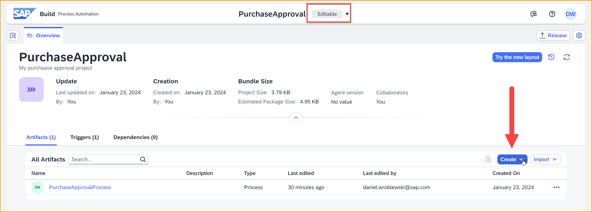

    

    For the name of the data type, enter `Order Item Type`, and then click **Create**.

3. In the **Order Item Type** window, click **New Field**.

    In the **General Information** area on the right, call the field `product`. Keep the type as **String**.

    

4. Repeat step 3 to create the following new fields (use **New Field**, NOT **New Child**):

    | Name | Type |
    |------|------|
    | `quantity` | **Number** |
    | `price`| **Number** |
    | `total` | **Number** |

    With all the fields, the screen should look like this:

    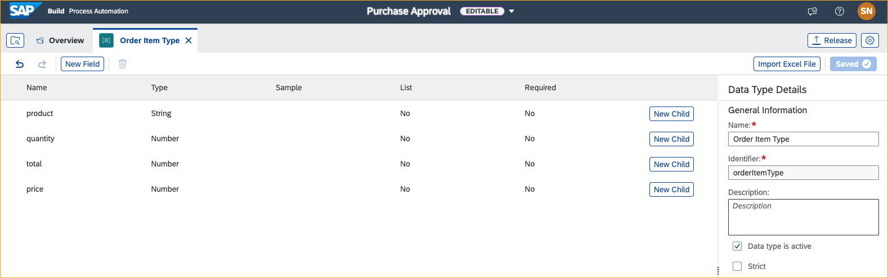

    Click **Save** (upper right).


### Update inputs
Now that we have a data type, we want to add to the process another input for receiving a list of items.

1. Open the **PurchaseApprovalProcess** process.  

    >If the process tab is not already open, you can go back to the **Overview** tab and double-click the process. 
    
    >Processes start with this icon:
    
    >

2. Open the side panel, and click **Variables**.

    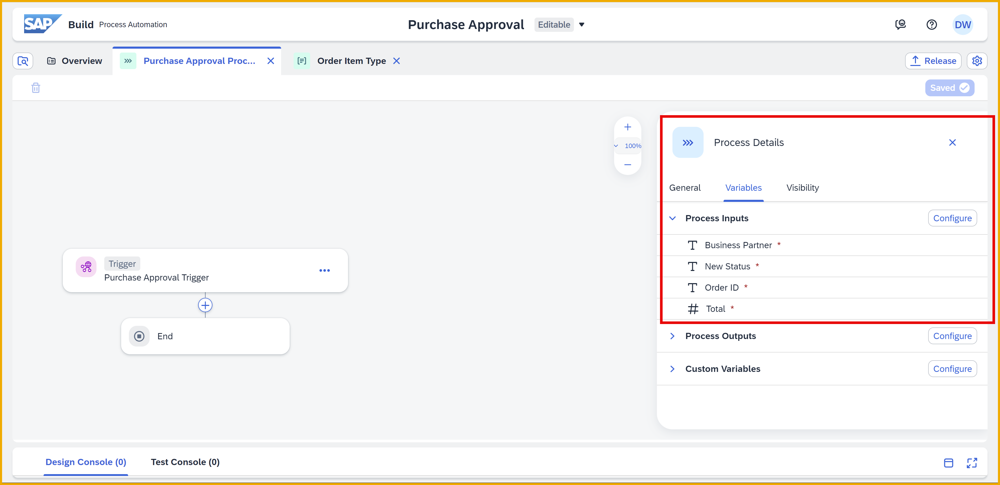

3. Click **Configure** next to the **Process Inputs**.

    A dialog with the existing inputs is displayed.

4. Click **Add Input**, and enter the following:

    | Name | Type | Required | List |
    |------|------|------|------|
    | `Order Items` | **Order Item Type** | Checked | Checked |

    Click **Apply**.

    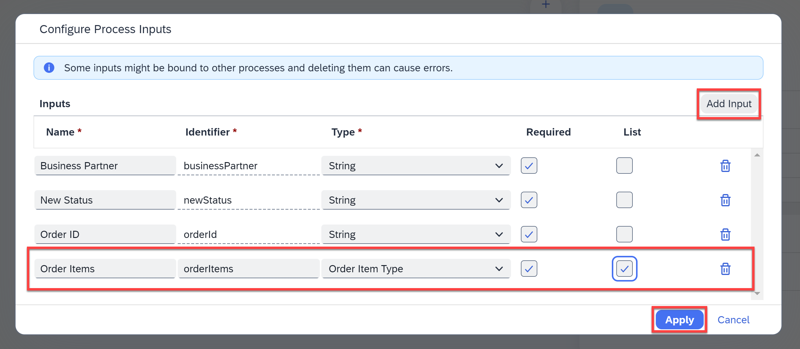

5. Click **Save** (upper right).


### Add a condition step
The process will include a condition that if the total is less than 1000, the purchase is automatically approved. Otherwise, it requires a person to approve it.

1. Click the plus sign, **+**, in the middle of the canvas.

    

    In the dialog, click **Controls and Events**.

    

    Then click **Condition**.

    

    This will add a condition step to the process.

    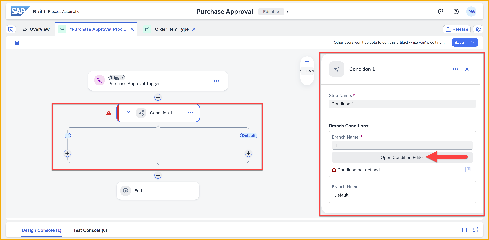

2. Click **Open Condition Editor** in the side panel.

    A dialog for setting a condition opens.

3.  In the first column, click in the box, and select **Process Inputs > Total**. 

    

    For the middle field, select **is less than**.

    For the last field, enter `1000`.

    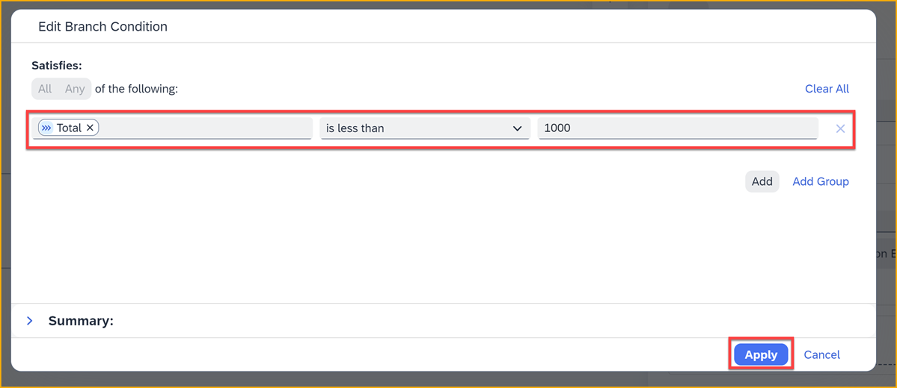

    Click **Apply**.

The warning triangle next to the condition step should now disappear.


### Add an approval form
If the purchase request meets the conditions for needing approval (total greater than 1000), you will need an approval form, which will be sent to the Inbox of the approver.

1. In the **PurchaseApprovalProcess** process tab, click the **+** sign under the **Default**.

    
    
    Select **Approval**.

    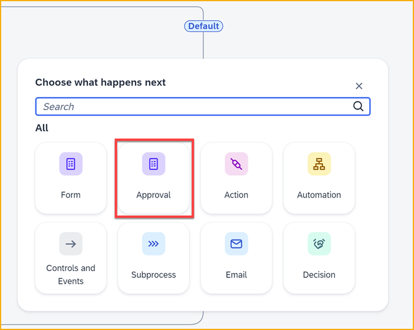

    Select **Blank Approval**.

    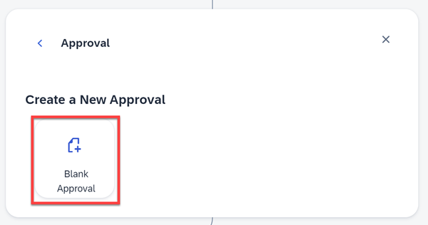
    
    Name the form `Approval Form`.

    Click **Create**.

    You will now have an approval form in your process.

    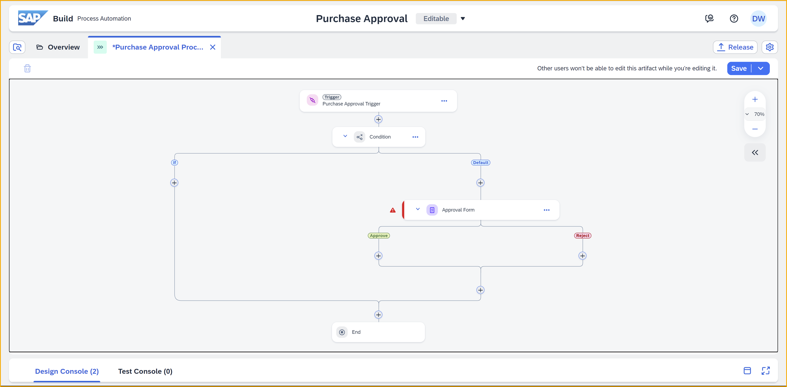

    >You will get a red triangle warning, because you haven't yet specified the approval form and who will receive it. But you will do these soon.

2. Open the form editor by clicking the three dots in the **Approval Form** tile, and then click **Open Editor**.

    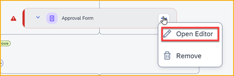 

3. In the form editor, drag in a **Header 1** field, and set the text to `New Order - Needs Approval`.

    

4. Add the following fields by dragging them from the left onto the form. Enter the name, and on the right configuration pane set them to read only.

    | Type | Name | Extra Settings |
    |------|------|------|
    | Text | `Business Partner` | Read Only | 
    | Text | `Business Partner Full Name` | Read Only | 
    | Text | `BP Grouping` | Read Only | 
    | Text | `Order ID` | Read Only | 
    | Table | `Order Items` | Read Only | 
    | Text Area | `Additional Information` |  | 
    
    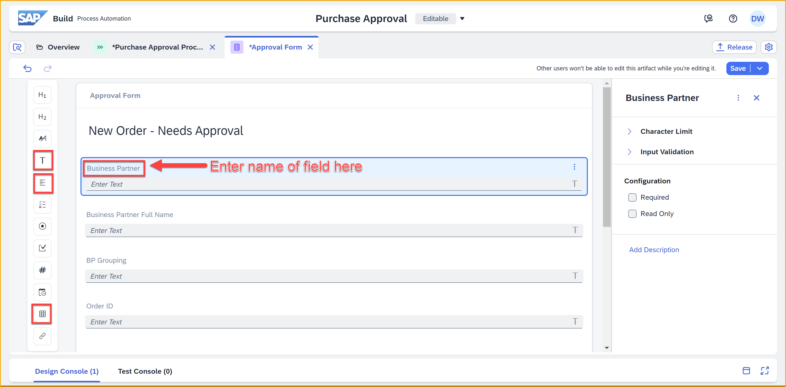

6. Select the **Order Items** table and click the **+** icon.

    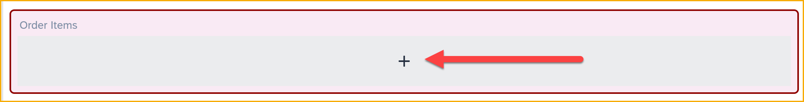

    Add a text field.

    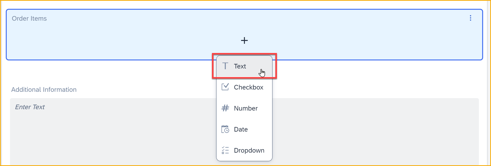
    
    Name the field `Product`.
    
    
    
    Repeat for the following additional fields:

    | Type | Name | 
    |------|------|
    | Number | `Quantity` | 
    | Number | `Price` | 
    | Number | `Total` | 

    In the end the table should look like this:

    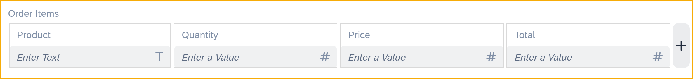

7. Click **Save**.


### Add notification form
Now we will send a notification form if the order is approved.

1. Go back to the process tab.

2. Under **Approve** under the **Approval Form**, click the **+** icon and then select **Form > Blank Form**.

    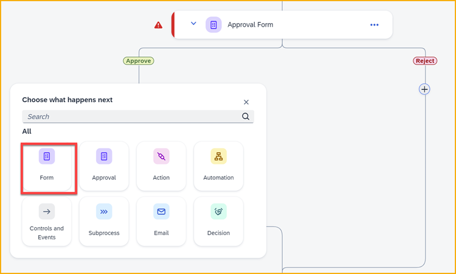

    For the form name, enter `Approval Notification`, and click **Create**. 

3. Open the form editor by clicking the three dots in the **Approval Notification** tile, and then click **Open Editor**.

    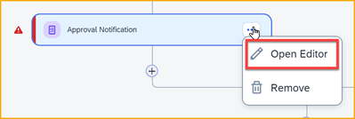

4. In the form editor, just add a **Headline 1** element, and set it's text to `Order Approved`.


    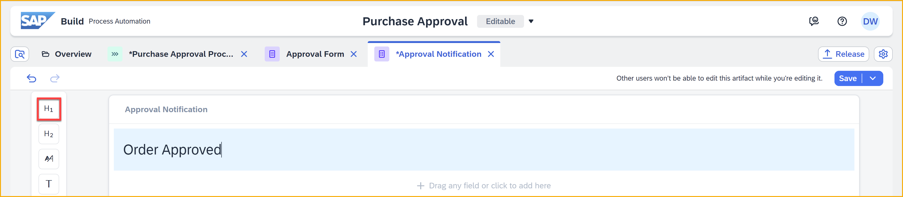

5. Click **Save** (upper right).


### Set the bindings
When we create a process, we create generic artifacts but we need to specify the values for the fields in each instance of the artifact.

For example, for an approval, we need to specify who will be the approver. Or, for a form with different fields, we must specify from where to take the data to fill those fields.

1. Open the process tab.

2. Click on **Approval Form**, and you will configure the fields in the side panel.

    

    Configure the fields as follows:

    | Tab | Field | Source/Binding |
    |-----|-------|----------------|
    | **General** | **Subject** | `Approval Request for Order: ` and then click in the box and select **Process Inputs > Order ID**.<div>&nbsp;</div>
    | **General** | **Recipients > Users** | Click in the box and select **Process Metadata > Process Started By**. 
    | **Inputs** | **Order ID** | Click in the box and select **Process Inputs > Order ID**. 
    | **Inputs** | **Order Items** | Click in the box and select **Process Inputs > Order Items**. 

    Expand **Order Items**, and you will see that the system automatically mapped the correct input fields to each of the table fields in form. 

    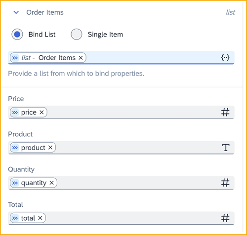

    You'll also notice that the warning for the approval form disappeared. 

3. Click the **Approval Notification** form, and configure as follows:

    | Tab | Field | Source/Binding |
    |-----|-------|----------------|
    | **General** | **Subject** | `Your order was approved: ` and then click in the box and select **Process Inputs > Order ID**. 
    | **General** | **Recipients > Users** | Click in the box and select **Process Metadata > Process Started By**. 

4. We can send the same approval form for when the request should be automatically approved.

    Under the **If** of the **Condition** step – meaning, the request is for a small amount of money – click the plus sign, **+**.

    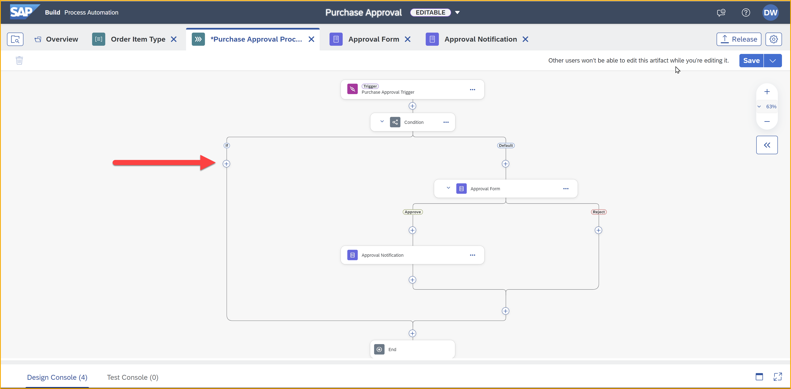

    Select **Form**, and instead of creating a new form, select **Available Forms > Approval Notification**.

    

    It is added as **Approval Notification 1**.

5. Just as we added the binding for the first notification form, we need to do the same for this one.

    With **Approval Notification 1** selected and the side panel open, configure the step as follows:

    | Tab | Field | Source/Binding |
    |-----|-------|----------------|
    | **General** | **Subject** | `Your order was AUTOMATICALLY approved: ` and then click in the box and select **Process Inputs > Order ID**. 
    | **General** | **Recipients > Users** | Click in the box and select **Process Metadata > Process Started By**.

    >Notice we made different subjects for each of the 2 instances of the notification form.

6. Click **Save**.


### Release and Deploy
When you are complete with the changes to your project, you must release and deploy another version.

1. Click **Release**.

    Since this is your second release, you see an option to describe the nature of the new release (e.g., major or minor), and to provide a comment on what has changed.

    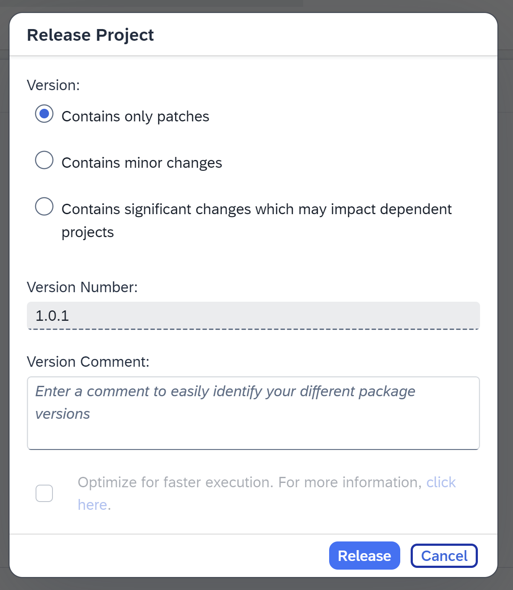

    Accept all the settings and click **Release**.

2. Click **Deploy**.

    Select the **Public** environment and click **Upgrade**.

    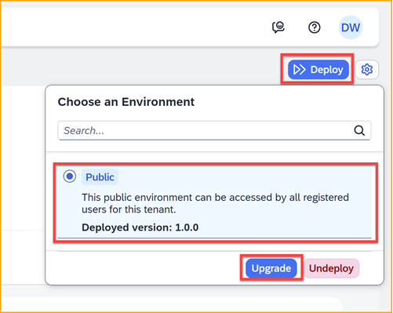

3. In the **Effect on Triggers** dialog, click **Deploy**.
    
    

    The project will now show as version 1.0.1.

    


### Test the process
1. Go back to the **Monitoring** section in the SAP Build lobby menu.

    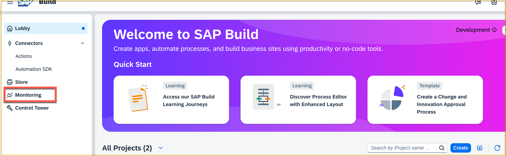

2. Under **Manage**, click **Processes and Workflows**.

    

    This area shows you all the processes that have been deployed.

3. Select your process, and then click **Start New Instance**.

    This opens the dialog that lets you trigger a process – for testing  – without using a form, API call, or external event.

    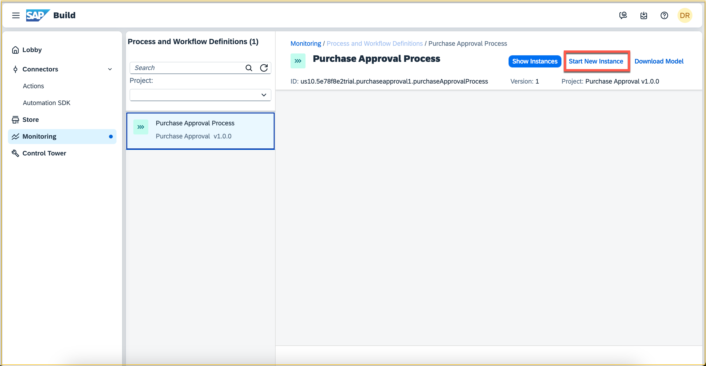

5. In the dialog, delete the JSON and replace it with the following:

    ```JavaScript
    {
    "businessPartner": "11",
    "newStatus": "APPROVED",
    "orderId": "100000",
    "total": 500,
    "orderItems": [
        {
            "product": "Pencils",
            "quantity": 2,
            "price": 14.5,
            "total": 29
        },
        {
            "product": "Pencils",
            "quantity": 2,
            "price": 14.5,
            "total": 29
        }
        ]
    }
    ```

6. Click **Start New Instance and Close**.

    If all goes well you will get a message **Instance started**.

>**Potential problems**
>
>- If you do not provide all the values that are used in the process (i.e., in one of the bindings or steps), then you will get an error.
>
>- If you provide a number value as a string, or a date value in the wrong format, you will get an error.


### Monitor the Process  
Once triggered, you can monitor the process instance from the **Monitor** section of the **Monitoring** tab.

1. You can use the shortcut of the **Show Instances** from the **Manage** tab to show your instances.

    Since this process instance added notifications and approval step, it won't automatically be completed and you will see it with the default filter.

    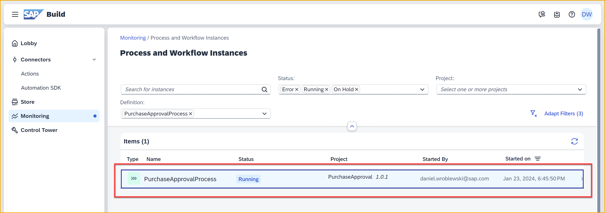

3. Click on your process instance.

    In the details section, you will see:
    
    - Status is **running**.
    - Under **Logs**, you can see a condition was completed, and you can see that because the total was under 1000, it was automatically approved.
    - Under **Context**, you can see all the data you provided in the JSON when you started the instance.
    
    

4. Open the Inbox by clicking the **My Inbox** icon in the header.

    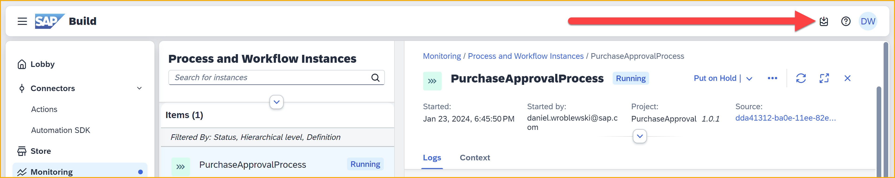
    
5. In your inbox, you will see a list of forms on the left. 

    Since you only have 1, it is already open, and you can see that the automatic approval notification was sent (no approval is needed).
   
    

    In addition, there is a **Submit** button at the bottom of the item so you can mark this notification as complete.

    Click **Submit**.

    >Once you complete a form, it is removed from your inbox.

6. Now go back to the previous browser tab and go to the  **Monitoring** tab of the SAP Build lobby. 

    You can use the **Refresh** icon to get the latest information.

    

    In the logs, you can now see that you the notification was completed, and therefore the process instance is completed.
    
    You can also see the status is now **Completed**.
    
7. You can test the process again – go back to **Monitoring > Manage**, click your process and click **Start New Instance** – this time with the following JSON, which has an amount above 1000, meaning it will require an approval: 

    ```JavaScript
    {
        "businessPartner": "11",
        "newStatus": "APPROVED",
        "orderId": "100000",
        "total": 1500,
        "orderItems": [
        {
        "product": "Pencils",
        "quantity": 2,
        "price": 14.5,
        "total": 29
        },
        {
            "product": "Pencils",
            "quantity": 2,
            "price": 14.5,
            "total": 29
        }
        ]
    }
    ```

    Now if you go to check your latest instance, you will see that the approval step is activated.

    

    And if you open the Inbox and refresh, you will now have an approval form with **Submit/Reject** buttons at the bottom.

    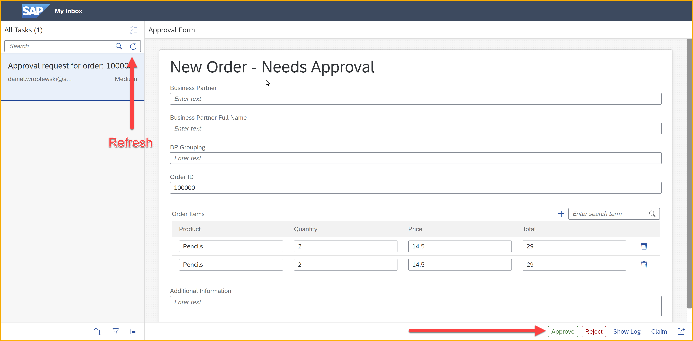