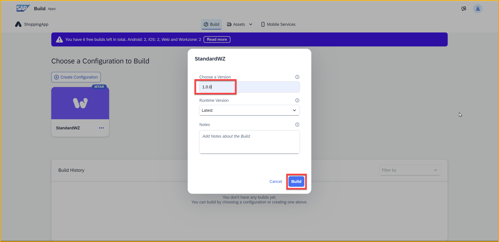
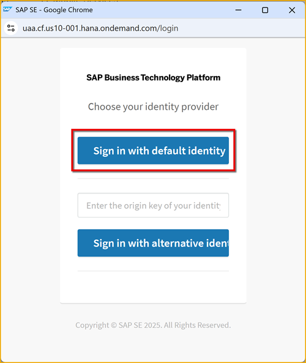

  
 

# 7 - Build and Deploy App to BTP
<!-- description --> Build your app and deploy it to SAP BTP, as part of the SAP Build CodeJam.

## Prerequisites
- You have completed the previous tutorial for the SAP Build CodeJam, [Add Approval Flow to Process](codejam-06-spa-approval).

## You will learn
- How to compile/build your app to an MTAR file
- How to deploy your app to SAP BTP

## Intro

### Build your app
1. Open your **ShoppingApp** SAP Build Apps project.

2. Click **Publish**.

    Click **Build and Deploy**.

    

    The build screen is displayed.

    
   
2. Click **Create Configuration**.
   
    

3. Click **SAP Build Work Zone**.

    

4. For the name of the configuration, enter: `StandardWZ`

    

    Click **Create**.

5. Click the 3 dots on the new configuration, and select **Build**.

    

    Enter `1.0.0` for the version, and click **Build**.

    

    The build will start, and you will see **Building** as the status.

    

    It may take about 6 minutes to finish, so this is a time for questions and coffee and cake. ☕🍰

    When complete, you will see the **Delivered** status.

    

### Deploy your app
1. Click on the row with your successful build.

    

2. Click **Deploy**.

    

3. Select the Cloud Foundry endpoint for your SAP BTP. 

    You can see your landscape by going to the SAP BTP cockpit, on the **Overview** tab, and see the URL for your Cloud Foundry environment.

    

4. Click **Login with BTP**.

    

    Click on your user.

    

    This will log you into Cloud Foundry. Click **Authorize**.

    

    Select your Cloud Foundry organization and space – to where you are deploying. If you are using a trial account, you likely will have just one organization and space.

    

    Click **Continue**.

    You should get a progress bar. It should take about **60 seconds** to complete.

    

5. When the deployment finishes, you should get a URL to your deployed app.

    

    If you click the link, your app should be displayed.

If you lose the link to your app, you can see all your deployed apps in your trial account, under **HTML5 Applications**.

