  


# 7 - Trigger Process from Your App
<!-- description --> Enable your app to call the SAP Build Process Automation API in order to trigger your process, as part of the SAP Build CodeJam.


## Prerequisites
- You have completed the previous tutorial for the SAP Build CodeJam, [Add Approval Flow to Process](codejam-06-spa-approval).


## You will learn
- How to create a destination for SAP Build Process Automation
- How to trigger a process from an SAP Build Apps application


## Intro
You have so far created an app to let users browse a product catalog and add items to their shopping cart. And you have created a process for approving the purchase.

Now you will connect the app to the process.


### Create destination for SAP Build Process Automation

To connect Build Apps to Process Automation a destination needs to be created for the Build Process Automation from the SAP BTP Cockpit.


1. Go to your SAP BTP cockpit, enter your **trial** subaccount, and on the left select **Instances and Subscriptions**.
   
2. Under **Instances**, find your instance of the SAP Build Process Automation service.

    

    On the right, click the three dots, and then select **Create Service Key**.

    <!-- border -->
      

3. Enter the name for service key as `spa-key` and choose **Create**.

    <!-- border -->
      

    The service key is created and you can view the credentials by clicking **View**.

    <!-- border -->
      

    When viewing the service key, make note of the following, which you'll need for the destination.

    - **api**
    - **clientid**
    - **clientsecret**
    - **url**

    These values are needed next for the **Destination Configuration**.

    

4. Download the destination definition.

    Click this [`sap_process_automation_service_user_access`](https://github.com/sap-tutorials/sap-build-apps/blob/main/tutorials/codejam-07-connect-app-process/sap_process_automation_service_user_access) link to the GitHub download page for the destination, and then click the download button in the GitHub menu.

    

5. In the SAP BTP cockpit, click **Connectivity >  Destinations**.

    <!-- border -->
    

    Click **Import Destination**, and then select the `sap_process_automation_service_user_access` file you downloaded.

    <!-- border -->
    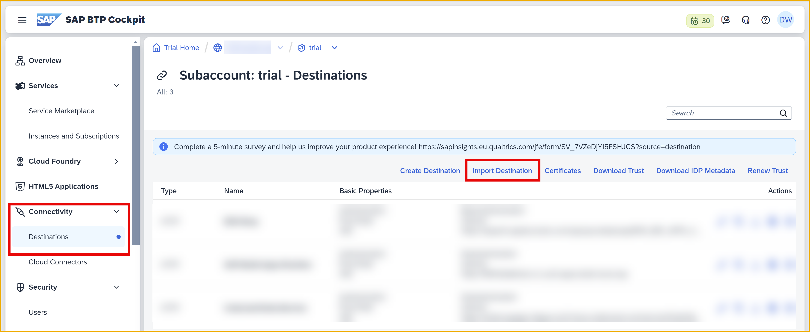

    The draft destination will be filled in except for the credentials and URLs.

    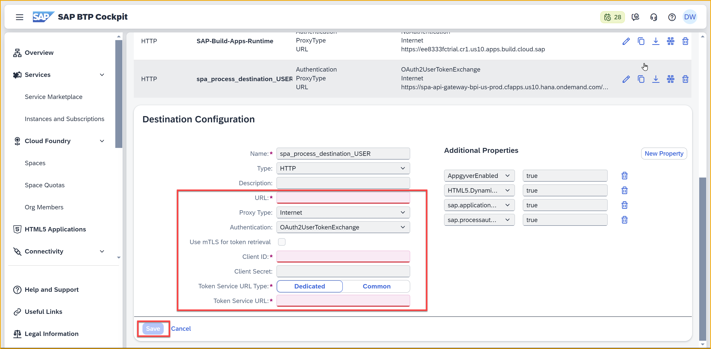

8. Enter values for the following fields, based on the service key information you saved earlier. 

    | Destination Field | Value from Service Key |
    |--------------------|--------------|
    | Client ID | **clientid**  |
    | Client Secret | **clientsecret**  |
    | Token Service URL | **url** + `/oauth/token`  |

    >The skeleton destination you imported assumes you are using US10 region and setting the **URL** field accordingly. Double-check the **URL** field in the destination, which should be the same as the **api** field in your service key.

    Select **Use default JDK truststore**.

    Click **Save**.

If you click **Check Connection**, you will get a 401 response code. This is OK and you have **successfully** created the destination


### Publish your process
In order to trigger a process from SAP Build Apps, you must first publish the process – which makes the process discoverable from an SAP Build Apps project.

1. Open the SAP Build lobby.  

2. In the 3 dots menu next to your project, select **Publish to Library**.

    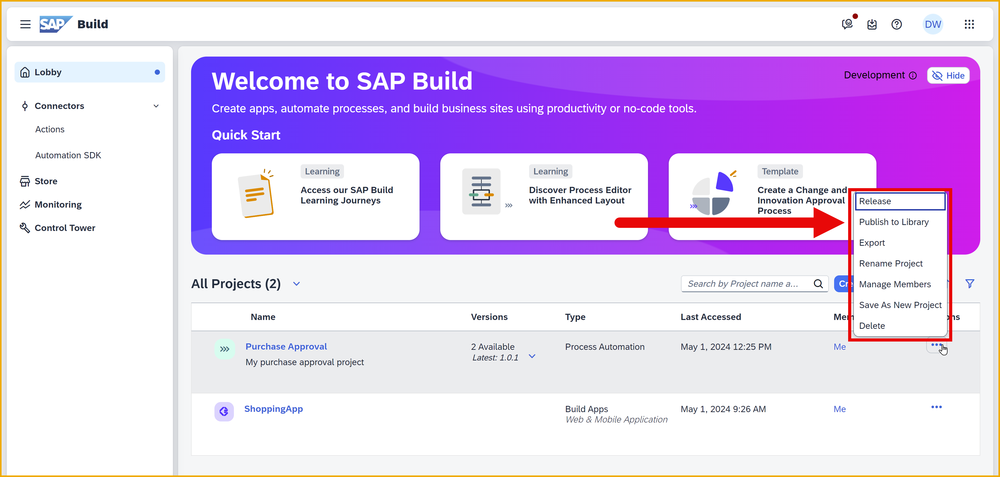

    A dialog lets you specify the version and other parameters. No need to change anything.
    
    Click **Publish**.

    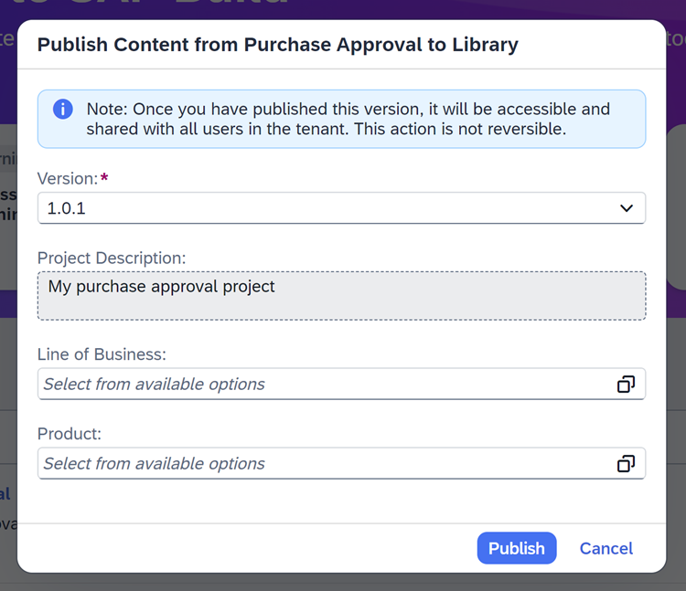

    You should get a dialog that the process was published.

    


### Enable the process
The process is published, but we need to reference it in our SAP Build Apps project.

1. In your SAP Build Apps project, go to the **Data** tab.

2. Click **Add Integration**

    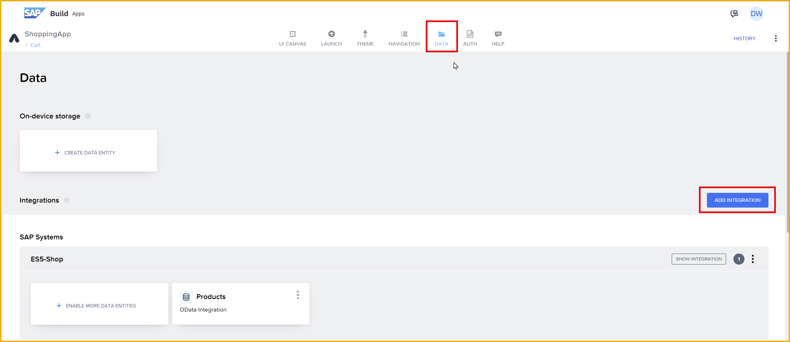

    Select **Library**.

    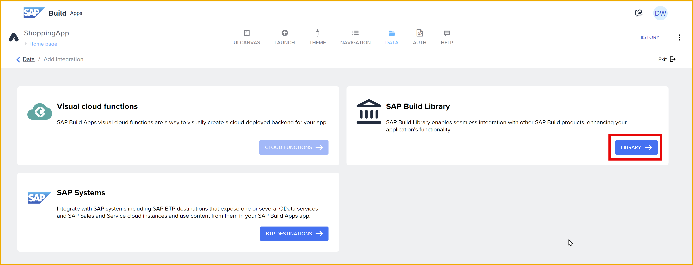

    You should now see your process you published.

    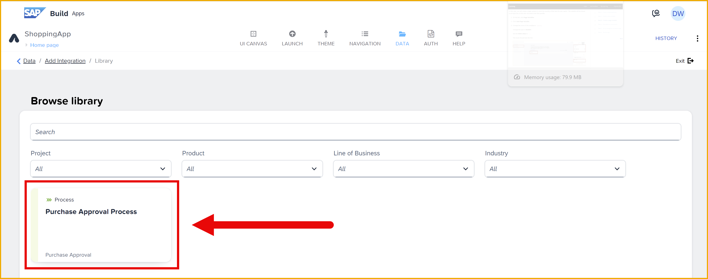

3. Select the process.

    On the left you will see actions available for this process, and he relevant inputs and outputs. For **Trigger process**, the inputs correspond to the inputs you created inside the process.

    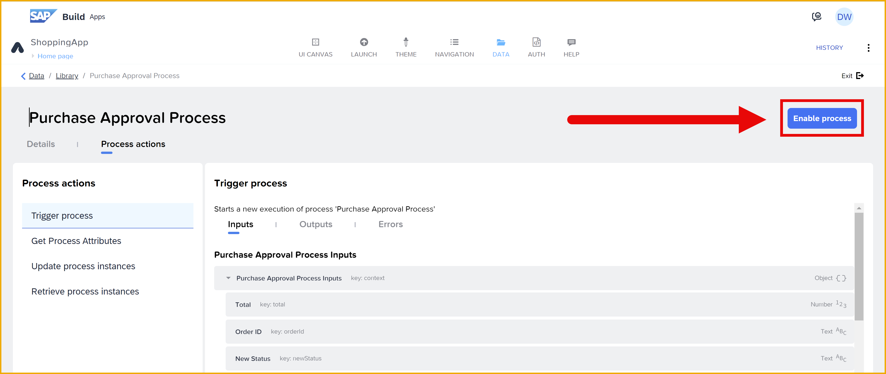

    Click **Enable Process**.

    Click **Save**.


### Create trigger of process
Now that you enabled the process, let's set up the logic to trigger it.

1. Click **UI Canvas**.

    Go to the **Cart** page.

2. Click on the **Purchase** button.

    Open up the button's logic canvas.

    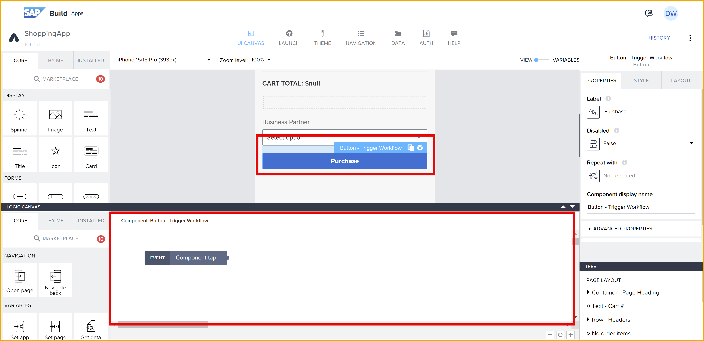

3. From the **Core** tab on the left, drag a **Trigger process** flow function onto the canvas, and connect it to the **Component Tap** event.

    The process should automatically have your process selected for the **Process** field.

    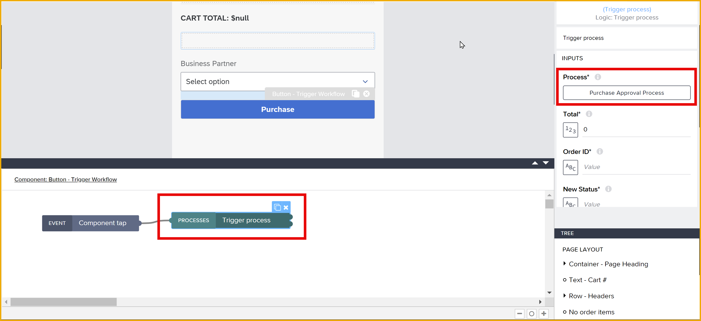

4. You now need to bind all the fields that the process needs.

    Under **Input Parameters**, click **Custom object**, and set the following:

    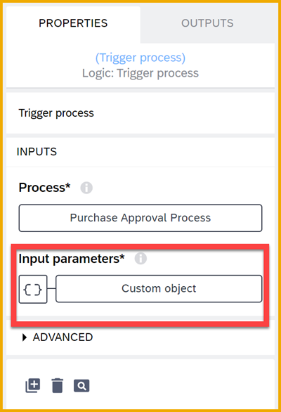

    | Field | Binding |
    | ----- | -------|
    | **orderId:** | Set to **Date and Variables > App variable > orderID** |
    | **newStatus:** | `APPROVED` |
    | **total:** | Set to the following formula: `SUM(MAP(data.OrderItems1,item.price * item.quantity))` |
    | **orderItems:** | Set to the following formula: `MAP(data.OrderItems1, {product: item.product, price: item.price, quantity: NUMBER(item.quantity), total: item.price * item.quantity})` |

    >You use a formula because you have to modify the data slightly before sending. Specifically, the quantity from the input box component is a string and you need to convert it to a number.

    Leave **businessPartner:** empty for now.

    Click **Save**.

5. Add **Update record** (for updating the CAP service) and **Alert** flow functions, as follows:

    

6. Configure the **Update record**, which is called to change the status of the order and set its total field, as follows:

    - **Resource name:** Set to **Orders**.

    - **ID:** Set to **Date and Variables > App variable > orderID**

        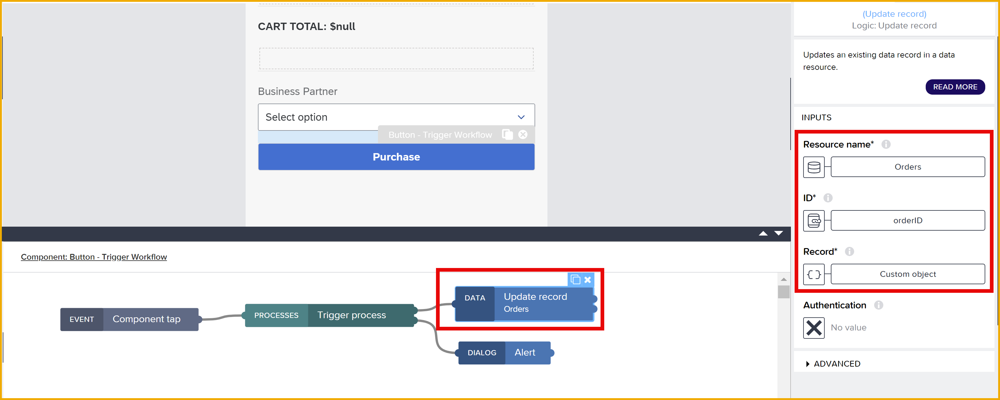

    - **Record:** Click **Custom object** and set the fields as follows:

        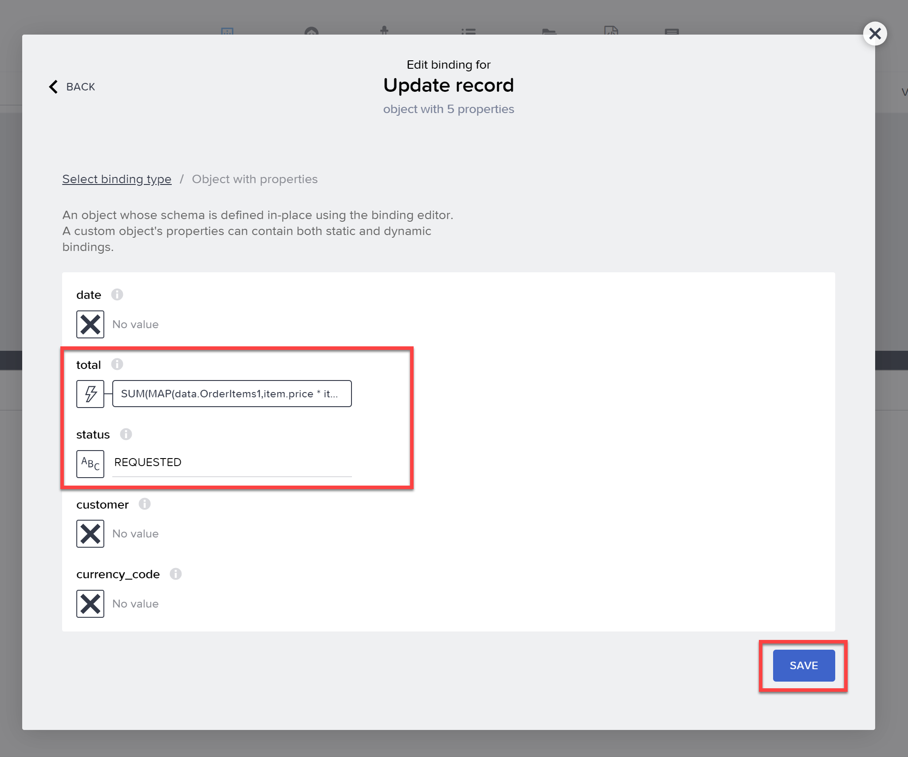

        - **status:** Set to **Static text** with value `REQUESTED`
        - **total:** Set to the following formula:

            ```JavaScript
            SUM(MAP(data.OrderItems1,item.price * item.quantity))
            ```
        
        Click **Save**.

7. Configure the **Alert** by setting the **Dialog title** to **Output value of another node > Trigger process > Error > message**.

    Click **Save**.

    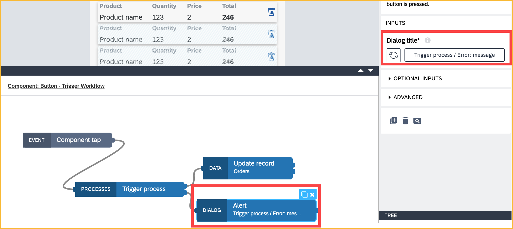

8.  Click **Save** (upper right).


### Add reset logic
In the same logic for the button, you want to:

- Alert the user that the purchase was successful
- Reset the cart ID (since it cannot be used anymore)
- Reset the items in your data variable.
- Go back to the home page

Update the logic as follows.

1. In the same logic for the button, add these additional flow functions and connect them as shown:

    

2. Configure the **Alert** by setting the **Dialog title** to static text:

    ```Text
    Order requested. Returning to Home Page.
    ```

3. Configure the **Set app variable** as follows:

    - **Variable name** to `orderID`.

    - Leave the **Assigned value** blank.

4. Configure the **Open page** as follows:

    - **Page** to `Home page`.

5. Click **Save** (upper right).

>There is no need to do anything for the **Set data variable**, since the data variable is automatically set to **OrderItems** since it is the only data variable for this page. And since you want to blank it out, the **Record collection** can be left as set to nothing.


### Test app
1. Run your app again (see the **Launch** tab).
   
2. In the navigation bar on the left, click **Cart**.

    >You should already have something in your cart. If not, go back to the home page and add something to your cart.

    >No need to select a business partner.

3. Click **Purchase**.

    If all goes well, you should get a confirmation box.
    
    

    If you navigate to the **Cart** page, you'll see there is nothing in your cart (and if you are really sharp, you'll notice that the UUID for your cart has changed).

3. Now go back to the **Monitoring** tab and you should see that your app started an instance of your process.

    And if it is over 1000 for the total, it will set off the approval form. You will see your order ID in the title.

    

    Pretty cool, no?

    Now go to your inbox, and you see a new approval form, this time with your orderID in the title.

    

    In the form itself, you'll see the order ID and the order items.

    Click **Approve** (the form should disappear), and then refresh the list of tasks. Now you should see the approval notification, with the same order ID. 

    