  
 

# 8 - Create a Work Zone Site and Embed Your App
<!-- description --> Create a site for accessing your application using SAP Build Work Zone, standard edition, as part of the SAP Build CodeJam.

## Prerequisites
- You have completed the previous tutorial for the SAP Build CodeJam, [Add Approval Flow to Process](codejam-06-spa-approval).

## You will learn
- How to create an SAP Build Work Zone site
- How to embed your shopping app in your site

## Intro

### Open SAP Build Work Zone, standard edition
1. In the SAP Build lobby, click **Create > Create**.

    

2. Select **Build a Business Site**.

    

3. Select **Configure Site in Admin Console**.

    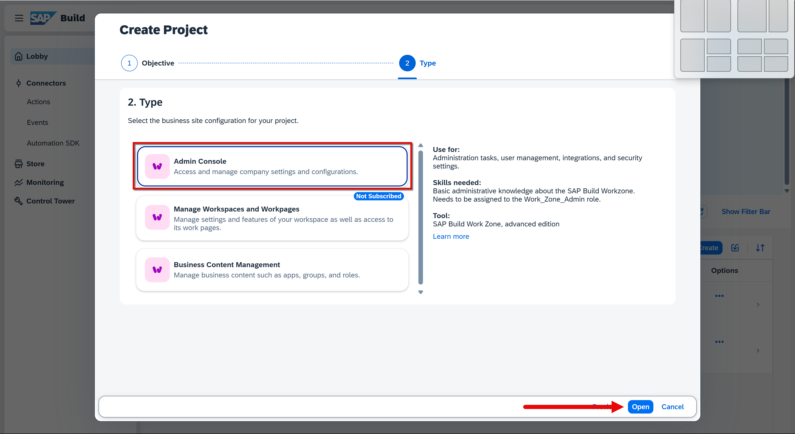

    The Admin Console opens.

    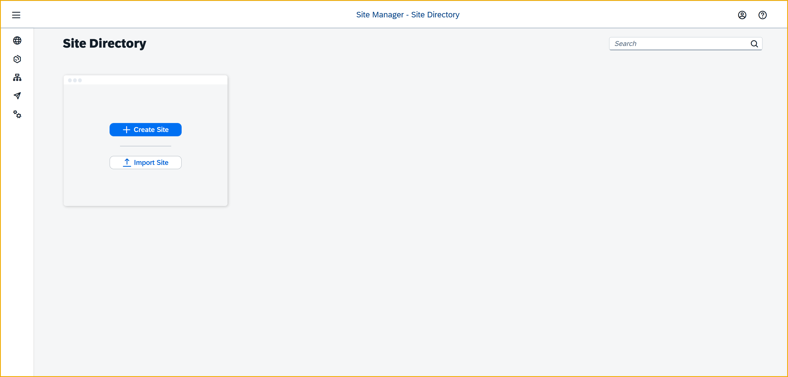

### Create Site

1. Click **Create Site**.

    

2. Enter `Purchasing` as the site name, and click **Create**.

    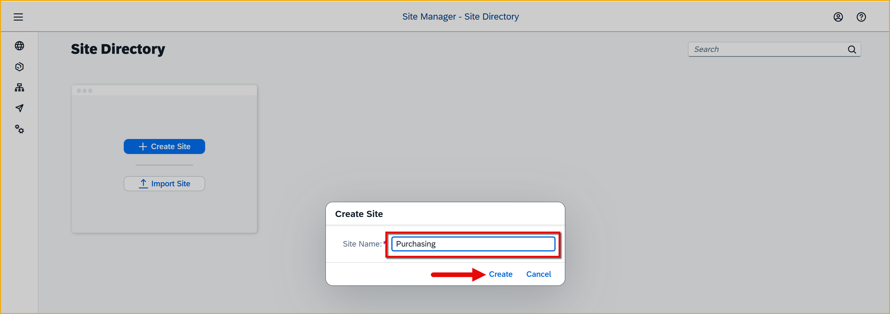

    The site settings screen is displayed.

3. Click **Edit** in the top-right corner.

    

4. Under **Display**, select **Spaces and Pages - New Experience**.

    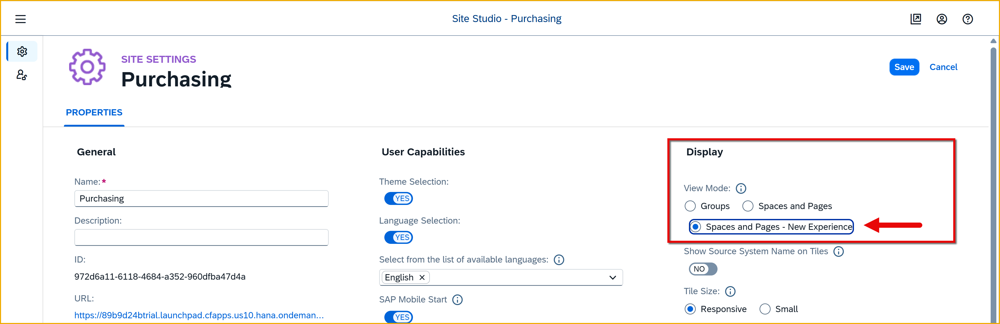

4. Click **Save**.

5. Go back to the site directory.

    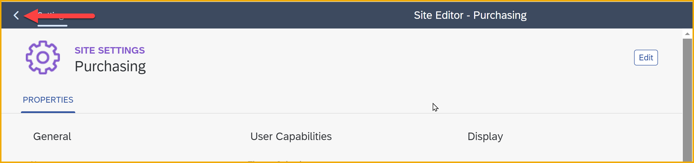

    You will see your new site tile.

    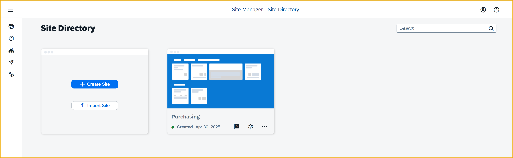

### Refresh HTML5 apps

1. Open the Channel Manager.

    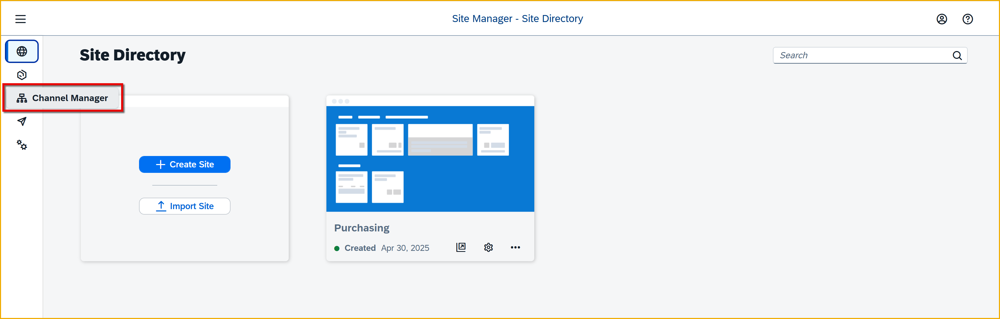

2. Click the **Update Content** icon.

    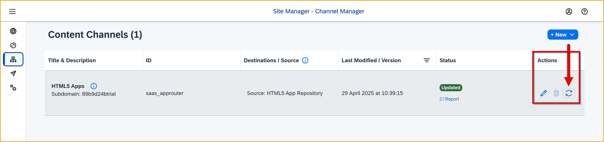

    It will take a few minutes to update. When **Updated** is displayed, continue to the next step.

 

### Add app to work zone
1. Open the Content Manager.

    

2. Click **Content Explorer**.

    

3. Click **HTML5 Apps**.

    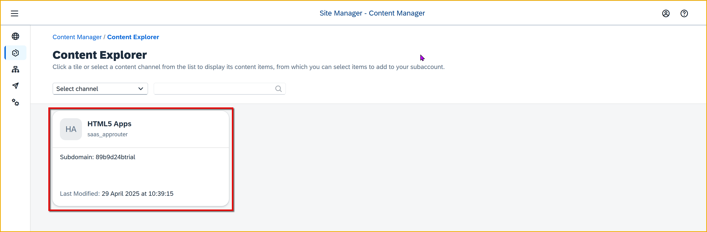

4. Select your **ShoppingApp**, and then click **Add**.

    

5. Use the breadcrumb to go back to the **Content Manager**.

    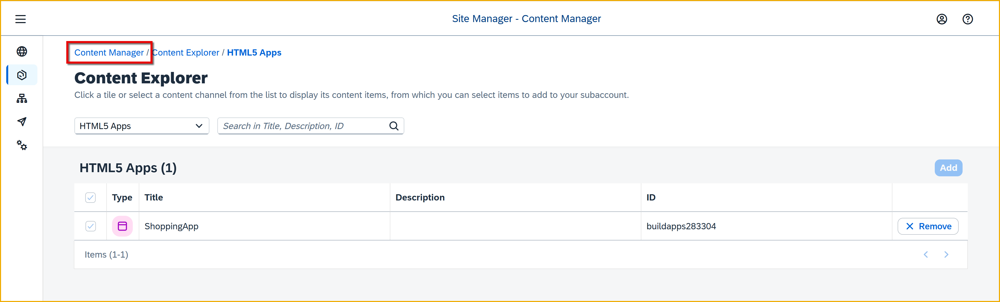

    There you will see your app.

    

### Assign app to everyone
1. In the **Content Manager**, click on the **Everyone** role.

    

2. Click **Edit**.

    

3. In the **Assignment Status** column for your app, toggle the switch to on (green).

    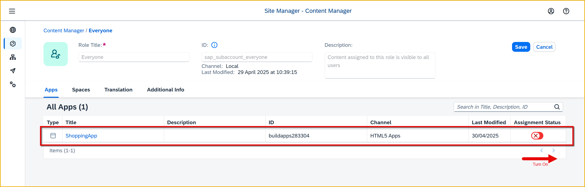

4. Click **Save**.

### Create a page
1. Go back to the **Content Manager** with the breadcrumb.

    Click **Create**, and then **Page**.

    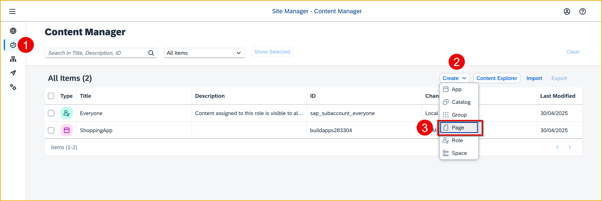

2. Set the title to **Overview**.

    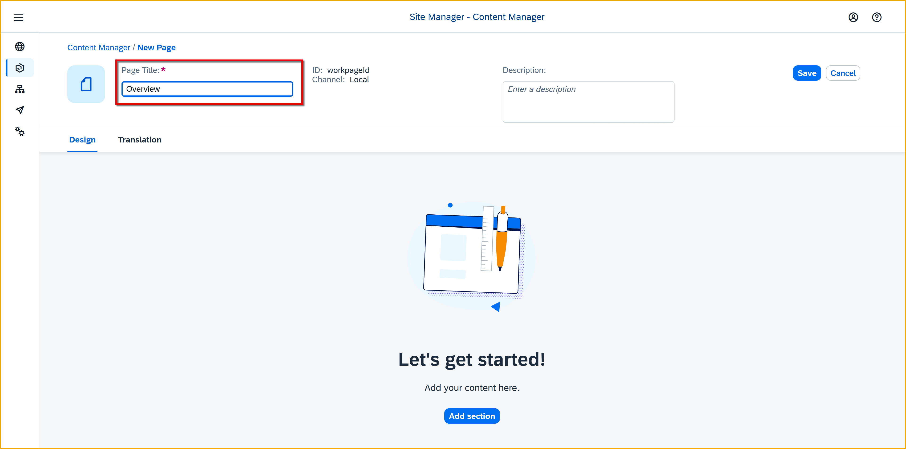

3. Click **Add Section**.

    Call the section **Purchasing**.

    

4. Click **Add Widget**.

    Select **Tiles**.

    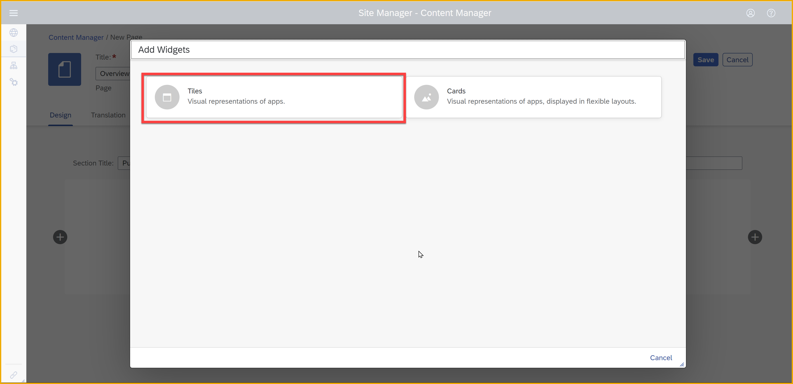

5. Select **ShoppingApp**, and then click **Add (1)**.

    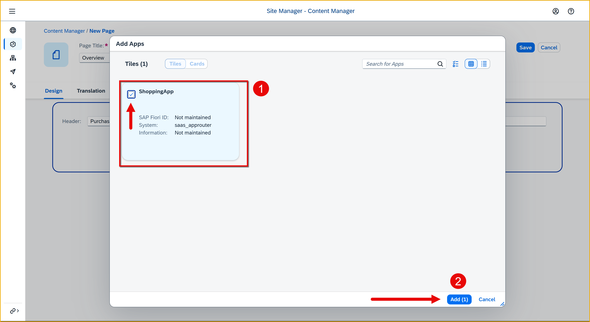

6. Click **Save** for the page.

You get a preview of the page.

### Create a space
1. Go back to the **Content Manager** with the breadcrumb.

    Click **Create**, and then **Space**.

    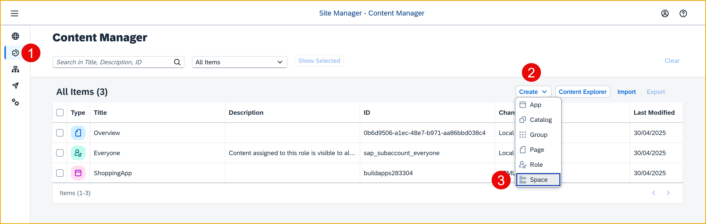

2. Set the title to **Home**.

    

3. In the Pages tab, for your page, toggle the **Assignment Status** column to assign (green).

    

4. Click **Save**.

### Add space to Everyone
1. Go back to the **Content Manager** with the breadcrumb.

    Double-click **Everyone** to open it.

    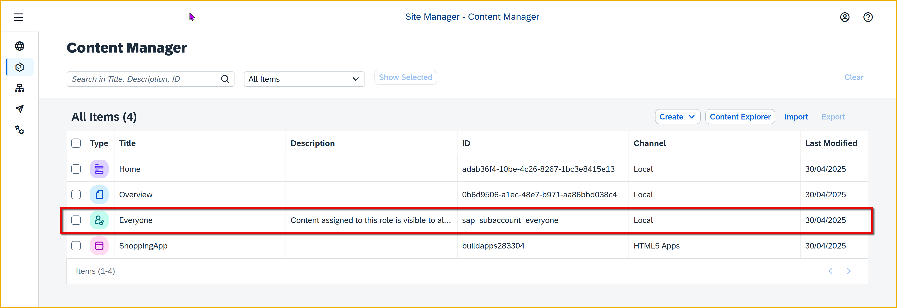e

2. Click **Edit**.

3. Under **Spaces**, toggle the **Assignment Status** column for your new space, so it is on (green).

    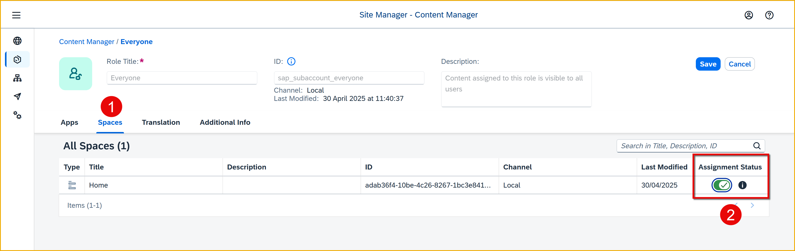

4. Click **Save**.

### Open your site
1. Go to the Site Directory.

2. Open your site.

    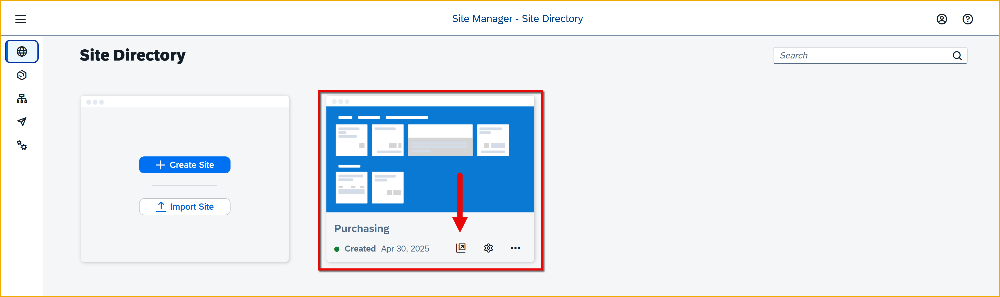

    You'll see your site, space, page, and app.

    

3. Click the tile, and your app should open.

    You will see at the top the navigation from SAP Build Work Zone to return you to your site.

    

