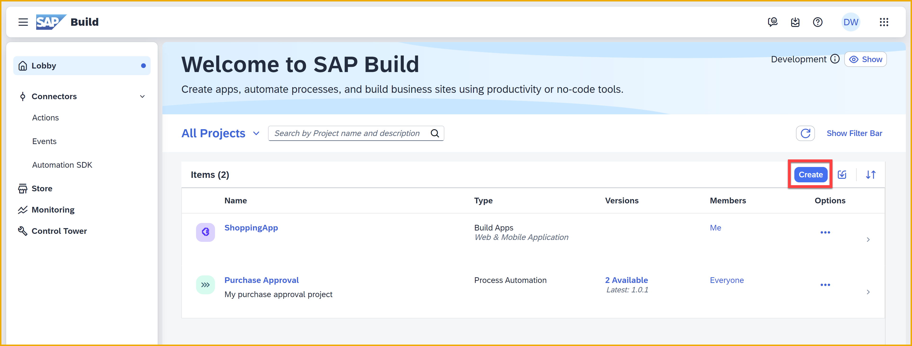
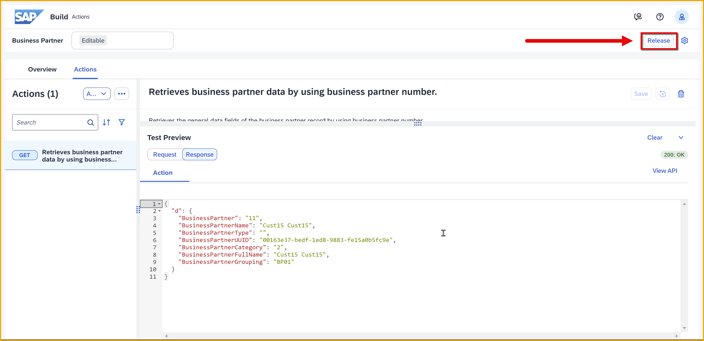
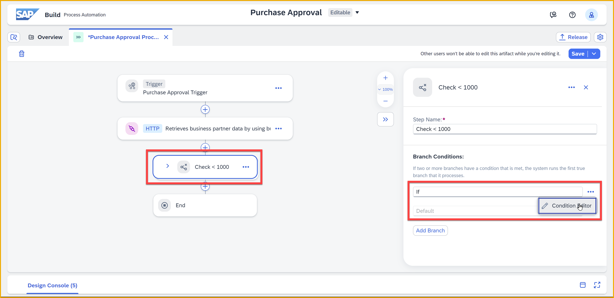
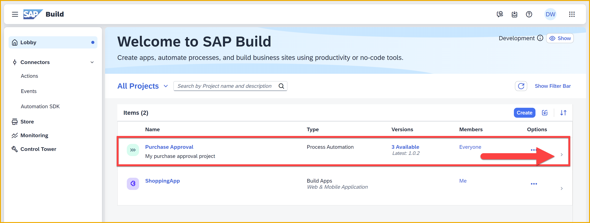
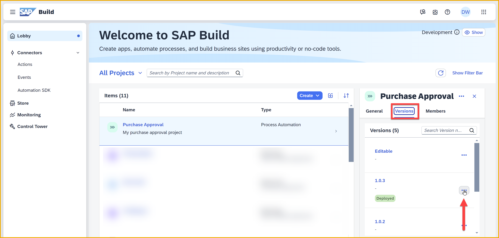

   

# 9 - Create Action to Get Data from SAP S/4HANA Cloud
<!-- description --> Create an action project to retrieve SAP S/4HANA Cloud data and call the action from your business process, as part of the SAP Build CodeJam.

## Prerequisites
- You have completed the previous tutorial for the SAP Build CodeJam, [Trigger Process from Your App](codejam-08-work-zone-app).

## You will learn
- How to create destination to SAP S/4HANA Cloud demo APIs on SAP Business Accelerator Hub
- How to create and publish an action project
- How to consume an action from a process

## Intro
Actions are SAP Build artifacts that you can create to connect processes and apps to external systems, be it SAP or non-SAP. This is an important piece of the puzzle especially if you want to extend or automate any of your business processes existing on systems like SAP S/4HANA, SAP Ariba and SAP SuccessFactors.

In this tutorial, you will create an action project based on the Business Partner API of SAP S/4HANA Cloud, using the demo service exposed on the SAP Business Accelerator Hub. Specifically, you will:

- Set up a destination to the API.
- Send a business partner ID from your app to your process.
- Retrieve data about that business partner from inside the process.
- Make decisions in the process based on the retrieved data.

 

### Create destination for SAP S/4HANA Cloud 
In order to access the demo SAP S/4HANA Cloud business partner API on the **SAP Business Accelerator Hub**, you need to create a destination.

1.  Go to the [SAP Business Accelerator Hub](https://api.sap.com/) and log in (or create a free account)

    

    On the top-right, click your avatar, and then click `Settings`.
    
    
    
    Click `Show API Key`.

    

    Save the key for later.

    

    >The last time we tested, the **Copy Key and Close** button did not work, so you may have to select the key and copy it manually.

2. Download the destination definition.
   
    Click [S4HANA-Hub-Public](https://github.com/sap-tutorials/sap-build-apps/blob/main/tutorials/codejam-09-action-get/S4HANA-Hub-Public), and then click the download button.

    

2. In the SAP BTP cockpit, click **Connectivity >  Destinations**.

    <!-- border -->
    

3. Click **Import Destination**, and then select the `S4HANA-Hub-Public` file you downloaded.

    <!-- border -->
    

    The draft destination will be filled in except for your API key.

    

    Enter the key (you saved earlier from the SAP Business Accelerator Hub).

    Click **Save**.

If you click **Check Connection**, you will get a 401 response code. This is OK, and you have **successfully** created the destination.

>To learn more about the [SAP Business Accelerator Hub](https://api.sap.com/) and how to set up destinations for any API, watch this video from **Daniel Wroblewski**. 

><iframe width="560" height="315" src="https://www.youtube.com/embed/11TUQgQi-9k" frameborder="0" allowfullscreen></iframe>

### Enable destination in processes
SAP Build Process Automation enables administrators to control which destinations – and, therefore, which backend systems – can be connected to processes during runtime. 

In this step, you will enable the destination to be used in your processes.

1. Go to the SAP Build main page.

2. Go to **Control Tower**, and then click **Backend Configuration > Destinations**.

    

3. Click **Add**.

    

    Select your destination, **SHANA-Hub-Public**.

    Click **Next**.

    

    On the second screen, keep the settings to allow the destination in **All Environments**.

    Click **Add Destination**.

    
    
    The destination will be added to the list of destinations that can be used within your processes.

    

### Create action project
1. In the SAP Build lobby, click **Connectors > Actions**.

     

    Click **Create**.

     
                
2. Choose **OData Destinations** as the API source.

     

3. Choose **S4HANA-Hub-Public**.
    
     

    >**Why do I see the CAP service?**
    >
    >You might be wondering why you see the CAP service here, when you only added the SAP S/4HANA service in the Control Tower.
    >
    >In the Control Tower, you added the destinations that could be used during runtime – and the `sap.processautomation.enabled` additional property in the destination enables the administrator to select it for runtime.
    
    >But destinations have a second property that indicates whether they should be shown in the actions setup screens, `sap.applicationdevelopment.actions.enabled`. When you set up your destinations, you added this to both the CAP and SAP S/4HANA destinations.

    You will now see all the APIs contained in the Business Partner service, including those for the `A_BusinessPartner` entity. Expand **A_BusinessPartner** to see the specific APIs available.

     

    >This screen is just to show you the APIs available – you do not have to select anything.

    Click **Next**.

4. Enter:

    - `Business Partner ` for the **Name**

    - `API to read Business Partner from SAP S/4HANA Cloud` for the **Description**

    Click **Create**.

     

    After about a minute, the action project will be created and open.
    
    You will now see all the APIs in the service, so that you can select the ones you want to include in this action project.

5. Expand the **A_BusinessPartner** entity.   

    >It might help to select the **GET** filter and search by `retrieves business partner data`.

    >

    Select the **GET** operation that is called **/A_BusinessPartner('{BusinessPartner}')** with the description **Retrieves business partner data by using business partner number** (see screenshot above).  
   
    >Be careful! There are a lot of APIs that look the same. Use the search to help make finding the right one easier.

6. Click **Add**.

    The action project **Business Partner** opens under a new tab.

     

    >The action will open with the selected APIs. You can always go back and add additional APIs to expose.

### Configure action project
You have now created an action project and selected the API to expose. But now you must configure – for example, what inputs to require, what outputs to return, and what OData parameters to include.

Your action should be open to the **Retrieves business partner data by using business partner number (GET)** API, and you should see the **Input** tab.

1. Click the **Output** tab. 

    Under **Body**, select all the fields by selecting the checkbox next to **d**.
    
    Then expand the node and deselect only the needed fields highlighted in the screenshots below.
  
     

    

      

2. Scroll back up, and click **Remove**.

    

    Confirm **Remove**.

     

    Under **Body**, you will now see only the needed fields.

     

3. Click **Save**.

4. Click the **Test** tab.

    Select your **Destination** from the dropdown value, **S4HANA-Hub-Public**.
    
    Under **Test Input Values**, set **BusinessPartner** to `11`.
    
    Click **Test**.

     

    You should get a **200:&nbsp;OK** response, and see the data from the demo API.

     

### Release and publish action
To make the action available to your processes, you must release and publish the action.

1. Click **Release**.

    >If **Release** is disabled, make sure you've saved the project.

     

    Click **Release** again, to confirm.

     

    The action project status is changed to **Released**. 

2. Click **Publish**.

    

    Click **Publish** to confirm. 

      

    Now the action project status is changed to **Published**.

     

    Go back to the SAP Build main page, refresh the page, and under **Actions** you can see your action and its released version.

     

    >If it's not updated, you can refresh the page or refresh the list with the refresh icon on the top right.

### Add action to process
You've created an action to retrieve data. Now add it to the process so you can retrieve data inside the process.

1. Return to the SAP Build lobby, and open your **Purchase Approval** project.

     

2. Select the **Editable** version at the top, and then under **Overview > Artifacts**, click **Purchase Approval Process**. 

     

    Click the plus sign, **+**, just below the API trigger block.

     

3. Click **Action**. 

     

    Choose **Browse All Actions**.
    
     
    
    Choose your action created in the previous steps. You may want to filter by your action project -- if necessary, click **Show Filter**.
    
    

    Click **Add**.
    
    The action is added to the process flow.

    

4. With the new action block selected, go to the side panel and configure the action.

    In the **General** tab, click the **Destination Variable** field, click **Create Destination Variable**.

    

    Enter `Business_Partner_Destination` for the **Identifier**, and click **Create**.

    

    >The destination variable creates an environmental variable for the destination. That is, when the process is deployed, you can then select which destination – meaning which backend system – to use in that environment.
    >
    >You can change the destination at deployment without having to change the process itself.

5. In the **Inputs** tab, click in the **BusinessPartner** field, and select **Process Inputs > Business Partner** field.

    

    **BusinessPartner** field is now mapped.

    

6. In the **Outputs** tab, expand **result** to see all the fields that will be returned by the action and be available inside the process.

    Notice it only includes the fields you selected when defining the action.

    

7. Click the condition block, and from the side panel click the 3 dots and then **Open Condition Editor**.

    

    Click **Add**.

    

    Set this new condition as follows:
    
    | Field | Value | How to Enter |
    |-------|-------|-----|
    | 1st | **BusinessPartnerGrouping** | Select from action fields | 
    | 2nd | **is equal to** | Select from comparison options |
    | 3rd | `BP01` | Type in |
    
    At the top, under **Satisfies**, change to **Any**.
    
    You can expand **Summary** to get a verbal summary of the conditions in plain English.

    

    Click **Apply**, and then click **Save** (upper right).

    > **What's going on?**
    >
    >Previously, anything less than 1000 was automatically approved. But now, if the related business partner is in group **BP01**, those requests are also automatically approved.

8. Click anywhere on **Approval Form** block.

    In the side panel under **Inputs**, you will now bind the business partner fields because you now have data from the backend.

    Bind the following fields:

    | Field | Action Field |
    |-------|-------|
    | BP Grouping | **BusinessPartnerGrouping** | 
    | Business Partner  | **BusinessPartner** | 
    | Business Partner Full Name | **BusinessPartnerFullName** | 

    
    
8. You may see an error next to your script task.

    If you do:
   
    * Open the editor for the **Script Task**.

    * Click **Apply**.

    

1.  Click **Save** (upper right).

2.  Click **Release**.

    
   
    Confirm by clicking **Release** again.

3.  Click **Show Project Version**.

    

    Click **Deploy**.

    Select the **Public** environment, and click **Upgrade**.

    

    The triggers that will be deployed will be displayed. There is nothing to do here but confirm.
    
    Click **Deploy**.
    
    

    Now you will see the environment variables for which you need to provide values. 

    
    
    >Previously, you did not get this screen because you did not have any variables to configure. But now you defined a variable for managing the destination, so you must select the destination for this variable for this deployment.

    Select the destination you created for accessing SAP S/4HANA.

    
    
    Click **Deploy**.

    The status of the project changes to **Deployed**. 

    

4.  Go back to the SAP Build lobby, refresh the page.

    Next to your process project, click the row of the project, or click the chevron.
    
    

    Click the **Versions** tab, and hen click the 3 dots next to the latest deployed version.
    
    

    Click **Publish to Library**.

    

    In the dialog, click **Publish**.

### Modify app to send business partner
Now that the process expects a business partner, we must change the app to provide one.

1. Open the **ShoppingApp** project from SAP Build lobby.

    

2. Navigate to the cart page.

    

3. Click **Variables**.

    Choose **Page Variables** on the left, then click **Add Page Variable > From Scratch**.

    

    Change the name of the variable to **BP**.
    
    Click **Save**.

    

    >Since you need to get a business partner from the user, and then pass it to process, you will need a place to store it.

4. Click **User Interface**.

    Click the business partner dropdown list, and bind **Selected value** to **Data and Variables > Page Variables > BP**.

    

    Click **Save** (upper right).

    >The skeleton project already had the business partner dropdown list to have 2 business partner IDs that were valid in the demo API, one with grouping BP01 and one with grouping BP02 – in order to test out the logic of our process. 

6.  Click the **Purchase** button and open its logic canvas.

    

    Click the **Trigger process** flow function.
    
    
   
    On the right, under **Input Parameters**, click **Custom object**. 
    
    In the dialog, bind **Business Partner** to **Data and Page Variables > Page Variable > BP**.

    Click **Save**.

    

    Click **Save** (upper right).

### Test app
1. Relaunch the app. 

2. Select a product.
      
    

    Change the quantity to `5` and click **Add to Cart**.

    

3. Click **Cart** in the left navigation menu.

    Select **1000000** for the business partner.

    
    
    Click **Purchase**.

    

    You should get a purchase confirmation message – it may take a minute.
    
    

4. In the SAP Build Lobby, navigate to the **Monitoring** tab.

    

    Under **Monitor**, click **Process and Workflow Instances**.

    

    Select the process you just triggered.

    

    Examine the **Log**, and you can see that the **Retrieves business partner data by using business partner number** action was executed successfully.

    

    In the process **Context** you can see that data from **S4HANA** is fetched successfully.

    

    You can also see that the last step is an approval form, waiting to be filled out -- the request is over 1000 and is not from someone in grouping BP01.

5. Open your **Inbox** by clicking he icon in the header.

    You should see an **Approve Form** task in the Inbox
     
    Open it, and you should now see that the business partner fields in the form are filled in with the backend data.

    

    Click **Approve** at the bottom of the page.
    
    Refresh your Inbox, and now you will see the approval notification form. 

    Click **Submit**.

    

6. Go back to the monitoring tab and click **Refresh**. 

    The **Purchase Approval Process** flow is now **Completed**.

    

You can test again with the other business partner to see if your purchase gets automatically approved.