  

# Create Action Project to Post Data to CAP Service
<!-- description --> Create an action project to update our CAP service and call the action from your process when the order is approved, as part of the SAP Build CodeJam.

## Prerequisites
- You have completed the previous tutorial for the SAP Build CodeJam, [Create Action to Get Data from SAP S/4HANA Cloud](codejam-08-action-get).

## You will learn
- How to create an action to update data
- How to use an action in your process

## Intro
In the previous tutorial, you created and used an action to retrieve data from an SAP S/4HANA Cloud system.

In this tutorial, you will create another action, this time to connect to our CAP service and update an entity.

### Create action project

1. Go back to the SAP Build lobby, and click **Connectors > Actions**.

    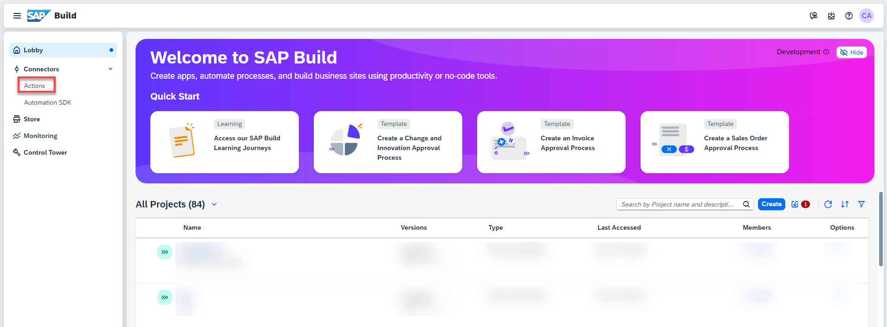

3. Choose **Create**.

    

    Select **Live API > OData Destinations**.
   
    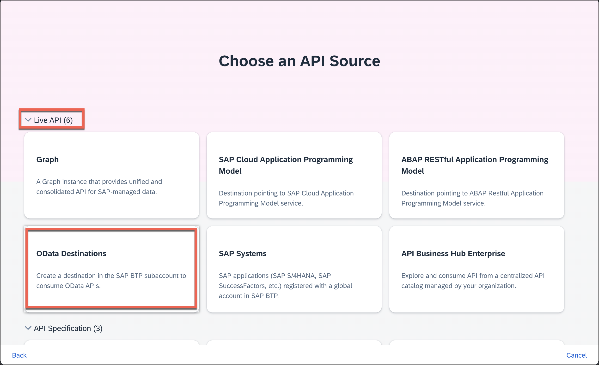

    Select **CodeJamOrdersService**.

    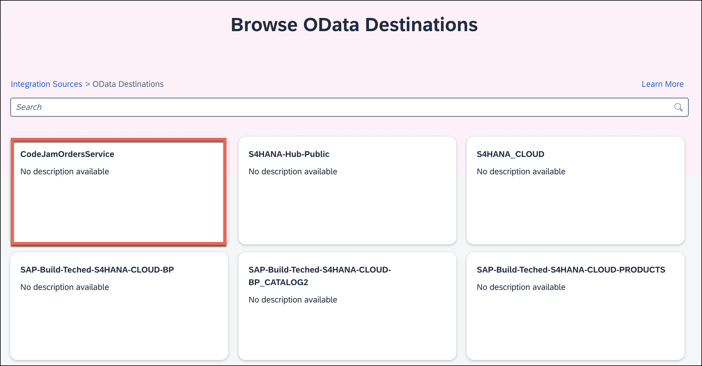
    
    >CodeJamOrdersService was already configured as a destination in the SAP BTP cockpit and hence it is visible here.

    After selecting the destination, you will see a list of all the entities and all the API calls you can make.

    Click **Next**.

4. Enter **OrderManagement-Actions** for the project name and description.
    
    Click **Create**.

    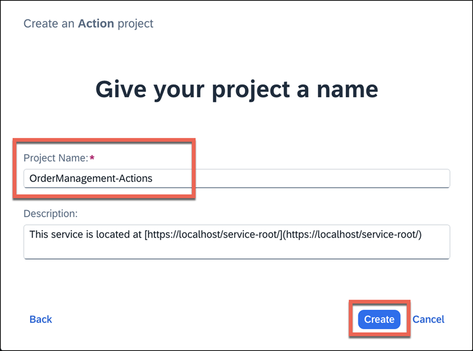

### Select actions
Now you must designed what operations you want to expose to the creators of processes.

1. In the **Orders** entity, we want to only update the **status** field. Hence, in the popup, you have to select the **Patch** method of **/Orders({ID})** API. 
    
    Select the **Filter actions** dropdown, filter option and choose **Patch**. 
    
    Now, under **Orders** there will appear just one API. Select it.

    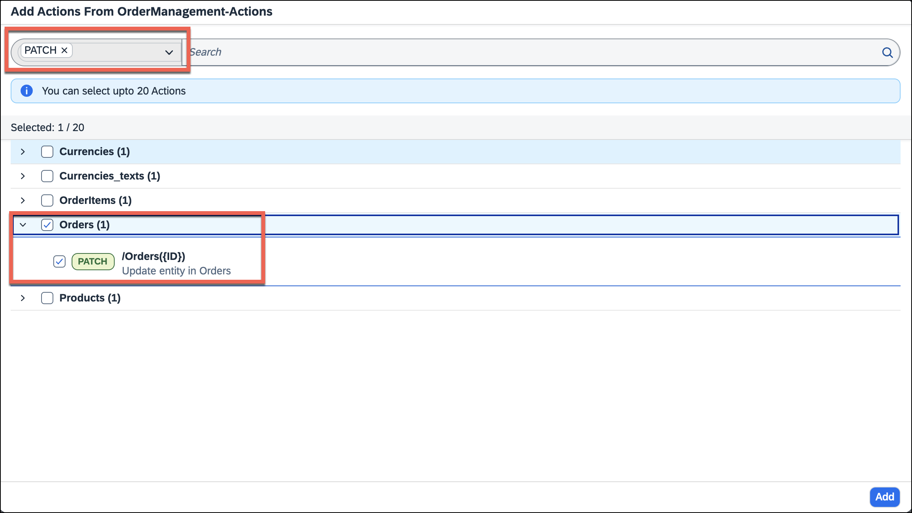

    >SAP Build Actions will open with the selected APIs. You can always go back and add additional APIs to expose.

2. Click **Add**.
   
3. Click **Save** (upper right).

### Test action

1. Once the action project is configured and saved, it is time to test the changes and output. 

    To test the API, do the following:
   
    - Click **Test** tab.

    - Under **Connectivity > Destination**, select the destination **CodeJamOrdersService** from the dropdown options.

2. Under the **Test Input Values**, enter the following values for the fields

    - ID: `6c25e827-15c2-4e7f-be1a-89fb4304d4fa`

    - status: `Approved`

    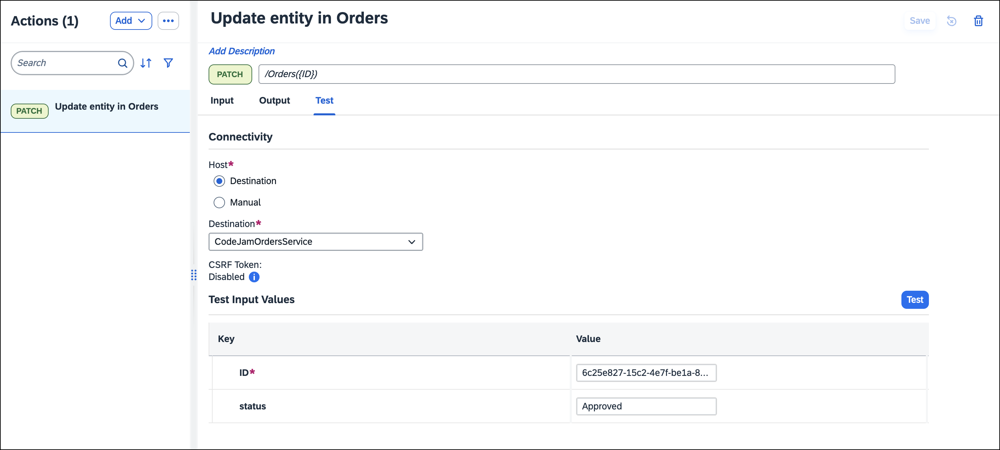
   
3. Click **Test**.

    Once the execution is successful, you should see **200 OK** response.

    >If for some reason you entered an order ID that did not exist, the service will create it, and you will get a **201 OK** status code.

>If you want to see the result of the update, you could use the following URL to see the order information (replace the **<service domain>** with the domain given in the CodeJam).

>`https://<service domain>/service/OrderManagement/Orders(6c25e827-15c2-4e7f-be1a-89fb4304d4fa)`

### Release and publish action

You will now release the action project to create version(s) and then publish a selected version in the action repository. It is these published actions that can be used in different processes to connect to external systems.

1. To release a version of the action project, click **Release** from top-right corner.

    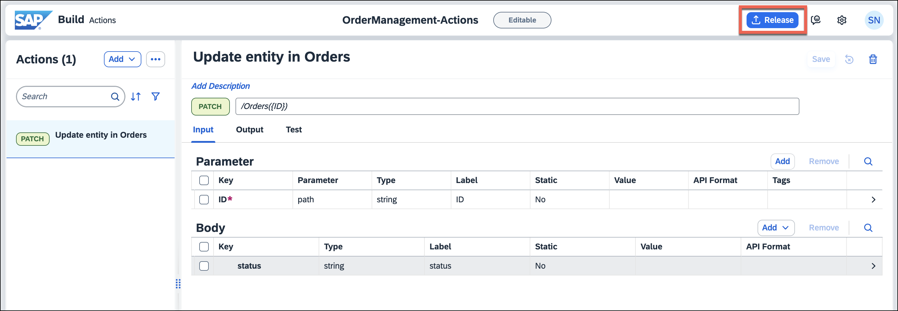

2. In the release popup, enter the **Release Notes** of your choice.

    >Notice the version of the project. It is in `majorVersionNumber.minorVersionNumber.patchNumber` format.

    Click **Release**.

    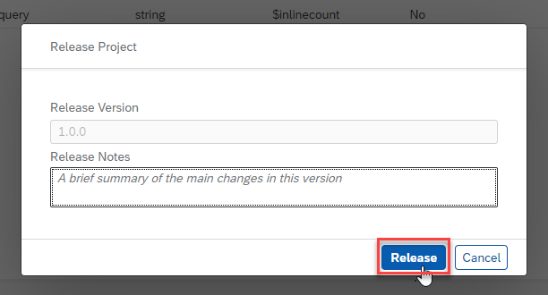

3. Click **Publish to Library** from top-right corner.

    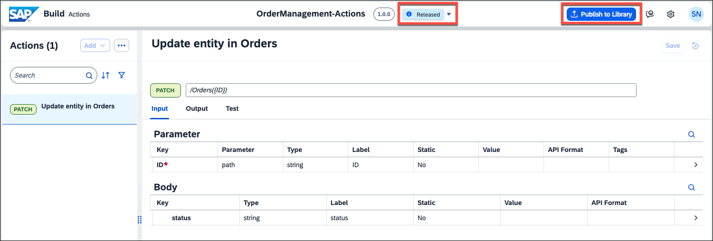

    After publishing the actions project, notice the label has changed to **Published**.

    

With this you have successfully completed creating, configuring, releasing and publishing an action project.

### Add action to process

You have already set up the approval form as part of the tutorial [Add Approval Flow to Process](codejam-06-spa-approval). 

Now, you will add the action so that if the order is approved, the action will update the status of the order.

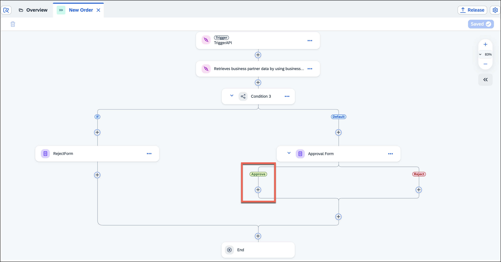

1. Go back to your process, and make sure the **Editable** version is selected.

2. Click on the plus sign, **+**, above the **Approval Notification** form.
   
    In the pop-up, choose **Actions**.

    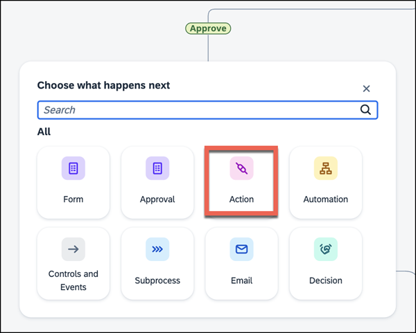

3. In the **Browse library** pop-up, select the **Update entity in Orders** tile.

    >If you are on a system with lots of actions, use the search text to find your **OrderManagementService** action, or select your project from **Projects** dropdown.

    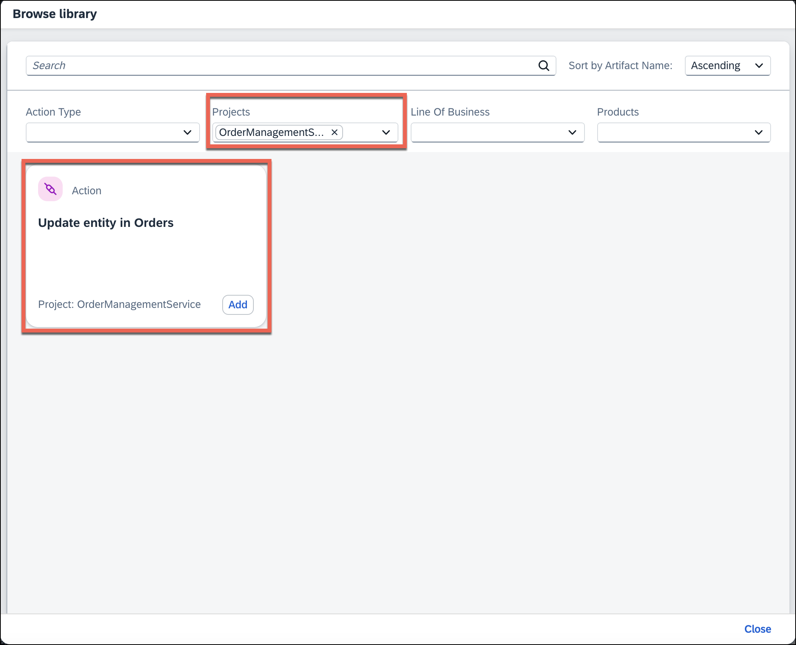

    Click **Add**.

    The action gets added and a side pane opens.

    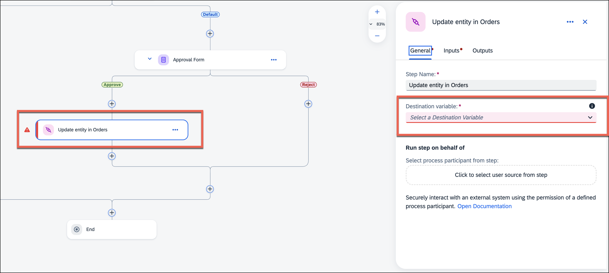

    >You will see a red warning icon. This is only because you still need to bind data to the action, for example, the order ID.

2. In the side pane, click the **Destination variable** dropdown, and choose **Create Destination Variable**.

    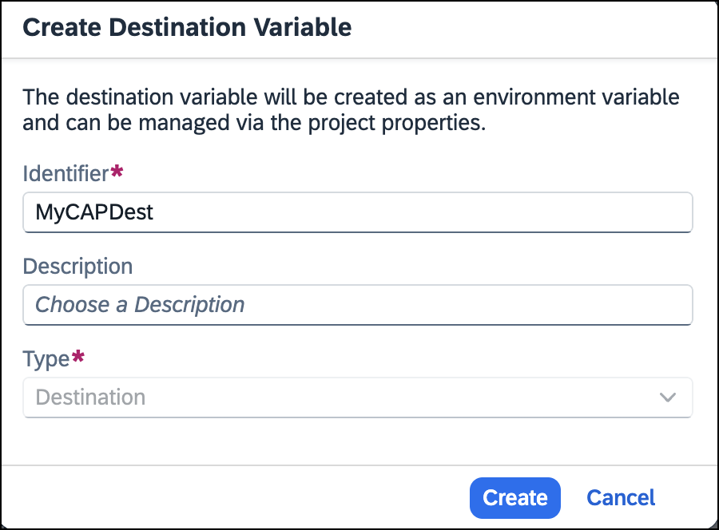

4. Enter **MyCAPDest** in the **Identifier** field, and click **Create**.

5. In the side pane, go to the **Inputs** tab.

    Click in the **ID** field (this is one of the inputs defined in the action). We must bind which order to update.
    
    Choose **Process Inputs > Order ID**.

    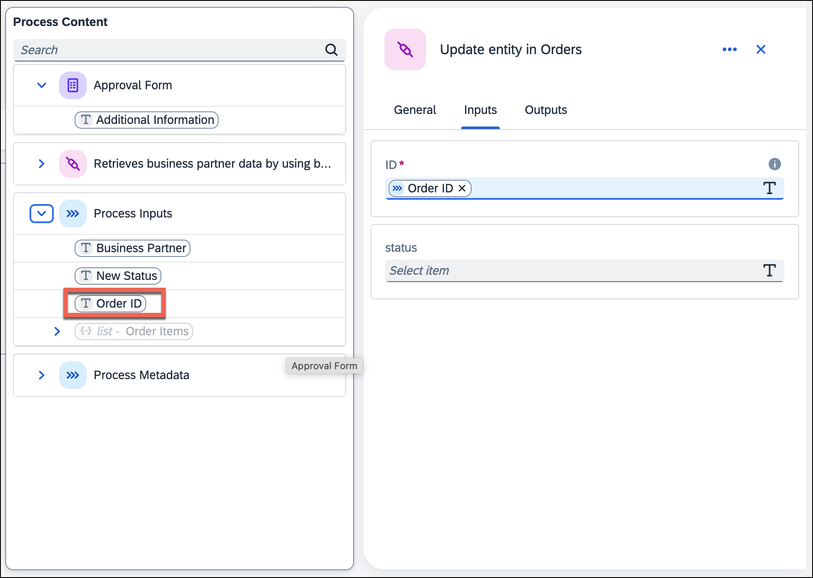

    Click in the **status** field, and then choose **Process Inputs > New Status**.

6. Click **Save**(upper right).

### Enable destination in SAP Build Process Automation

Though we tested the action with our CAP destination, we did not select a destination to use at runtime. This is done when you deploy your project that includes the action.

But destinations must be enabled by the administrator as available for business users to select from. We will enable our CAP destination.

1. In the SAP Build lobby, go to **Control Tower**.

2. Under **Backend Configuration**, select **Destinations**.

3. Select **New Destination**.

    >Only destinations with the proper **Additional Properties** will be listed here.

    Select **CodeJamOrdersService**, and click **Add**.

The destination can now be selected by a business user when they deploy a project. The destination selected is what is used in runtime.

### Release and deploy process

1. Click **Release** on the top right corner.

    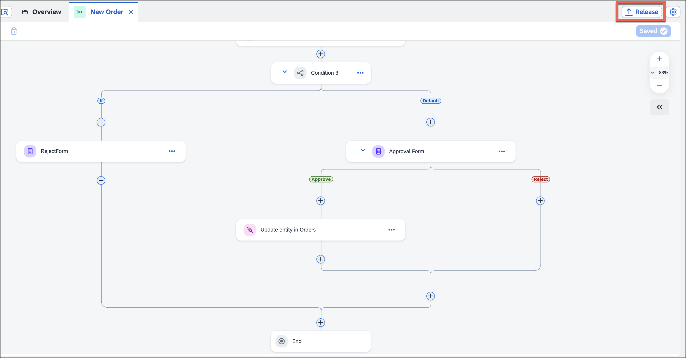

    In the Release project pop-up, enter the **Version Comment** as `Added Action to update Orders entity` and click **Release**. 

    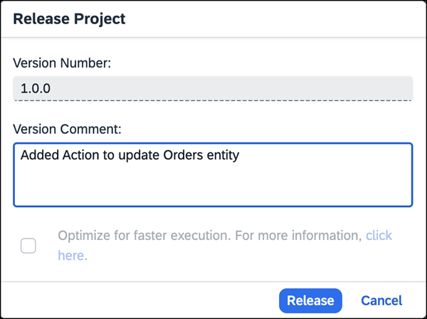

2. Now click **Deploy** on the top right corner.

    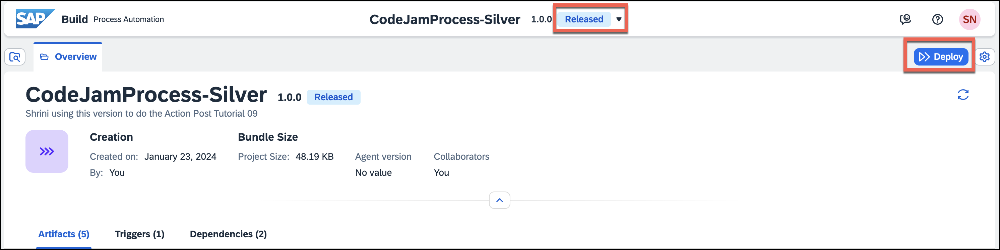

    In the **Overview** screen, select **Next**.

    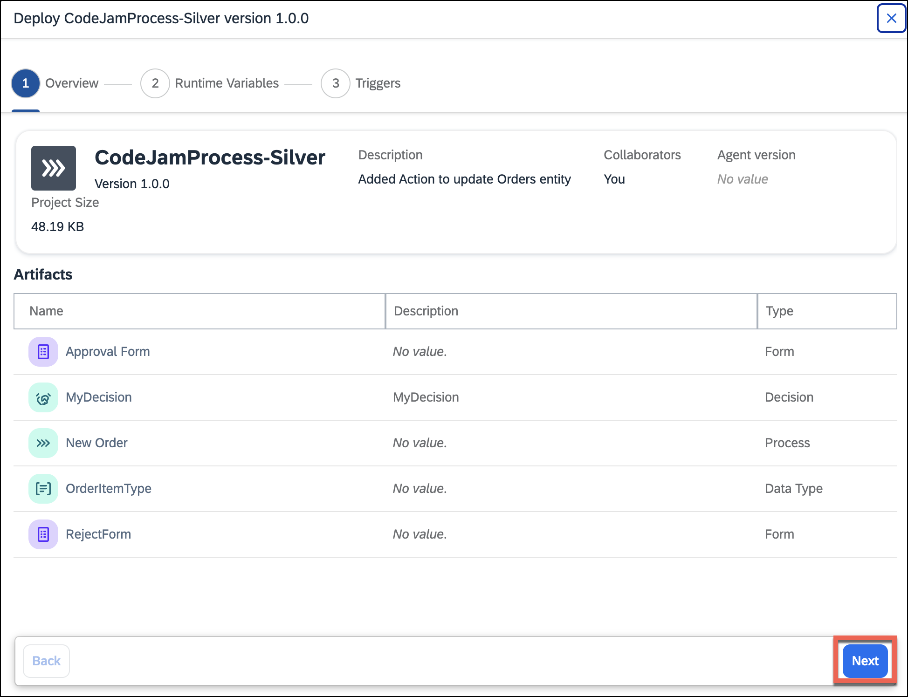

    In the **Runtime variables** screen, select the **CodeJamOrdersService** destination, and then click **Next**.

    >This is the destination we just enabled for use for deployments.

    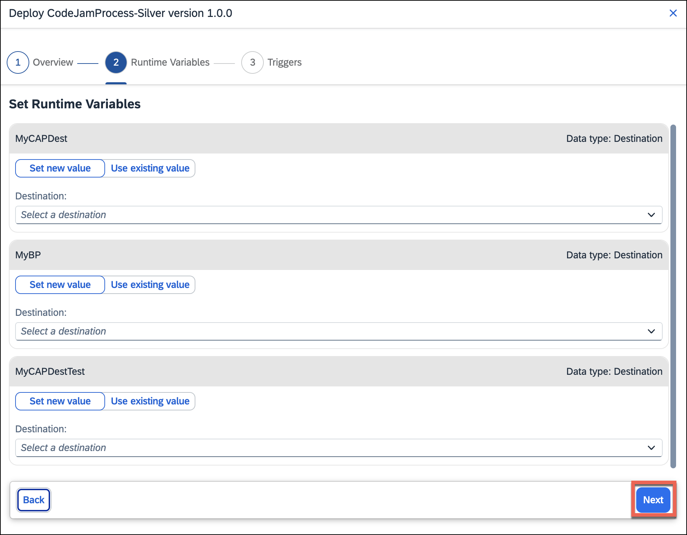
    
    In the **Triggers** screen, click **Deploy**.
   
    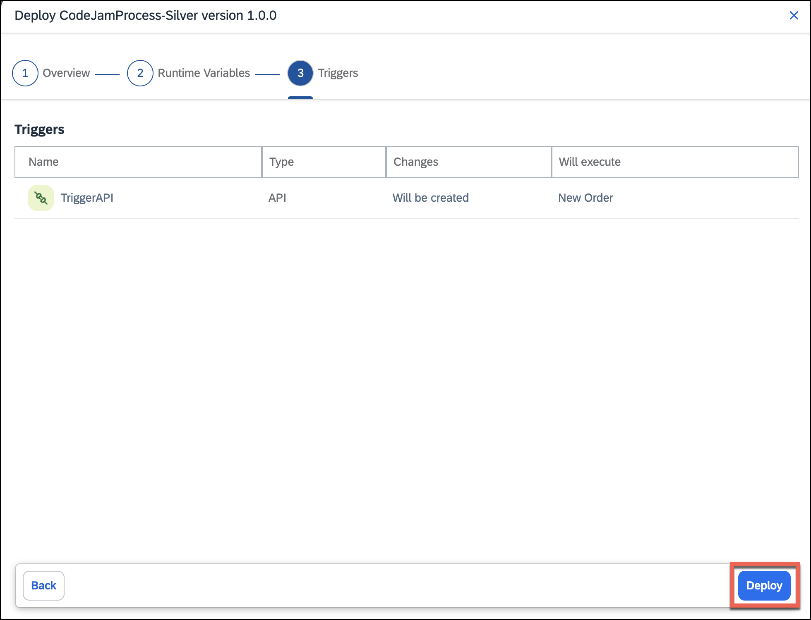

Once the deployment is successful, the status will change.

You can also see all your deployed and released project versions from the project status list next to the project name at the top of the page.

### Test process

Go into your app, select the **Notebook Basic 18**, and add it to your cart.

Go to the **Cart** page (left-side menu), and click **Purchase**.

Your process should now be triggered. You can see the new order in the CAP service.

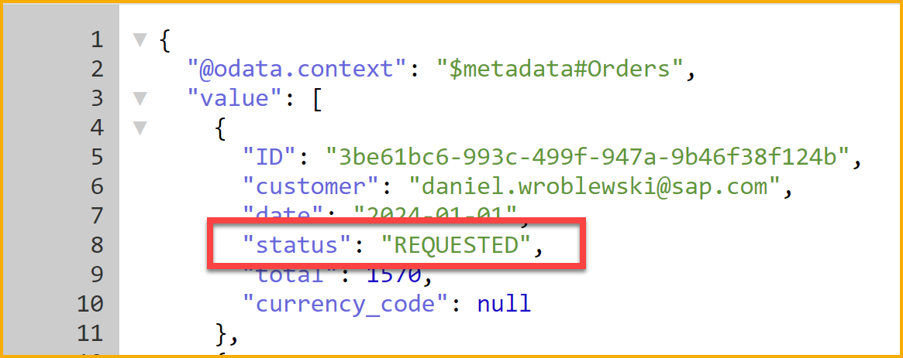

Open the Inbox from the SAP Build lobby, and see the approval form from the order you just created.

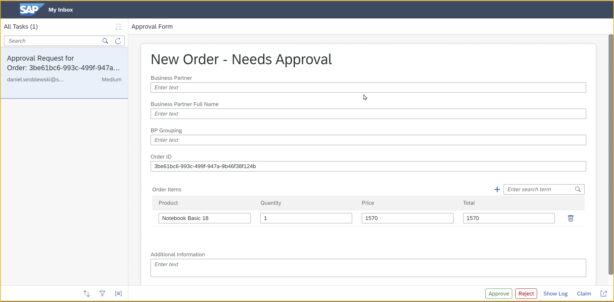

Click **Approve**. Refresh the Inbox and you will get the approve notification. YOu can click **Submit** to complete the process.

This is similar to the previous test, except now the CAP service has been updated. If you view your order in the CAP service, you will see it is now approved.

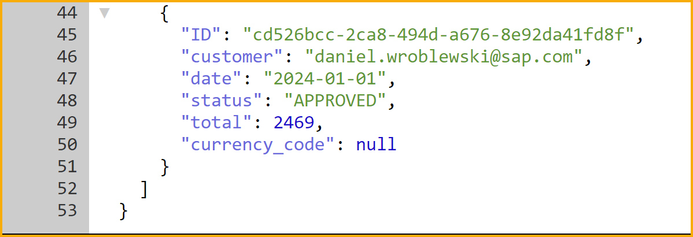

 

