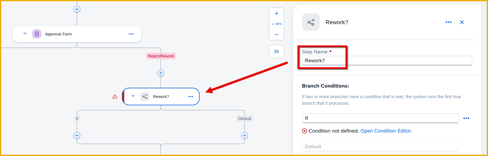
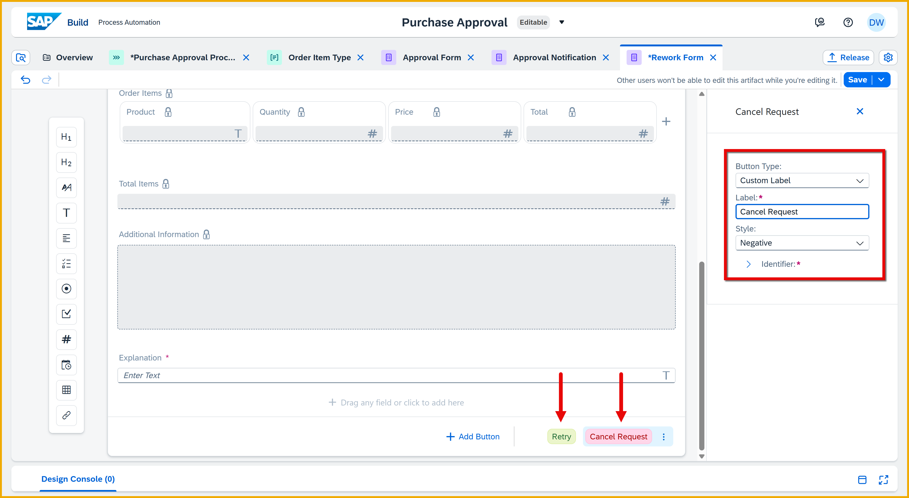

  

# 11 - Expand Process to Add Rework Flow
<!-- description --> Use a custom variable and Go-To Step to expand your workflow so the approver can ask the submitter to rework it, as part of the SAP Build CodeJam.

## Prerequisites
- You have completed the previous tutorial for the SAP Build CodeJam, [Create Action to Post Data to CAP Service](codejam-10-action-post).

## You will learn
- How to define and set custom variables
- How to use the Go-To Step
- How to modify labels on **Approve** and **Reject** buttons of an approval form.
- How to create a rework flow

## Intro
In order for you to learn about custom variables and Go-To steps, you will expand slightly the process you created to include a rework flow – the ability for approver to reject a request but allow the submitter to modify it.

Here is the current process, annotated with what you will do.

Here's the flow:

- The **approver** can approve or reject the request, as before. But the approver can also reject the request but indicate that they will allow the submitter to modify the request.
- The **submitter** will get a form to modify the request. In this case, the submitter can now add an explanation for the request.
- The **submitter** can choose to provide an explanation and return the form to the approver, or can simply cancel the request.
- The **approver**, if they get a reworked form, can again choose to approve, reject, or reject and return the form to the submitter.

 

### Add custom variable
The approver has a field in the approval form to add **Additional Information** when sending the request to the submitter for rework.

The problem is you want this field to be sent to the submitter, but also returned back to the approval form so the approver knows what they asked for from the submitter. The problem is that the approval form cannot bind a field to one of its own fields.

To solve this, you will create a custom variable.

1. Open the process, and open the side panel.

    >Make sure you are in the **Editable** version of the process.

2. Click **Variables**, and then open **Custom Variables**.

    

3. Next to **Custom Variables**, click **Configure**.

4. Click **Add Variable**, and enter `Additional Information` for the **Name**. The identifier is filled in automatically, and leave the type.

    
    
    Click **Apply**.

5. Close the side panel.

### Modify approval form
You need to modify the approval form to enable the approver to indicate that they want to allow rework, and to add a field to show the explanation from the submitter.

1. Click the three dots next to **Approval Form**, and click **Open Editor**.

    

2. Just before the **Additional Information** field, add a checkbox and call it `Rework`.

    

3. Just after the **Additional Information** field, add another text area, and call it `Explanation`. Set it to **Read Only**.

    

4. Click the **Reject** button, and then in the side panel:

    - Set **Button Type** to **Custom Label**.

    - Set **Label** to `Reject/Rework`.

    

5. Click **Save** (upper right).

### Add condition
Now you need to check whether the approver enabled rework. For this, you add a condition step.

1. Go back to the tab with your process.
   
    Under **Reject/Rework** under the approval form, click the plus sign, **+**, and select **Controls and Events > Condition**.

    >You may need to expand the approval form.

    

    This adds a condition.

    

2. In the side panel, change the name to `Rework?`. 

    

3. Click **Open Condition Editor**.

4. Click in the first field, and under **Approval Form**, select **Rework**.

    

    Click the last field, and select **true**.

    
    
    Click **Apply**.

### Add rework form
Now you need to provide a form for the submitter to provide an explanation. Since the submitter wants to see all the same information that the approver got to see, you start by duplicating the approval form.

1. In the **Overview** tab, click the three dots next to the **Approval Form** artifact, and select **Duplicate**.

    

    In the dialog, change the name to `Rework Form`, and click **Duplicate**.

    

2. The data at the top of the form can be kept as is, but you have to not allow the submitter to change the **Additional Information** but you do have to allow them to change **Explanation**.

    Click the **Additional Information** text area, and on the right make it **Read Only**.

    

    Click on the **Explanation** text area, uncheck **Read Only**, and check **Required**.

    

    Finally, click on the three dots next to the **Rework** checkbox, and click **Delete**.

    

3. Click each of the buttons and change their labels by setting **Button Type** to **Custom Label**. Then change the labels:

    Change **Approve** to `Retry`.
    
    Change **Reject/Rework** to `Cancel Request`.

    

4. Click **Save** (upper right).

### Add go-to step
1. Back in the process, under **If** under the **Rework?** condition, click the plus sign, **+**, and select **Approval > Rework Form**.

    

2. In the side, panel, under **General** set the following bindings:

    | Field | Value |
    |-------|-------|
    | Subject | `This request needs rework - ` and then select **Process Inputs > Order ID** | 
    | Recipients | **Process Metadata > Process Started By** |

2. In the side, panel, under **Inputs** set the following bindings:

    | Field | Value |
    |-------|-------|
    | Additional Information | **Approval Form > Additional Information** | 
    | BP Grouping | **BusinessPartnerGrouping** |
    | Business Partner | **BusinessPartner** | 
    | Business Partner Full Name | **BusinessPartnerFullName** |
    | Order ID | **Process Inputs > Order ID** |
    | Order Items | **Process Inputs > Order Items**  |

3. Under **Retry** under the **Rework Form**, click the plus sign, **+**.

    

    Select **Controls and Events > Go-to Step**.

    Select **Approval Form**. 

    The flow diagram will update to show you the revised flow.

    

4. Select the **Approval Form**.

    Under **Inputs**, bind the following:
    
    | Field | Binding |
    |-------|-------|
    | Additional Information | **Custom Variables > Additional Information** | 
    | Explanation | **Rework Form > Explanation** |

    

    Under **Outputs**, select the **Additional Information** custom variable, and then set it to **Approval Form > Additional Information**.

    

5. Click **Save** (upper right).

### Release and deploy
1. Click **Release** (upper right).

    Click **Release** again to confirm.

2. Click **Deploy**.

    Select the **Public** environment, and click **Upgrade**.

    On the **Effects on Triggers** page, click **Deploy**.

    On the **Define Variables** page, select **S/4HANA-Hub-Public** destination for the first destination, and **CodeJamOrdersService** for the second destination, and then click **Deploy**.

    

### Test app
Go into your app, select the **Notebook Basic 19**, change quantity to 3, and add it to your cart.

Go to the **Cart** page (left-side menu).

Select business partner **1000000**, and then click **Purchase**.

Open the Inbox from the SAP Build lobby, and see the approval form from the order you just created.

Do the following:

- Check the **Rework** checkbox.

- Enter `Why do you need this purchase?` in the **Additional Information** field.

- Click **Reject/Rework**.

The approval form should disappear, but if you refresh the Inbox, you'll get the rework form.

Enter `I need this stuff for a customer` in the **Explanation** field, and click **Retry**.

Refresh the **Inbox** and you will see the approval form again, but this with **Additional Information** and **Explanation** fields filled in.

From this point, you can continue to finish the process.

