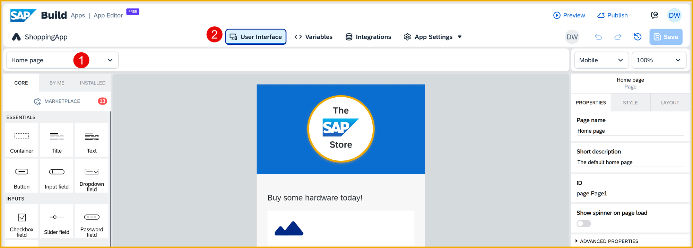
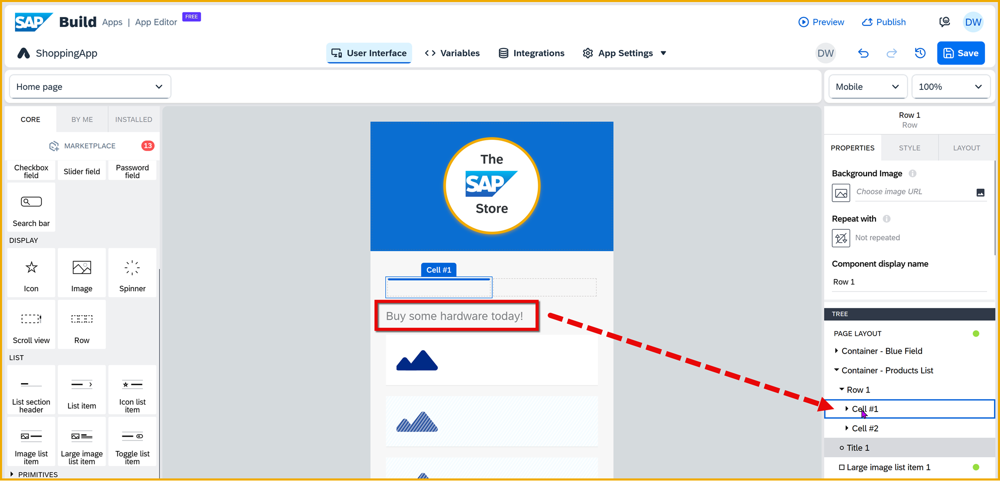
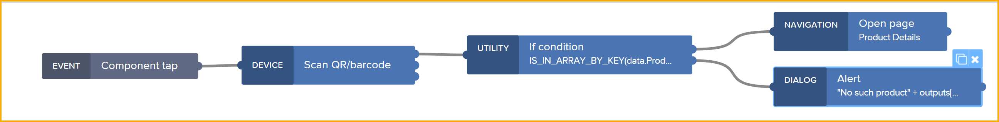
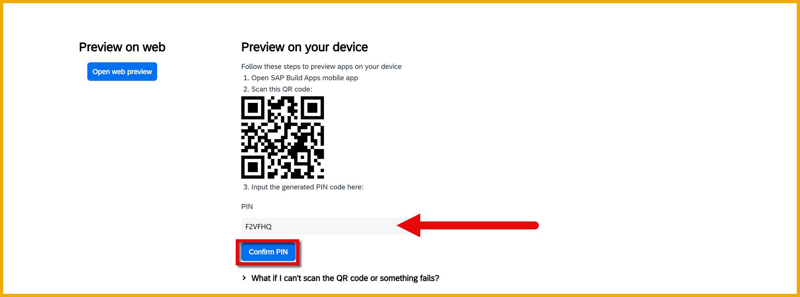
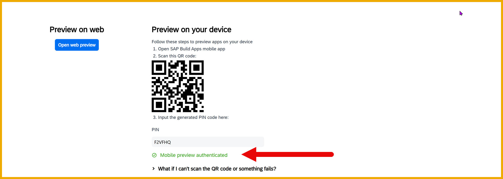

  

# 12 - Enable App to Select Product by Scanning Barcode 
<!-- description --> Show some of the native mobile capabilities of SAP Build Apps by allowing users to select a product by scanning a barcode, as part of the SAP Build CodeJam. 

 

## Prerequisites
- You have completed the previous tutorial for the SAP Build CodeJam, [Add Rework Flow to Your Process](codejam-10-spa-rework).


## You will learn
- How to get and set up the Mobile Preview App
- How to enable barcode scanning


## Intro
One of the best things about SAP Build Apps is that you can easily enable basic but powerful native mobile features – such as access to contacts and photos, the camera, location services and more.

In this tutorial, you will let you scan a barcode in order to select a product, instead of having to select from the list on the home page.


### Install preview app on your device
To get and set up the SAP Build Apps Mobile Preview App, watch and follow along with this video from **Daniel Wroblewski**. 

<iframe width="560" height="315" src="https://www.youtube.com/embed/UvdCV4-kGAY" frameborder="0" allowfullscreen></iframe> 


### Add UI for barcode scanning
1. Go to the home page.
   
    Make sure you are toggled to **View**.

    

2. Right now, you have a title component.

    
    
    Add a Row component just above the title.
    
    >When you drag in a row component, it will automatically contain 2 cells.

    
    
    Move the existing title component into Cell #1.
    
    
    
    In Cell #2, add a container, and in the container add a text and icon component.

    The UI should look like this:

    

3. Select the row component (use the tree view), and in the **Layout** tab click the first **50%**.

    

    Set the cell width to `5`.

    

    Now click the other side, now **0%**, and then enter for the cell width `3`.

    

    This now sets the relative widths of the cells.

    

    Finally, set **Align cell content** to align bottoms.

4. Select the container in Cell #2, and in the **Layout** tab, in the **Layout** section, set the layout to **Horizontal**.

    

5. Select the text component (in Cell #2) and set the following.

    - Under **Properties**, set **Content** to `Click to scan product`.

        

    - In the **Style** tab, click the **Primary Paragraph** dropdown, and click **Edit**.
        
        

        Under **Typography**, set **Text size** to **Small text**.

    - In the **Layout** tab, in the **Layout** section, change **Text align** to **right**.

6. Select the icon component (the star in Cell #2), and set the following.

    - Under **Properties**, in the **Icon** property, click the word **star**.

        
        
        Enter `barcode` in the search, and click the barcode symbol.

        

    - Under **Style**, click the **Primary Icon** dropdown, and click **Edit**.

        

        Under **Typography**, change the binding type for **Font size** to **Static number**, and change the font size to `60`.

Your UI should now look like this:


### Add logic to scan barcode
Now lets create the logic for handling the tap of the barcode icon.

1. Select the icon component, open the logic canvas (at the bottom).

    

2. Create the following logic, and connect the flow functions as shown. 

    

    >The logic opens the barcode scanner, and if the user actually selects a barcode, then you test that value.
    >
    >- If the value is a product number and in our list of products – held in our data variable – then you navigate to the product details page.
    >
    >- If the value is not a product, you just alert the user.
    >
    >**IMPORTANT:** You must connect the top output of he QR code flow function with the If condition flow function.

3. For the **If condition** flow function, set the **Condition** to the following formula:

    ```JavaScript
    IS_IN_ARRAY_BY_KEY(data.Products1, "Id",outputs["Scan QR/barcode"].codeContent)
    ```

4. For the **Open page** flow function, set the **Page** to **Product Details**.

    

    Set the **productID** to the **Output value of another node > Scan QR/barcode > QR barcode content**.

5. For the **Alert** flow function, set **Dialog title** to the following formula:

    ```JavaScript
    "No such product " + outputs["Scan QR/barcode"].codeContent
    ```

The logic should now look like this:




### Test with preview app
Now you will use the mobile preview app so you can use the native functionality of the device.

>Make sure you have installed the preview app on your device.
>
>- [Instructions for iOS](https://apps.apple.com/us/app/sap-appgyver-preview/id1585856868)
>
>- [Instructions for Android](https://play.google.com/store/apps/details?id=com.sap.appgyver.preview.release)


1. Click the **Launch** tab, and then **Open preview portal**.

    

    You should now get a place to enter a code from your preview app.

    

2. Open the preview app on your device.

3. Follow one of the following:

    - **For US10:** If you are on a trial account, likely you are on an SAP BTP account in the US10 region.

        - Click **Other login options**.

        - Select **SAP Build Apps US10**, and then click **Generate Code**.

            A code will be shown.
            
            

    - **For EU10:** Just click **SAP Build Apps** and a code will be shown.

        

4. Take the code and enter it in the preview portal in SAP Build Apps.

    Press **Enter**.

    >The pin code can be entered upper or lower case, and you can press **Enter** instead of clicking **Confirm pin**.

    

    If all goes as planned, you will see that you have been authenticated.

    

    Your preview app will now update and show all the applications in your tenant. You should see something like this:

    

5. Click the **Shopping App** tile to open the app.

    Click the barcode icon.

    

    You can scan this barcode for product **HT-1020**.

    

    This should take you to the product details page, where you should see the details for **HT-1020**.

    
