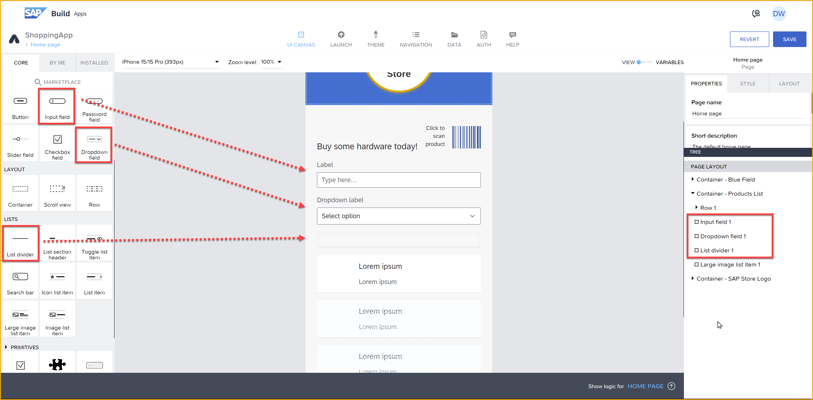
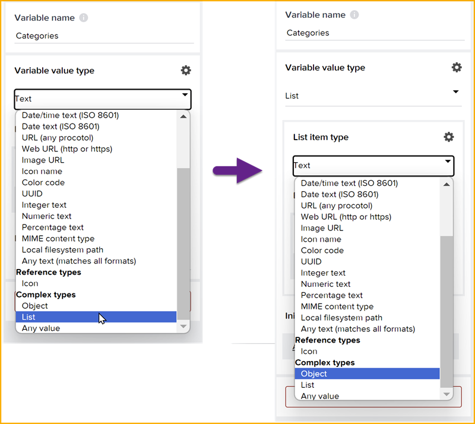
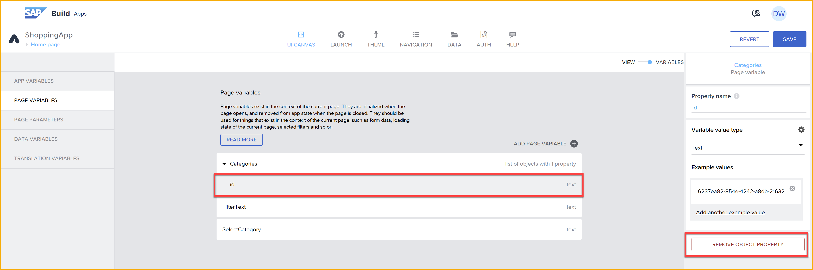
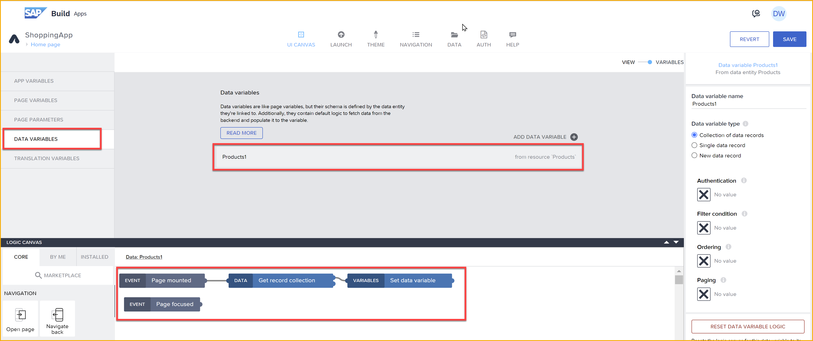
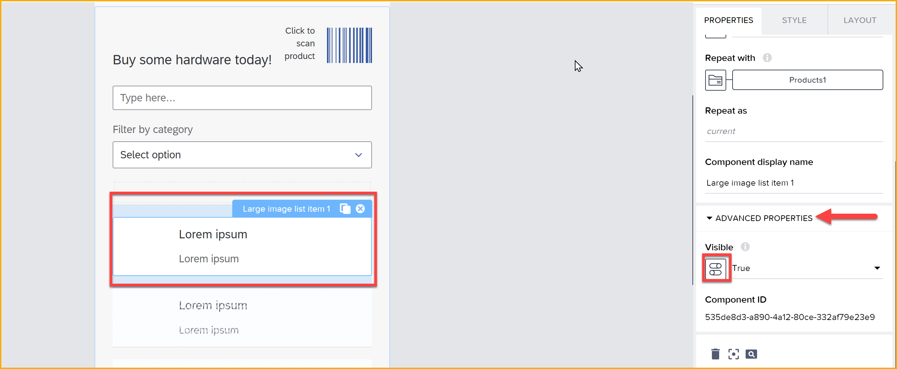
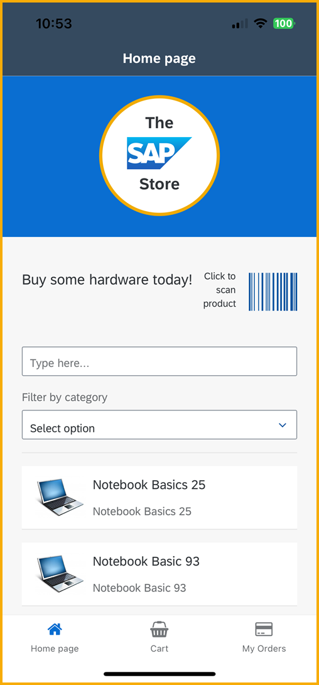
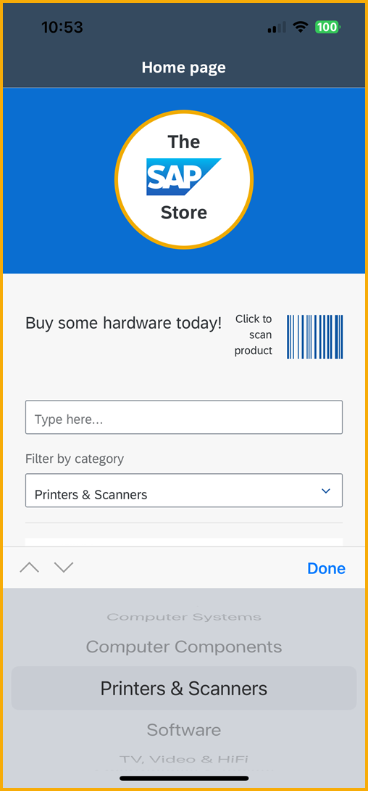
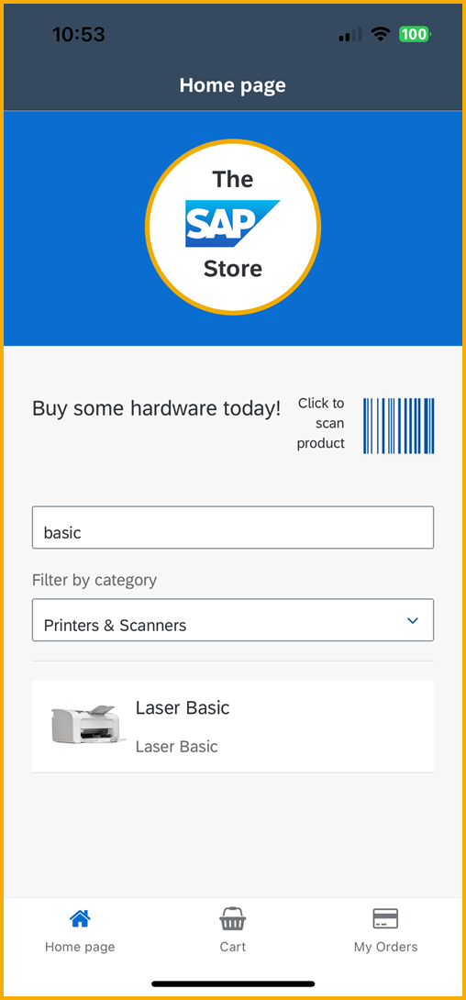

  

# 13 - Enable App to Filter Products 
<!-- description --> Add UI components and logic to enable filtering of the product list, as part of the SAP Build CodeJam. 


## Prerequisites
- You have completed the previous tutorial for the SAP Build CodeJam, [Enable App to Select Product by Scanning Barcode](codejam-12-scan-barcode).


## You will learn
- How to the filter a repeated component using the **Visible** property


## Intro
The very first thing you did in this CodeJam was to create a product page listing products from our CAP service.

But will want to be able to filter the list, and you will create 2 filters:

- Free text search, using an input field. The app will then show any product whose name or description contains the string.

- By category, using a dropdown field. The app will contain a dropdown of valid categories, and the user can select one; the app then displays only products in that category.

>Note that this type of filtering is done in the app, after all data has been retrieved. There are other ways to filter the data on the server, generally using the OData filtering capabilities. That is beyond the scope of this tutorial.


### Add UI for filters
1. Go to the **Home page** page.

2. In the **Tree** view, just below the **Row** component, add:

    - Input field
    - Dropdown field
    - List Divider

    

3. For the input field, delete the text `Label` from the **Label** property. Leave it empty. 

4. For the dropdown field, change the **Label text** property to `Filter by category`.

    

5. Click **Save**.


### Add variables
You need 3 variables:

- **Categories:** Holds a list of the product categories, so a user can select one to filter the products by.
- **SelectCategory:** Holds the category selected by the user.
- **FilterText:** The text entered by the user to filter the products by.

The text filter will show only products with the text contained in the product name or description.

1. Toggle to **Variables**.

2. Add 3 page variables with the following names and data types:

    | Name | Type |
    |-------|-------|
    | `Categories` | list of objects | 
    | `SelectCategory` | text |
    | `FilterText` | text |

    To set a variable to a list of objects, first set the **Variable value type** to List (at the bottom of the options), and then set the **List item type** to Object.

    

    In the end, you should have 3 variables like this:

    

3. In the **Categories** variable, SAP Build Apps automatically created a object property called **id**, but you do not need that. 

    So select the field, and click **Remove Object Property**.

    

4. Click **Save**.


### Add logic to get list of categories
To enable the user to choose a category, you need to populate the **Categories** variable with the list of available categories. You will derive this from the list of products you retrieved from our CAP service.

1. In the **Variables** area, click **Data Variables**.

2. Click the **Products1** data variable, and open the logic canvas.

    

    There should already be the default logic for retrieving the products.

3. Add a **Set page variable** flow function to the end of the flow.

    

4. Set the **Variable name** to **Categories**.

    Set the **Assigned value** to a formula, and set the formula to the following:

    ```JavaScript
    UNIQUE_BY_KEY(MAP(data.Products1,{ value: item.MainCategoryId, label: item.MainCategoryName}), "value") 
    ```

    
    
    >**What does the formula do?**
    >
    >With the **MAP** function, the formula goes through one-by-one the list of products, one of whose fields is **MainCategoryName**.
    >
    >The formula creates a list, and for each product adds an object to that list. These objects have 2 fields: **value** and **label**, which are set to the category ID and name.
    >
    >Finally, the formula uses the **UNIQUE_BY_KEY** function to remove duplicate categories.
    >
    >And why did you do all this?
    >
    >Because a list of objects with the 2 fields **value** and **label** is what the dropdown field needs to display a list.
    >
    >

5. Click **Save** (upper right).


### Add logic to perform filtering 
1. Toggle back to **View**.

2. Select the dropdown field, and then select the binding icon for **option list**.

    

    For the binding, select **Data and Variables > Page variable > Categories**, and click **Save**.

    With the dropdown field still selected, click the binding **X** next to the **Selected value** property, and bind the property to **Data and Variables > Page variable > SelectCategory**.

    

3. Select the input field, and then select the binding icon for **Value**.

    

    For the binding, select **Data and Variables > Page variable > FilterText**.

4. Select the **Large image list item** component, and then under **Advanced Properties** click the binding icon for the **Visible** property..

    

    Select **Formula**, and set the formula to the following:

    ```JavaScript
    CONTAINS(UPPERCASE(repeated.current.Name), UPPERCASE(pageVars.FilterText)) && IF(!IS_EMPTY(pageVars.SelectCategory),repeated.current.MainCategoryId == pageVars.SelectCategory, true)
    ```
 
    

    >**What does the formula do?**
    >
    >The formula will return **True** if both of the following are true:
    >
    >- The name of the product contains the text entered for the filter
    >
    >- The selected category is the same as the current item's category. If no category is selected in the dropdown, then this test returns true.
    
5. Click **Save**.


### Test app
After saving your project, your app on the preview app should be refreshed.

>If your preview app timed out, just follow the instructions in the last step of the previous tutorial [Enable App to Select Product by Scanning Barcode](codejam-12-scan-barcode).

After opening the app, you should see all the products.



Click in the **Filter by category** dropdown, and select **Printers & Scanners**. 



Now you should see only printers and scanners.


Finally, in the input box, enter `basic`, and you should see just the one product.




