  

# 14 - Implement Spinner for Product Details Page 
<!-- description --> Set up and use a spinner control to hide UI until all data is available to display, as part of the SAP CodeJam.


## Prerequisites
- You have completed the previous tutorial for the SAP Build CodeJam, [Enable App to Filter Products](codejam-12-filtering).


## You will learn
- How to set up and use a spinner control
- How to delay displaying data until it is retrieved


## Intro
As you know your app has a product list and product details pages, but have you noticed while testing today that for a brief moment, after selecting a product, you can see empty or null fields on the product detail page?

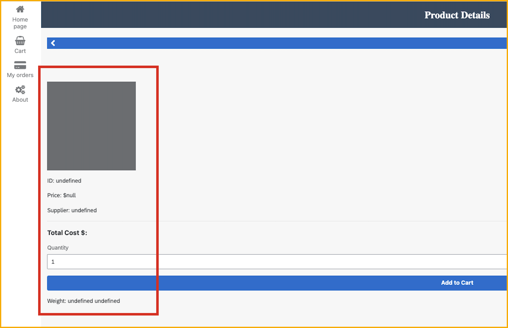

In this exercise, you will enhance the **Product details** page by adding a spinner and only showing the fields once they are populated with the data.

There are 2 ways to show a spinner:

* Using special flow functions to show and hide the entire page.
* Using a spinner control that you position on the UI where you want to show a spinner, and control with a page variable. 

You'll do both.


### Add spinner variable
1. Go to the **Product Details** page.

2. Toggle to **Variables**.
    
3. Create a new page variable, and set its properties to the following:
    
    | Name | Type |
    |-------|-------|
    | **Variable name** | `showSpinner` | 
    | **Variable value type** | True/false |
    | **Initial value** | True |

    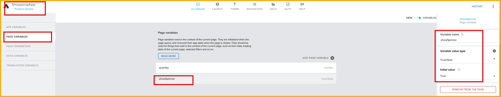


### Add spinner to UI
1. Toggle back to **View**

2. Drag the spinner control from the **Core** components tab – currently the very first component – and place it on the page.
   
    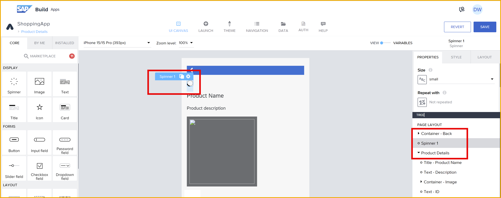
   
    >It will be easier to place it by dragging and dropping on the UI canvas

   
3. With the spinner selected, go to the **Advanced Properties > Visible** property.

    Click the binding icon, and set the binding to **Data and Variables > Page Variable > showSpinner**.

    This is the variable you created in the previous step.
   
    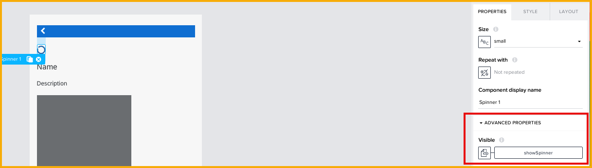


### Set visibility of UI
1. In the Tree View, select the **Product Details** container.

2. Under **Advanced Properties**, click on the binding icon for the **Visible** property. 

    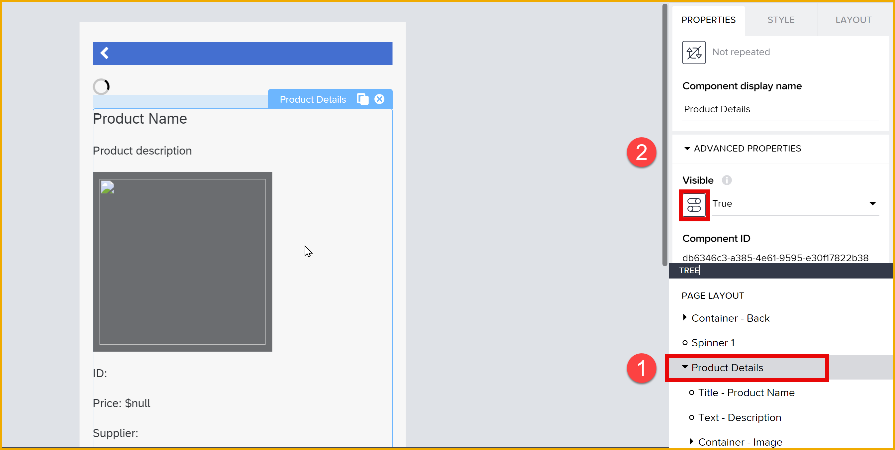

    Select **Formula** and set the formula to the following:

    ```JavaScript
    !pageVars.showSpinner
    ```

    Before saving the formula, set the **Optional preview data** to **True**.

    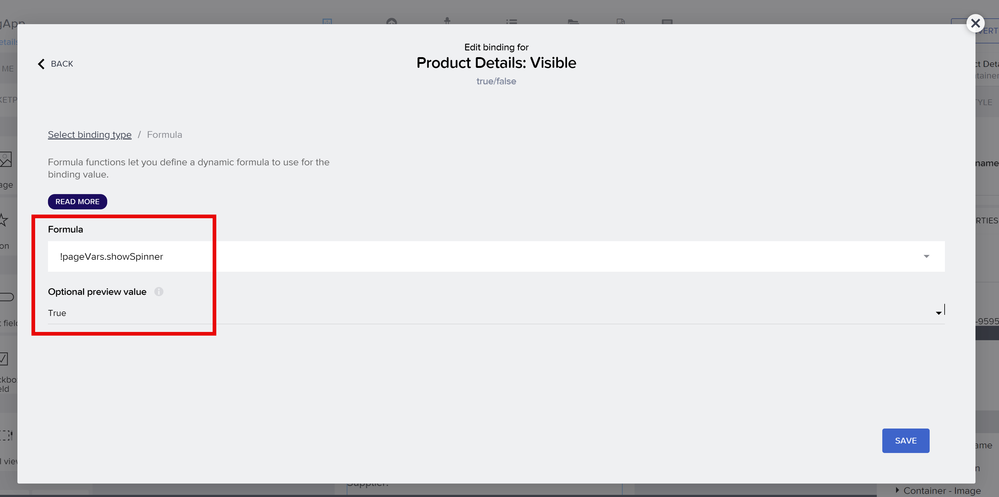

    Save the formula, and then click **Save** (upper right).

    This will set it to the opposite of the spinner. So when the spinner is visible, the product details UI is not, and vice versa.

    >**What does the formula do?**
    >
    >The formula will show the page components only when the spinner is hidden. So initially, the spinner is shown and the page is hidden; when the data is all retrieved, the spinner is hidden and the page components are shown.
    >
    We set the **Optional preview value** because by default the **Visible** property is false and this will hide all the page components while we are designing them. So in order to see them while we work on building the page, we set the preview to **True**.


### Add logic to hide the spinner
1. Toggle to **Variables**.

2. Select **Data Variables**, then select **Products1**.

    Open the logic canvas.

3. In the logic canvas, add a **Set page variable** flow function to the end of the flow.

    Set **Variable Name** to **showSpinner**.

    Set **Assigned value** to **False**.
   
    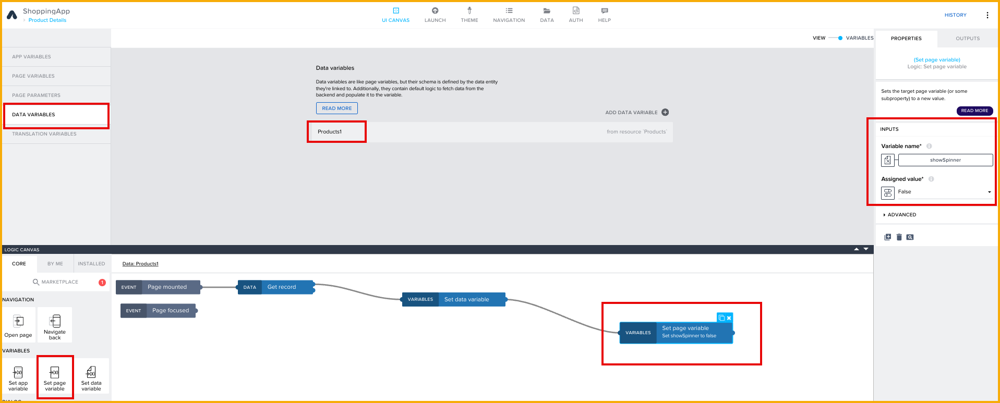


4. Click **Save** (upper right).


### Test the app
1. Launch the app.

2. Select a product, which will take you to the **Product Details** page.

    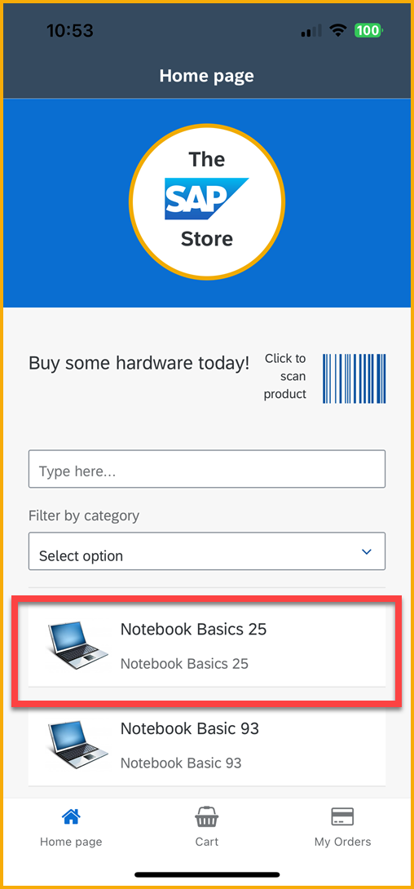

3. On the **Product Details** page, you will first see the spinner and nothing else on the page.
   
    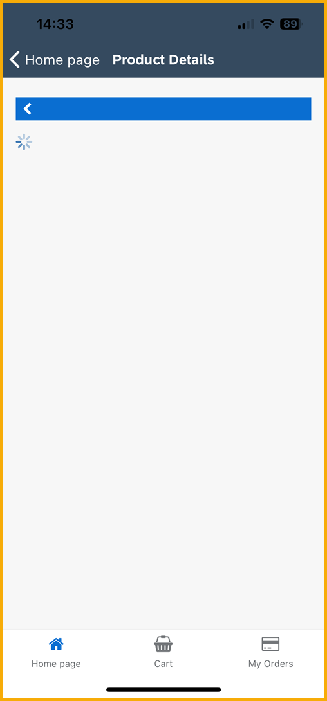

    When the data is returned, the spinner will disappear and the product details will be displayed

    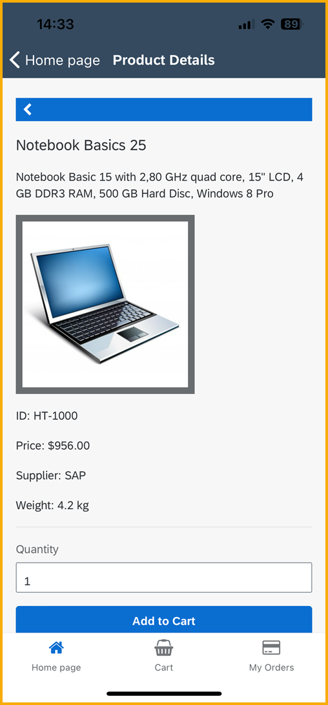


### Use spinner flow functions
The way we just implemented the spinner, with a dedicated spinner UI component, lets us create a spinner for just a part of the screen.

But if we just want to hide the entire screen until the data is ready, there are dedicated spinner flow controls that make this easy.

1. Go back to the **UI Canvas** to the **Product Details** page.

    Remove the spinner component.

    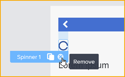

2. In the tree view, select the **Product Details** container, and set the visibility back to **True**.

    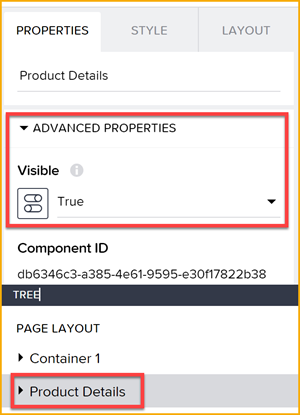

3. Click on **Variables > Data Variables**, select **Products1**, and open the logic pane.

    Remove the **Set page variable** flow function.

    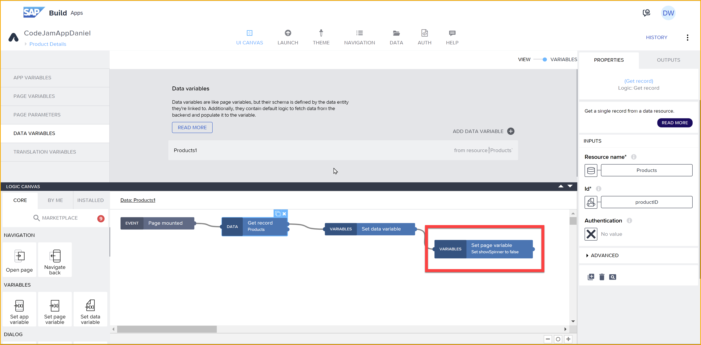

4. Add a **Show spinner** flow function at the start of the logic, and then a **Hide spinner** at the end of the logic. Arrange the flow functions like this:

    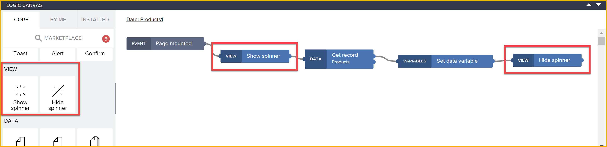

5. Click **Save** (upper right).

6. Relaunch the application.

    Select a product. Now, on the **Product Details** page, the entire page – including the navigation bar at the top – is hidden with a large spinner in the center of the page until all the data is retrieved.

    