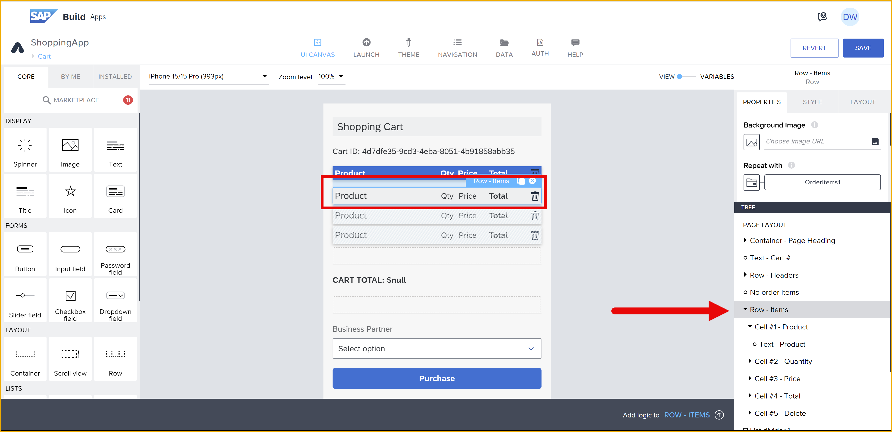
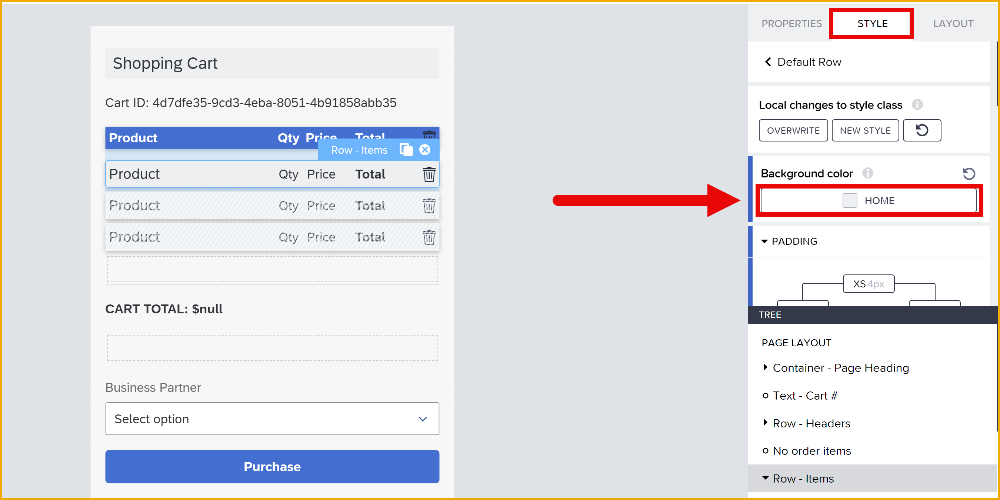
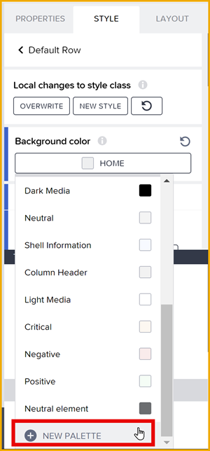
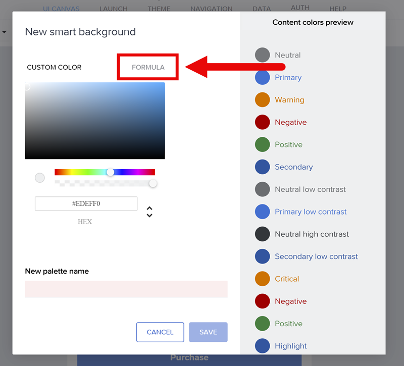
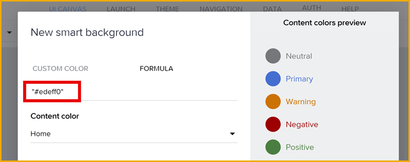
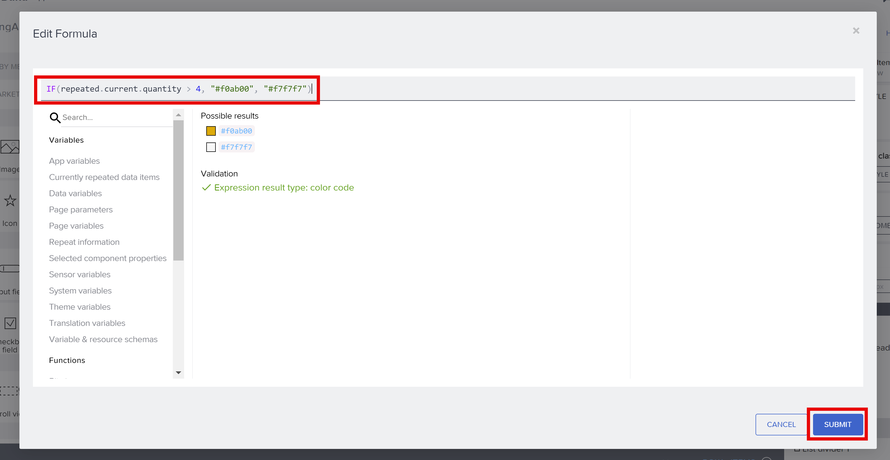
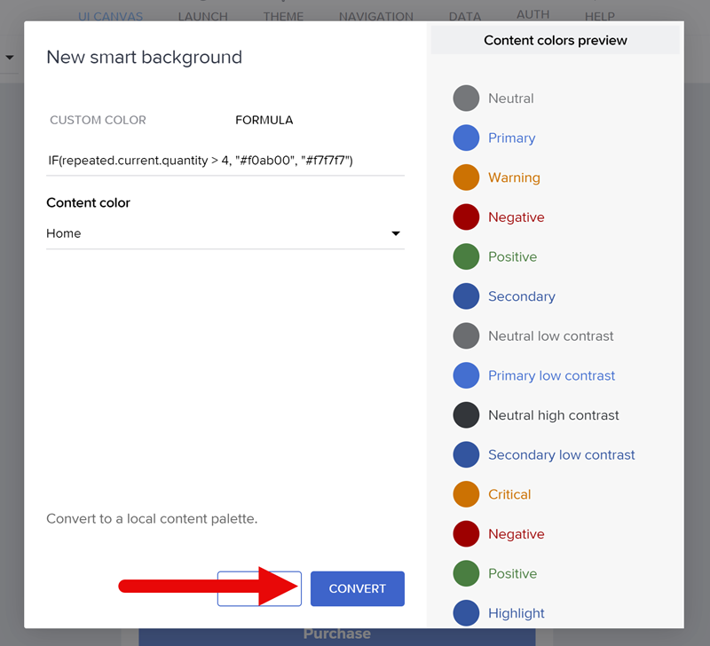
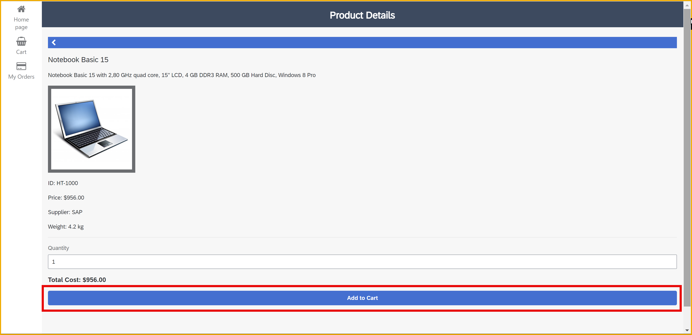
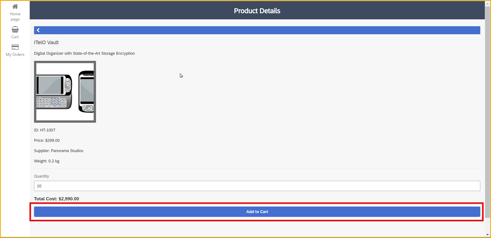
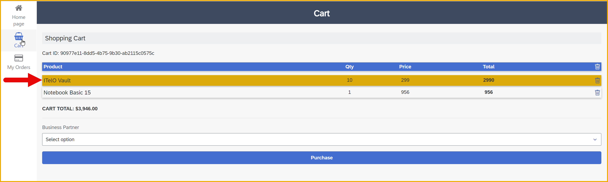

  

# 15 - Implement Conditional Formatting to Change Color Based on Data  
<!-- description --> Amend the shopping cart page - to highlight any items that have a Unit Quantity of 50 or higher – as part of the SAP Build CodeJam.


## Prerequisites
- You have completed the tutorial for the SAP Build CodeJam, [Implement Spinner for Product Details Page](codejam-14-spinner).


## You will learn
- How to use a formula to change a row background color.


## Intro
In this exercise, you will be enhancing the **Cart** page of the SAP Build CodeJam app with data and functionality.

Specifically, you will change the background color of the row showing the cart entries. If the quantity ordered is less than 5 the color will be white, and if it is 5 or more the background color will be changed to amber.


### Amend the Cart Page

1. Open the **Cart** page.

2. Select the **Row - Items** component.

    

3. In the **Style** tab, click on the **Background color**, likely set to **Home**.

    

4. Select the **NEW PALETTE** item.

    

5. Select **Formula**.

    

    Then click the existing formula, which is just a string representing a color.

    

    Enter the following formula:
    
    ```JavaScript
    IF(repeated.current.quantity > 4, "#f0ab00", "#f7f7f7")
    ```
    
    

    Click **Submit**, and then save your formula by clicking **Convert**.


    

6.  Click **Save** (upper right).


### Test the App

1. Open the app again.

2. Select **Notebook Basic 15**.

    Keep the quantity as 1 and then click **Add to Cart**.

    

3. Go back to the home page, and select **ITelO Vault**.
   
    This time change the quantity to 10, and click **Add to Cart**.

    

4. Open the **Cart** page. 
   
    You should see that the **ITelO Vault** order item is highlighted.

    


