  

# Event-Driven Processes CodeJam – Prerequisites
<!-- description --> Get ready for your event-based processes CodeJam now!

## Prerequisites
- Do this before you come to CodeJam ⏱️
- Bring your laptop 💻
- Bring your device 📱
- Be ready to have FUN! 🤗

## You will learn
- How to set up the SAP BTP trial account
- How to set up SAP Process Automation

## Intro
In this SAP CodeJam, you will interact with two main services: SAP Integration Suite, advanced event mesh and SAP Build Process Automation. 

- For SAP Integration Suite, advanced event mesh, access to a shared tenant will be provided as part of the event. 

- For SAP Build Process Automation, you will use the SAP BTP trial account, and install SAP Build Process Automation on SAP BTP. This tutorial shows you how to set that up.

### Create SAP BTP trial account
Do one of he following:

- If you already have an SAP BTP trial account, you can skip this step.

- If you already have an SAP ID but not an SAP BTP trial account, you can go directly to [https://account.hanatrial.ondemand.com/trial](https://account.hanatrial.ondemand.com/trial) and create an SAP BTP trial account. 

- If you do not already have an SAP ID, follow this tutorial: [Get a Free Account on SAP BTP Trial](https://developers.sap.com/tutorials/hcp-create-trial-account.html)

### Install SAP Build Process Automation
Here is video from **Daniel Wroblewski** showing you how to install SAP Build Process Automation.

>STOP the video at **1:10 mins**. You do **NOT** have to install the Desktop Automation agent.

<iframe width="560" height="315" src="https://www.youtube.com/embed/2gB7ipo8TNY" frameborder="0" allowfullscreen></iframe> 

If you prefer, here are the step-by-step instructions.

1. In your SAP BTP cockpit, go to **Instances and Subscriptions**, and then click **Create**. 

    

2. Set the following fields:

    | Field | Value|
    |-------|------|
    |  Service      | **SAP Build Process Automation**     |
    | Plan        |  **Standard**     |
    | Instance Name       | `spa-service`     |

    Click **Create**.

    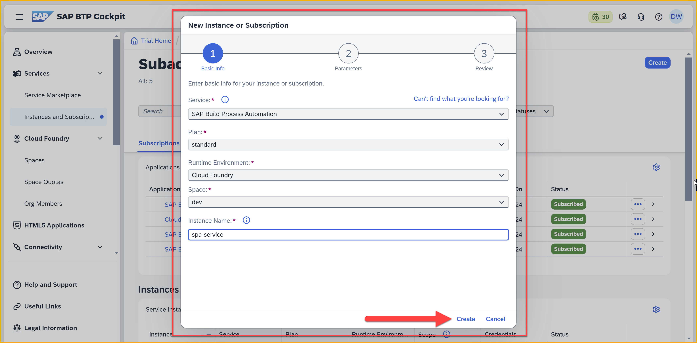

    The wizard will run and you will see **Creation in Progress** (the service appears under **Instances**).

    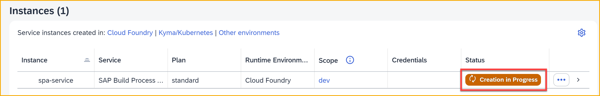

    After a few minutes, it will turn green to **Created**.
    
    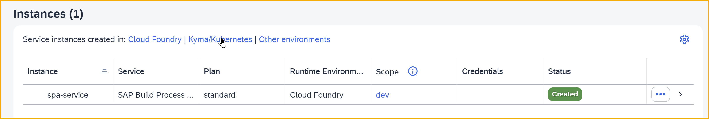

3. In the same **Instances and Subscriptions**, click **Create** again. 

4. Enter the following:

    | Field | Value|
    |-------|------|
    |  Service      | **SAP Build Process Automation**     |
    |  Plan        |  **Free**     |

    Click **Create**.

    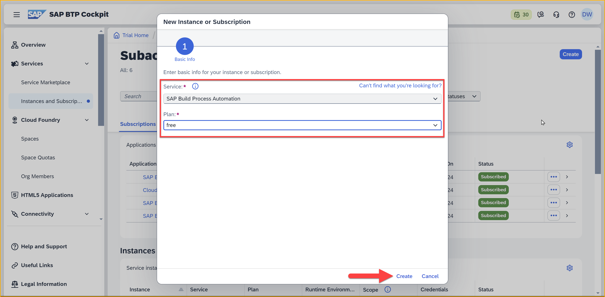

    The wizard will run and you will see **Processing**. 

    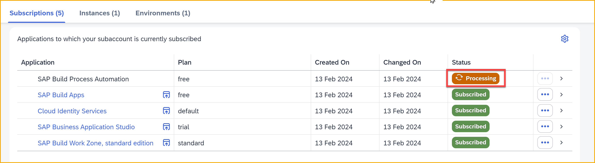

    >**NOTE:** It may take a few minutes for this step to complete.
 
    When the subscription for SAP Build Process Automation is complete, the status will turn green to **Subscribed**.

    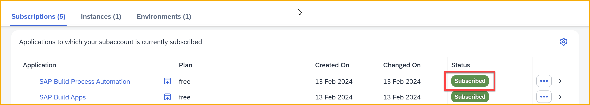
   
5. On the left-side menu, go to **Security > Users**.

    >**IMPORTANT:** If you also installed SAP Build Apps, you would have installed a custom identity provider (IAS), an additional service for defining users, and a second user would have been created for you. This "custom user" is now the user that be used to enter the SAP Build Lobby. 
    >
    >If you also installed SAP Build Apps, assign roles to this user.
    >
    >If you did not install SAP Build Apps, assign roles to your "default user".

    Select your user, and then click the 3 dots under **Role Collections**.

    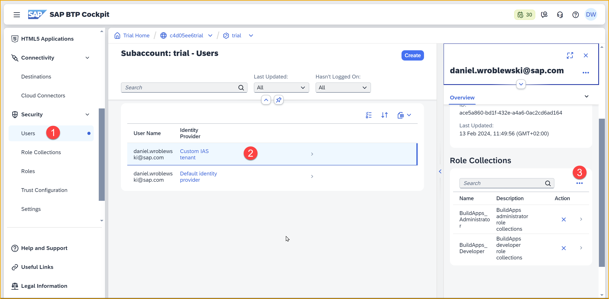

6. Select **Assign Role Collections**.

    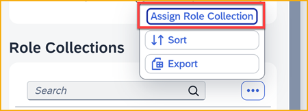

    In the dialog, enter `process` in the search box, select all the roles, and click **Assign Role Collection**.

    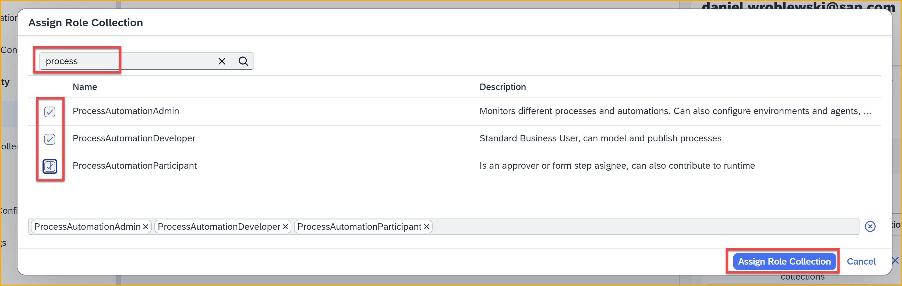

If you want to test, go back to the **Instances and Subscriptions** screen. Click the icon next to SAP Build Process Automation, which will open the SAP Build lobby.

Click on **Create** and try to create **Build an Automated Process > Business Process** project – if you can proceed with the creation, this indicates you are logged in with your custom identity provider user and all is working OK. At this point, there is no need to create a Business Process.

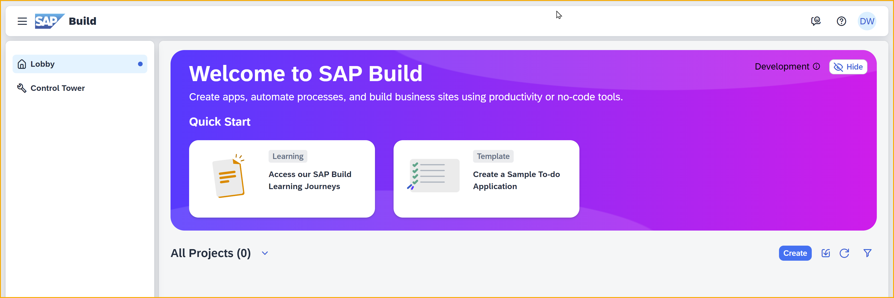

### Create a service key
Because we have external systems that will need to communicate with SAP Build Process Automation, we need to create a service key. The service key creates credentials for connecting with the SAP Build Process Automation service.

1. In the SAP BTP cockpit, go to **Instances and Subscriptions**.

    Under **Instances**, click the 3 dots next to the **spa-service** and select  

    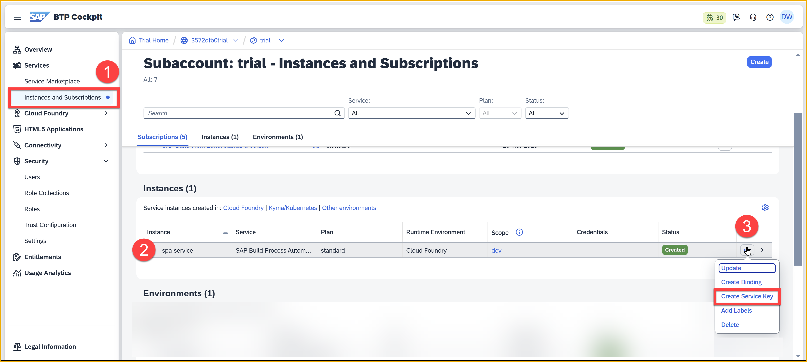

2. In the dialog, give the key a name, for example, **spa-key**.

    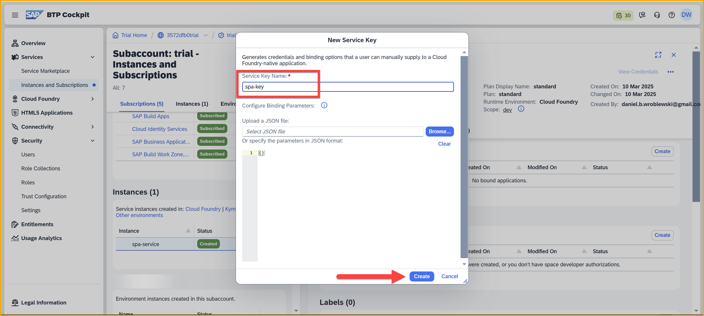

    Click **Create**

3. After the key is created (it will take about half a minute), click he 3 dots next to the key and download the key.

    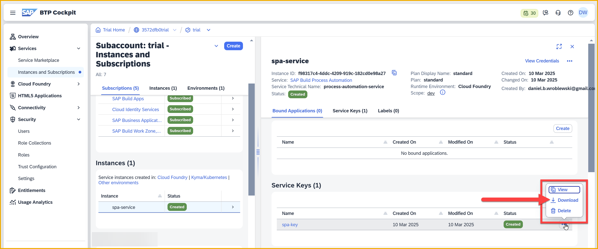

    Keep it in a safe place. You will need it later in the CodeJam.

### Congratulations!
Congratulations, you are now ready for our **Event-driven processes CodeJam**. Have a safe journey and the SAP Developer Advocates team looks forward to seeing you on the day of your event.

>**IMPORTANT:** You do not need to continue with any more tutorials in this series until you arrive at your event.
