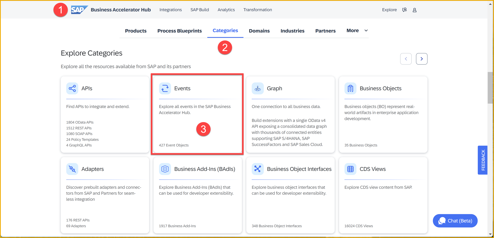
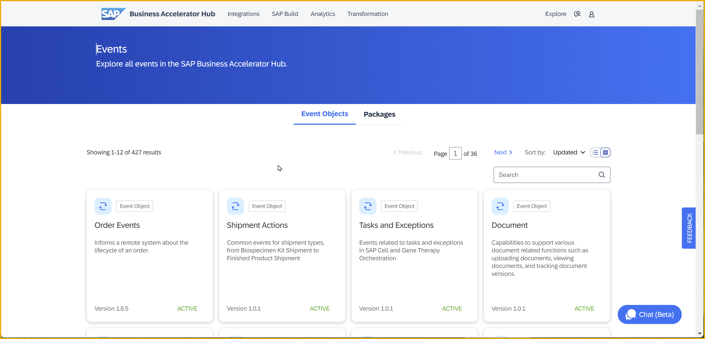
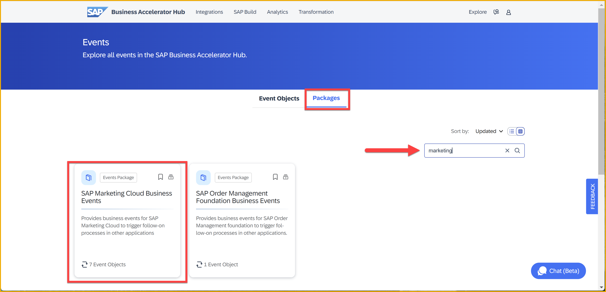
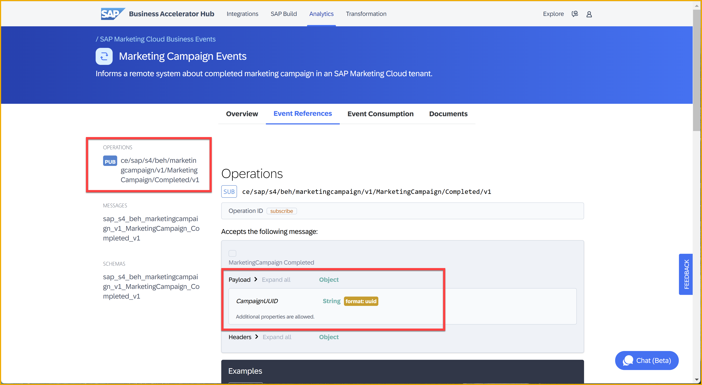
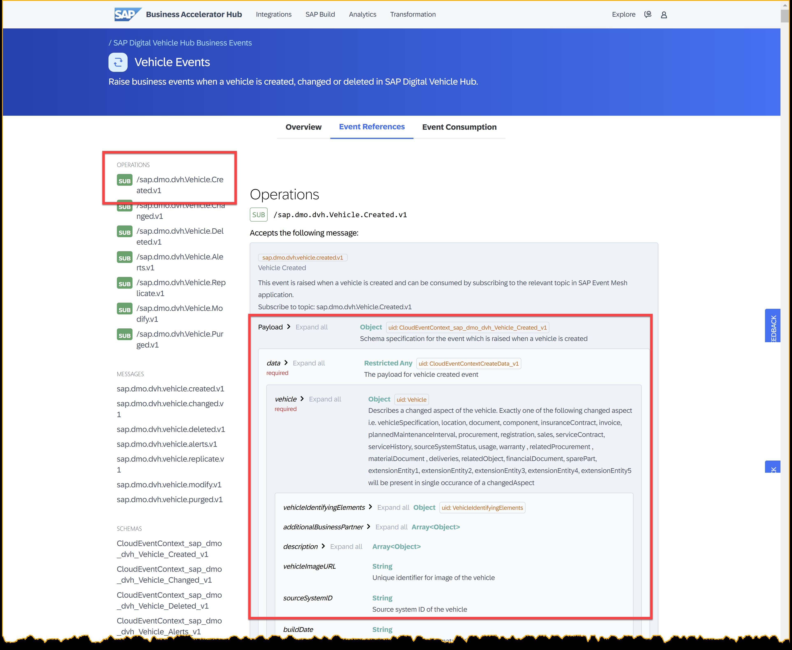
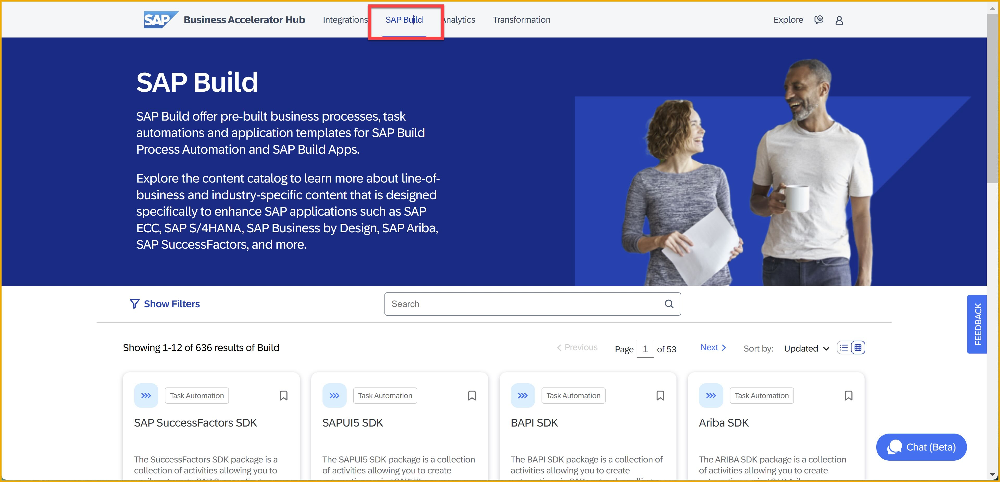
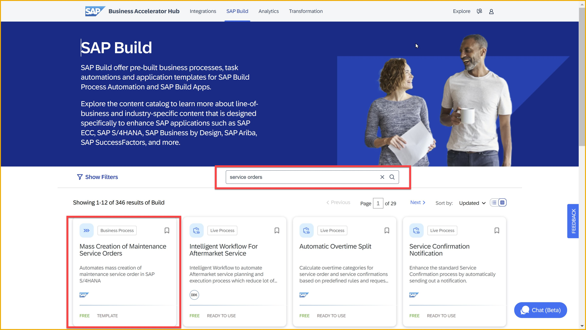
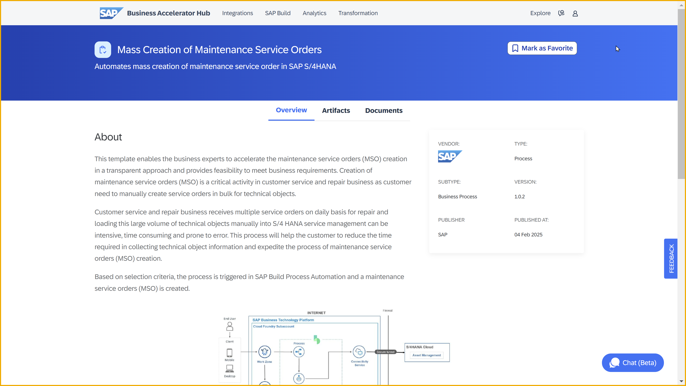
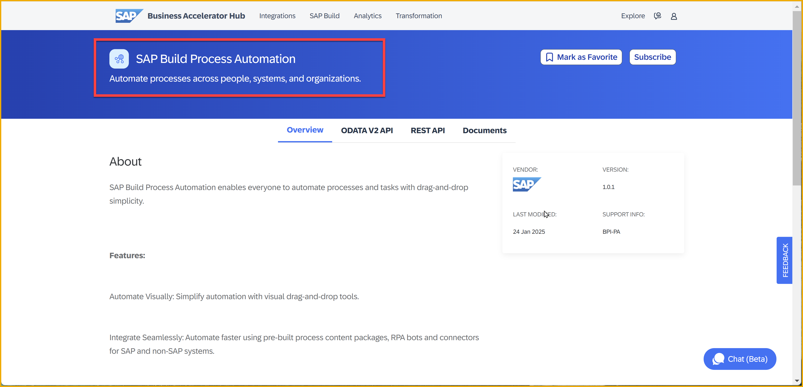
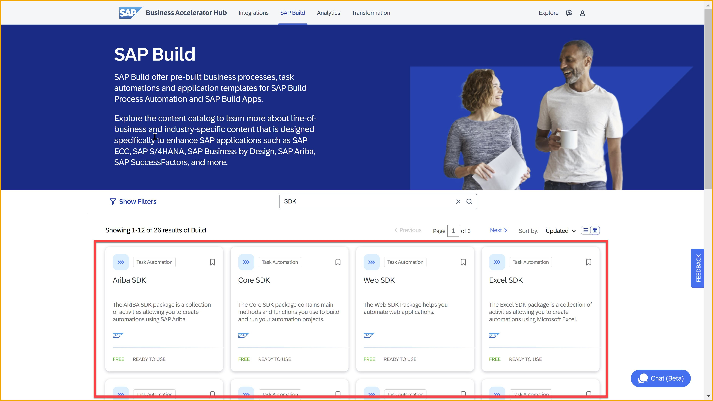

# 1 - Exploring Events and More in the SAP Business Accelerator Hub
<!-- description --> Before you start exchanging events between systems, let's get familiar with the events that SAP applications can produce, and with the SAP Business Accelerator Hub, where these events are described.

<!--
## Prerequisites
- You have completed the previous tutorial for the event-based processes CodeJam, [Event-Driven Processes CodeJam – Prerequisites](codejam-events-process-0-prerequisites).
-->

## You will learn
- The basics about the SAP Business Accelerator Hub 
- About the different SAP products that can generate events
- About the different types of events and the content for SAP Build


## Intro
In the SAP Business Accelerator Hub, you can discover, explore, and test the different types of content available for SAP products, as well as third-party products. The content available here can be used to accelerate the development of integrations and extensions required at your company.

Among the artifacts provided by SAP products and that are described in the SAP Business Accelerator Hub:

- APIs

- Events

- Business objects

- CDS views

- Business add-ins (BAdIs)

Among the SAP Build-related artifacts:

- APIs

- Process templates (especially for SAP applications)

- Automation SDKs


### Tour events section of SAP Business Accelerator Hub

Let's start by exploring the **Events** section of the SAP Business Accelerator Hub.

👉 Navigate to the SAP Business Accelerator Hub, [https://hub.sap.com](https://hub.sap.com), click **Categories**, and select **Events**.



This will list more than 350 events available. 



Let's group these events by SAP application and get familiar with the events produced by a particular SAP application.

👉 Click the `Packages` tab, and select the [SAP Marketing Cloud Business Events](https://hub.sap.com/package/SAPMarketingCloudBusinessEvents/event)




### Notification and data events

The two most common types of events that we will normally interact with are known as notification events and data events. They mainly differ in the amount of information included in the payload. Let's explore this further.

#### Notification events

A notification event is a message that is sent to inform that something has happened. It is a simple message that does not contain much data. For example, a notification event could be sent to inform that a new customer has been created in a system and within its payload it might just contain an ID.

As an example, let's use the [Marketing Campaign Events](https://hub.sap.com/event/CE_MARKETINGCAMPAIGNEVENTS/resource) available from SAP Marketing Cloud in the SAP Business Accelerator Hub. 




We can see that there is an operation available, `ce/sap/s4/beh/marketingcampaign/v1/MarketingCampaign/Completed/v1`, and within it we can find the headers and payload of the event. This event is an example of a notification event.

```JSON
{
  "type": "sap.s4.beh.marketingcampaign.v1.MarketingCampaign.Completed.v1",
  "source": "",
  "datacontenttype": "application/json",
  "specversion": "1.0",
  "subject": "string",
  "id": "QgEK7wzuHtqdhJwqCS+VOA==",
  "time": "2018-04-05T17:31:00Z",
    "data": {
        "CampaignUUID": "265239ce-e1b5-46a9-8c6d-dc68a238fd18"
    }
}
```

>We'll see another notification event later in this tutorial, for SAP S/4HANA business partners.


#### Data events

A data event is also a message that is sent to inform that something has happened, but unlike a notification event, it includes the data that has changed. For example, a data event could be sent to inform that a new customer has been created in a system and include the data of the new customer.

As an example, let's get familiar with the [SAP Digital Vehicle Hub Business Events](https://hub.sap.com/event/SAPDigitalVehicleHubBusinessEvents_SAPDigitalVehicleHubBusinessEvents/resource) available from SAP Digital Vehicle Hub. We can see that there is an operation available – Vehicle Created (`/sap.dmo.dvh.Vehicle.Created.v1`), and within it, we can find an example payload of the event. 



You can see that it contains lots of information – vehicle information, business partner info, storage location, model specification, vehicle specification, tire information, and more. The [full sample](vehicle-created-sample.json) can be found in the assets folder. This event is an example of a data event.

```JSON
{
    "specversion": "1.0",
    "type": "sap.dmo.dvh.Vehicle.Created.v1",
    "source": "/eu10/sap.dmo.dvh",
    "subject": "808E6E30B65149978A443429B29FB300",
    "id": "a823e884-5edc-4194-a81a-f3a3632417ee",
    "time": "2018-04-08 08:31:00",
    "datacontenttype": "application/json",
    "sappassport": "string",
    "data": {
        "vehicle": {
            "vehicleIdentifyingElements": {
                "id": "808E6E30B65149978A443429B29FB300",
                "externalID": "vehicle-008",
                "vin": "1234567898888888"
            },
            "additionalBusinessPartner": [
                {
                    "id": "string",
                    "role": "string"
                }
            ],
            "description": [
                {
                    "short": "string",
                    "long": "string",
                    "language": "string"
                }
            ],
            "vehicleImageURL": "string",
            "sourceSystemID": "string",
            "buildDate": "string",
            "plannedIndicator": true,
            "batchNumber": "string",
            "businessTypeCode": "string",
            "availabilityCode": "string",
            "plantID": "string",
            "plantName": "string",
            "storageLocationID": "string",
            "storageLocationDescription": "string",
            "modelSpecification": {
                "modelExternalID": "string",
                "modelName": "string",
                "manufacturerName": "string"
            },
            "vehicleSpecification": {
                "interiorColor": "string",
                "exteriorColor": "string",
                "upholstery": "Leather",
                "upholsteryColor": "string",
                "wheelType": "Alloy",
            ...
}
```

You might have noticed that the notification and data events above follow a specific format. It includes what looks like header fields and a payload within the data node. This is because SAP has adopted the **CloudEvents** specification as the common format for its systems/applications to publish events. 


### What is CloudEvents?

CloudEvents is a specification for describing event data in a common way. Its goal is to simplify event declaration and delivery across services, platforms and beyond! The specification is now under the [Cloud Native Computing Foundation](https://cncf.io/).

Below is an example of what a CloudEvent message will look like:

```JSON
{
  "specversion" : "1.0",
  "type" : "com.github.pull_request.opened",
  "source" : "https://github.com/cloudevents/spec/pull",
  "subject" : "123",
  "id" : "A234-1234-1234",
  "time" : "2018-04-05T17:31:00Z",
  "comexampleextension1" : "value",
  "comexampleothervalue" : 5,
  "datacontenttype" : "text/xml",
  "data" : "<much wow=\"xml\"/>"
}
```

You'll notice that the example above is composed of many attributes. These attributes describe the event and are independent of the event data. This means that we can process or inspect the event without needing to process its data. Now, let's dive a bit into the message itself.

>For more information on how SAP has adopted CloudEvents, check out this blog post: https://community.sap.com/t5/application-development-blog-posts/cloudevents-at-sap/ba-p/13620137.

#### CloudEvents message format

A CloudEvent message is mainly composed of context attributes and data. As we briefly touched on previously, the payload in the data field will depend on whether it is a notification event or a data event.

#### Context attributes

Several attributes can be included within the message, these attributes are known as [context attributes](https://github.com/cloudevents/spec/blob/v1.0.2/cloudevents/spec.md#context-attributes) and the idea is that these context attributes can be used to describe the event. We can think of these context attributes as the header information of our event.

Let's explore some of the attributes available.

| Name | Required | Description | Example |
| ---- | ----- | ---- | --- |
| id | ✅ | Identifies the event. Producers MUST ensure that source + id is unique for each distinct event. | QgEK7wzuHtqdhJwqCS+VOA== |
| source | ✅ | Identifies the context in which an event happened. | https://github.com/cloudevents |
| specversion | ✅ | The version of the CloudEvents specification which the event uses. | `1.0` |
| type | ✅ | Describes the type of the event | `sap.s4.beh.businesspartner.v1.BusinessPartner.Created.v1` |
| datacontenttype | | Content type of the value in data. | `application/json` |


#### Extension context attributes

A CloudEvent message may also include additional context attributes, which are not defined as part of the specification. These additional attributes are known as "extension context attributes" and can be used by the producer systems to include additional metadata to an event, similar to how we can use HTTP custom headers.

👉 Check out the events available for the [SAP Digital Vehicle Hub](https://hub.sap.com/event/SAPDigitalVehicleHubBusinessEvents_SAPDigitalVehicleHubBusinessEvents/resource) in the SAP Business Accelerator Hub.

For example, in the [SAP Digital Vehicle Hub Business Events package](https://hub.sap.com/event/SAPDigitalVehicleHubBusinessEvents_SAPDigitalVehicleHubBusinessEvents), we can see that the event is raised when a vehicle changes – `sap.dmo.dvh.Vehicle.Changed.v1` – and it contains the extension context attribute `sappassport`, which is an SAP-specific tracing identifier.

```JSON
{
  "specversion": "1.0",
  "type": "sap.dmo.dvh.Vehicle.Changed.v1",
  "source": "/eu10/sap.dmo.dvh",
  "subject": "808E6E30B65149978A443429B29FB300",
  "id": "a823e884-5edc-4194-a81a-f3a3632417ee",
  "time": "2018-04-08T08:31:00",
  "datacontenttype": "application/json",
  "sappassport": "string",
  ....
}
```

#### Data field

A CloudEvent message may include a payload but this is not required. If included, it will be in the format specified in the `datacontenttype` context attribute. Although it is not required, we will generally have a payload in messages. Below we can see an example of an event message that contains a payload.

```JSON
{
  "specversion": "1.0",
  "type": "sap.dmo.dvh.Vehicle.Changed.v1",
  "source": "/eu10/sap.dmo.dvh",
  "subject": "808E6E30B65149978A443429B29FB300",
  "id": "a823e884-5edc-4194-a81a-f3a3632417ee",
  "time": "2018-04-08T08:31:00",
  "datacontenttype": "application/json",
  "sappassport": "string",
  "data": { 
    "BusinessPartner": "10003245"
  }
}
```

Now that we are familiar with the CloudEvents format, let's explore the Business Partner events available in SAP S/4HANA Cloud.


### Tour business partner events in SAP S/4HANA Cloud 

As part of this CodeJam, we will interact with the Business Partner data from an SAP S/4HANA Cloud system. In our scenario, the Business Partner event will be used to inform that a Business Partner has been created and it will be triggered with the creation of a new Business Partner in the SAP S/4HANA Cloud system.

👉 Now that you are familiar with how to get around the SAP Business Accelerator Hub, search for the [Business Partner events](https://api.sap.com/products/SAPS4HANACloud/apis/all) available for SAP S/4HANA Cloud Public Edition. Check out the different operations and get acquainted with the payload for the Business Partner changed event, [https://hub.sap.com/event/CE_BUSINESSPARTNEREVENTS/resource](https://hub.sap.com/event/CE_BUSINESSPARTNEREVENTS/resource).

```JSON
{
    "type": "sap.s4.beh.businesspartner.v1.BusinessPartner.Changed.v1",
    "specversion": "1.0",
    "source": "/default/sap.s4.beh/244572008",
    "id": "194780e0-b5db-1ede-b58a-4550178dff9e",
    "time": "2024-02-26T02:53:06Z",
    "datacontenttype": "application/json",
    "data": {
        "BusinessPartner": "1000667"
    }
}
```

The event shared above would be considered a notification event, as it only contains the Business Partner ID that has been changed. As we can see it doesn't contain any information about the Business Partner itself, just the ID. 

If we would like to get more information about the Business Partner, we would need to call the [Business Partner (A2X) API](https://hub.sap.com/api/API_BUSINESS_PARTNER/overview), available in SAP S/4HANA Cloud, to get the details.

> 🧭 Take some time to explore what's documented on the [Business Partner events - Overview page](https://hub.sap.com/event/CE_BUSINESSPARTNEREVENTS/overview). You will be able to find lots of valuable information here, for example, [event reference](https://hub.sap.com/event/CE_BUSINESSPARTNEREVENTS/resource), event specifications (in JSON and YAML format), and a link to the [documentation](https://help.sap.com/docs/SAP_S4HANA_CLOUD/3c916ef10fc240c9afc594b346ffaf77/a75345282ddd4054a1e5ce7687e4b088.html?locale=en-US&state=PRODUCTION&version=2402.500).

Now, you might have noticed that the event samples shared in this exercise are in JSON format and follow a specific format. They all contain a similar structure, some header information (metadata) describing the message (like `id`, `type`, `specversion`, `source`, `type`, `datacontenttype`) and a `data` node, which includes the actual payload. This is because SAP has adopted the CloudEvents specification as the common format for its systems/applications to publish events.

In the next exercise, we will explore the CloudEvents format, which is a specification for commonly describing event data.


### Tour SAP Build artifacts
In addition to the event artifacts in the SAP Business Accelerator Hub, there are many SAP Build-related artifacts, especially for SAP Build Process Automation.


#### Pre-Built Content
One of the greatest features of SAP Build Process Automation is that it comes with thousands of templates for automating SAP-related processes.

In the menu header of the SAP Business Accelerator Hub, click **SAP Build**.



This will show hundreds of tiles for templates or SDKs that can be used in SAP Build Process Automation. These lead to documentation for these assets – if you want to use them, a similar list appears inside SAP Build in the SAP Build Store, where you quickly create projects based on these templates.


Enter **service orders** in the search box, and click the tile **Mass Creation of Maintenance Service Orders**.



You will get a page about this specific template. 

- **Overview:** Explains the use case and high-level architecture of the template

- **Artifacts:** Lists all the assets contained within the project and what they are for

- **Documentation:** Links to documentation, generally a PDF that you can download  




#### APIs
You've already seen in the site APIs for SAP S/4HANA Cloud. There are also key APIs for SAP Build. 

For example, you can explore the [SAP Build Process Automation API package](https://hub.sap.com/package/SAPProcessAutomation/overview).  



There are both OData and plain REST APIs for performing a variety of actions: trigger a process, view the context of process instances, execute rules, and much more.


#### Automation SDKs
Go back to the SAP Build area, but search by SDK – or just click [SDKs](https://hub.sap.com/build?searchterm=SDK).



Though you can consider these as just more pre-built content, SDKs are special projects that enable SAP Build Process Automation bots to connect to different applications: for example, Microsoft Office, Google Productivity Tools, SAP GUI, UI5 apps, and more.

SDKs are what make automation bots do useful things.

These entries provide an explanation of what the SDKs can do, plus a list of artifacts they come with. Generally, they do not have documentation.


### Further study

Now that you are familiar with some of the events available in the SAP Business Accelerator Hub, we are ready to start exploring the format used to describe the events. Enter CloudEvents.

To expand your learning, you might want to check out the links below and think about the open questions included in this section.

* Explore the events in the SAP Business Accelerator Hub - [link](https://hub.sap.com/content-type/Events/events/events)
* CloudEvents at SAP - [link](https://community.sap.com/t5/application-development-blog-posts/cloudevents-at-sap/ba-p/13620137)

>**Things to Ponder**
>
> 1. Can you think of reasons why would you prefer publishing notification events instead of data events?
> 2. Which format is used to document the Business Partner event specification?
   <details>
    <summary>⇟ Hint 🔦</summary>
    <i>Go to the Business Accelerator Hub and open the Business Partner event specification, in JSON or YAML format.</i>
    </details>

