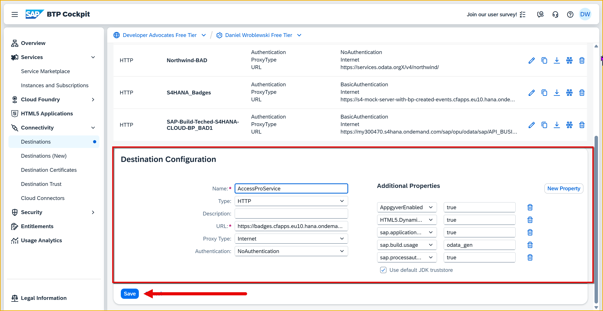
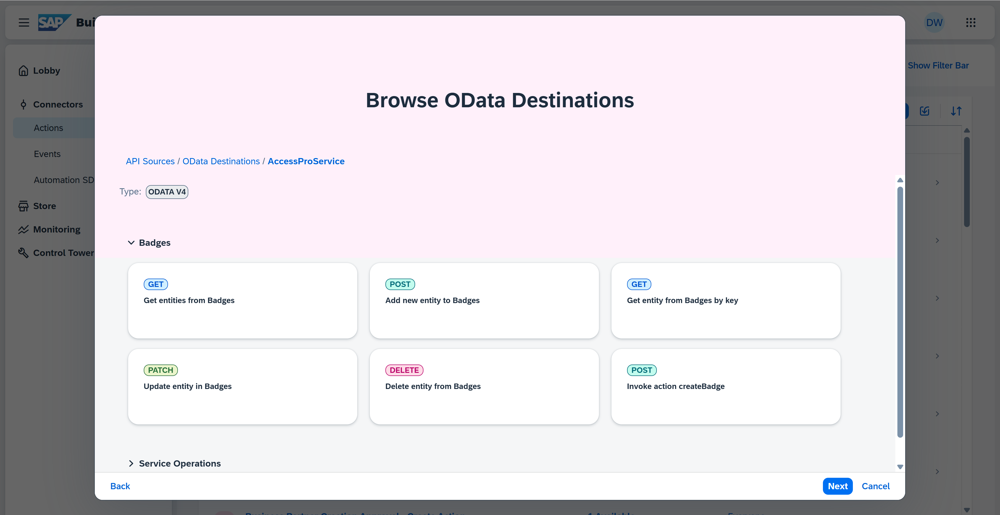
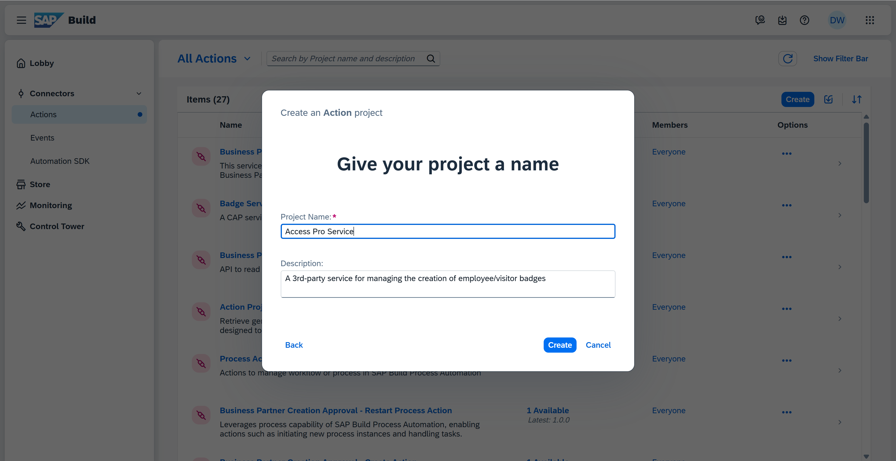
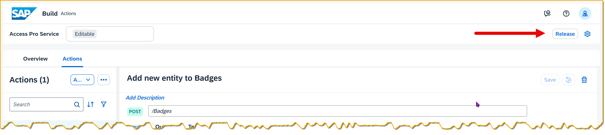
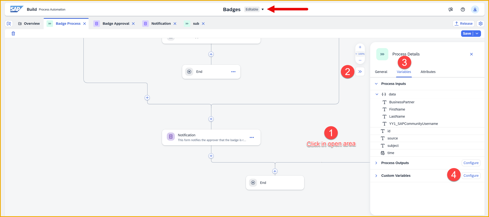
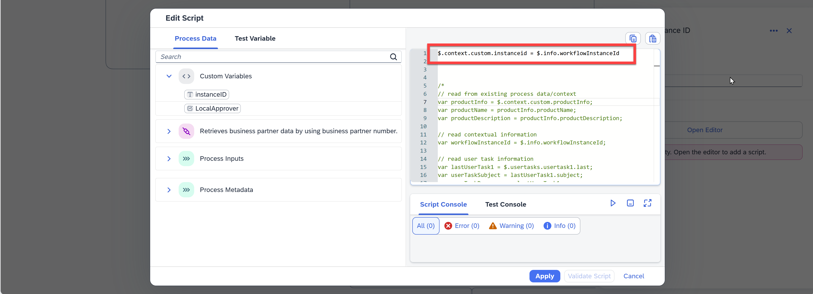
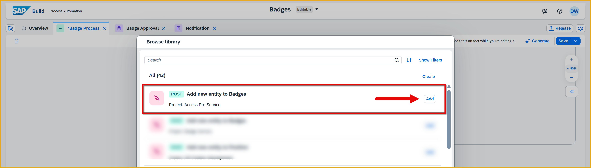
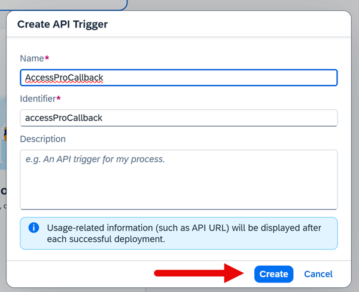
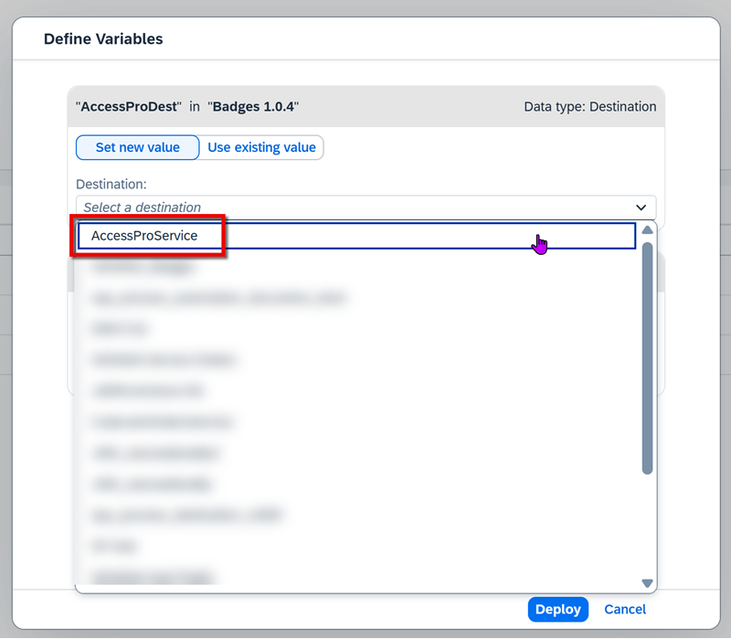

# 10 - Call 3rd-Party System and Wait for Callback

<!-- description --> Add a "Wait for an API Call" to integrate an external system by using an action to call the system and then waiting for the system to trigger resumption of the process instance.   

## Prerequisites
- You have completed the previous tutorial for the event-based processes CodeJam, [Add 2nd Approval With Custom Variables, Conditions and Form Events](codejam-events-process-9).

## You will learn
- How to pause process instance with "Wait for an API Call"
- How to call trigger to resume process instance


### Create destination to Access Pro (3rd-party system)
Remember, our action will just describe the type of service we want to access, but we need to create a destination to indicate the actual backend service to call.

1. Download the destination template. 

    Click [Destination template](https://github.com/sap-tutorials/sap-build-apps/blob/main/tutorials/codejam-events-process-10/Badge-Service), and then click the download button.

    

2. Go to the SAP BTP cockpit for your subaccount.

    >You can always return to your trial account cockpit by going to [https://account.hanatrial.ondemand.com/](https://account.hanatrial.ondemand.com/) and then opening your subaccount.

    Click **Connectivity > Destinations**.

    

    Click **Import Destination**, and select the file you downloaded.
    
    

3. Click **Save**.

4. Click **Check Connection**, and you should get a **200** status code.

    


### Add destination to Control Tower
You created a destination, but you must let SAP Build Process Automation know that you want to allow it to be used in deployed processes.

1. In the main SAP Build page, click **Control Tower**.

2. Click **Destinations**.

    

3. Click **Add**.

    

    Select the **S4HANA_Badges** destination.

    

    Click **Next**.

    Keep **All Environments**, and click **Add Destination**.

    

The destination should now appear in the list of destinations that can be used with your processes.


### Create action to generate badge
1. In the SAP Build menu, click **Actions**.

    

2. Click **Create**.

    

    Scroll down and select **SAP Business Accelerator Hub**.

    

    Select **Badge_Service**.

    

3. You will now see a list of all the entities and all the API calls you can make, only for your information.

    

    Click **Next**.

4. Name the action as follows:

    | Field | Value | 
    |------|--------|
    | **Name** | Badge Service |
    | **Description** | A CAP service to manage the Badge System. |

    

    Click **Create**.

    You will now see the operations available for this service, and you will need to decide which ones to expose (to "your" developers).

5.  Select the **POST** call, since you will want to create a new badge request during your process.

    

    Click **Add**.

    You now get the action where you can modify the inputs and outputs, or add additional API calls to this action. We will keep the inputs and outputs as is.

6. Under **Inputs**, select **ID** and click **Remove**.
   
    >The CAP service will generate an ID automatically, so we do not want to be forced to supply that field.
   
    

    Click **Save**.

    

7.  Click **Release**, then click **Release** to confirm..

    

    Click **Publish**, and then click **Publish** to confirm.

    


### Store instance ID
We will want the 3rd-party system to call our process back, and we need to supply to it the process instance ID. So first we must store the value. 

1. With nothing selected (just click in an open space), open the side panel.
   
    Under **Variables**, and then under **Custom Variables**, click **Configure**.

    

2. Click **Add Variable**.

    Set the name to **instanceID**.
    
    >The identifier is automatically generated and the type is automatically String.

    Click **Apply**.

    

3. Above the notification step, add a script task.

    

4. Set the name to **Get instance ID**.

    

5. Open the editor.

    Add the following line to the editor.

    ```JavaScript
    $.context.custom.instanceid = $.info.workflowInstanceId
    ```

    

    Click Apply.  

6. Click **Save** (upper right). 


### Add action to generate badge 
1. Under the script task click theplus sign, **+**, and add an action.

    

2. Click **Browse All Actions**.

    

    Select the **Add new entity to Badges**, and click **Add**.

    

3. In the side panel, create a destination variable.

    Click inside the **Destination Variable** field, and click **Create Destination Variable**.

    

    Name the variable **BadgeDest**, and click **Create**.

    

4. Under inputs, bind the input fields:

    | Field | Value | 
    |------|--------|
    | **businesspartnerId** | Process Inputs > data > BusinessPartner |
    | **communityId** | Process Inputs > data > YY1_SAPCommunityDisplayName |
    | **firstname** | Process Inputs > data > FirstName |
    | **lastname** | Process Inputs > data > LastName |
    | **processInstanceId** | Custom Variables > instanceID |
    | **status** | **Approved** |

5. Click **Save**. 


### Add "Wait for an API Call"
1. Under the action, click the plus sign, **+**.

    

2. Click **Controls and Events**.

    

    Scoll down and select **Wait for an API Call**.

    

    Click **Create an API Call**.

    

3. Call the API trigger **Badge System**, and click **Create**.

     
   
4. with the new step selected, open the side panel.
   
    Select the **Inputs** tab, and click **Configure**.

    

5. Click **Add Ouput**.

    Set the name to **badgeId**, and click **Apply**.

    

6. Click **Save**.


### Modify notification form
Our 3rd-party system will call back to our process instance, and send a badge number. Let's add that to the notification form.

1. Click the 3 dots next to your notification form, and select **Open Editor**.

    

2. Add a **Paragraph** and set its text to:
   
    ```Text
    Your badge number is:
    ```
    
    Add a **Text** field. Call it **Badge Number** and set to read only.

    

    Click **Save**.

3. Back in the process, with your form selected, open the side panel.
   
    Under **Inputs**, bind the **badgeId** from the **Wait for Badge System** step to the new form field.

    

4. Click **Save**.
   


### Add API key
In order to call an SAP Build Process Automation trigger – either a standard trigger or a wait trigger – you must send an API key with the adequate permissions.

1. Go to the **Control Tower**, and click **Environments**.

    

    Select the **Public** environment.

    

2. In the **API Keys** tab, click **Add API Key**.

    

3. Call the key **BadgeKey**, and click **Next**.

    

    Enable the following scopes:

    - trigger_read
    - trigger_execute

    Click **Next**.

    

    On the **Review** page, click **Add**.

    

4. A key will be generated. 

    >**IMPORTANT:** Make sure to copy and save it in a safe place.

    


### Release and deploy process
1. Click **Release**.

    

    Confirm by clicking **Release**.

2. Click **Show project version** (upper left).

    This will take you to the released version of your project, so you can deploy it.

    

3. Click **Deploy**.

    

    Select the **Public** environment.

    Select **Upgrade**.

    Note that it will show you that a new trigger will be created for the **Wait for an API Call** step.

    

4. Click **Deploy**.

    You will now have a new destination to select, since you created a destination variable for the action to create a new badge request. 

    >This is in addition to the one you selected in previous deployments for the S/4HANA backend.

    

    Select the **Badge_Service** destination, make sure the **S4HANA_Badges** destination is selected.

5. Click **Deploy**.

6. After deploying, go to the **Control Tower > Environments**, and go to the Public environment.

    Click **Triggers**, and you will see the trigger created for the Wait for an API Call. The trigger is called **Badge System**.

    Click **View**

    You will see the connection details for the 3rd party system to call our process instances to resume them.

    Copy the URL and put it in a safe place, where you put your API key. You will need these when we use the 3rd-party system.

    


### Trigger process
1. Again, go back to the **Create Business Partner** app we provided to you.

    

2. Enter the following:

    | Field | Value |
    |-------|--------|
    | **First Name** | Anything you want | 
    | **Last Name** | Anything you want | 
    | **Country** | US |      
    | **SAP Community Username** | Your user name in the SAP Community |      

    Click **Create**.

    Your business partner is created.

3. Check that the event was received into SAP Build by going to **Monitoring** > **Acquired Events** > **Business Events**.
   
    You should see an event created for your new business partner, including the business partner ID that you saw when you created it.

    


### Complete the process instance
In this step, you'll go through the entire process 🥳.

1. In SAP Build, click **Monitoring**.

    Click the **Processes and Workflow Instances** tile.

    

2. You should now see your process instance.

    Click on the process instance to see its details.
    
    

    You can see the steps that have run so far (from the bottom).

    - The process was triggered

    - The flag for the local approver was set

    - Data from S/4HANA was retrieved

    - An approval task was created and is ready to be executed

3. Open the Inbox in the header.

    

4. Approve the request.

    

    The task will disappear in the Inbox. If you check Monitoring for the steps, you'll see these additional steps (from bottom to top):
 
    - The approval was completed
 
    - The condition was checked
 
    - Since Sabrina is from the US, a task was sent to the local approver 

    

5. Again – FAST! – go into the Inbox and refresh the display. 

    If you were fast enough, you would have seen the form for the local approver.
    
    

    **DO NOT CLICK ANYTHING!** Let a minute go by and let the form lapse. If you refresh the Inbox, it will disappear.

    If you now check Monitoring for the steps by refreshing, you'll see these additional steps (from bottom to top):

    - The local approval was not done in time, and was canceled (2 entries)

    - The process instance went to the next step

    - The instance ID was retrieved (2 entries)

    - The action to create a new badge request in the 3rd-part system was executed (2 entries)

    - The process instance started to wait for an API call

    

6. Open the 3rd-party badge system (your instructor will provide details). 

    Select your new business partner.

    

    On the details page, enter the following, which you saved along the way:

    - Your API key

    - Wait Trigger URL

    

    Click **Upload Service Key**, and select your service key file. The client ID, client secret, and the authentication URL will be set.

    

    Click **Create Badge**.

    You should get a success message.

    

    >**What just happened?**
    >
    >The app made an API call to SAP Build Process Automation, specifically, to the "wait trigger" we created to  pause the process. The API call restarts the process, and injects the new badge ID in the process instance.
    >
    >We also updated the CAP service so that entity's status is updated to **PRINTED** and the badge ID is stored.    

7. Go back to the **Monitoring** tab and refresh your process instance. You'll see 2 more steps (from bottom to top):

    - The wait completed (because we called it via API)

    - The notification form was sent.

    

    If you look at the context, you will see an entry for the API we called to restart the process, along with the badge ID sent with the API call.

    
    
    Go to the Inbox and you will see the last notification form to acknowledge, along with the badge ID.

    

8. Submit the form and the process instance will complete.

    Here's the entire flow:

    

    Nice job 😺