# 11 - Run the Full Scenario

<!-- description --> Now that all the pieces are in place, run the entire event-based process scenario.
   

## Prerequisites
- You have completed the previous tutorial for the event-based processes CodeJam, [Call 3rd-Party System and Wait for Callback](codejam-events-process-10).

## You will learn
- How the entire event-based scenario works together

### Trigger process
1. Go to the **Create Business Partner** app we provided to you.

    

2. Enter the following:

    | Field | Value |
    |-------|--------|
    | **First Name** | Anything you want | 
    | **Last Name** | Anything you want | 
    | **Country** | US |      
    | **SAP Community Username** | Your user name in the SAP Community |      

    Click **Create**.

    Your business partner is created.

3. Check that the event was received into SAP Build by going to **Monitoring** > **Acquired Events** > **Business Events**.
   
    You should see an event created for your new business partner, including the business partner ID that you saw when you created it.

    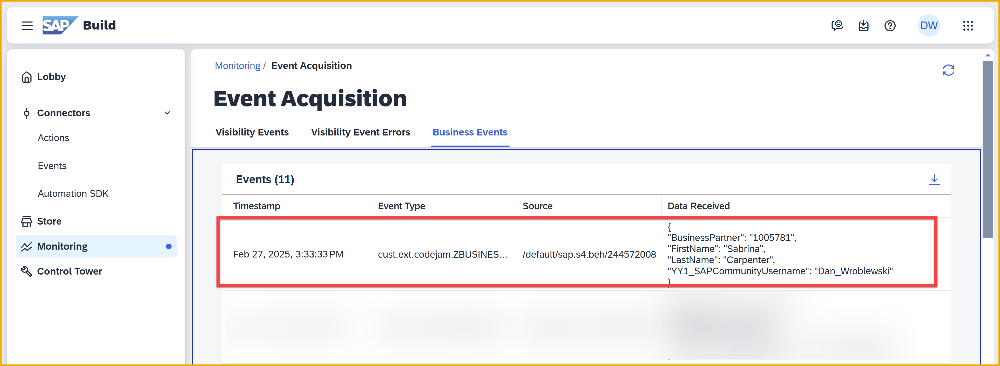

### Approve the badge
1. In **Monitoring**, click the **Processes and Workflow Instances** tile.

    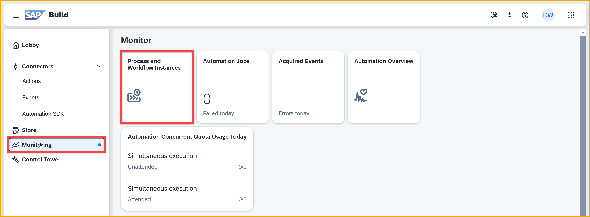

2. You should now see your process instance.

    Click on the process instance to see its details.
    
    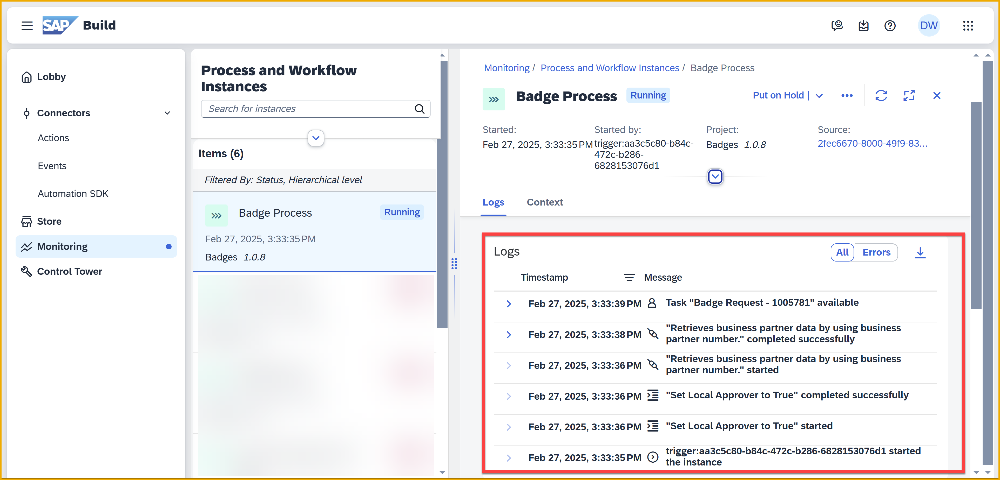

    You can see the steps that have run so far (from the bottom).

    - The process was triggered

    - The flag for the local approver was set

    - Data from S/4HANA was retrieved

    - An approval task was created and is ready to be executed

3. Open the Inbox in the header.

    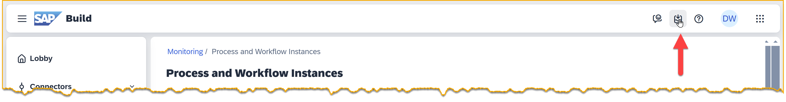

4. Click on the new task. 

    You will see information from the event, plus data you retrieved from the S/4HANA Business Partner API.

    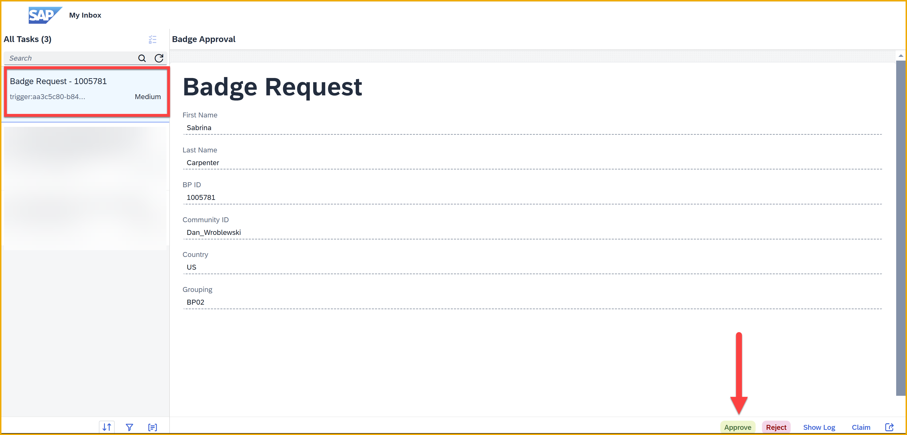

    Click **Approve**.

    The task will disappear in the Inbox. 

5. Return to **Monitoring** and refresh the process instance.

    You'll see the following additional steps (from bottom to top):
 
    - The approval was completed
 
    - The condition was checked
 
    - Since the new business partner is from the US, a task was sent to the local approver 

    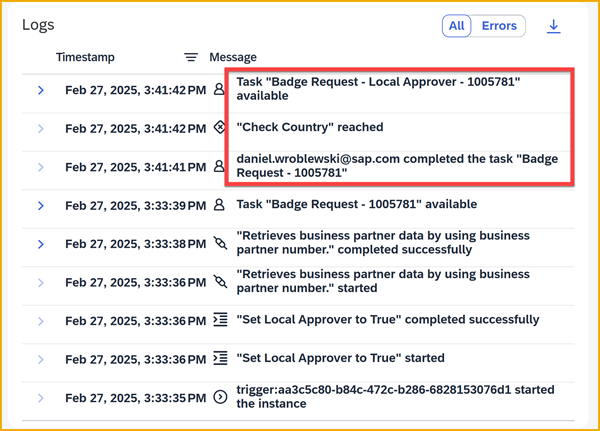

### Check the local approver
1. Again – FAST! – go into the Inbox and refresh the display. 

    If you were fast enough, you would have seen the form for the local approver.

    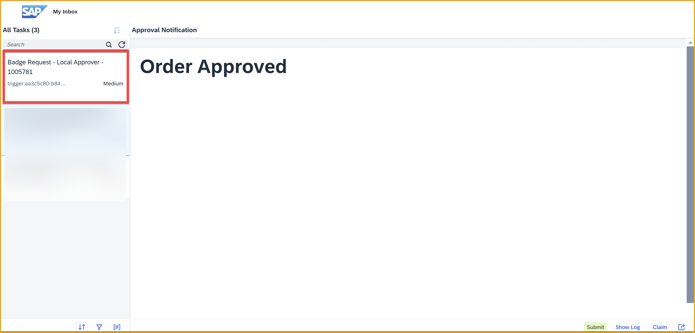

    **DO NOT CLICK ANYTHING!** Let a minute go by and let the form lapse. If you refresh the Inbox, it will disappear.

2. After a minute, check **Monitoring** again and refresh your instance.

    - The local approval was not done in time, and was canceled (2 entries)

    - The process instance went to the next step

    - The instance ID was retrieved (2 entries)

    - The action to create a new badge request in the 3rd-part system was executed (2 entries)

    - The process instance started to wait for an API call

    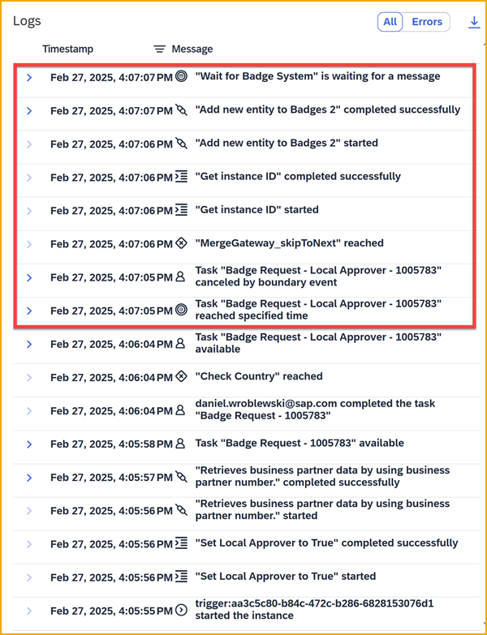

### Use 3rd-party system (Access Pro)
1. Open the 3rd-party badge system (your instructor will provide details). 

    Select your new business partner. (You can filter by your community ID)

    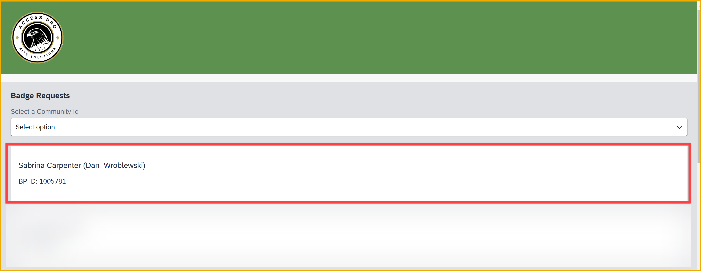

2. On the details page, enter the following, which you saved along the way:

    - Your API key

    - Wait Trigger URL

    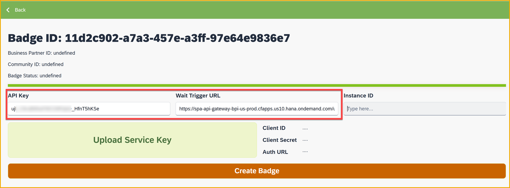

3. Click **Upload Service Key**, and select your service key file. The client ID, client secret, and the authentication URL will be set.

    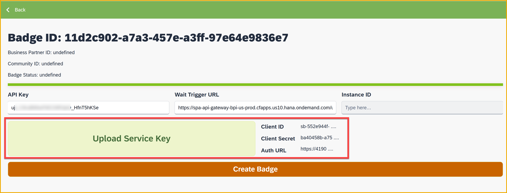

4. Click **Create Badge**.

    You should get a success message.

    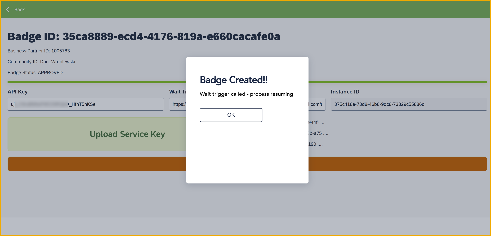

    >**What just happened?**
    >
    >The app made an API call to SAP Build Process Automation, specifically, to the "wait trigger" we created to pause the process. The API call restarts the process, and injects the new badge ID in the process instance.
    >
    >We also updated the CAP service so that entity's status is updated to **PRINTED** and the badge ID is stored.    

### Check that process instance resumed

1. Go back to the **Monitoring** tab and refresh your process instance. You'll see 2 more steps (from bottom to top):

    - The wait completed (because we called it via API)

    - The notification form was sent.

    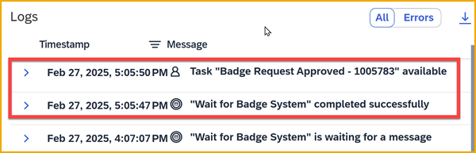

    If you look at the context, you will see an entry for the API we called to restart the process, along with the badge ID sent with the API call.

    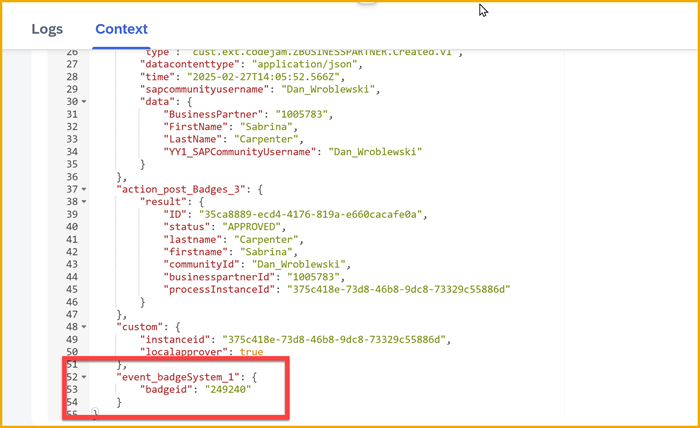
    
2. Go to the Inbox and you will see the last notification form to acknowledge, along with the badge ID.

    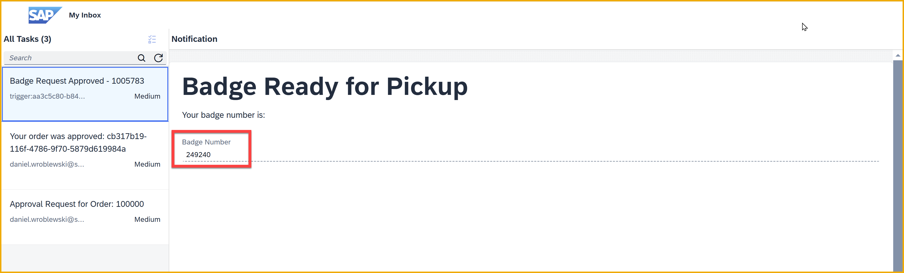

3. Submit the form and the process instance will complete.

    Here's the entire flow:

    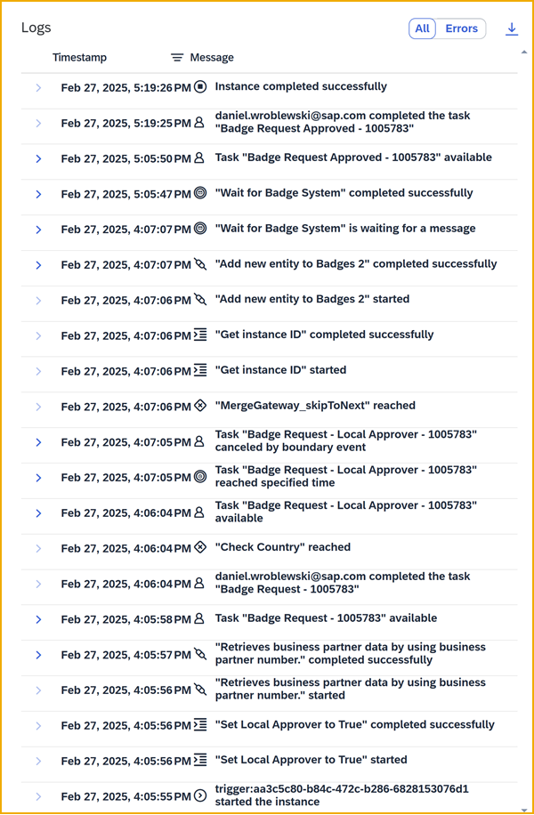

    Nice job 😺

### Further study

- [Creating Processes and Automations with SAP Build Process Automation (Learning Journey)](https://learning.sap.com/learning-journeys/create-processes-and-automations-with-sap-build-process-automation)

- [SAP Build Process Automation (YouTube playlist)](https://www.youtube.com/playlist?list=PL6RpkC85SLQBePo670YRglVJqaX_YaUtJ)

>**Things to Ponder**
>
>What are the advantages of using SAP Build Proceass Automation for designing and deploying processes?
>
>   - That is, what capabilities does it provide?
>
>What other processes can you imagine creating?

    