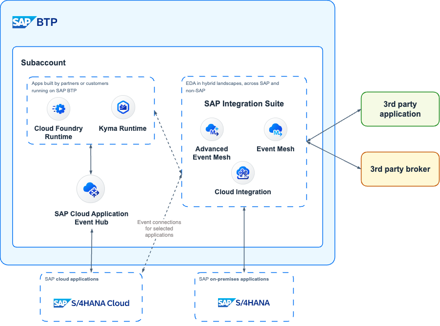
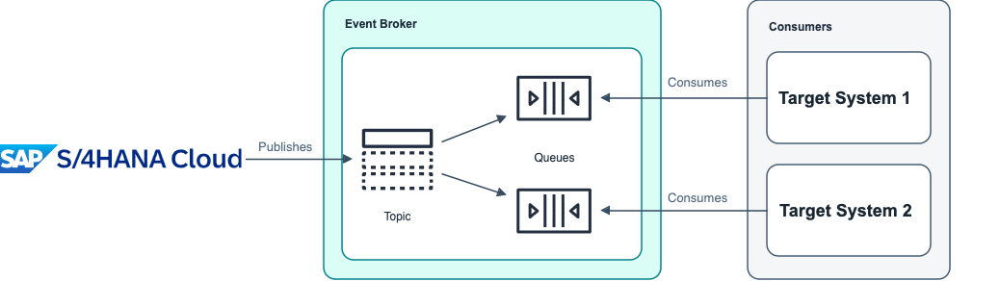

# 2 - Why Event-Driven Architectures?
<!-- description -->Learn how event-driven architectures (including event-based processes) make software systems more robust, and learn how such systems work.

## Prerequisites
- You have completed the previous tutorial for the event-based processes CodeJam, [Events and SAP Build Artifacts in the SAP Business Accelerator Hub](codejam-events-process-1-bah).

## You will learn
- What is event-driven architecture
- How systems communicate in event-driven architecture
- The role of an event broker in event-driven architecture

## Intro
An **event-driven architecture** is a software architecture paradigm concerning the production and consumption of events. An event can be defined as a significant change in the state of an object within a system.

Long gone are the days when a system (aka, **target system**) will constantly poll to check if there are any changes in another system: for example, a new customer created in a master data system. In the past, the **target system** would only know about the change by programming a routine that would poll a file share to check for any files produced by this system or a web service exposed in the **source system**, every X minutes/hours/days. 

The expectation nowadays is that systems are integrated and that the data exchanged between these systems will be immediately available in the **target system(s)** if any data is created/changed in the **source system**. Enter **event-driven architectures**.

An event-driven architecture is a software architecture paradigm concerning the production and consumption of events. An event can be defined as a significant change in the state of an object within a system. For example, when a customer/supplier/employee ( **business object** ) is created/updated/deleted ( **action**) in a system. 

Translating this to the SAP world, when a Business Partner is created/changed in SAP S/4HANA ( **source system** ), SAP S/4HANA can notify that there was a change in a business object and ***target system(s)*** interested in the Business Partner object can then react and trigger follow-up activities in their systems.

### How do source and target systems communicate?

Now, if the source system lets other systems know of any changes happening in its business objects, it will not be sustainable to create a new programming routine within the source system every time we want to notify a new target system of any changes. 

Traditionally we would have some form of middleware, e.g. SAP Cloud Integration) and configure our source system (for example, SAP S/4HANA) to send notifications of these events to the middleware and then use the middleware to distribute these messages. We would add target system(s) as needed. 

Now, we are moving the problem from the source system to a sort of middleware but ideally, there will be a way for the source system to notify others without the need to make any changes. Enter the **event broker**.

#### Event broker

An event broker is message-oriented middleware that enables the transmission of events between different components of a system, acting as a mediator between publishers and subscribers. It is the cornerstone of event-driven architecture, and all event-driven applications use some form of event broker to send and receive information.

By introducing an event broker in our landscapes:

- We can configure our source systems to **publish** their events to this message-oriented middleware. The source system will specify the class of the message (that is, **topic**).

- Systems interested in the changes happening (for example, in a particular business object in the source system) can **subscribe** to the event(s), via the event broker, by specifying the topic they are interested (`topic-based filtering`) or it can also be based on the content of the message (`content-based filtering`). 

There are two keywords that are important here: publish and subscribe (or "PubSub"). This is a well-known messaging pattern used to decouple systems/applications and allow asynchronous communication between them.

### PubSub messaging pattern

**Publish-subscribe** is a communication pattern that is defined by the decoupling of applications, where applications publish messages to an intermediary broker rather than communicating directly with consumers (as in point-to-point).

In a way, publishers and consumers do not need to know each other; they simply publish (produce) or consume (receive) the events. When following this messaging pattern, we move from the traditional polling mechanism to know if there have been any changes in the source system to reacting to real-time events (notifications) the moment something happens in the source system.

A subscriber (consumer), is generally only interested in a subset of the messages published. Normally, a message-oriented middleware will provide subscribers with a mechanism to set filters on the data that they want to receive. There are two common ways of filtering: topic-based and content-based.

#### Topic-based filtering

We mentioned before how target systems can subscribe to events by specifying a topic they are interested in. Some event brokers will allow subscribers to subscribe to topics by using wildcards (*) and they will be able to receive only the events they are interested in, which can be for different topics. 

For example, let's assume we have an SAP S/4HANA with the name `S4D` and it publishes the Business Partner create and change on the following topics: `default/sap.s4/S4D/ce/sap/s4/beh/businesspartner/v1/BusinessPartner/Created/v1` and `default/sap.s4/S4D/ce/sap/s4/beh/businesspartner/v1/BusinessPartner/Changed/v1`. A subscriber system could subscribe to both topics using a wildcard – `default/sap.s4/S4D/ce/sap/s4/beh/businesspartner/v1/BusinessPartner/*/v1` – and receive the messages for both event types. In this case, we are filtering the message by topics.

#### Content-based filtering

In some other cases, the event broker will allow the subscriber to specify which messages they want to receive, based on the attributes or content of the message. For example, the message sent to the event broker can contain attributes that describe the message and we can do some filtering based on the values of those attributes. 

>SAP offers different services that can act as event brokers. These were discussed in the previous tutorial.

With many systems in our landscapes and each one being developed by different vendors/teams, it would be good if there was a standard way of structuring these events to simplify how systems create/handle/process these messages right? This is why we discussed [CloudEvents](https://CloudEvents.io/) previously.

### Further study

In this tutorial, we learned about event-driven architectures and how they can help us to move from the traditional polling mechanism to reacting to real-time events (notifications) the moment something happens in the source system. 

We also learned about the PubSub messaging pattern and how it can help us to decouple systems/applications and allow asynchronous communication between them. Finally, we learned about two common ways of filtering messages, topic-based and content-based filtering. In a future tutorial, we will dive deeper into some of these concepts, such as topics, queues, topic structures, topic subscriptions, and how to publish and subscribe to events.

To expand your learning, you might want to check out the links below and think about the open questions included in this section.

* Event-driven architecture: [link](https://en.wikipedia.org/wiki/Event-driven_architecture)
* What is an event broker?: [link](https://solace.com/what-is-an-event-broker/).
* What is the publish-subscribe messaging pattern?: [link](https://solace.com/blog/publish-subscribe-messaging-pattern/)
* SAP event-driven integrations: [link](https://help.sap.com/docs/event-broker/event-broker-service-guide/event-driven-integrations?locale=en-US%3Fversion%3DCloud).

>**Things to Ponder**
>
> 1. Some event brokers only support topic-based filtering, while others support only content-based filtering. Can you think of the advantages and disadvantages of each?
> 2. What are some of the benefits of embracing an asynchronous communication pattern in your systems?
