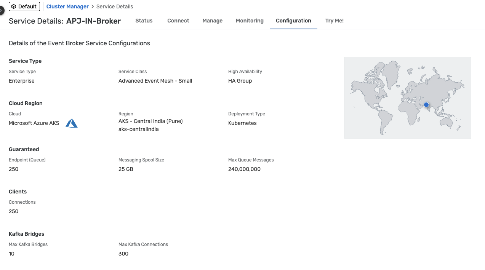

# 3 - Explore SAP Integration Suite, advanced event mesh
<!-- description -->Learn to get around SAP Integration Suite, advanced event mesh, and get familiar with some of key parts of the product.

## Prerequisites
- You have completed the previous tutorial for the event-driven processes CodeJam, [Why Event-Driven Architectures?](codejam-events-process-2-eda).
- You have received the participants handbook, which contains systems and credentials you will need. The instructor will provide this to you. 

## You will learn
- How to access the SAP Integration Suite, advanced event mesh
- How to get around the UI
- How to connect to advanced event mesh
- How to send basic events using the event broker service UI

## Intro
In this tutorial, we will start interacting with SAP Integration Suite, advanced event mesh (AEM) and we will get familiar with some key parts of the product.

So far, we've learned about events in the SAP ecosystem, CloudEvents and the different products that are part of SAP's event-driven portfolio. In this tutorial, we will start interacting with SAP Integration Suite, advanced event mesh and we will get familiar with some key parts of the product.

### Access the AEM instance

>🔐 Your instructor will provide you with the details to access the SAP Integration Suite, advanced event mesh instance.

👉 Navigate to the instance URL provided – in the format `https://[region].console.pubsub.em.services.cloud.sap/login?tenant-id=[our-tenant-id]`. Enter the user credentials provided to you – in the format `EDI-[country]-[SAPCommunityDisplayName]@sap.com`.

You'll get the start page.

The start page is divided into three sections:

- **Event Portal:** Here we can access the cluster and mesh managers, through which we can manage the event brokers and event meshes in our instance.
- **Mission Control:** The different event management services are available here. For example, the Event Portal, through which we can create, design, share, and manage various aspects of your EDA based on event brokers or other streaming technologies.
- **Insights:** AEM has dashboards and visualizations available out of the out-of-the-box. Through here we are able to monitor the event brokers deployed.

### Mission Control

Mission Control is where we manage the event broker services and event meshes (which contain a bunch of event broker services), and monitor the health of our AEM instance.

Mission control is divided into two sections:

- **Cluster Manager:** Here, we can find the event broker services available in our instance, and you can create, configure and delete event brokers.

    👉 Navigate to **Cluster Manager** and view the event broker services available. 
    
    >**IMPORTANT:** Please uncheck the **Only show my services** checkbox.

    

- **Mesh Manager:** Here, we can create and manage our event meshes. An event mesh is composed of multiple event brokers that can span different data centers. An event broker can only belong to one mesh.

    👉 Navigate to **Mesh Manager** and view the event mesh available

    

#### Event Broker services

The event broker service is the main object that we interact with in AEM. It is the service that provides the messaging capabilities to our client applications. An event broker service can be created in different cloud providers, be deployed to different regions, be part of a cluster and also be part of a mesh.

In our case, we have four event broker services (only three are in our mesh – click `Cluster Manager` to see all of the event broker services):

- AMER-USEast-Broker

- APJ-IN-Broker

- EU-North-Broker

- EU-FR-DevBroker

We will not be creating an event broker service in this tutorial, but we will be interacting with the existing ones. Creating an event broker service is quite simple, you just need to provide a name, a region and the service type (service class). To select the right service class, you need to know and understand the requirements of your client applications, for example:

- Number of client applications connecting simultaneously
  
- Maximum throughput

- Number of queues required

- Type of traffic exchanged between client applications

> To learn more about how to choose the right service class, visit the [documentation](https://help.pubsub.em.services.cloud.sap/Cloud/ght_pick_service_type.htm).

Now, let's explore an event broker service available in our instance.

1. Navigate to **Cluster Manager**, and go to the `APJ-IN-Broker` event broker service. You will land in the Status tab of the service. Get familiar with the information available.

    

    In the **Status** tab, we will be able to get an overall status of the event broker service, know the number of active connections, the number of queues used, the state of the service, its version, when was it created, who created it, if it is part of a high availability group. Also, we'll see if this event broker service is part of a mesh. 

2. In the **APJ-IN-Broker** event broker service, go to the **Connect** tab.    

    In the dropdown on the right side, select to **View by: Protocol**.  Now, expand the `REST` section part of the accordion and select the `Solace REST Messaging API` element. The connection details will be displayed on the right side of the screen.

    In the ***Connect*** tab, we can see the connection details available for the event broker service depending on the protocol we want to use – for example, the host, the port, the username and the password to connect to the event broker service.
    
    Depending on the protocol we use to connect, sometimes we might also need to provide Message VPN details. This is also included here.

    

    > 🚨 The connection details (username and password) available in the **Connect** tab are the ones set by default when creating an event broker service. That doesn't mean that they will actually work (that is, you can update the password for the `solace-cloud-client` created with the event broker service). This is the case of the `solace-cloud-client` user in the `APJ-IN-Broker`.

3. In the `APJ-IN-Broker` event broker service, go to the **Manage** tab of the event broker service.

    In the **Manage** tab, we can access the event broker service manager. From here we can quickly access the clients, queues, access control and bridge of our event broker and also see the different management tools available.

    

    > 💡 An idea ... once we start connecting to an event broker, remember to visit the **Clients** section of an event broker to see the clients connected and their details, for example, the username and protocol they are using to connect. 

4. In the `APJ-IN-Broker` event broker service, go to the **Monitoring** tab of the event broker service.

    In the **Monitoring** tab, we will be able to get a summary of the messages exchanged via our event broker. 

    

5. In the `APJ-IN-Broker` event broker service, go to the **Configuration** tab of the event broker service.

    In the **Configuration** tab, we can see the service type (service class), the cloud provider and region where it is deployed, the upper limits of the event broker service: the maximum number of client connections, the maximum number of queues possible, the messaging storage and the maximum number of queue messages.

    

6. In the `APJ-IN-Broker` event broker service, go to the **Try Me!** tab of the event broker service.

    And last but certainly not least ... the **Try Me** tab. From here, we will be able to access the Try Me! functionality that's available from within the event broker service. Through it, we can connect to the event broker, publish messages to it and also consume messages sent to topics. This is a great way to quickly test the event broker service and exchange simple messages.

    

    Just as a quick test, let's use the Try Me! functionality to quickly establish a connection and exchange a message. We will achieve the communication scenario below.

    

7. In the **Try Me!** tab, follow the instructions below:

   - Click on the `Open Broker Manager` button.

    
    
   - On the `Publisher` side, expand the area for entering the credentials.
  
    

   - From the **participants handbook**, enter the credentials:`Broker URL`, `Message VPN`, `Client Username` and `Client Password`.

    

   - Click **Connect**.

    You should now see **Connected**.

    

   - On the `Subscriber` side, expand the credentials area, and select **Same as Publisher** checkboxes for the first three credentials.

    

    Click **Connect**.

   - After establishing the connection, subscribe to the topic `try-me` by clicking the **Subscribe** button.

    

   - Back on the **Publisher** side, publish a message to the topic `try-me` by clicking the **Publish** button.

    Check the message being consumed on the **Subscriber** side.

    

### Event Meshes

As we learned in the previous section, an event mesh is composed of multiple event brokers that can span different regions and data centers. An event broker can only belong to a single mesh and the communication between event broker services in a mesh is powered by Dynamic Message Routing.

> **Dynamic Message Routing** is the underlying technology enabling message exchange between different event broker services (nodes) in an event mesh. DMR allows connected nodes to automatically determine how to forward event messages within the same site (horizontal scaling) or between sites (multi-site scaling) to exchange subscription information.

> What's great about DMR is that the event brokers dynamically discover how to route messages between each other, without the need for manual configuration. A client application doesn't need to know the exact event broker service to which it should publish or subscribe messages. The event mesh takes care of routing the messages to the correct destination.

> DMR is a key feature of the event mesh that allows you to scale your event mesh horizontally and across sites (multi-site).

In our case, we have one mesh, called **EDI CodeJam**, composed of three event broker services. Note that not all event broker services need to be part of a mesh – **EU-FR-DevBroker** doesn't belong to a mesh, and is a "standalone" broker. Also, you can have/manage multiple event meshes in an AEM instance.

We will not be creating an event mesh in this tutorial, but we will be interacting with the existing **EDI CodeJam** mesh. Creating an event mesh is quite simple, you just need to provide a name, select the event broker services that will be part of the mesh and specify the links between the event broker services.

👉 Navigate to the Mesh Manager, go to the **EDI CodeJam** event mesh and view the information available.

You will see the event broker services that are part of the mesh, the last time that there was a sync and the status of all the links. From here you will also be able to run a mesh health check.

### Insights

Insights provide us with a centralised place where we can monitor various aspects of the AEM instance:

- Resource usage

- Event mesh health

- Message flow

- High-Availability (HA) status

- Queue, topic endpoint, RDP, and bridge health

- Message spool utilization

- Capacity utilization

👉 Navigate to **Insights** and view the insights of our AEM instance.

From here, you will also be able to access dashboards available in Datadog if [Insights advanced monitoring has been enabled](https://help.pubsub.em.services.cloud.sap/Cloud/Insights/Advanced-Monitoring/access-datadog.htm). We will not cover it in this CodeJam but you can learn more about it in the [documentation](https://help.pubsub.em.services.cloud.sap/Cloud/Insights/Advanced-Monitoring/using-dashboards.htm). One thing to highlight here is that if you already use Datadog, it will be possible to [forward the Insights data](https://help.pubsub.em.services.cloud.sap/Cloud/Insights/insights_data_forwarding.htm) to your own Datadog account.

> 💡 An idea ... once we start exchanging messages in AEM, remember to visit the Insights section so that you can see how the number of messages

### Further study

In this tutorial, we explored the AEM instance that we have available for the event. We navigated through the different sections of the start page, the Cluster Manager, the Event Broker services, the Mesh Manager and the Insights section. 

We also exchanged our first messages through the `Try Me!` functionality available in our event broker service.

To expand your learning, you might want to check out the links below and think about the open questions included in this section.

- Create Event Broker services - [link](https://help.pubsub.em.services.cloud.sap/Cloud/create-service.htm)
- Choosing the Right Service Class for Your Event Broker Service - [link](https://help.pubsub.em.services.cloud.sap/Cloud/ght_pick_service_type.htm)
- Creating an Event Mesh - [link](https://help.pubsub.em.services.cloud.sap/Cloud/Event-Mesh/ght_event_mesh.htm)
- DMR or a Message VPN Bridge? - [link](https://help.pubsub.em.services.cloud.sap/Features/DMR/DMR-Overview.htm#dmr-or-vpn-bridge) 
- Insights Advanced Monitoring - [link](https://help.pubsub.em.services.cloud.sap/Cloud/Insights/Advanced-Monitoring/using-dashboards.htm)

>**Things to Ponder**
>
> 1. Which protocols can we use to connect to an event broker service in AEM?
> 2. Can you list some of the programming languages that there are SDKs available for, which can be used for Solace Messaging?
