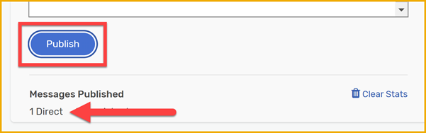
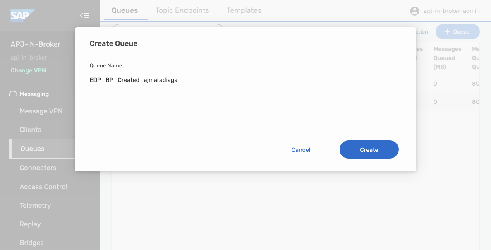

# 4 - Publish and Subscribe to Events
<!-- description -->Dive deeper into the message exchange, still by using the UI in AEM, and also explore a different section through which you can exchange messages.

## Prerequisites
- You have completed the previous tutorial for the event-driven processes CodeJam, [Explore SAP Integration Suite, advanced event mesh](codejam-events-process-3-aem).
- You have received the participants handbook, which contains systems and credentials you will need. The instructor will provide this to you. 

## You will learn
- What are topics, queues and subscriptions
- How to create a queue
- How to add subscriptions to a queue
- How to send and receive messages using `Try Me!` page in the event broker service

## Intro
In a previous tutorial, we learned more about event-driven architecture, so we are now familiar with the basic UI elements in SAP Integration Suite, advanced event mesh (AEM). 

In this tutorial, we will dive deeper into the message exchange, still by using the UI in AEM and we will also explore a different section through which you can exchange messages. Before we get to the exercise, we might need to expand a bit on some concepts. 

Let's get started.


### Topics

In a previous exercise, we mentioned that a topic is a means by which a publisher classifies a message. A topic tells us what type of message we will receive if we subscribe to that topic.

In essence, it is a string that is composed of one or more levels. Each level is separated by a forward slash (/) and the levels can be anything. This is commonly known as topic-level granularity. The granularity allows for more targeted and efficient information exchange. 

Instead of having a single topic for all updates on a business object in a complex system (/BusinessPartner), the system can have distinct topics for different types of updates on a business object (/BusinessPartner/Created, /BusinessPartner/Updated, /BusinessPartner/Deleted). 

There is no specific schema/specification on how you need to structure your topic string but you do find that patterns are established within a system. Let's get familiar with the structure of a topic by "dissecting" a real-world topic. 

Below we can see a topic on which an SAP S/4HANA Cloud system will publish a Business Partner message.

Example: `default/sap.s4/S4D/ce/sap/s4/beh/businesspartner/v1/BusinessPartner/Created/v1`:

- *default/sap.s4/S4D*: System information.
- */ce*: CloudEvent. We know that all events published by an SAP S/4HANA Cloud system follow the CloudEvent specification
- */sap/s4*: This is coming from an SAP S/4HANA system.
- */beh/businesspartner/v1/BusinessPartner*: Information of the business object that we will be receiving.
- */Created*: This is the action that took place in the source system. In this case, it is notifying us that a Business Partner was created. Many actions can take place in a system, for example, `/Updated` or `/Deleted`. In other cases, if we were dealing with a business object like a Purchase Order, there could be an event raised when it is `/Cancelled` or `/Rejected`.
- */v1*: Version of the message. If a new version of the message is made available – adding new fields to the payload – then this will change.

Now, by knowing the topic on which a message type will be published, we can create a consumer program/service that subscribes to the topic directly and processes the messages sent to it. Generally, you can subscribe to a topic by specifying the entire topic string when establishing the connection – for example, *default/sap.s4/S4D/ce/sap/s4/beh/businesspartner/v1/BusinessPartner/Created/v1*. 

But what if we want to subscribe to all actions (Created, Updated, Deleted) that occur on a BusinessPartner object? 

Luckily, in the case of SAP Integration Suite, advanced event mesh, we can subscribe to the topic by using wildcards (\*). For example, by subscribing to the topic ***default/sap.s4/S4D/ce/sap/s4/beh/businesspartner/v1/BusinessPartner/\*/v1*** we will be able to get all messages for different actions (Created, Updated, Deleted) whose version is v1.

In AEM, the `>` character can be used at the last level of a subscription to indicate a "one or more" wildcard match for any topics – for example, by subscribing to the topic *default/sap.s4/S4D/ce/sap/s4/beh/>* will bring all objects that are published under that prefix, independent of type, action, and version.

>In the example above we can see how the topic level granularity can allow a consumer program/service to subscribe only to the information it needs. 
>
>Learn more about wildcard characters in topic subscriptions: [https://help.pubsub.em.services.cloud.sap/Messaging/Wildcard-Charaters-Topic-Subs.htm](https://help.pubsub.em.services.cloud.sap/Messaging/Wildcard-Charaters-Topic-Subs.htm)

If our consumer program/service subscribes to a topic, we will receive all messages for that topic subscription. That said, a direct topic subscription lasts only as long as the consumer is connected. The problem here is that our consumer needs to be online to receive a message. If the consumer becomes unavailable then we will end up losing the message. 

In some scenarios, this is unacceptable and we need to ensure that we receive and process all messages published. Fortunately, there is a mechanism to retain messages without the need for a consumer service to be online 100% of the time. Then, the consumer can process the messages asynchronously or whenever it is available. Enter **Queues**.


### Queues

Queues allow us to subscribe to one or more topics and receive messages for all topics matching their subscriptions. The messages are received by the messaging system, saved in the queue and delivered to consuming clients if they are online and connected or held in the queue until the consumer becomes available. 

Queues can provide exclusive access to one consumer or access to multiple consumers where messages are distributed among the consumers. The message will be in the queue until a consumer acknowledges that a message has been processed. Only then the message will be removed from the queue.


In the case of AEM, queues can be durable or non-durable:

- **Durable queues** exist until they are removed by an administrative action. They accumulate messages whether clients are online or offline. When offline clients reconnect, they receive all of the messages that accumulated while they were offline.

- **Temporary (or non-durable) queues** follow the lifecycle of the client connection and are useful for ensuring message persistence while clients are online. Once the client disconnect, the queue disappears.


### Topic subscription

As mentioned before, we can subscribe to a topic directly. A topic subscription is created after establishing a connection to AEM. We achieved this previously when we subscribed to the `try-me` topic in the **Subscriber** section of the **Try Me!** page. 

This is not a polling mechanism, but a running connection is needed, through which AEM will send a message to the subscriber. In this case, the web page. If there is no subscriber available, the message will be missed.

In the case of a queue, which is subscribed to topics, a message sent to a topic will be stored in the queue until a consumer is available to process it. This is a more reliable way to ensure that messages are not lost.


### Topic endpoint

In AEM there is a concept of a **Topic Endpoint**. A topic endpoint is a durable storage for messages that are published to a topic. It is also a way to ensure that messages are not lost if there are no subscribers available to receive them. It is in a way similar to a queue but it has some limitations:

- A topic endpoint can only be used for a single topic. Queues can subscribe to multiple topics.

- A producing application can publish messages directly to a queue by referencing the queue by its name. A topic endpoint can only be used to store messages published to a topic, and it is not possible to reference it by name in the same way as a queue.

- A topic endpoint doesn't allow reading messages without removing them. A queue supports this.


### Publish an event

We published a simple event in the previous tutorial by using the **Try Me!** page in the `APJ-IN-Broker` event broker service. Let's now explore another mechanism to exchange messages with our event broker. 

By the end of this tutorial we will achieve a communication scenario like the one below. Enter the `Try Me!`.

![Publish and subscribe to the default/sap.s4/S4D/ce/cust/ext/codejam/ZBUSINESSPARTNER/Created/v1/\[SAPCommunityUsername\] topic](./assets/edp-codejam-exercise-5.png)

1. Navigate to the `APJ-IN-Broker` event broker service and click the **Open Broker manager** link. 

    On the left side, click **Try Me!**. Here you cannot just publish and subscribe to topics but also interact with queues in the event broker.

    Now, let's use some of the concepts that we've learned so far in this exercise and publish an event on a topic that has some levels in it. But first, we will need to connect to the event broker.

2. Click **Connect** in the **Publisher** section.

    This will fail, as we need to provide the connection details. Enter the credentials from the participants handbook.

3. Go to the `Try Me!` page, provide the connection details in the Publisher section and click the `Connect` button.

    

    We have connected the Publisher section to the event broker service. 
    
4. For the topic, enter the following but replace `[SAPCommunityUsername]` with your SAP Community username.
   
    ```JSON
    default/sap.s4/S4D/ce/cust/ext/codejam/ZBUSINESSPARTNER/Created/v1/[SAPCommunityUsername]
    ``` 

    For the payload, enter the following but replace `[SAPCommunityUsername]` with your SAP Community username (it appears twice).

    ```JSON
    {
    "id": "33642f82-f55d-4d03-a198-2f2b9e135902",
    "time": "2025-01-31T06:12:26.851Z",
    "type": "cust.ext.codejam.ZBUSINESSPARTNER.Created.v1",
    "source": "/default/sap.s4.beh/244572008",
    "specversion": "1.1",
    "datacontenttype": "application/json",
    "data": {
        "BusinessPartner": "1005773",
        "FirstName": "Alan",
        "LastName": "Turing",
        "YY1_SAPCommunityUsername": "[SAPCommunityUsername]"
    },
    "sapcommunityusername": "[SAPCommunityUsername]"
    }
    ```

    It should look like this:
    
    

5. Click **Publish**.

    OK, we've published the message but it doesn't seem like much has happened. Apart from the stats being updated after sending the message, we don't have any feedback. 
    
    

    Let's now subscribe to the topic and see if we can receive the message.

>The payload above is a custom CloudEvents message that's generated when a Business Partner is created in the simulated SAP S/4HANA Cloud system that we will be using as part of this CodeJam. 
>
>For now, we are just copying and pasting the payload but in a later step we will be triggering a similar payload from a UI. We can see that the message contains the Business Partner ID, First Name, Last Name, and the SAP Community username of the person who created the Business Partner. The `YY1_SAPCommunityUsername` field mimics a custom field that we've added to the Business Partner object in the SAP S/4HANA Cloud system. The `sapcommunityusername` field is a custom header that we are including in our CloudEvents message.
>
>You might have also noticed that the topic structure for the custom event (*default/sap.s4/S4D/ce/cust/ext/codejam/ZBUSINESSPARTNER/Created/v1/[SAPCommunityUsername]*) is different from the one used by a standard event (*default/sap.s4/S4D/ce/sap/s4/beh/businesspartner/v1/BusinessPartner/Created/v1*). This is because a different topic structure is used in SAP S/4HANA Cloud when generating custom events. You can learn more about extending out-of-the-box events in SAP S/4HANA Cloud here: [Extending SAP S/4HANA Cloud events with RAP and event filtering plus dynamic topics](https://www.youtube.com/watch?v=Q4H0LNZi7Dg).


> **Delivery Mode**
>
> In the example above we've not changed the Delivery Mode. Two delivery modes are possible in AEM, Direct and Persistent. By default, the delivery mode will be `Direct` which can have some limitations in terms of message delivery. For example, the message doesn't require acknowledgment of receipt by subscribing clients and messages aren't retained for a client when it's not connected to an event broker. This means that we can end up losing messages and in some scenarios, this is perfectly fine and acceptable but that might not be the case always. Fortunately, we are also able to change the delivery mode to `Persistent` which ensures that messages are retained in the event broker until they are acknowledged by the consumer. It keeps a copy of the message until successful delivery to all clients and downstream event brokers has been verified. This will be a more reliable way to ensure that messages are not lost.


### Subscribe to an event

We've successfully connected the publisher section to the event broker by providing the **Solace Web Messaging** credentials. Let's now connect the subscriber section to receive the event.

1. Click **Connect** in the **Subscriber** section to log in. It will the credentials from the publisher side.

2. Enter the following in the topic field but replace `[SAPCommunityUsername]` with your SAP Community username. 
   
    ```JSON
    default/sap.s4/S4D/ce/cust/ext/codejam/ZBUSINESSPARTNER/Created/v1/[SAPCommunityUsername]
    ``` 

3. Click **Subscribe**.

    

4. On the publisher side, click **Publish**.

    Excellent! We were able to receive the message that we published. 

    


    We've achieved the same scenario we completed in the previous exercise but this time we are getting used to interact with the **Try Me!** page in the event broker service and we are now sending a CloudEvent message.

As explained previously, we can subscribe to a topic directly and so far we've created a topic subscription. For us to receive messages, our subscriber needs to be online and connected to AEM. 

But what if we want to ensure that we receive all messages published, even if our subscriber is offline? This is where queues come into play. Let's explore how we can create a queue to receive/accumulate messages in it and finally, we will subscribe to it.


### Create a Queue

> 🚨 Before we create a queue, make sure you open the `Queues` link in a new tab, so that you don't have to re-enter the credentials in the `Try Me!` page and connect again to the event broker.

1. Select the **Queues** link on the left side and **Open in a New Tab**to see the queues in the event broker service. 

    

2. On the right of the new tab, click **+ Queue**.
   
    
   
    Enter the name `EDP_BP_Created_[SAPCommunityUsername]`, but replace `[SAPCommunityUsername]` with your SAP Community username.

    

    Click **Create**.
    
3. Leave all the default settings, and click **Apply**. 

    Our queue has no subscriptions at the moment, so let's go ahead and add a subscription to the following topic: `default/sap.s4/S4D/ce/cust/ext/codejam/ZBUSINESSPARTNER/Created/v1/[SAPCommunityUsername]` (replacing `[SAPCommunityUsername]` with your SAP Community username).

4. Click on the queue you just created.
   
5. Go to the **Subscriptions** tab.
    
    
    
    Click **+ Subscription** on the right side. 
    
    Enter the topic name, `default/sap.s4/S4D/ce/cust/ext/codejam/ZBUSINESSPARTNER/Created/v1/[SAPCommunityUsername]` (replacing `[SAPCommunityUsername]` with your SAP Community username).

    

    Click **Create**.


### Subscribe to a Queue
Now that we have created a queue, let's subscribe to it in the **Try Me!** page.

1. Go back to he previous tab, which is the **Try Me!** page.

    On the publisher side, you should still be signed in.
    
2. Click **Connect** on the subscriber side. It should grab the credentials from the publisher side.

    >If not, provide them again.

3. Expand the **Bind to an endpoint to receive guaranteed messages** section.

    Enter the queue name in the text box – `EDP_BP_Created_[SAPCommunityUsername]`(replacing `[SAPCommunityUsername]` with your SAP Community username).

    Click **Start Consume**.

    

    If you've published a message after creating the queue, some messages would have been accumulated in the queue and they will be displayed in the UI. If not, publish a new message, and your queue will receive it and it will then be displayed in the UI.

>🧭 Take some time to explore further what we've learned in this tutorial. Some ideas:
>
>- Publishing:
>
>   - Try publishing some additional messages on the topic and see how they are received in the subscriber section.
>
>   - Change the delivery mode before publishing a message and see how it affects the message delivery. 
>
>   - Changing the topic where it is published.
>
>- Manage your queue:
>
>   - Add new topic subscriptions to your queue.
>
>   - Look at the stats of your queue.
>
>   - When consuming messages from Try Me! page, check the Consumers listed in the Queue.
>
>- Stop consuming messages from the queue and see how the messages are accumulated in the queue. Check the queue stats in `Queues`.


### Create a Business Partner in the simulated SAP S/4HANA Cloud system
We've been publishing and subscribing to events directly in the UI available in the event broker service. Now, let's create a business partner from the simulated SAP S/4HANA Cloud system. 

This is an activity that we will do multiple times in the CodeJam, in order to trigger our process in SAP Build Process Automation.

1. Navigate to the simulated SAP S/4HANA Cloud system. 

    >The URL is included in the participants handbook.

    

2. Create a new business partner by entering a first name, last name, and your SAP Community user name, and selecting a country.

    Click **Create**.

    This create  a new Business Partner in the simulated SAP S/4HANA Cloud system and it will trigger a CloudEvents message that will be published to the event broker service. The event will be published to the following topic: 
    
    ```JSON
    default/sap.s4/S4D/ce/cust/ext/codejam/ZBUSINESSPARTNER/Created/v1/[SAPCommunityUsername]
    ```
    
    The message will be delivered to the queue that we've created (`EDP_BP_Created_[SAPCommunityUsername]`) and you should be able to see it in the **Try Me!** UI if you are still connected and consuming messages from the queue.

    


### Further study

We've covered a lot in this tutorial. We've learned about topics, topic subscriptions, queues, and how to publish and subscribe to events in the event broker service using the `Try Me!` page. We've also learned about the different types of queues, durable and non-durable, and how they can be used to ensure that messages are not lost if the consumer is offline. We created a queue, subscribed to a topic and consumed messages. These are activities that we will do more in future exercises.

- Topic endpoints and Queues - [link](https://help.pubsub.em.services.cloud.sap/Get-Started/topic-endpoints-queues.htm)
- Understanding Solace endpoints: Queues vs Topic endpoints - [link](https://solace.com/blog/queues-vs-topic-endpoints/)
- Consuming messages from a queue - [link](https://help.pubsub.em.services.cloud.sap/Cloud/Consuming-Guaranteed-Messages-from-Queue-in-Broker-Manager.htm)
- Message delivery modes - [link](https://help.pubsub.em.services.cloud.sap/Get-Started/message-delivery-modes.htm)
- Direct Messaging - [link](https://docs.solace.com/Messaging/Direct-Msg/Direct-Messages.htm)
- Guaranteed Messaging - [link](https://docs.solace.com/Messaging/Guaranteed-Msg/Guaranteed-Messages.htm)

>**Things to Ponder**
>
> 1. Which wildcard can you use to receive all events, independent of levels, for Business Partners?
> 2. Some queues can be configured to have multiple consumers. Can you think of a scenario where this would be useful?
> 3. On the Queues page of our event broker service, there were some queues whose names started with a #. What do you think this means?
