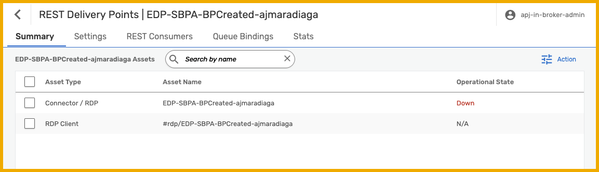

# 5 - Send Events to SAP Build Process Automation

<!-- description -->Learn how we can configure sending events to a particular SAP Build Process Automation tenant, so that we can later create processes that can be triggered by those events.

## Prerequisites
- You have completed the previous tutorial for the event-driven processes CodeJam, [Publish and Subscribe to Events](codejam-events-process-4-publish-and-subscribe-events).
- You have received the participants handbook, which contains systems and credentials you will need. The instructor will provide this to you. 
- You have the SAP Build Process Automation service key created as part of the [CodeJam prerequisites](codejam-events-process-0-prerequisites).

## You will learn
- How to configure REST Delivery Points in SAP Integration Suite, advanced event mesh
- How to forward messages from a queue to a REST consumer

### Intro
Now that we are familiar with the SAP Integration Suite, advanced event mesh, how we can publish and subscribe to events, and how we can exchange messages using an event broker service, we will start tackling one of the requirements of our integration scenario: trigger a business process in SAP Build Process Automation when a BusinessPartner is created in SAP S/4HANA Cloud.

There are scenarios where the target system/application can't consume messages directly from an event broker but we still want these systems/applications to be part of our event-driven world and react to events as they are produced. Fortunately, some of these systems might expose APIs (REST endpoints) through which we can notify them of an event. 

For these cases, we can leverage REST Delivery Points to forward messages from a queue to that system. For example, the integration we are about to configure between SAP S/4HANA Cloud and SAP Build Process Automation goes through an event broker service in SAP Integration Suite, advanced event mesh. In AEM, we end up configuring a [REST Delivery Point](https://help.sap.com/docs/event-mesh/event-mesh/manage-webhook-subscriptions) to [forward the events received and start a process](https://help.sap.com/docs/build-process-automation/sap-build-process-automation/create-event-triggers) in SAP Build Process Automation. 

> You can check out this [SAP Tech Bytes: SAP S/4HANA Cloud + SAP Integration Suite, AEM + SAP Build Process Automation](https://community.sap.com/t5/application-development-blog-posts/sap-tech-bytes-sap-s-4hana-cloud-sap-integration-suite-aem-sap-build/ba-p/13706661).

If you remember the CodeJam's [integration scenario](../codejam-events-process-introduction/)), we have an SAP S/4HANA Cloud system that generates events whenever a Business Partner is added to the system and we would like to trigger a process in SAP Build Process Automation. As part of this tutorial we will forward events from a queue to a REST consumer, in this case, SAP Build Process Automation. From now on, we will refer to these types of systems as **REST consumers**.

>It is also possible to configure this message forwarding in the Event Mesh capability of SAP Integration Suite. If you are interested in exploring how you can configure the webhook subscription mentioned above in the Event Mesh capability of SAP Integration Suite, you can check out the documentation here: [https://help.sap.com/docs/integration-suite/sap-integration-suite/create-webhook-subscription](https://help.sap.com/docs/integration-suite/sap-integration-suite/create-webhook-subscription).

By the end of this tutorial, we will achieve a communication scenario like the one below.

### REST Delivery Points (RDP)

A REST delivery point (RDP) is a provisioned object on an event broker service that facilitates message delivery to REST consumers. The RDP can be bound to message queues to deliver messages from those queues to REST consumers. The RDP maintains a list of REST consumers, which are identified by their remote connection information.

For this tutorial, we will use the `APJ-IN-Broker` event broker service and we will reuse the queue we created in the previous tutorial: `EDP_BP_Created_[SAPCommunityDisplayName]`. 

This queue is subscribed to the `default/sap.s4/S4D/ce/cust/ext/codejam/ZBUSINESSPARTNER/Created/v1/[SAPCommunityDisplayName]` topic, where the events for the BusinessPartner object created in the simulated SAP S/4HANA Cloud are being published.

### Create a REST Delivery Point

Now that we have our queue, we are ready to create a REST Delivery Point (RDP) to forward messages from the `EDP_BP_Created_[SAPCommunityDisplayName]` queue to a REST consumer.

1. Inside the `APJ-IN-Broker` service broker, click **Open Broker Manager**.

2. Click **Clients** on the left-side menu.

    Click **REST**.

    

3. Click **+ REST Delivery Point**.

    

    Enter a name, `EDP-SBPA-BPCreated-[SAPCommunityDisplayName]`, (replacing `[SAPCommunityDisplayName]` with your SAP Community display name).

    

    Click **Create**.

    A simple configuration form will appear. No need to modify anything here – **Do not enable the RDP yet**, that is, leave the toggle button off.
    
    Click **Apply**.

    

4. Once created, go to the RDP details page by clicking on the name of the RDP. 
   
    

    You will see that there isn't much here yet, as we haven't configured the REST consumer details. We will do this now.

    

### Configure REST consumer
Now that we've created a REST Delivery Point, we have to specify where we want events sent.

1. Navigate to the **REST Consumers** tab.
   
2. Click **+ REST Consumer**, and enter the name `SBPA_[SAPCommunityDisplayName]`, (replacing `[SAPCommunityDisplayName]` with your SAP Community display name) 
    
    Click **Create**.

    

    A configuration form will be displayed. 

3. Enter the details from the SAP Build Process Automation service key created as part of the prerequisites (you downloaded the key file).

    >**IMPORTANT:** Do not enable the REST Consumer yet – leave the toggle button off. 

    Enter the following:

    | Field         | Value        |
    | ------------- | ------------ |
    | *Host*        | Value from service key `.endpoints.api`, e.g.`spa-api-gateway-bpi-us-prod.cfapps.[region].hana.ondemand.com` |
    | *Port*        | `443`          |
    | *HTTP Method*        | `POST`          |
    | *TLS Enabled* | `Yes`          |
    | *Authentication Scheme* | `OAuth 2.0 Client Credentials`          |
    | *Client ID*        | Value from service key `.uaa.clientid`, e.g. *sb-VQ18I1VS-3226-5LF1-JVWV-760D08FHP857-3ok534d4-8562-632j-436w-0j5b0n8r4d0l!b139588|eventing-xsuaa-broker!b####*          |
    | *Client Secret*        | Value from service key `.uaa.clientsecret`          |
    | *Token Endpoint URL*        | Value from service key `.uaa.url`, e.g. *https://[host].authentication.[region].hana.ondemand.com/oauth/token?grant_type=client_credentials*          |
    | *Token Expiry Default* | `3600`          |

4. Click **Apply**.

    

The newly created REST consumer will be listed in the REST Consumers tab. Now we need to configure the queue that we will bind to our RDP. Events in this queue will be forwarded.

### Configure Queue binding

1. Navigate to the **Queue Bindings** tab. 

2. Click **+ Queue Binding**. 
    
    Select the queue you previously created, named `EDP_BP_Created_[SAPCommunityDisplayName]` but with your SAP Community display name.

    

3. Click **Create**.

4. A simple configuration form will be displayed. 

    In the **Post Request Target** field, you need to enter the path where we can send events to SAP Build Process Automation (`/internal/be/v1/events`). Notice that you will need to include the `/` at the beginning of the value.

    Enter the following details:

    | Field                       | Value                                                         |
    | --------------------------- | ------------------------------------------------------------- |
    | *Post Request Target*       | `/internal/be/v1/events` |
    | *Request Target Evaluation* | None                                                          |
    | *Replace Target Authority*  | No                                                            |

    Click **Apply**.

    

The newly created queue binding will be listed in the **Queue Bindings** tab. Now we need to configure a request header that is required by SAP Build Process Automation.

### Configure Request Headers
1. In the **Queue Bindings** tab, select your queue binding.

    

2. Navigate to the **Request Headers** tab.
    
    

3. You will create 2 headers. 
    
    For each, you will click **+ Request Header**, enter the header name, then the header value, and then click **Apply**.

    Create the following headers:

    | Header Name                       | Header Value                                                         |
    | --------------------------- | ------------------------------------------------------------- |
    | `Content-Type`       | `application/cloudevents+json` |
    | `WebHook-Request-Origin`       | `aem` |

    

Now that we've created the request headers, we are ready to enable the REST consumer and the RDP.

### Enable the REST Consumer and RDP
We've configured the REST consumer and the queue binding, we can enable the REST consumer and the RDP.

First, let's see all the objects that we've configured.

1. Navigate back to the main page for your RDP.

    Select the **Summary** tab. Here you will see all the objects and their status. Notice that the only object in an operational state is the queue we created at the beginning of the exercise.

    

2. Navigate to the **REST Consumers** tab, and click the name of your REST consumer, something like `SBPA_[SAPCommunityDisplayName]`.

    

3. Click **Edit** on the top right.

    

    Enable the REST consumer by toggling the **Enabled** setting.
    
    Click **Apply**.

    Now we are ready to enable our RDP.

4. Navigate back to the main page for your RDP.

    Select the **Summary** tab.
    
5. Click on the **Connector / RDP**, named `EDP-SBPA-BPCreated-[SAPCommunityDisplayName]`, but with your SAP Community display name.
    
    Click **Edit** on the top right, and enable the RDP by toggling the **Enabled** setting.
    
    Click the **Apply** button.

    Once we enable the RDP, if we navigate to the `Summary` tab, we should see that all the objects are in an operational state.

    

6. Now, go to the simulated SAP S/4HANA Cloud system and create a Business Partner. 

    This will trigger a Business Partner event which you will receive in your queue.

    Check that the `EDP_BP_Created_[SAPCommunityDisplayName]` queue (inside your RDP) is accumulating messages.

    

### Summary

This tutorial completed all the configuration required on the AEM side. We achieved quite a few things in AEM:

1. Familiarized ourselves with different parts of AEM.
1. Connected to an event broker service.
1. Sent and received events using the **Try Me** feature available in AEM.
1. Defined a queue.
1. Added subscriptions to a queue.
1. Created a REST Delivery Point. 
1. Defined an RDP REST Consumer, where we configured the details of our SAP Build Process Automation tenant.
1. Bound a queue to our RDP.
1. Added request headers to the queue binding.
1. Enabled it all.

### Further study

In this tutorial, we have learned how to create a REST Delivery Point (RDP) to forward messages from a queue to a REST consumer. We used OAuth 2.0 authentication to securely deliver events to SAP Build Process Automation. Now we know a mechanism to enable systems that expose REST endpoints to "react" to events produced by an event broker service.

* Managing REST Delivery Points - [link](https://docs.solace.com/Services/Managing-RDPs.htm)
* REST Consumer Authentication Schemes - [link](https://docs.solace.com/Services/Managing-RDPs.htm#configuring-REST-consumer-authentication-schemes)
* Integration with Advanced Mesh Service Plan for Service Cloud - [link](https://help.sap.com/docs/SAP_S4HANA_CLOUD/0f69f8fb28ac4bf48d2b57b9637e81fa/9b34c841dfba4f82af0825a2f3196ecf.html?locale=en-US)

>**Things to Ponder**
>
> 1. What if you would need to transform or enrich the message before sending it to the REST consumer? How would you do it?
> 2. Can you think of a system within your company that exposes REST endpoints and could benefit from being part of an event-driven architecture?
