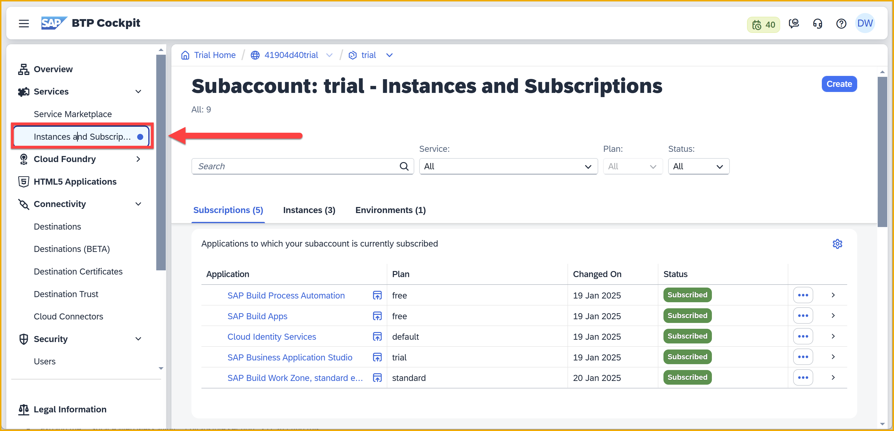
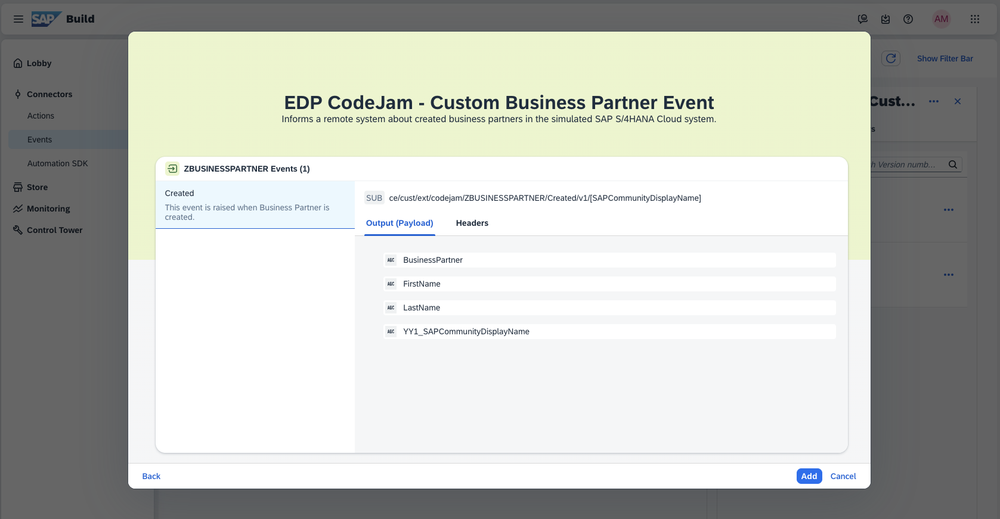
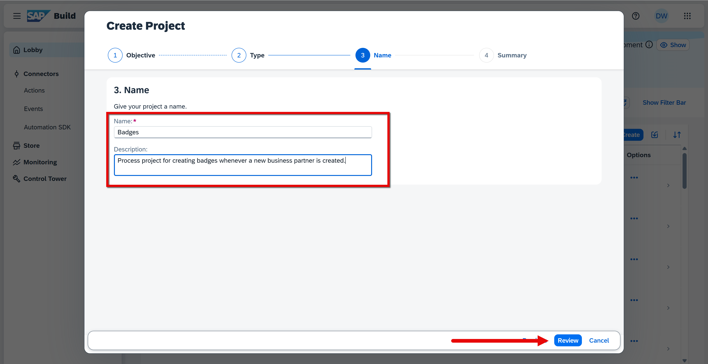
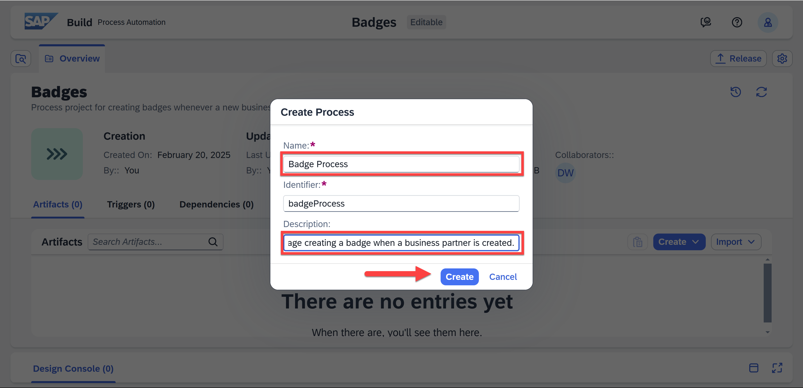
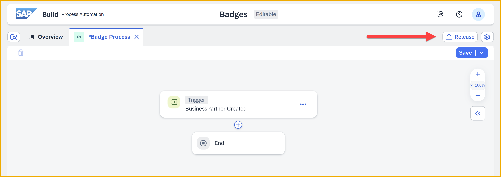
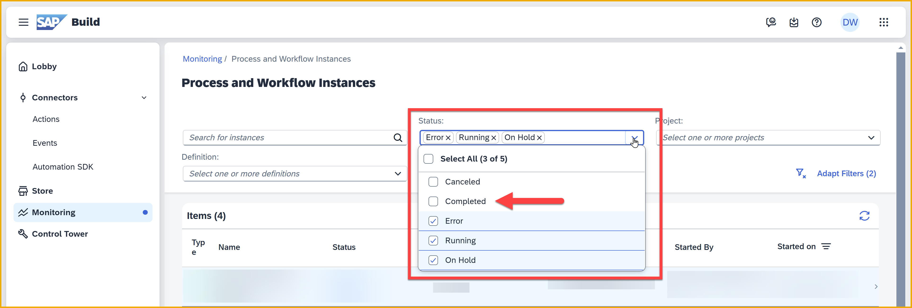

# 6 - Capture Events in SAP Build Process Automation

<!-- description --> Now that you've created events and sent them to your SAP Build Process Automation tenant, create a project that can be triggered by those events.
 
## Prerequisites
- You have completed the previous tutorial for the event-based processes CodeJam, [Send events to SAP Build Process Automation](codejam-events-process-5-send-events-sbpa).

## You will learn
- How to specify an event to be captured by the SAP Build Process Automation tenant
- How to create a process project
- How to create an event-based trigger for the project
- How to monitor a triggered process (process instance)


### Download event spec
Since we want to use events, we must let SAP Build know which events we want consume in our SAP Build projects, by creating an event project. Such event projects can be based on standard SAP S/4HANA Cloud events, or our  own custom events.

Since we created a custom event, we will have to provide an event definition, or spec. Below is part of that spec.


Download our [Business Partner event spec](https://github.com/sap-tutorials/sap-build-apps/blob/main/tutorials/codejam-events-process-6/assets/EDP_CodeJam_ZBUSINESSPARTNER.json).
 

### Open SAP Build
1. In the cockpit of your trial account, go to **Instances and Subscriptions**.

    

2. Click the icon next to **SAP Build Process Automation**.

    

    The SAP Build lobby now opens, where you can create apps, process and business sites.

    

    On the left are a bunch of supporting / administrative tasks, including a place for defining events.


### Create event 
If we want to consume events in SAP Build projects, we must let SAP Build know which events to capture. We do that by creating an event project.

Once defined, each process project can create an event trigger for one of those events so that SAP Build notifies it when such an event arrives.

1. Click **Events**.

    

3. Click **Create**.

    Select **Upload Specification**, and select the spec file you downloaded in the previous step. 

    

4. Click **Browse Files**, and select the file you downloaded in the previous step.
   
    

    After selecting the file, you should file details.

    

    Click **Next**.

    You will see details about the event, including the data it will pass with the event (Output).

    

5. Click **Add**.

    Keep the project name and description as is, and click **Create**.

    

You will now see the event project opened, with the editable version showing. There is nothing to change. You can close the tab.


Go back to the **Events** area of the main SAP Build window. Select the tile (not the name) of your new event. On the right select the **Versions** tab.


When you created the project, SAP Build automatically released and published the project (version 1.0.0), so you can already use it in your processes.


### Create process project
1. Go to the SAP Lobby.

    

2. Click **Create**.

    Select **Automated Process**, and click **Next**.

    

    Select **Process**, and click **Next**.

    

3. Enter the following:

    | Field | Value |
    |-------|--------|
    | **Project Name** | Badges | 
    | **Description** | Process project for creating badges whenever a new business partner is created. |      

    Click **Review**.

    

    On the **Summary** page, click **Create**.

    

4. Since you indicated this was a process project (as opposed to an automation project), you will get a popup asking you to name the process artifact inside the project, too.

    Enter the following (the identifier is automatically generated).

    | Field | Value |
    |-------|--------|
    | **Name** | Badge Process | 
    | **Description** | This is the process that will manage creating a badge when a business partner is created. |      

    Click **Create**.

    

The project opens to the process.


The process is empty except for:

- **Trigger:** A place for you to specify what will trigger the process.

- **End:** Indicates the process is completed. 

The plus sign, **+**, enables you to add all sorts of other types of steps to your process.

>**REMINDER:** You first created an SAP Build Process Automation project, which can contain all kinds of artifacts. Then you created your first artifact, a process. Projects can have many processes and automations, and those can themselves contain other processes and automations. It can get complicated.

>**Processes** are a series of steps that run on the server and require intervention by a human.

>**Automations** are bots that run automatically on a desktop or virtual machine, and require the installation of an agent on that machine. 


### Add event trigger
Every process needs a trigger to start a new instance of the process. 

1. Click **Add a Trigger**.

    

2. Select **Wait for an Event**.

    

3. In the list of published events, find the **BusinessPartner Created** event (from the **EDP CodeJam** project).

    Click **Add** next to it.

    

    For the event details, including name, keep all the defaults. Click **Create**.

    

4. Click **Save** (upper right).

You can now see the trigger at the start of the process. The process is ready to be triggered by our event.


>A process can be triggered in one of the following ways:
>
>
>
>**Submit a Form:** You can provide users a link to a form, which they can fill out and submit. For example, to order equipment or to create sales orders from an Excel file.
>
>**API Trigger:** You can specify that you want other applications to be able trigger the process via an API Call.
>
>**Wait for an Event:** You can specify that the process starts whenever we receive a specific event. That is what we will use.
>
>**Scheduled Trigger:** The process is automatically triggered at the times you specify.


### Release and deploy process
For the process to be active, you must create a release version and then deploy it.

1. Click **Release**.

    

    In the dialog, you can add some release notes if you want.

    Click **Release**.

    

    

2. Note that you are still inside the editable project, not the released version you just created. But we want to deploy the released version.
   
    Click **Show project version** (upper left).

    

    This will take you to the released version of your project, so you can deploy it.

    >You can navigate between the versions of your project at the very top using the dropdown (assuming there is more than one version).

    >

3. Click **Deploy**.

    

    Select the **Public** environment.

    Select **Deploy**.

    

    >Environments lets you deploy different projects to different areas that have different resources and permissions.
    >
    >For example, you can have environments for different lines of business, allowing specific people to create and deploy projects. And each environment can include different destinations to different backend systems.  

4. When deploying, you will be made aware of the triggers that will be created, modified or deleted because of your deployment. Triggers are separate artifacts that can be configured within an environment.

    You can just click **Deploy**.

    

The status of the project will change to **Deployed**, with a marker that says the project is **Active**


### Trigger process (manually)
Now we want to trigger the process. 

But for this tutorial, we are going to do it manually from within the administration tools, without creating a business partner nor generating an event to trigger the process. Using a real event to trigger the process will wait until the next tutorial.


1. On the main SAP Build page, select **Control Tower**.

    >You should have a browser tab open to the main SAP Build page. If not, click on the SAP logo.

    


2. Click the **Environments** tile.

    

    Select the **Public** environment.

    

3. Click **Process and Workflows**.

    >The button may be hidden under the **More** dropdown.

    


4. In the list of process definitions, select **Badge Process**.

    
    
    >For when you have lots of processes, you can filter the list by project, from the dropdown.

5. On the right, click **Start New Instance**.

    This displays a dialog for provided the required payload for the trigger.

    


    >**IMPORTANT:** In the dialog, you must provide the values for the inputs that you defined as "process inputs" in JSON format (those fields in the trigger event). BUT ... the example JSON you will see in the dialog is not related **AT ALL** to what you need to provide. Therefore, you will delete this JSON.  

    In the dialog, replace the JSON with the following JSON.

    ```JSON
    {
    "id": "33642f82-f55d-4d03-a198-2f2b9e135902",
    "time": "2025-01-31T06:12:26.851Z",
    "type": "cust.ext.codejam.ZBUSINESSPARTNER.Created.v1",
    "source": "/default/sap.s4.beh/244572008",
    "specversion": "1.1",
    "datacontenttype": "application/json",
    "data": {
        "BusinessPartner": "1005773",
        "FirstName": "Alan",
        "LastName": "Turing",
        "YY1_SAPCommunityDisplayName": "[SAPCommunityDisplayName]"
    },
    "sapcommunitydispname": "[SAPCommunityDisplayName]"
    }
    ```

    If you want, change the community ID to yours. But for this test, you do not have to.

    

    Click **Start New Instance**.

    If all goes well, you should see **Instance started** at the bottom.

    

We have now simulated an event within SAP Build Process Automation in order to start and test the process more easily. 


### Monitor process
Once we start a process, we have created a **process instance**, and we want to see who started it, when it was started, which steps have been executed, and more information about the instance.


1. In SAP Build, click **Monitoring**.

    

2. Click the **Processes and Workflow Instances** tile.
   
    

3. Since the filter hides **Completed** or **Canceled** process instances, your process will not be visible -- since we created a blank process, our process instance completed immediately.

    In the **Status** filter, add **Completed**.

    

    You should now see your process instance.

    

4. Click on the process instance to see its details.

    

    The information is divided into three parts:

    | Field | Value |
    |-------|--------|
    | **Header** | At the top you will be things like when the process started, its ID, its environment, its current status and more. | 
    | **Logs** | Here you will see what steps were started and stopped, as well as some details about each step.<div>&nbsp;</div>For example, you will see an entry for the trigger and to indicate the instance completed. In other types of steps you will get additional information, like who was sent an approval form, the ID of the form, or error details.  | 
    | **Context** | Here you will see the data that is contained in the process instance, such as the input values sent with the trigger, custom variable values, data returned by an action, and more.|      


### Further study

- [What are environments? (Help Portal)](https://help.sap.com/docs/build-process-automation/sap-build-process-automation/environments?locale=en-US&q=environment) 

- [Event Triggers (video)](https://youtu.be/ZxSiE5ANlWY)

    <iframe width="560" height="315" src="https://www.youtube.com/embed/ZxSiE5ANlWY" frameborder="0" allowfullscreen></iframe>

> **Things to Ponder**
>
>What capabilities does an environment let you control?
>
>Open the Overview tab of your process. What types of artifacts can you add to the project and what would they be useful for?
>
>What types of triggers are there, and when do you think you would use each?
