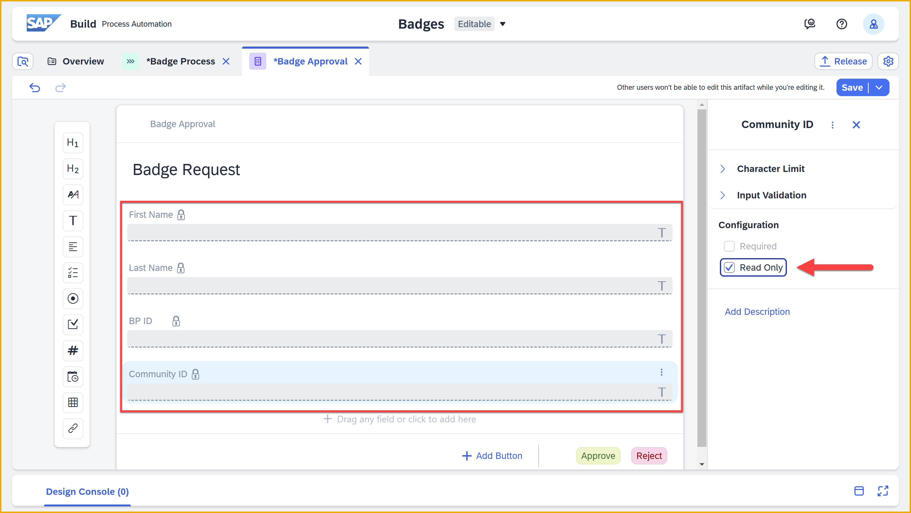
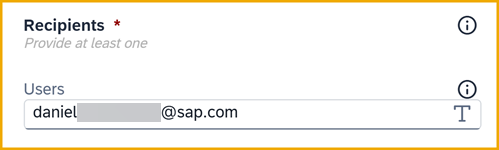
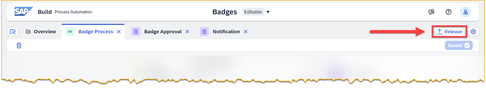
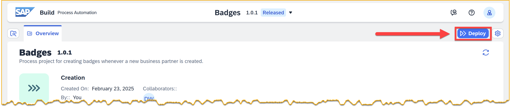

# 7 - Add Approval Step and Use Inbox

<!-- description --> Add a step to allow an approver to see the details sent with the event and approve the request for a badge. 

## Prerequisites
- You have completed the previous tutorial for the event-driven processes CodeJam, [Capture Event in SAP Build Process Automation](codejam-events-process-6).

## You will learn
- How to add an approval step
- How to bind values to step inputs
- How to work with the Inbox

## Intro
One of the most basic steps you can create is an approval step, which sends an approval form to the recipients Inbox (in SAP BTP) and lets them approve or reject a request.

In this tutorial you will create an approval form and assign it to a recipient (you). You will also be introduced to the Inbox, where such forms are sent for execution by the assigned parties. The Inbox has many featured to enhance the approval flow, such as:

- Warnings when the due date approaches or passes

- Hides completed tasks

- Ability to send to multiple parties and have one claim the task

- Ability to approve / reject tasks via API


### Add approval form
1. Go back to your process project, and make sure you are working in the **Editable** version by clicking the dropdown at the top of the page and selecting **Editable**.
   
    

2. With the **Badge Process** process open, click the plus sign, **+**, between the trigger and the end.

    

    Select **Approval**.

    

    Select **Blank Approval**.

    

3. Enter the following (the identifier is automatically generated):

    | Field | Value |
    |-------|--------|
    | **Name** | Badge Approval | 
    | **Description** | This is the form in which the main approver will indicate approval or rejection of the badge. |  

    Click **Create**.

    

    You will see the form add to the process, with different paths for approval and rejection.

There will be an red error, but this is expected and you did nothing wrong. The error is just an indicator that you need to add some settings, like to whom to send the form. 


### Design approval form
1. Click the 3 dots on the side of the approval form, and select **Open Editor**.

    

2. Add the following fields, just by clicking the corresponding square on the left:

    - Headline 1
    - Text
    - Text
    - Text
    - Text

    

3. On the form, click each field and set its label to the following:

    | Field | Value |
    |-------|--------|
    | **Headline 1** | Badge Request | 
    | **Text** | First Name | 
    | **Text** | Last Name | 
    | **Text** | cc | 
    | **Text** | Community ID |     

    

4. On the form, select each **Text** field and set it to **Read Only**.

    

5. Click **Save** (upper right).

>You can configure the buttons for forms. You can have up to 10 buttons, and they can be named whatever you want.

>In addition, for each button, your process will have a different output. So an approval can have up to 10 different paths, not just two.


### Bind approval form fields
For each step in a process, you must bind its properties and inputs to the appropriate values. For example, for a form you must say to whom to send the form.

The binding step enables you to reuse steps, for example, to send the same approval form at different points in your process to different stakeholders.

1. Back in the process, select the **Badge Approval** form and make sure the process panel is open.

    >The side panel is where you set the bindings for the selected step, or for the entire process if no step is selected. There is an icon to open and close the side panel.

    

2. For the **Subject** field, enter the following (including trailing space):

    ```Text
    Badge Request - 
    ```

    

    Click at the end of the field twice. Then, with the cursor still at the end of the field, select **Process Inputs > data > BusinessPartner**.

    

    The field should now look like this:

    

3. Under **Recipients**, click inside the **Users** field, and enter the email address you used to create your SAP BTP trial.

    

4. Under the **Inputs** tab, bind the following fields:

    | Field | Value |
    |-------|--------|
    | **BP ID** | Process Inputs > data > BusinessPartner | 
    | **Community ID** | Process Inputs > data > YY1_SAPCommunityUsername | 
    | **First Name** | Process Inputs > data > FirstName | 
    | **Last Name** | Process Inputs > data > LastName | 

    

5. Click **Save** (upper right).


### Add notification form
1. Click the plus sign, **+**, under **Approve**.

    

2. Select **Form**.

    

    Select **Blank Form**.

3. Enter the following (the identifier is automatically generated):

    | Field | Value |
    |-------|--------|
    | **Name** | Notification | 
    | **Description** | This form notifies the approver that the badge is ready and to indicate if it has been picked up. |  

    Click **Create**.

    

4. Open up the editor.

    

    Just click **H1** to add a **Headline 1** field, and type into the field **Badge Ready for Pickup**.

    

5. Click **Save**.


### Bind notification form fields
1. Back in the process, select the **Notification** form and make sure the process panel is open.

    

2. For the **Subject** field, enter the following (including trailing space):

    ```Text
    Badge Request Approved - 
    ```

    

    Click at the end of the field twice. Then, with the cursor still at the end of the field, select **Process Inputs > data > BusinessPartner**.

    

    The field should now look like this:

    

3. Under **Recipients**, click inside the **Users** field, and enter the email address you used to create your SAP BTP trial.

    

4. Click **Save**.


### Release and deploy process
1. Click **Release**.

    

    This time, since it's not the first release, you can specify what type of change you made, as well as provide release notes.
    
    

    Keep all the settings the same.

    Click **Release**.

    >Note that after releasing, you are still inside the editable project, not the released version.

2. Click **Show project version** (upper left).

    

    This will take you to the released version of your project, so you can deploy it.

    >You can navigate between the versions of your project at the very top using the dropdown (assuming there is more than one version).

3. Click **Deploy**.
   
    

    Select the **Public** environment.

    Select **Upgrade** – as you already have a version deployed.

    

   You get a message that your deployment will update the existing trigger. 

   Click **Deploy**.  


### 🥳 Trigger process
This step is an exciting moment. Here you will trigger your process from your real event (not manually like you did before). This is the crux of the entire CodeJam – to be able to trigger processes from S/4HANA or other SAP events.

1. Go to the **Create Business Partner** app we provided to you.

    

2. Enter the following:

    | Field | Value |
    |-------|--------|
    | **First Name** | Anything you want | 
    | **Last Name** | Anything you want | 
    | **Country** | Select one of the countries |      
    | **SAP Community Username** | Your user name in the SAP Community |      

    >**IMPORTANT:** You set up your REST Delivery Point to publish only events that contain your community user. So you need to provide your user in order for the event to be delivered to your SAP BTP tenant and to trigger your process.

    Click **Create**.

    

    Your business partner is created.

    

3. Check that the event was received into SAP Build by going to **Monitoring**.

    Click **Acquired Events**.

    

    Click **Business Events**. You should see an event created for your new business partner, including the business partner ID that you saw when you created it.

    

    😺🙃


### Check your Inbox
Now that we know the event arrived into SAP Build Process Automation, let's check if our process was triggered and the approval form was created.

1. From the SAP Build header, click the Inbox icon.

    

    This opens the Inbox, and you will see the approval form, with all the data from our simulated event that we pasted in. Notice that the form has the ID of the business partner you created. 

    

2. Before acting on the form, go back to the browser tab with SAP Build's main page.

    Go to **Monitoring**.
    
    Go to **Process and Workflow Instances**.

    

    At the same time, from the SAP Build main page, go to **Monitoring > Processes and Workflow Instances**.

    This time, you do not have to change the filter because the process instance has not completed and instead stopped for the response to the approval form.

    

3. Click on **Badge Process**, and you will see the header info, logs, and context for the process instance you just started.

    In the logs, notice **Task "Badge Request"** is available – this is the approval form waiting for your action.

    

    Expand the **Task "Badge Request"**. You'll see the recipients (you) as well as an ID for that specific task instance (there are APIs for manipulating that specific task, which use this ID).

    

4. Go back to the Inbox and approve the badge by clicking **Approve** on the bottom right.

    

    The task in the Inbox disappears. But refresh the Inbox and the notification will be shown.

    

5. Now go back to the **Monitoring** area and refresh the view of your process instance.
   
    You now see that you completed the approval step and now a second task is awaiting you, the notification.

    

You can go back to the Inbox and click **Submit** on the notification form, then return to the **Monitoring** area and see that the process instance completed.


