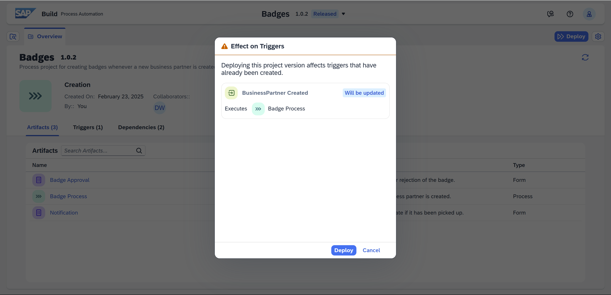

# 8 - Create Action to Get Data from SAP S/4HANA Cloud

<!-- description --> Create an action project for defining the API call for retrieving additional data about the business partner, who ID was sent in the event. 

## Prerequisites
- You have completed the previous tutorial for the event-based processes CodeJam, [Add Approval Step and Use Inbox](codejam-events-process-7).

## You will learn
- How to create an action (for calling APIs)
- How to add an action into your process
- How to configure an action
- How to work with the data returned by the action

## Intro
IT administrators can create "actions" to expose backend APIs to developers of processes or apps (using SAP Build Apps). 

From within a package of APIs, actions let the admin expose only the APIs that are meaningful to the developers, and to select a subset of the input and output parameters to make complex APIs easier to use.

Actions specify the details of the API call, but do not specify a backend system. The developer of the process or app will later – during design time – assign the appropriate destination to the action.


### Create action to get a business partner
1. Open SAP Build, and click **Actions**.

    

2. Click **Create**.

    Scroll down and select **SAP Business Accelerator Hub**.

    

    Enter **BusinessPartner** in the search.

    

    Select **Business Partner (A2X)** from **SAP S/4HANA Cloud Public Edition**.

3. The next screen just shows all the API calls inside this API package, for your information.

    

    Click **Next**.

4. Now you can name the action.

    

    Keep the defaults, and click **Create**.

    The newly created action opens, again showing all the OData calls. But now you can select which ones to include in your action.

5.  In the search, enter **Retrieves business partner data**.

    Open the **Business Partner** node, and select the **/A_BusinessPartner('{BusinessPartner}')** API call.

    

    Click **Add**.

    You now get the action where you can modify the inputs and outputs.

    


6. Click **Output**.

    Check the **d** node, and then expand it.

    

    **Uncheck** the following fields (it might help to sort by **Key**):

    

    - BusinessPartner
    - BusinessPartnerGrouping
    - CreationDate
    - FirstName
    - LastName
    - NameCountry

    Scroll back to the top and click **Remove** and then confirm **Remove**.

    

    You should be left with just a few fields in the output.

    

7. Click **Test**.

    Select **Manual** under **Host**.

    For the URL, enter: 
    
    ```URL
    https://s4-mock-server-with-bp-created-events.cfapps.eu10.hana.ondemand.com/sap/opu/odata/sap/API_BUSINESS_PARTNER
    ```

    

    Set the authentication to **Basic Authentication** and then enter the user and password distributed in the CodeJam by your instructor.

    

8. For the **BusinessPartner**, input the ID for the business partner you created (or enter this ID: **1003769**).

    Click **Test**.

    You should get data from the backend.

    

9. Click **Save**.

    

    Click **Release**, then click **Release** to confirm.

    

    Click **Publish**, and then click **Publish** to confirm.

    


### Create destination to SAP S/4HANA Cloud
In the action test, we supplied the URL and credentials, but this was just for the test. In order to use in production, we want to use a destination – a connection defined in the SAP BTP cockpit to a backend system.

Destinations can then be used seamlessly in applications and processes to connect to systems, without needing to know the connection details and using all types of sophisticated authentication schemes. 

1. Download the destination template. 

    Click [Destination template](https://github.com/sap-tutorials/sap-build-apps/blob/main/tutorials/codejam-events-process-8/S4HANA_Badges), and then click the download button.

    

2. Go to the SAP BTP cockpit for your subaccount.

    >You can always return to your trial account cockpit by going to [https://account.hanatrial.ondemand.com/](https://account.hanatrial.ondemand.com/) and then opening your subaccount.

    Click **Connectivity > Destinations**.

    

    Click **Import Destination**, and select the file you downloaded.

3. Enter the password distributed in the CodeJam by your instructor.

    Click **Save**.

    

4. Click **Check Connection**, and you should get a **200** status code.

    


### Add destination to Control Tower
You created a destination, but you must let SAP Build Process Automation know that you want to allow it to be used in deployed processes.

1. In the main SAP Build page, click **Control Tower**.

2. Click **Destinations**.

    

3. Click **Add**.

    

    Select the **S4HANA_Badges** destination.

    

    Click **Next**.

    Keep **All Environments**, and click **Add Destination**.

    

The destination should now appear in the list of destinations that can be used with your processes.


### Add action to process
1. Go back to your process project.

    Make sure you are in the Editable version.

    

2. Under the trigger, click the plus sign, **+**.

    

    Select **Action**.

    

    Select **Browse All Actions**.

    

    Click **Add** next to your action. To help you find the right action, you can see the name of the acttion project.

    

    The action is added to the process.

3. With the action selected and the process panel on the right open, find the **Destination Variable** field.

    Click **Select a Destination Variable**, then click **Create Destination Variable**.

    

    For the identifier, enter **BPdest**.

    Click **Create**.

    

4. In the **Inputs** tab, click inside the **BusinessPartner** field.

    Select **Process Inputs > data > BusinessPartner**.

    

5. Save the process by clicking **Save** (upper right). 


### Update approval form
Now that we've retrieved the data, we want to display it in the approval form. You will add a field to display the business partner's country and grouping.

1. On the **Badge Approval** form, click the three dots and select **Open Editor**.

    

2. Click the **Text** field on the left twice, which adds 2 new text fields at the end of the form.

    

3. Set the 2 fields as follows:

    | Field Name | Settings |
    |-------|--------|
    | **Country** | Make the field **Read Only** | 
    | **Grouping** | Make the field **Read Only** | 

    Click **Save**.

    

4. Back in the process, select the **Badge Approval** form.

    Open the **Inputs** tab.

5. Bind the 2 new inputs as follows:

    | Field | Binding |
    |-------|--------|
    | **Country** | **Retrieve business partner > result > Business Partner > Ctry/Reg. for Format** | 
    | **Grouping** | **Retrieve business partner > result > Business Partner > Grouping** | 

    Click **Save**.

    


### Release and deploy process
1. Click **Release**.

    

    Click **Release**.

    >Note that after releasing, you are still inside the editable project, not the released version.

2. Click **Show project version** (upper left).

    

    This will take you to the released version of your project, so you can deploy it.

3. Click **Deploy**.
   
    

    Select the **Public** environment.

    Select **Upgrade** – as you already have a version deployed.

    You get a message that your deployment will update the existing trigger.

    

    Click **Deploy**.

    You now get a new dialog to select values for all the environment variables you created for this project. In this case, you created a destination variable for your action, in order to select the destination for connecting to your backend system.

    

    Select your **S4HANA_Badges** destination, and then click **Deploy**.


### Trigger process
1. Go back to the [**Create Business Partner** app](https://s4-mock-server-with-bp-created-events.cfapps.eu10.hana.ondemand.com/create-bp) we provided to you.

    

2. Enter the following:

    | Field | Value |
    |-------|--------|
    | **First Name** | Anything you want | 
    | **Last Name** | Anything you want | 
    | **Country** | Select one of the countries |      
    | **SAP Community Username** | Your user name in the SAP Community |      

    >**IMPORTANT:** You set up your REST Delivery Point to publish only events that contain your community user. So you need to provide your user in order for the event to be delivered to your SAP BTP tenant and to trigger your process.

    

    Click **Create**.

    Your business partner is created.

3. Check that the event was received into SAP Build by going to **Monitoring** (in the main SAP Build page).

    Click **Acquired Events**.

    

    Click **Business Events**. You should see an event created for your new business partner, including the business partner ID that you saw when you created it.

    


### Monitor process
1. In SAP Build, click **Monitoring**.

2. Click the **Processes and Workflow Instances** tile.

    

3. Click on the process instance to see its details.

    In the **Logs** area, you will see the step where the action was started and completed.

    

    In the **Context** area, you will see data received from the event, as well as the data retrieved from the action call to our business partner.

    

4. In your Inbox, see the approval form. It now contains the country and grouping, which you retrieved from the SAP S/4HANA Cloud backend.

    


Feel free to finish the process by approving the badge and then acknowledging the notification, as you did in the previous tutorial.


### Further study

- [Actions in SAP Build Process Automation (video)](https://youtu.be/A_o8qwUnXRo)

    <iframe width="560" height="315" src="https://www.youtube.com/embed/A_o8qwUnXRo" frameborder="0" allowfullscreen></iframe>

- [Create an Action Project (Help Portal)](https://help.sap.com/docs/build-process-automation/sap-build-process-automation/create-action-project)

    - [Using $filter in actions](https://help.sap.com/docs/build-process-automation/sap-build-process-automation/managing-input-and-output-parameters-c9a06f9520cc44879f16933e9ab6a7e0)

> **Things to Ponder**
>
>What is the advantage of creating actions?
>
>When creating an action, why configure it? Why not leave all the API calls and all the inputs/outputs?
>
>What is the purpose of a destination variable?
>
>What is another advantage of using actions (related to SAP Build Apps, see this [news item](https://www.youtube.com/watch?v=haaZDIgz7kI&list=PL6RpkC85SLQAVBSQXN9522_1jNvPavBgg&index=26))?
