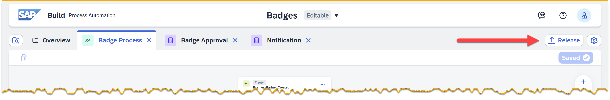
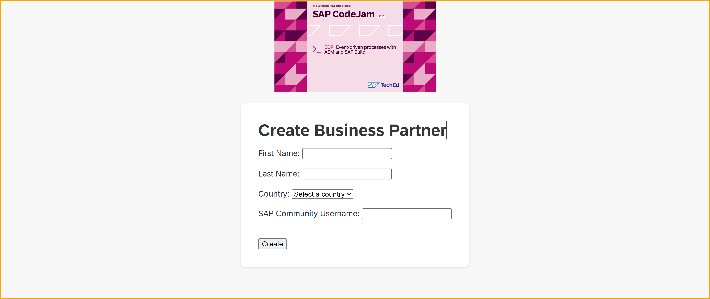
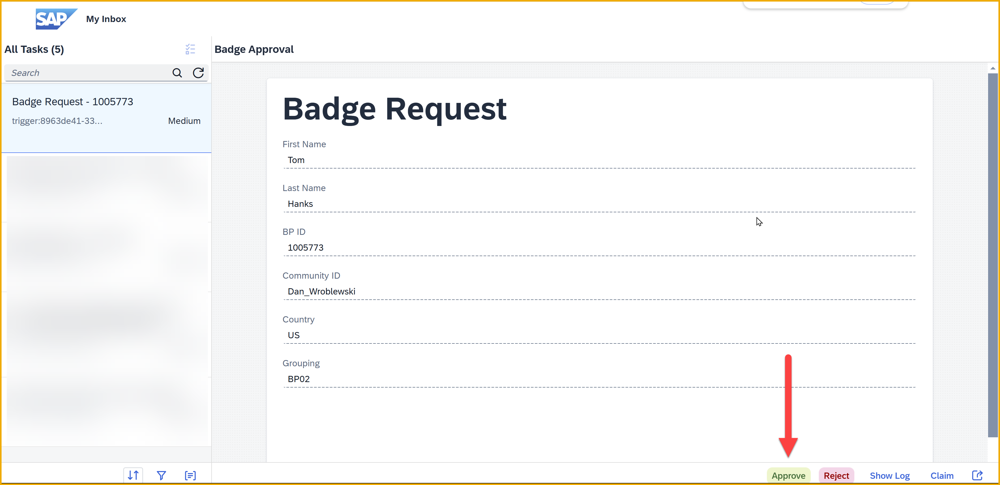
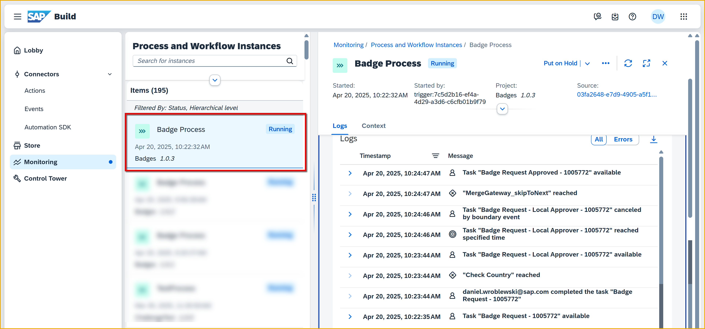

 
# 9 - Add 2nd Approval With Custom Variables, Conditions and Form Events
<!-- description --> Create a second approval that can veto the badge but only within 24 hours, using custom variables, conditions and form events.


## Prerequisites
- You have completed the previous tutorial for the event-based processes CodeJam, [Create Actions to Get Data from S/4HANA](codejam-events-process-8).

## You will learn
- How use conditions
- How to create and access custom variables
- How to use form events

## Intro
SAP Build Process Automation enables many types of flows and branching. Here we will introduce 2 types of flow controls:

- **Conditions**, where the flow can branch based on a specific condition. You can create up to 10 branches.

- **Process events**, where the flow can change based on certain events that occur within a process. We will use form time events, which get raised after a specific amount of time and alter the flow.

**Our scenario is:** You will check if the new business partner is from the United States. If yes, then a second approval step is needed from the local staff. But ... that approver only has 24 hours to veto the issuance of the badge – after that, the badge is automatically approved.


### Create custom variable
1. Go back to your process project.

    Make sure you are in the Editable version.

    

1. In the **Badge Process**, with nothing selected, open the side panel.

    

2. Click **Variables**.

3. Under **Custom Variables**, click **Configure**.

    

4. Click **Add Variable**

    Enter the following (the identifier is automatically generated).

    | Field | Value |
    |-------|--------|
    | **Name** | LocalApprover | 
    | **Type** | Boolean |      

    Click **Apply**.

    

5. Click **Save** (upper right).


### Set variable with script task
We want by default that the flag be set to **True**, in case there is no need to add a local approver. If the local approver is needed and they reject the item, then we will set the flag to **False**.

This is a very simple use of the Script Task, but we wanted to introduce it to you, because it is very powerful for processing data, for example, lists of backend data returned via action, and making it available to the rest of the process. The results of the data manipulation are generally stored in custom variables.

1. Right after the trigger step, click the plus sign, **+**.

    

    Select **Script Task**.

    

2. Rename the **Step Name** to **Set Local Approver to True**.

    Click **Open Editor**.

    

3. In the code area on the right, add a few blank lines at the top, and then set the cursor at the top.

    On the left, click **Custom Variable > LocalApprover** to a reference to that custom variable.

    

    Then add code so the line is the following:

    ```JavaScript
    $.context.custom.localapprover = true;
    ```

    

4. Let's explore the **Script Task** a little.

    Click **Validate Script** to check the syntax, including variable references. Any errors will be shown in the **Script Console**.

    

4. Once the script is valid, you can test the script with different data. Select the **Test Variable** tab.

    

    Add test input values by clicking the plus sign, **+**, setting the variable name to `$.context.custom.localapprover`, and setting the value to `false`.
    
    Click **Run Test**. The results, including the values for the custom variables, are shown in the **Test Console**.

    

5. Click **Apply**

6. Click **Save**.


### Check the business partner country
1. Under the **Approve** branch of the first approval form, click the plus sign, **+**.

    

2. Select **Control and Events**.
   
    

    Select **Condition**.
   
    

3. Rename the **Step Name** to **Check Country**.

    

4. In the side panel, click the 3 dots next to **If**, then click **Condition Editor**.

    

5. Set the condition as follows:

    | Field | Value |
    |-------|--------|
    | **1st Operand** | Retrieves business partner > result > Business Partner > Ctry/Reg. for Format  | 
    | **Operator** | is equal to |      
    | **2nd Operand** | US | 

    Click **Apply**.

    


### Add 2nd approval
1. Under the new condition, in the **If**, click the plus sign, **+**.

    

2. Click Approval.

    

    Instead of creating a new form, you will reuse the existing form but change its binding slightly. 

    Click **Approval Form**.  

    
  
3. For the **Subject** field, enter the following (including trailing space):

    ```Text
    Badge Request - Local Approver - 
    ```

    Then, with the cursor still at the end of the field, select **Process Inputs > data > BusinessPartner**.

    For the **Users** field, enter the email address you used to create your SAP BTP trial.

    

4. Under the **Inputs** tab, bind the following fields:

    | Field | Value |
    |-------|--------|
    | **BP ID** | Process Inputs > data > BusinessPartner | 
    | **Community ID** | Process Inputs > data > YY1_SAPCommunityDisplayName | 
    | **Country** | Retrieves busines partner > result > Business Partner > Business Partner | 
    | **First Name** | Process Inputs > data > FirstName | 
    | **Grouping** | Retrieves busines partner > result > Business Partner > Grouping | 
    | **Last Name** | Process Inputs > data > LastName | 

    

5. Click **Save**.


### Set flag to false
In the case that the local approver rejects the badge, we must set the flag to false.

1. Under the new **Approval Form 1**, and then under the **Reject** branch, click the plus sign, **+**.

    

    Select **Script Task**.

2. Rename the **Step Name** to **Set Local Approver to False**.

    Click **Open Editor**.

    

4. In the code area on the right, select all the text, and delete it.

    Copy in the following:

    ```JavaScript
    $.context.custom.localapprover = false;
    ```

    Click **Apply**.

    

5. Under the Script Task, click the plus sign, **+**.
    
    

    Add the step **Controls and Events > End**.
    
    It should look like this:

    

6. Click **Save**.


### Create form event
We want to give the local approver a chance to reject the badge, but only for 24 hours. So we will make use of form events, also known as timer events, which allow us to break into the flow after a certain period has elapsed without the form being completed. 

>For the sake of this exercise, we will give the local approver just 1 minute.

1. Click the 3 dots next to **Approval Form 1**, and click **Handle Events**.

    

    The form will now have a third path, in addition to Approve and Reject – a path for events when neither of the other two paths are taken.

    

2. Click **Timer Event**.

    This will create a small subflow in case the timer event is triggered.

    

3. Click **Timer Event** to open the side panel. 

4. Set **Count** to 1.

    Set **Unit** to **Minutes**.

    Under **After the event is handled**, change the select to **Skip to Next Step**.

    >If you cannot see this option, reduce the zoom of your browser.

    

5. Click **Save** (upper right).


### Release and deploy process
1. Click **Release**.

    

    In the dialog, you can add some release notes if you want.

    Click **Release**.

2. Click **Show project version** (upper left).

    

    This will take you to the released version of your project, so you can deploy it.

    >You can navigate between the versions of your project at the very top using the dropdown (assuming there is more than one version).

3. Click **Deploy**.
   
    

    Select the **Public** environment.

    Select **Upgrade**.

    You get a message that your deployment will update the existing trigger.

    

    Click **Deploy**.

    You again get a dialog to select the destination for the action. The previous selection from the previous deployment should still be there. If not, select **S4HANA_Badges**.
    
    Click **Deploy**.

    


### Trigger process
1. Again, go back to the **Create Business Partner** app we provided to you.

    

2. Enter the following:

    | Field | Value |
    |-------|--------|
    | **First Name** | Anything you want | 
    | **Last Name** | Anything you want | 
    | **Country** | United States |      
    | **SAP Community Username** | Your user name in the SAP Community |      

    Click **Create**.

    Your business partner is created.

3. Check that the event was received into SAP Build by going to **Monitoring** > **Acquired Events** > **Business Events**.
   
    You should see an event created for your new business partner, including the business partner ID that you saw when you created it.

    


### Monitor process
1. Go to the Inbox.

    You will see an approval form. Click **Approve**.

    

2. Refresh the Inbox and you will get a second, approval, because the business partner is in the United States.

    Do not approve, and wait for a minute until the timer event triggers.

    

3. Now go to **Monitoring > Processes and Workflow Instances**.

    Click on the latest instance.

    

    Let's look at the log more closely. The log is in chronological order, from bottom to top. So let's review what happened.

    

    From the bottom to top, you will see these steps:

    - The process was triggered.
    - You tried to set the local approver flag to true.
    - You set the local approver flag to true successfully.
    - You tried to retrieve business partner data with an action.
    - You retrieved business partner data with an action successfully.
    - The 1st approval task was triggered.
    - The 1st approval task was completed.
    - The country was checked.
    - The 2nd approval task was triggered (because the country was the US).
    - The 2nd approval task was not completed in the specified time (1 minute).
    - The 2nd approval step was canceled.
    - The process went to the next step.
    - The notification form was triggered.


 
### Further study

- [Raise and Handle Escalation and Timer Events (Help Portal)](https://help.sap.com/docs/build-process-automation/sap-build-process-automation/add-flow-controls-and-events)

- [Create and Configure a Script Task (Help Portal)](https://help.sap.com/docs/build-process-automation/sap-build-process-automation/create-and-configure-script-task)

- [Transform Data with JavaScript in SAP Build Process Automation (Devtoberfest video)](https://youtu.be/Su2QvsCqjt4?si=rQlDeM2Fu_48sf-x)

    - <iframe width="560" height="315" src="https://www.youtube.com/embed/Su2QvsCqjt4" frameborder="0" allowfullscreen></iframe>


>**Things to Ponder**
>
>What are the 2 types of process events inside SAP Build Process Automation?
>
>What specifically would you use a Script Task for?
>
>How could you make use of an escalation event?


