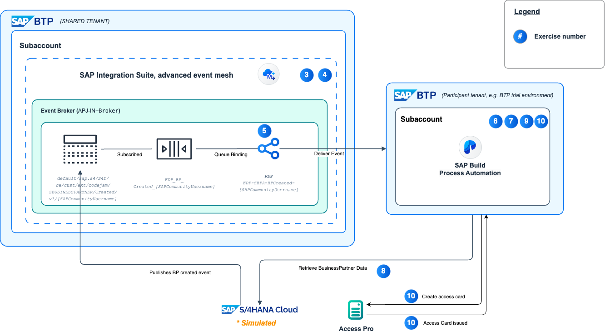
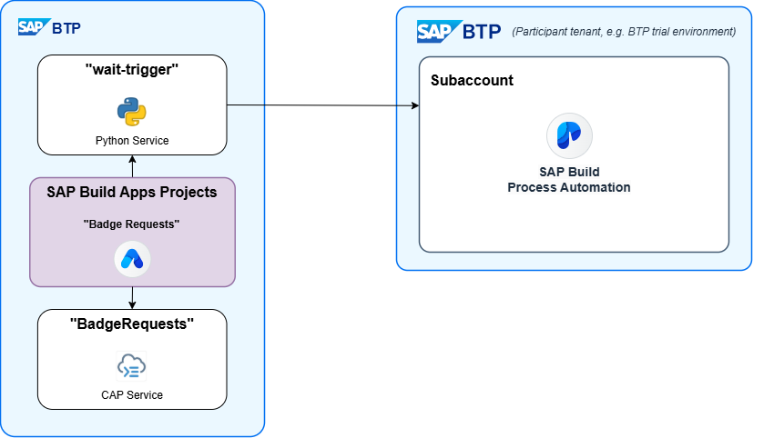

# SAP Build: Event-Based Processes CodeJam – Introduction
<!-- description -->Welcome to the SAP Build: Create event-based processes CodeJam, and thanks for your interest in joining us as part of this CodeJam.

## Intro
In this SAP CodeJam, we will look at [SAP Integration Suite, advanced event mesh](https://discovery-center.cloud.sap/serviceCatalog/advanced-event-mesh?service_plan=default&region=all&commercialModel=cloud) and [SAP Build Process Automation](https://discovery-center.cloud.sap/serviceCatalog/sap-build-process-automation/?region=all) and how we can leverage both to enable event-driven architecture and processes across multiple systems and services in our landscape. 

By the end of the CodeJam, we will achieve a scenario like the one below in the diagram.

### What you will learn

In short, you will learn about **event-driven architecture** and **event-based processes**.

Let's imagine you work for a company, ITeLO Industries. All employees of ITeLO Industries are reflected in SAP S/4HANA Cloud as Business Partners. ITeLO is interested in managing its employees onboarding process via SAP Build Process Automation.

Currently, their applications and services expose their data via APIs. The different services use a [poll mechanism](https://www.enterpriseintegrationpatterns.com/patterns/conversation/Polling.html) to check if there is any new data (tickets/BPs) that need to be processed. 

ITeLO is interested in adopting an event-driven approach to how it processes its data and is looking to adapt its application to follow a [publish-subscribe pattern](https://help.pubsub.em.services.cloud.sap/Get-Started/message-exchange-patterns.htm#Publish-). Following this pattern will enable them to easily extend and add new functionality, in the form of [new services](https://www.enterpriseintegrationpatterns.com/patterns/conversation/SubscribeNotify.html), which can fulfill new business cases in the future where the same data is required for further processing.

We are in charge of enabling the event-driven integration scenario that will allow our applications and services to create (produce) events and react (consume) to them.

>**SAP Build Process Automation:** The CodeJam does not assume any previous knowledge of SAP Build Process Automation, but will introduce some more advanced techniques – including using event triggers – so you can quickly become proficient in creating processes.

### What you will create

In the end, you will have a flow that does the following:

1. A user creates a business user in SAP S/4HANA. The user includes a reference to your community ID.

2. The creation of the business partner creates an event inside SAP Integration Suite.

3. You forward that event to your SAP Build Process Automation, via a REST Delivery Point you created inside SAP Integration Suite. (In the CodeJam, the community ID is used to route only the events you create to your SAP Build Process Automation system.)

4. Your SAP Build Process Automation captures that event, and forwards it to any processes watching for that event. 

5. Your process waits for that specific event, and when it arrives starts a process instance.

6. Your process includes an approval step, as well as an action that retrieves additional information about the business partner from S/4HANA.

7. After being approved, the process calls an external system to create a badge and pauses to wait for that system to call it back.

8. The external system (eventually, when a user interacts with it) creates the badge, and calls back the process instance, sending the badge ID in that call.

9. The process instance, now restarted, creates a notification saying the badge is ready, including the badge ID.

You will not have to create all the pieces. You will:

- Create a REST Delivery Point in SAP Integration Suite to forward the events that contain your community ID to your SAP BTP tenant.

- Create the entire process, from scratch, in SAP Build Process Automation for approving and creating the badge.

>**IMPORTANT:** So that you do not receive the events for all the business partners, we have created a custom event (modified from the standard S/4HANA Business Partner Create event) that includes a place for your SAP Community ID. Your REST Delivery Point will only forward to you those business partners associatd with your community ID.

### What systems you will use

Here are the systems you will interact with (this icon 🔐 means your instructor will provide system details, including credntials):

- **(Simulated) SAP S/4HANA Cloud System 🔐:** We will provide a simulated S/4HANA system where you can create business partners, and we will provide you with a make-shift, non-SAP UI where it will be easy to create a business partner, including to associate your community ID with the new partner.
- **SAP Integration Suite, advanced event mesh 🔐:** While learning about Advanced Event Mesh and publishing/subscribing events, you will create a REST Delivery Point to forward events to you.  
- **SAP BTP:** You will have to create an SAP BTP trial account. We will tell you how in the prerequisites.
- **SAP Build Process Automation:**: You will need to install SAP Build Process Automation on your SAP BTP trial account. We will tell you how in the prerequisites.
- **3rd-Party Badge System (Access Pro) 🔐:** We have created – with SAP Build Apps and a Python app deployed to SAP BTP – a make-believe but working 3rd-party app that will simulate the creation of badges. 

    See next step for more information on this app.

    We will provide you access to that app.

>A connection between the simulated SAP S/4HANA Cloud and SAP Integration Suite, advanced event mesh has been set up.
>
>That said, it is very simple to configure a connection between SAP S/4HANA Cloud and SAP Integration Suite, advanced event mesh – you can find the step-by-step guide in the Help Portal. See [Integration with Advanced Mesh Service Plan for Service Cloud](https://help.sap.com/docs/SAP_S4HANA_CLOUD/0f69f8fb28ac4bf48d2b57b9637e81fa/9b34c841dfba4f82af0825a2f3196ecf.html?locale=en-US).
>
>This feature was recently introduced in the [SAP S/4HANA Cloud 2402 release](https://help.sap.com/docs/SAP_S4HANA_CLOUD/ee9ee0ca4c3942068ea584d2f929b5b1/5fd69458026d47f7bcc11837b42c5371.html?locale=en-US&version=2402.500).

### 3rd-Party Badge System
We have introduced the simulated 3rd-party app in order to show how SAP Build Process Automation can be integrated with external apps, especially using the new "Wait for an API Call" step.

The "Wait for an API Call" step lets you pause a process instance until a specific API call is made to SAP Build Process Automation. This call can also include a payload to inject data into the process instance.

The app has 2 pages. The first page lists all the requests for badges:

When a request is selected, a second page shows details. On this page, you can specify the connection details so the app can call back your SAP Build Process Automation installation so that the process instance the created the badge request can be resumed and sent the badge ID.

The design of the app is as follows:

- The app was designed in SAP Build Apps, and deployed to SAP BTP.

- The app uses an OData service (built with the Cloud Application Programming Model, or CAP) running in SAP BTP as its backend.

- When the app needs to call back SAP Build Process Automation, it does this through a Python service, which is used to avoid CORs issues. A destination is usually used for this purpose, but cannot be used here as we do not know ahead of time the service URL, as we want to enable the app to call back to any tenant. 

    The Python service, with the connection details from the app, makes the call to the CodeJam participant's installation of SAP Build Process Automation.

### Prerequisites

To complete this CodeJam, you will need to come with a laptop, you will need to set up a SAP BTP trial account, set up SAP Build Process Automation, and a few more things. 

>Don't worry 🙃 it won't take long.

The complete prerequisites for this CodeJam, including hardware and software, are detailed in the [prerequisites tutorial](codejam-events-process-0-prerequisites).

